## 一、认知心理学与认知神经科学导论

### 1. 认知心理学概述
* **学科定义**：认知心理学是对**思维与头脑（Mind）**的科学研究。
* **研究核心**：关注信息如何从外部世界获取、在内部储存、加工转换，并用于解决问题、驱动思维以及生成言语。
* **涉及的心理过程全领域**：
  $$\text{外部刺激} \longrightarrow \text{感知觉} \longrightarrow \text{模式识别} \longrightarrow \text{注意} \longrightarrow \text{意识} \longrightarrow \text{学习} \longrightarrow \text{记忆与回忆} \longrightarrow \text{概念形成} \longrightarrow \text{思维与想象} \longrightarrow \text{言语与智力} \longrightarrow \text{情感与发展} \longrightarrow \text{横跨行为的广泛领域}$$


* **学习认知心理学的核心价值**：
  1. **赋能人工智能研究**：深入理解人类认识规律，为AI算法提供理论基础与灵感。
  2. **构建“以人为中心”的智能系统**：设计与人类智力同构、符合人类心智模型的交互界面。
  3. **辨析人机边界**：深入思考人类心智与机器智能的异同，构建安全友好的共生AI。
  4. **培养学术与职业直觉**：为未来的科研选题、技术孵化、就业创业提供底层认知敏锐度。
  5. **重拾对人类自身的好奇心**：探寻意识与心智的终极本质。

---

### 2. 认知神经科学基础与神经元传导
* **学科定义**：$\text{认知神经科学} = \text{认知心理学} + \text{神经科学}$。核心在于探寻记忆、感知、问题解决、语言加工、动作控制等心智理论背后的脑物质基础。
* **两学科的相互支持关系**：
  * 为抽象的心灵理论构想寻找来自生物脑的物质证据。
  * 将神经科学的微观发现与宏观的认知理论计算模型相联系。
  * 在临床上阐明脑损伤的病理机制及其与特定认知行为缺失的关联。
  * 将神经功能约束引入心智理论模型中，避免脱离生理现实。
  * 开发与生物脑运行机制同构的计算神经网络模型以模拟人类认知。
  * 借助前沿成像技术无创深入人脑内部，揭示未知的动态时空结构。

```mermaid
graph TD
    subgraph 中枢神经系统 (CNS)
        Brain[脑: 约1350g, 功耗12~20W<br/>电热毯休眠10W, 运行时150W<br/>包含约1000亿个神经元]
        Spinal[脊髓: 感觉/运动中继与简单躯体反射]
    end
    subgraph 神经元信息传导机制
        Dendrite[树突: 接收突触后输入] --> Soma[胞体: 整合电位变化]
        Soma --> Axon[轴突: 传导动作电位 0.5~120 m/s]
        Axon --> Sheath[髓鞘与朗飞氏结: 跳跃式传导]
        Sheath --> Bouton[终端终扣: 突触小泡释放神经递质]
    end
```

* **四大经典神经元类型**：
  * **锥体细胞 (Pyramidal Cells)**：大脑皮层与海马的主要投射神经元。
  * **浦肯野细胞 (Purkinje Cells)**：小脑皮层中具有极其庞大树突分支的抑制性神经元。
  * **运动神经元 (Motor Neurons)**：支配肌肉收缩与腺体分泌。
  * **感觉神经元 (Sensory Neurons)**：接收体内外感受器信号并向中枢传入。
* **突触传递过程**：树突与轴突终端之间存在微小的**突触间隙**。轴突释放神经递质，与突触后膜受体结合，改变树突膜极性与电位，产生兴奋性突触后电位 (EPSP) 或抑制性突触后电位 (IPSP)。
* **青少年大脑发育特点**：
  * **边缘系统与前额叶皮层 (PFC) 发育不匹配**：情绪冲动中枢（边缘系统）发育成熟远早于理性控制中枢（前额叶皮层，约 **25岁左右** 才完全髓鞘化成熟），导致青少年在情绪冲动与深思熟虑之间存在近10年的生理性失衡。
  * **连接组学重构**：基于图论分析，12~30岁期间脑发育的核心在于**神经元集群之间远程功能连接的增强与局部低效连接的修剪**，从而提升复杂抽象思考与社会交际能力。

---

## 二、大脑解剖、功能定位与神经成像技术

### 1. 脑解剖结构与皮层分区

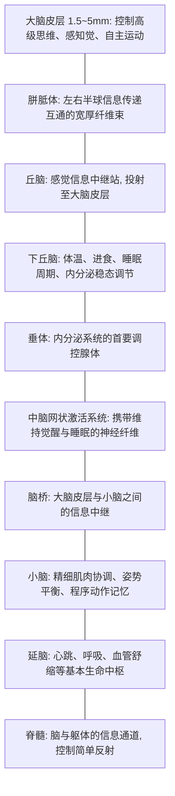

#### 大脑皮层解剖方位与四大脑叶
* **解剖切面与方位**：
  * **切面**：横断面 (Horizontal/Axial)、冠状面 (Coronal)、矢状面 (Sagittal)。
  * **方位**：背侧 (Dorsal) / 腹侧 (Ventral)；前/吻端 (Anterior/Rostral) / 后/尾端 (Posterior/Caudal)；内侧 (Medial) / 外侧 (Lateral)。
* **皮层界标与脑叶分工**：
  * **额叶 (Frontal Lobe)**（中央沟之前）：高级执行功能、工作记忆、运动控制（中央前回初级运动区）、言语发音（Broca区）。
  * **顶叶 (Parietal Lobe)**（中央沟之后、顶枕裂前）：躯体感觉（中央后回初级感觉区）、空间定向、感觉整合。
  * **枕叶 (Occipital Lobe)**（顶枕裂后）：初级视觉皮层 (V1) 及视觉联合皮层。
  * **颞叶 (Temporal Lobe)**（外侧裂下方）：听觉加工、高级客体识别、言语理解（Wernicke区）、长时记忆（内侧颞叶海马体）。

```
        ┌──────────────────────────────────────────────────────┐
        │                     背侧 (Dorsal)                    │
        │                                                      │
        │         额叶 (Frontal)       │  顶叶 (Parietal)       │
        │      ┌─────────────────────┐ │ ┌───────────────────┐ │
前端    │      │  执行功能 / 运动控制 │ │ │  躯体感觉 / 空间  │ │   后端
(Anterior)     │  Broca 言语产生区    │中央沟│  顶内沟注意网络 │ │(Posterior)
        │      └─────────────────────┘ │ └───────────────────┘ │
        │              外侧裂 ─────────┴───────── 顶枕裂       │
        │         颞叶 (Temporal)      │  枕叶 (Occipital)      │
        │      ┌─────────────────────┐ │ ┌───────────────────┐ │
        │      │  听觉 / Wernicke区  │ │ │  初级视觉 (V1)    │ │
        │      │  客体识别 (What通路)│ │ │  视觉联络区       │ │
        │      └─────────────────────┘ │ └───────────────────┘ │
        │                                                      │
        │                     腹侧 (Ventral)                   │
        └──────────────────────────────────────────────────────┘
```

#### 感觉-运动功能定位的经典神经学发现
* **电刺激实验**：19世纪通过电刺激轻度麻醉犬的大脑皮层特定区域，诱发出对应肌肉群的抽搐反应，证实了皮层运动区的功能局部定位。
* **布洛卡失语症 (Broca's Aphasia)**：19世纪60年代法国神经病学家Broca对患者尸检发现，左额下回后部受损导致说话短促、语用停顿费力、语法缺失，但语言理解相对保留。
* **韦尼克失语症 (Wernicke's Aphasia)**：1876年Wernicke发现左颞上回后部受损导致语速流畅、发音清晰、符合语法规则，但语义极度空洞混乱、毫无意义，伴有严重的言语理解丧失。

---

### 2. 现代脑功能成像技术对比

| 技术名称 | 物理与生理信号来源 | 空间分辨率 | 时间分辨率 | 侵入性 | 购置与维护成本 | 技术特性与局限 |
| :--- | :--- | :--- | :--- | :--- | :--- | :--- |
| **脑电图 / 事件相关电位 (EEG / ERP)** | 大量皮层锥体细胞同步突触后电位在头皮的代数和 | 差 ($\approx 1\text{英寸}$) | **极优 ($\text{ms}$ 级)** | 无创 | 设备便宜，耗材成本低 | 时间动态极其精确；空间反演存在数学上的“逆问题”不确定性。 |
| **脑磁图 (MEG)** | 神经元细胞内轴向电流产生的感应微弱磁场 | 良好 ($<1\text{cm}$) | **极优 ($\text{ms}$ 级)** | 无创 | 极昂贵（需强磁屏蔽室与液氦超导维护） | 磁场穿透颅骨不受扭曲；主要探测皮层脑沟，对脑回径向电流不敏感。 |
| **正电子发射断层成像 (PET)** | 静脉注射放射性示踪剂衰变释放的正电子与电子湮灭产生的光子对 | 良好 ($\approx 1\text{cm}$) | 差 (每副图像需 $40\text{s}\sim\text{min}$) | **高 (放射性同位素)** | 极昂贵（需配套医用回旋加速器，单次检查数千美元） | 可直接定量葡萄糖代谢和受体密度；时间分辨率差且具放射性伤害。 |
| **功能磁共振成像 (fMRI)** | 局部神经激活诱发的血氧水平依赖 (BOLD) 效应与去氧血红蛋白磁性改变 | **极优 ($\approx 0.5\text{mm}$)** | 较低 (取决于血流动力学，约 $2\sim 6\text{s}$) | 无创 | 昂贵（高场强超导磁体与屏蔽机房） | 具备当前最精细的无创空间全脑成像能力；为间接血管反应。 |
| **功能近红外光谱 (fNIRS)** | 650~900nm近红外光穿透颅骨检测氧合与去氧血红蛋白吸光度差 | 较差 ($\approx 2\text{cm}$) | 较高 (最高可达 $10\text{Hz}$) | 无创 | 成本较低，设备轻巧便携 | 适合婴儿、儿童及自然动态运动场景；无法探测深部皮下核团。 |
| **经颅磁刺激 (TMS / rTMS)** | 放置于头皮的电磁线圈发射瞬变强磁场诱发皮层局部感应微电流 | 局部皮层靶向刺激 ($\approx \text{数毫米}$) | **极优 ($\text{ms}$ 级脉冲)** | 物理无创（功能可逆性干扰） | 设备成本中等 | **唯一具备非侵入性因果推断能力的技术**（创建“暂时性虚拟脑损伤”）。 |

#### 脑机接口 (BCI) 突破应用
* **意念书写 (Mind-writing)**：在大脑运动皮层手部代表区植入微电极阵列，实时记录被试在脑海中想象手握笔书写字符时的神经发放模式，借助解码算法将神经电活动特征流映射为屏幕上的文本字符，书写速度逼近常人手打水平。

#### 经颅磁刺激 (TMS/rTMS) 的临床与实验局限
1. **网络扩散效应**：刺激特定皮层靶点的影响常沿白质纤维束扩散至远隔脑区，难以断定实验效应是源于靶区还是远端共振脑区。
2. **安全风险**：若参数设置不当（如高频强刺激），rTMS 存在诱发癫痫发作的临床风险。
3. **穿透深度限制**：磁场强度随距离快速衰减，只能作用于颅骨下浅层大脑皮层，无法直接刺激海马、杏仁核等深部脑结构。
4. **外周肌肉干扰**：当线圈置于额叶或颞侧时，磁脉冲会同步激发头面部肌肉与神经，产生不适的抽动感与叩击痛。

#### 功能神经成像解释的六大共同局限
1. **兴奋与抑制不可辨**：BOLD 信号或代谢增加无法分辨局部神经元是处于兴奋性去极化还是抑制性超极化状态。
2. **信号强度与加工效率非线性**：更强的脑区激活不一定代表该功能更强，反而可能反映神经回路效率低下导致的代偿性过度耗能。
3. **个体解剖变异导致均值模糊**：不同被试的解剖折叠存在微观差异，进行跨被试空间标准化与高斯平滑后，往往掩盖微小的功能特异性细节。
4. **基线（静息态）的不可控性**：大脑在无任务基线期依然存在高耗能的默认网络 (DMN) 活动，减法范式中“任务态 - 基线态”的差力解释容易受到基线波动干扰。
5. **任务减法范式的纯插入假设缺陷**：假设实验任务与控制任务仅存在单一认知维度的差异，忽视了复合认知过程中各子成分间的非线性交互。
6. **多功能神经元交织共存**：同一脑区内常交错分布着编码不同属性的神经元集群（如同时处理颜色与形状），宏观体素分辨率无法精细区分。

---

## 三、大脑半球不对称性与裂脑研究

### 1. 脑功能单侧化与裂脑人实验

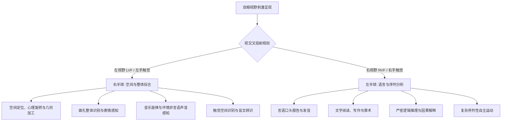

* **裂脑人实验核心范式 (Sperry & Gazzaniga)**：
  * 切断**胼胝体**的外科难治性癫痫患者，左右半球丧失直接通信通道。
  * 将刺激短暂闪现在**左侧视野 (LVF)**（时间 $<200\text{ms}$，防止眼动扫视）：信息投射至右半球。由于右半球缺乏语言中枢，患者**无法口头说出**看到了什么；但左手（受右半球支配）可以从遮挡物后**准确摸出或画出**对应物体。
  * 若刺激呈现在**右侧视野 (RVF)**：信息投射至左半球，患者能立即进行流畅的**口头言语报告**。

### 2. 左右大脑半球优势功能对照

| 认知维度 | 左半球优势功能 (Left Hemisphere) | 右半球优势功能 (Right Hemisphere) |
| :--- | :--- | :--- |
| **语言与听觉** | 言语发音、词汇识别、句法解析、语言相关声音 | 语调感知、非言语环境声、音乐旋律与音质 |
| **视觉与空间** | 字母、单词识别、局部细节分析、超现实/抽象艺术 | 几何构图、空间方位、心理旋转、面孔识别、写实艺术 |
| **记忆与思维** | 言语代码记忆、逻辑演绎、因果归因（“解释器”机制） | 空间与视觉意象记忆、非言语表象整合、直觉模式匹配 |
| **动作控制** | 复杂有序的自主动作编程、精细手部分工 | 整体空间姿态维持、大范围空间轨迹运动控制 |

### 3. 进化解释与嵌合脸实验
* **进化论解释**：脑半球功能特化通过将高度耗能的计算集中于单侧，极大地提升了神经元集群的组合灵活性与生成能力（如运用有限语法规则生成无限句子，或利用工具组件创造复杂机械）。
* **嵌合脸实验 (Chimeric Faces)**：
  * 将两张不同性别或年龄的人脸各取一半拼接成一张对称面孔（例如左半边年轻、右半边年老），被试注视中央固定点。
  * **言语提问（“这个人多大岁数？”）**：由左半球驱动，被试报告右视野所见的年老人脸。
  * **非言语指出（“请用左手指认对应面孔”）**：由右半球驱动，被试指出左视野所见的年轻面孔。
  * **利手与阅读习惯效应**：右利手个体在面孔加工中右脑参与度极高，显著倾向于报告左半脸特征；左利手个体半球特化程度较低。同时，从左向右的阅读习惯也强化了从左侧优先抓取特征的注意定势。
* **大脑整体性器官本质**：正常个体的胼胝体每秒传递数亿次脉冲，左右半球时刻处于高频交互协同之中，所谓“左脑人/右脑人”的通俗划分严重脱离神经生物学事实。

---

## 四、学习理论与条件反射

### 1. 学习的界定与长尾效应
* **学习的定义**：由经验或练习引起的个体行为或行为潜能相对持久的变化（排除疲劳、药物、疾病及生物成熟导致的暂时性改变）。
* **长尾效应与自适应挑战**：现实生活中大部分常规事件可依据概率预测，但具有决定性影响的重大突发事件往往概率极低，个体无法单纯依赖常规监督学习，必须具备灵活的泛化与适应机制。

---

### 2. 经典条件反射 (Classical Conditioning)
* **巴甫洛夫反射建立范式**：
  $$\text{中性刺激 (NS, 铃声)} \xrightarrow{\text{无先天联系}} \text{无定向反应}$$
  $$\text{条件刺激 (CS, 铃声)} + \text{无条件刺激 (UCS, 肉粉)} \xrightarrow{\text{多次时间紧邻配对}} \text{无条件反应 (UCR, 唾液分泌)}$$
  $$\text{充分建立后：} \text{条件刺激 (CS, 铃声)} \longrightarrow \text{条件反应 (CR, 唾液分泌)}$$

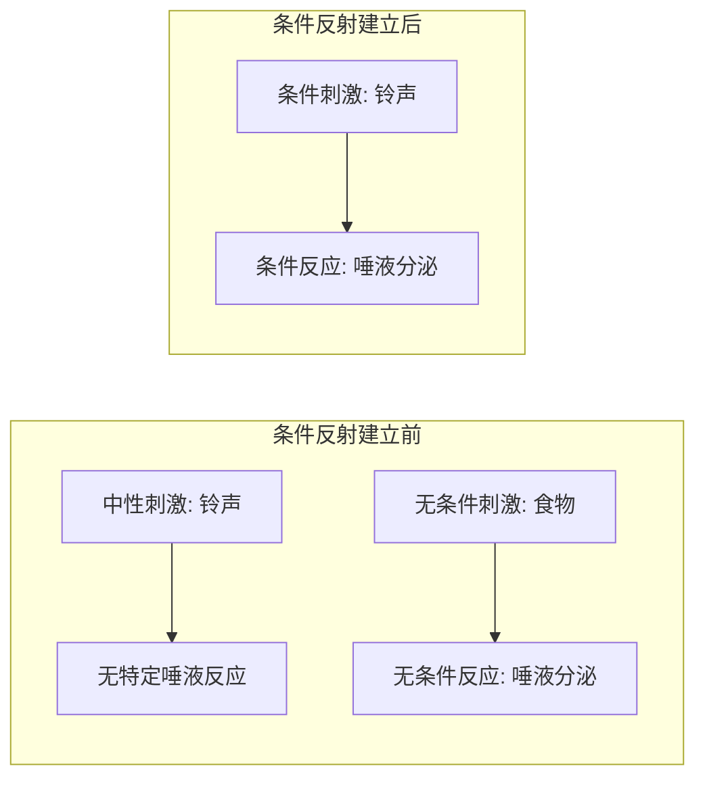

* **产生机制的基本原则**：
  1. **时间次序**：CS 必须先于 UCS 呈现（前向延缓条件作用效果最优，后向条件作用极难建立）。
  2. **时间紧邻性**：CS 与 UCS 之间的时间间隔必须极其短暂（通常在几百毫秒至数秒内）。
  3. **配对重复**：中性刺激与无条件刺激必须经历多次稳定的伴随配对。
  4. **刺激显著性**：CS 必须具备独特性和物理显著性，能从背景噪声中脱颖而出。
* **核心现象与动力学规律**：
  * **刺激泛化 (Generalization)**：对与原 CS 物理属性相似的新刺激表现出相同 CR 的倾向（如“一朝被蛇咬，十年怕井绳”）。
  * **刺激分化 (Discrimination)**：机体通过条件辨别训练，学会仅对特定 CS 做出反应，对其他相似刺激不产生反应。
  * **消退 (Extinction)**：反复单独呈现 CS 而不给予 UCS 强化，已建立的 CR 强度逐渐减弱直至消失。
  * **自发恢复 (Spontaneous Recovery)**：消退经过一段时间休息后，再次单独呈现 CS 时，CR 会短暂重新出现，证明消退是**新抑制性痕迹的形成**，而非原有记忆痕迹的物理擦除。
  * **高级条件反射 (Higher-order Conditioning)**：用已巩固的 CS 作为“虚拟无条件刺激”，与新的中性刺激配对，建立第二级甚至第三级条件反射。
  * **生物准备状态 (Biological Preparedness)**：进化学决定的特定刺激-反应更易联结（如加西亚味觉厌恶实验：老鼠在恶心与味觉之间只需一次长间隔匹配即可建立厌恶，但在电击与味觉之间极难建立）。
  * **情绪条件反射与替代学习**：恐惧症多为条件性情绪反应；人类可通过“观察他人恐惧反应”（替代性条件反射）直接习得恐惧。

---

### 3. 操作性条件反射 (Operant Conditioning)
* **桑代克效果律 (Law of Effect)**：在特定情境下，凡是带来满意后果的行为，其与该情境的联结会增强，未来再次发生的概率上升；带来烦恼后果的行为，其联结会削弱。
* **斯金纳行为强化与惩罚四象限**：

| 操作机制 | 刺激呈现（施加刺激 $+$） | 刺激撤除（移除刺激 $-$） | 目标行为发生频率变化 |
| :--- | :--- | :--- | :--- |
| **强化 (Reinforcement)** | **正强化 (Positive Reinforcement)**<br/>给予渴望的愉悦刺激（如奖金、食物） | **负强化 (Negative Reinforcement)**<br/>终止或逃避厌恶刺激（如关掉刺耳警报） | **增加 / 维持** $\uparrow$ |
| **惩罚 (Punishment)** | **正惩罚 / 施加型 (Positive Punishment)**<br/>施加痛苦的厌恶刺激（如通报批评、体罚） | **负惩罚 / 消除型 (Negative Punishment)**<br/>剥夺享用愉悦刺激的权利（如禁足、扣分） | **减少 / 消除** $\downarrow$ |

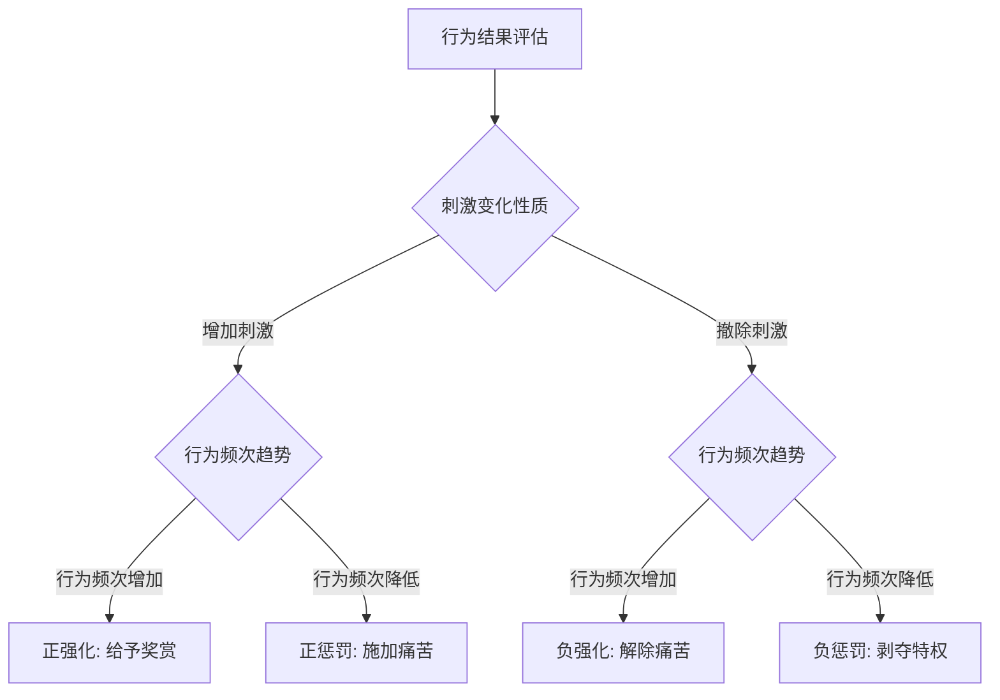

* **经典条件反射 vs 操作性条件反射对比**：

| 比较维度 | 经典条件反射 (Classical) | 操作性条件反射 (Operant) |
| :--- | :--- | :--- |
| **反应性质** | 非自主的、反射性的（平滑肌与腺体活动） | 自主的、主动发出的（骨骼肌与目标导向行为） |
| **刺激顺序** | **刺激先行**：UCS 紧随 CS 之前/之后诱发反应 | **行为先行**：有机体先自发做出反应，**后果随后**到来 |
| **控制机制** | 依赖先行刺激与环境的联结 | 依赖行为与后续强化/惩罚结果的联结 |
| **关键因素** | 刺激的时间紧邻性与信号关联度 | 强化物的及时性、强度及强化程式匹配 |

* **强化程式与行为塑造高级概念**：
  * **部分强化效应 (Partial Reinforcement Effect)**：相比于每次都给予强化的连续强化，间歇性/部分强化（尤其是变比率强化，如老虎机）建立的行为抵抗消退的能力显著更强。
  * **行为塑造 (Shaping & Chaining)**：通过连续逼近法，对逐步接近最终目标的微小行为变异给予即时强化，从而建立自然状态下极难自发产生的复杂行为链。
  * **本能漂移 (Instinctive Drift)**：经过长期强化训练的动物行为，会逐渐退化并回归到该物种先天的生物本能反应模式中。
  * **有效惩罚的实施原则**：①即时性（紧随错误行为发生）；②一致性与不可逃避性；③必须与正确替代行为的正强化配对出现。
  * **行为矫正技术**：代币制 (Token Economy)、暂停/计时隔离 (Time-out)、应用行为分析 (ABA)、生物反馈与神经反馈技术。

---

### 4. 认知学习理论
* **托尔曼的潜伏学习 (Latent Learning)**：老鼠在无奖赏迷宫中自由探索，虽然外显行为无明显进步，但内部已构建出空间环境的**认知地图 (Cognitive Map)**；一旦引入食物强化，其成绩立即跃升，证明**学习可以在没有强化的情况下发生**。
* **苛勒的顿悟学习 (Insight Learning)**：黑猩猩利用箱子叠高或竹竿拼接获取高处香蕉，表明解决问题是对情境中各要素空间几何与因果关系的突然领会与心智重组，而非盲目的机械试误。
* **塞利格曼的习得性无助 (Learned Helplessness)**：动物或人类在经历多次无法通过自身行动逃避的电击/挫折后，会产生弥散性的无能感，即便后来环境改变、允许逃脱，也放弃任何尝试。
* **班杜拉的观察学习 (Observational Learning)**：
  $$\text{注意过程 (关注榜样)} \longrightarrow \text{保持过程 (表象/言语编码)} \longrightarrow \text{动作再现 (运动执行)} \longrightarrow \text{动机过程 (直接/替代/自我强化)}$$

---

## 五、感知觉、心理物理学与感觉记忆

### 1. 感觉系统物理机制与心理物理学
* **心理物理学基本定律（韦伯-费希纳定律）**：
  $$S = K \log R \quad (S:\text{心理感觉量},\, R:\text{物理刺激量},\, K:\text{常数})$$
  *心理物理学揭示：心理量与物理刺激强度的对数成正比，保证了感官在极宽的物理动态范围内不至于过载。*
* **五大核心感觉受体与物理输入**：
  * **视觉**：眼睛 $\to$ 400~700nm 电磁波光子 $\to$ 视网膜视杆细胞（暗视觉、运动）与视锥细胞（明视觉、颜色、细节）。
  * **听觉**：耳朵 $\to$ 空气声波振动 $\to$ 耳蜗基底膜毛细胞机械弯曲。
  * **味觉**：舌面与口腔 $\to$ 溶于唾液的化学物质 $\to$ 味蕾味觉受体细胞。
  * **嗅觉**：鼻腔嗅上皮 $\to$ 挥发性气体化学分子 $\to$ 嗅觉受体神经元。
  * **触觉**：皮肤 $\to$ 机械压力、温度、组织损伤 $\to$ 迈斯纳小体、帕西尼小体、游离神经末梢。


* **先验知识与认识论**：感觉是人类作为生物体适应地球物理环境演化出的“心物窗口”。大脑对感觉信号的解释不仅取决于自下而上的刺激物理能量，更高度依赖于记忆中先验知识的顶层预测性约束。
* **经典视觉错觉的启示**：
  * **缪勒-莱尔错觉 (Müller-Lyer Illusion)** 与 **庞佐错觉 (Ponzo Illusion)**：大脑利用三维空间透视经验（透视线汇聚代表距离遥远）对二维视网膜图像进行大小距离恒常性补偿计算，证明错觉是深度计算规则自动投射的结果。

---

### 2. 双视觉皮层通路：P 通路与 M 通路
* **解剖分流与计算分工**：

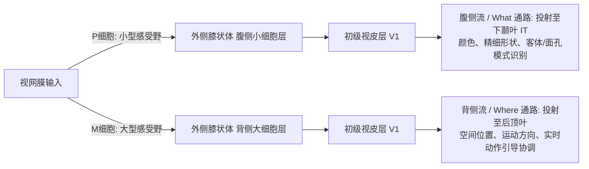

* **P 通路 (Parvocellular)**：对颜色、高空间频率、精细边界敏感，传导速度慢，专司“是什么 (What)”。
* **M 通路 (Magnocellular)**：对明暗对比、低空间频率、高频运动敏感，传导速度快，专司“在哪里 / 如何操作 (Where/How)”。

---

### 3. 知觉广度与感觉记忆
* **知觉广度与眼动机制**：人类在阅读或复杂视觉探索时，眼动并非平滑扫描，而是由**注视点 (Fixations, 持续约 200~250ms)** 与**眼跳 (Saccades, 耗时 20~40ms)** 交替构成的跳跃过程。信息提取仅发生在注视期间，在跳跃瞬间存在“眼跳抑制”现象。
* **斯珀林 (Sperling) 部分报告法范式**：
  * **全报告法**：短暂呈现 $3 \times 4$ 字母矩阵，被试只能报告出 $4\sim 5$ 个字母（受限于短时记忆提取容量瓶颈）。
  * **部分报告法**：字母消失后立即给予高、中、低音提示音，指示报告对应行。被试能近乎完美地报告任意一行。
  * **结论**：**图像记忆 (Iconic Memory)** 容量极其巨大，但衰退极快（保持时间 $<500\text{ms}$）。
* **声像记忆 (Echoic Memory)**：听觉感觉存储，原始声学信息保留时间达 $250\text{ms} \sim 4\text{s}$，为语音时序理解提供时间积分窗口。

---

## 六、视觉组织、模式识别与理论模型

### 1. 格式塔 (Gestalt) 组织原则与主观轮廓
* **格式塔核心信条**：“整体大于部分之和（刺激的全局结构决定局部特征的知觉）”。

```
[封闭律]        [邻近律]         [相似律]         [简素律]
 ╭──╮ ╭──╮      ••  ••  ••      ••  ○○  ••      ╭───────╮
 │  │ │  │      ••  ••  ••      ••  ○○  ••      │ 5个圆 │
 ╰──╯ ╰──╯                                      ╰───────╯
 自动闭合成整体   依据空间距离归类  依据属性特征组合   知觉倾向最简结构
```

1. **封闭律 (Closure)**：视觉系统倾向于将残缺的轮廓补全为闭合的整体。
2. **邻近律 (Proximity)**：空间或时间上相互靠近的元素倾向于被聚合成一组。
3. **相似律 (Similarity)**：形状、颜色、大小、亮度相似的元素被视作一个集合。
4. **简素律 (Prägnanz / Good Figure)**：视觉感知总是倾向于组织出最规则、对称、简单的结构。
5. **对称律 (Symmetry)**：空间对称的区域会被优先知觉为图形主体而非背景。
6. **良好连续律 (Good Continuation)**：具有顺畅延伸趋势的线条倾向于被知觉为连续实体。
7. **共同命运 (Common Fate)**：以相同速度、朝相同方向运动的元素被感知为一个单元。
* **主观轮廓与侧抑制机制**：如**卡尼萨三角 (Kanizsa Triangle)**，物理上不存在亮度边界，但由于局部诱导块的缺口排布激活了初级视皮层的共线神经元侧抑制网络，自上而下计算出超越物理输入的明亮轮廓。

---

### 2. 模式识别的核心理论模型

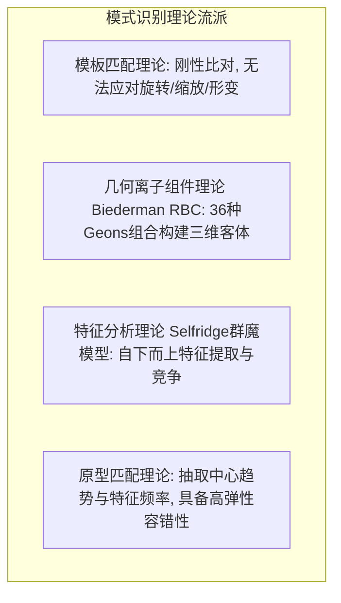

* **模板匹配理论 (Template Matching)**：认为长时记忆中存有无数精确模板，感觉输入必须与之一一比对。其缺陷在于需要无穷的存储空间且无法处理非刚性形变。
* **几何离子理论 (Recognition-by-Components, RBC)**：由 Biederman 提出，主张三维客体由约 36 种基本的“几何离子 (Geons)”（如圆柱体、楔形、立方体）根据空间连接关系拼接而成，具备**视点不变性**。
* **特征分析理论 (Feature Analysis)**：Selfridge 提出的“群魔图模型 (Pandemonium Model)”。模式识别始于自下而上的基础物理特征检测（线段、朝向、拐角），经由特征魔、认知魔、决策魔逐级汇总竞争。Hubel & Wiesel 发现的视皮层简单细胞与复杂细胞为此提供了神经生理学证据。
* **原型匹配理论 (Prototype Matching)**：
  * **原型本质**：长时记忆中储存的是抽象化的理想范式，而非孤立具体的样例。
  * **趋中模型 vs 特征-频率模型**：趋中模型主张原型是所有样例特征维度的**数学平均值**；特征-频率模型主张原型是**高频共现特征的组合**。
  * **原型学习规律**：被试即便只接触变形样例而从未见过真实原型，也能在脑中自发抽象出原型，并在后续测试中出现**伪记忆**（误将从未见过的原型认作已学过的熟悉刺激）。

---

### 3. 自下而上 vs 自上而下加工与情境效应
* **数据驱动 (Bottom-up) 与概念驱动 (Top-down)**：绝大多数模式识别是双向交互的。自上而下的知识假设与自下而上的感官特征在时空上同步整合。
* **词优效应与交互激活模型 (McClelland & Rumelhart)**：在速示条件下，识别单词中的字母（如 `WORD` 中的 `D`）比识别孤立字母或无意义字母串（如 `OWRD` 中的 `D`）显著更快更准。词汇层对字母层提供了自上而下的反馈激活。
* **贝叶斯先验推断**：感知觉是根据记忆中各特征的先验概率 $P(\text{Hypothesis})$ 与当前感官线索的似然度 $P(\text{Data}|\text{Hypothesis})$ 计算后验概率的统计优化过程。

---

## 七、注意机制与多任务加工

### 1. 经典听觉注意选择模型

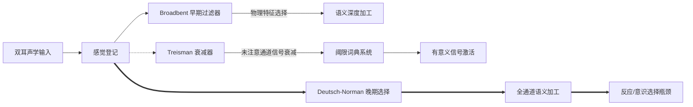

| 模型名称 | 提出者 | 过滤器位置 | 未注意通道的加工深度 | 解释的典型现象 |
| :--- | :--- | :--- | :--- | :--- |
| **早期选择模型 (过滤器理论)** | Broadbent | 感觉分析之后、语义加工之前 | **完全被阻断**，仅保留粗糙物理特征 | 双耳分听追随实验中的语义完全忽视 |
| **衰减模型 (Attenuation)** | Treisman | 感觉分析与语义系统之间 | **信号被衰减弱化**，低阈值词可穿透 | **鸡尾酒会效应**（喧闹中听到自己名字） |
| **后期选择模型 (Late Selection)** | Deutsch-Norman | 语义加工之后、反应选择之前 | **全部经过深度语义分析** | 无意识语义启动、负启动效应 |

---

### 2. 视觉注意与特征整合理论 (FIT)
* **Anne Treisman 特征整合理论 (Feature Integration Theory)**：
  1. **前注意阶段 (Pre-attentive Stage)**：全视野**自动、无意识、并行**加工颜色、朝向、运动等低级离散特征；在视觉搜索中表现为不受干扰项数量影响的“**弹出效应 (Pop-out)**”。
  2. **聚焦注意阶段 (Focused Attention Stage)**：**串行**空间注意像胶水一样将分离的特征绑定固定到特定物体上。干扰项增多时，搜索反应时呈线性上升。
* **错觉结合 (Illusory Conjunction)**：当注意被分散或极速呈现时，游离的特征会发生随机错误拼装（例如将红方块和绿圆圈看成绿方块）。

```
【特征搜索 (并行弹出)】          【结合搜索 (串行注意)】
    O   O   O   O                   O   X   O   X
    O   X(目标) O                   X   O(目标:红O) X
    O   O   O   O                   O   X   X   O
反应时恒定，与干扰项无关           反应时随项目增多显著延长
```

---

### 3. 空间注意系统与单侧视野忽视
* **单侧空间忽视 (Hemispatial Neglect)**：
  * 右侧后顶叶皮层损伤导致患者对**左侧视野**的所有事物彻底丧失注意意识（画钟表只画右半边、剃须只剃右脸）。
  * **顶叶分工不对称性**：右顶叶负责**全视野（左+右）**的全局注意调控；左顶叶仅负责**右视野**的局部注意。故右顶叶损伤的临床后果远比左顶叶严重。
* **内源性注意 vs 外源性注意 (Posner 线索范式)**：
  * **外源性注意（外周线索闪烁）**：反射性、自下而上、极速建立（$\approx 100\text{ms}$），随后产生**返回抑制 (Inhibition of Return, IOR)** 防止注意重复滞留。
  * **内源性注意（中央箭头指示）**：意志性、自上而下、速度较慢（$\approx 300\text{ms}$），可持续稳定维持。

---

### 4. 中枢注意、双任务瓶颈与自动化
* **中枢认知瓶颈 (Central Bottleneck)**：人脑在进行感知与运动执行时可部分并行，但在**中枢反应选择 (Response Selection)** 阶段存在单通道瓶颈。
* **注意瞬脱 (Attentional Blink, AB)**：在快速序列视觉呈现 (RSVP) 任务中，当识别目标 T1 后的 $200\sim 500\text{ms}$ 窗口内出现目标 T2 时，T2 的识别率断崖式下降，证明将注意力抽离并重新集中需要时间开销。
* **自动化加工与斯特鲁普效应 (Stroop Effect)**：
  * **自动化特征**：无需意识努力、不消耗认知资源、不可随意压制。
  * **Stroop 效应**：当文字含义与打印颜色冲突时（如用红墨水写“绿”），阅读自动化加工会强行干扰颜色命名反应，导致反应时显著延长。
* **西蒙效应 (Simon Effect)**：刺激呈现的空间几何位置与按键反应的手部空间位置重合时反应极快，冲突时反应延缓，证明空间位置编码具有强制自动激活倾向。

---

## 八、记忆系统架构与工作记忆模型

### 1. 传统记忆多存储模型 (Atkinson-Shiffrin)

| 记忆阶段 | 编码表征形式 | 保持时间 | 存储容量 | 遗忘主导机制 |
| :--- | :--- | :--- | :--- | :--- |
| **感觉记忆** | 原始物理声学/视觉模式 | 图像 $<0.5\text{s}$，声像 $2\sim 4\text{s}$ | 极大（瞬时照相） | 物理痕迹极速衰退、掩蔽覆盖 |
| **短时记忆 (STM)** | 听觉发音代码为主，兼具视觉/语义 | $15\sim 30\text{s}$ (若无复述) | $7\pm 2$ 组块 (Chunk) | 痕迹自然衰退、前/后项目位移挤出 |
| **长时记忆 (LTM)** | 语义网络、命题、心理表象为主 | 数天至数十年（甚至终生） | 理论上无限 | 提取线索丢失、前摄/倒摄干扰 |

---

### 2. 巴德利工作记忆多组分模型 (Baddeley & Hitch)

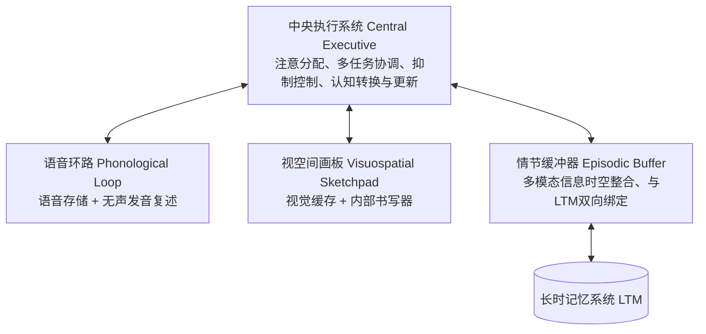

#### 四大核心子系统运行机制：
1. **语音环路 (Phonological Loop)**：
   * **四大经典生理证据**：
     * **语音相似性效应**：发音相似的字母/词（如 B, C, D, P, T）即时回忆成绩远差于发音不相似者。
     * **词长效应**：单音节词广度显著大于多音节词（容量受限于 $\approx 2\text{s}$ 循环发音极限）。
     * **发音抑制效应**：识记时大声重复无意义音节（如“the-the-the”），会彻底抵消词长效应。
     * **无关声音效应**：背景中无法理解的有声言语会自动侵入语音存储破坏记忆。
2. **视空间画板 (Visuospatial Sketchpad)**：
   * **视觉缓存 (Visual Cache)**：暂存客体形态、颜色与纹理。
   * **内部书写器 (Inner Scribe)**：规划空间动作轨迹、复述刷新空间表象。
3. **中央执行系统 (Central Executive)**：
   * 工作记忆的核心中枢，负责：①**抑制控制**（压制优势自动反应与分心物）；②**任务转换**（在多个心智操作间灵活切换）；③**内容更新**（实时监控更新工作记忆内容）。
4. **情节缓冲器 (Episodic Buffer)**：
   * 具有多维编码能力的临时存储平台，将来自视觉、听觉与长时记忆的信息融合成连贯的时空情节表征。

---

### 3. 短时记忆的编码、容量与提取
* **组块化 (Chunking)**：利用长时记忆中的已有知识结构将分散孤立的项目组合成有意义单元（如将 `1-9-4-9-1-0-0-1` 组块为 `1949` 与 `1001`），极大突破 $7\pm 2$ 的物理容量限制。
* **斯腾伯格 (Sternberg) 记忆扫描提取实验**：
  * 向被试呈现包含 $1\sim 6$ 个数字的记忆集，随后呈现探测项目判断是否在集内。
  * **结论**：人类在短时记忆中的搜索提取方式是**完全串行穷尽式搜索 (Serial Exhaustive Search)**（反应时随项目数线性上升，且“在/不在”两条回归线斜率一致，单项扫描耗时 $\approx 38\text{ms}$）。
* **前摄抑制释放 (Release from Proactive Interference, Wickens)**：连续识记同类别词汇会导致回忆成绩因前摄抑制逐轮下降；若突然切换词汇语义类别（如从“水果”换成“职业”），记忆成绩立即反弹，证明短时记忆中存在**自动化的自上而下语义编码**。

---

## 九、长时记忆、遗忘机制与记忆的建构性

### 1. 长时记忆分类体系与神经解剖学基础

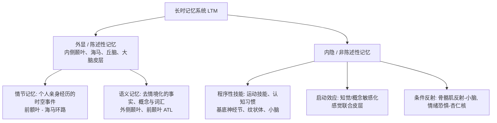

* **神经双重分离的经典证据（H.M. 病例）**：
  * 切除双侧海马及相邻内侧颞叶组织后，表现出极其严重的**顺行性遗忘**（完全无法形成新的陈述性长时记忆）；
  * 短时记忆正常（数字广度完好），且**镜像描画等运动程序性记忆完好**，证明陈述性与非陈述性记忆在解剖学上相互独立。

---

### 2. 加工水平理论与长时记忆巩固
* **加工水平理论 (Craik & Lockhart)**：信息的保持时间与稳固度取决于其被加工的深度：
  $$\text{结构物理加工 (浅)} \longrightarrow \text{语音发音加工 (中)} \longrightarrow \text{语义联想加工 (深)} \longrightarrow \text{自我参照加工 (极深)}$$
* **自我参照效应 (Self-reference Effect)**：将新知识与个体的“自我图式”相联结，能激活最丰富精细的联想网络，记忆效果最佳。
* **生物巩固机制**：记忆最初以电回路活动维持在海马-皮层环路中，在经历长时程增强 (LTP) 及蛋白质合成后，逐渐转移至大脑皮层永久固化。情绪激动时肾上腺素激增促进肝糖原分解为葡萄糖，为大脑海马与杏仁核提供充足代谢能量，强化重大情绪事件的记忆巩固。

---

### 3. 遗忘曲线与记忆重构错误
* **艾宾浩斯遗忘曲线 (Ebbinghaus Forgetting Curve)**：遗忘在学习后立即发生，其速度呈**先快后慢**的负指数幂函数特征（前期急剧下降，后期极其平缓）。

```
保持量 (%)
100 █
 80 │ █
 60 │  █
 40 │   █
 20 │    ████████████████ (渐进平稳线)
  0 └──┬───┬───┬───┬───┬──▶ 时间
      20m 1h  9h  2d  31d
```

* **自传体记忆与普鲁斯特现象 (Proust Phenomenon)**：气味能极其生动地唤起遥远且富有情绪色彩的自传体回忆。其神经机制在于**嗅神经直接与杏仁核及海马相连**，不经丘脑中继，受语言符号系统的干扰最小。
* **闪光灯记忆 (Flashbulb Memory)**：重大突发事件（如911事件）发生时对知悉情境（来源、地点、情绪）产生的极具生动度的“快照式”记忆。研究表明其主观确定性极高，但客观准确性随时间推移同样存在严重衰减与细节重构。
* **目击者证言的不可靠性与虚假记忆植入 (Loftus)**：
  * **提问引导效应 (Misinformation Effect)**：在提问中微妙改变用词（如将两车“相撞 hit”替换为“粉碎性撞击 smash”），会导致被试不仅高估车速，还会无中生有地“回忆出”现场本不存在的碎玻璃。
  * **记忆的建构本质**：提取记忆不是调取录像带，而是基于碎片线索、当前预期与图式进行的当下**重构**。

---

## 十、知识表征、语义网络与概念模型

### 1. 语义特征对比模型 (Smith et al.)
* 概念被解构为两类离散特征：
  * **定义性特征 (Defining Features)**：概念必须具备的根本核心特征。
  * **描述性特征 (Characteristic Features)**：普遍具备但非绝对必要的修饰特征。

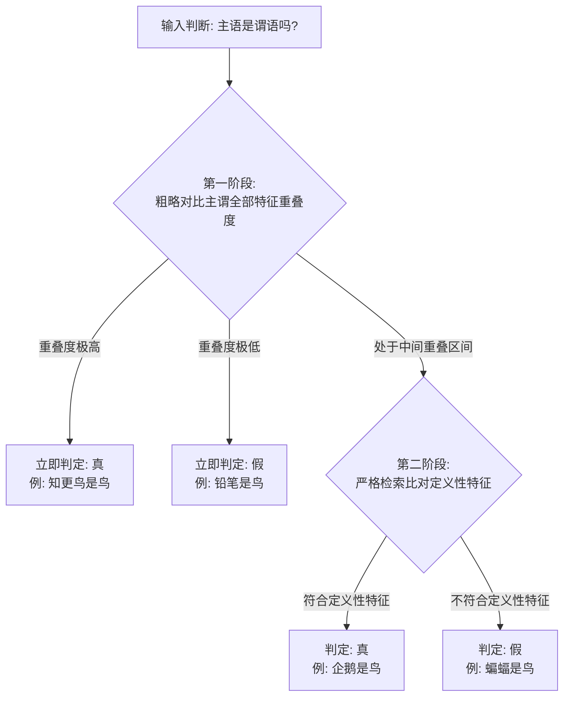

---

### 2. 层次网络模型 vs 扩散激活理论

```
【Collins & Quillian 层次网络模型】
          [动物 (Animal)] ── (有皮肤, 能呼吸)
                ▲
                │
            [鸟 (Bird)] ── (有羽毛, 会飞, 下蛋)
          ▲           ▲
          │           │
 [金丝雀 (Canary)]   [企鹅 (Penguin)]
 (会唱歌, 是黄色)    (不会飞, 会游泳)
```

* **层次网络模型 (Collins & Quillian)**：
  * **认知经济性**：属性存储在最高可能层级上，不向下冗余重复。
  * **层级距离效应**：验证“金丝雀是金丝雀 $<$ 是鸟 $<$ 是动物”反应时逐级递增。
  * **模型局限**：无法解释**典型性效应**（知更鸟比企鹅更快被确认为鸟）以及**范畴大小效应的反转**（判定“狗是哺乳动物”比“狗是动物”更慢）。
* **扩散激活模型 (Collins & Loftus)**：
  * 放弃刚性树状层级，改为基于**语义关联度**构建的弹性网状拓扑；
  * 某个节点被激活后，兴奋沿连线向周围所有节点呈衰减性扩散，成功解释了**语义启动效应**。

---

### 3. 命题网络、ACT-R 认知架构与联结主义 (PDP)
* **命题 (Proposition)**：表达思想判断的最小意义独立单元，通常由谓词和若干参数构成。
* **Anderson ACT-R 架构**：


* **联结主义 / 平行分布式处理模型 (PDP)**：
  * 心智表征分布于庞大的微观神经元样单元网络中，概念表现为整个网络中**激活强度的特定空间分布模式**而非单一节点；
  * 学习本质上是突触连接权重基于误差反向传播算法的自适应调整。
* **图式 (Schema) 与脚本 (Script)**：
  * **图式**：关于特定物体、场景、角色的结构化上位知识插槽集合。
  * **脚本**：关于常规情境中事件发生标准时间序列的动态图式（如“餐馆点餐就餐脚本”）。
* **具身认知 (Embodied Cognition)**：概念表征深植于感觉-运动系统。被试在阅读“踢球”等动作动词时，大脑功能成像显示其运动皮层脚部代表区会产生同步激活。

---

## 十一、心理表象与空间认知

### 1. 表象的争论：模拟表征 vs 命题表征
* **双重编码理论 (Paivio)**：人脑具备相互独立又紧密相连的两套表征系统：**言语符号系统**与**非言语表象系统**。具体词（如“苹果”）能同步激活两种系统，记忆效果显著优于只能依赖言语系统的抽象词（如“正义”）。
* **模拟表征派 (Kosslyn, Shepard)** vs **命题表征派 (Pylyshyn)**：
  * **模拟派（功能等价假说）**：心理表象具备空间拓扑结构，其在头脑中的心智操作在神经机制与时间动力学上与真实物理刺激感知**功能对等**。
  * **命题派**：所有心智底层均为抽象的谓词逻辑命题，主观体验到的心理图像仅仅是认知运算的“副现象 (Epiphenomenon)”。

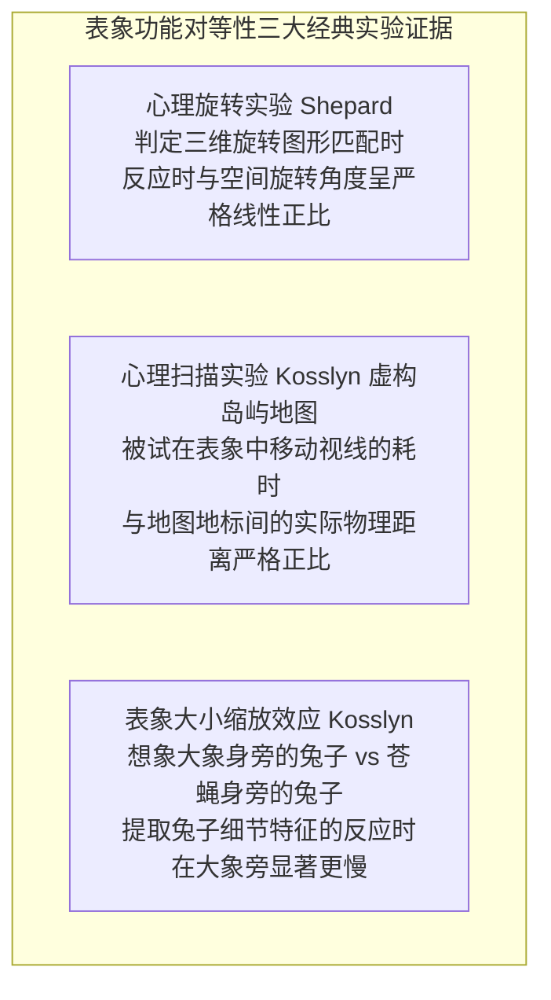

---

### 2. 空间认知地图与联觉
* **认知地图 (Cognitive Map) 的三级发展**：
  $$\text{地标知识 (Landmark Knowledge)} \longrightarrow \text{路径知识 (Route Knowledge)} \longrightarrow \text{全局俯瞰调查知识 (Survey Knowledge)}$$
* **认知地图的启发式扭曲**：人们倾向于使用概念图式规则化地理信息，导致系统的估计偏差（如将弯曲的道路脑补为直线、将倾斜的国家版图旋转对齐）。
* **联觉 (Synesthesia)**：一种感官通道的刺激自动化且非随机地诱发另一种感官通道主观体验的神经交联现象（如“看到字母 A 体验到红色”），源于大脑发育中皮层感觉区之间未完全修剪的跨通道神经串扰。

---

## 十二、语言学基础、乔姆斯基语法与语言获得

### 1. 人类语言的五大本质属性与层级结构
1. **语义性 (Semanticity)**：符号指代特定的客观客体、动作或抽象概念。
2. **任意性 (Arbitrariness)**：词的声音/字形与其实际所指意义之间无内在物理必然性。
3. **位移性 / 跨时空性 (Displacement)**：能够交流不在眼前、发生在过去、未来或虚构情境的事物。
4. **离散性 (Discreteness)**：由有限个界限分明的离散单位（音位、语素）组合而成。
5. **生成性 / 能产性 (Productivity / Generativity)**：基于有限的语法规则能够生成和理解无穷无尽的新句子。

```
【语言的自下而上层级结构】:
 语篇 (Discourse) ──> 句子 (Sentence) ──> 短语 (Phrase) ──> 词汇 (Word) ──> 语素 (Morpheme) ──> 音位 (Phoneme)
```

* **音位 (Phoneme)**：语言中能够区别意义的最小声音单位。嗓音起始时间 (VOT) 决定了清浊辅音的范畴知觉。
* **语素 (Morpheme)**：最小的有意义语言单位。分为**自由语素**（可独立成词，如 `book`）与**粘着语素**（必须依附，如复数 `-s`）；以及**内容语素**与**功能语素**。

---

### 2. 乔姆斯基转换生成语法理论 (TG Grammar)
* **表层结构 vs 深层结构**：
  * **深层结构 (Deep Structure)**：表达句子核心语义命题的底层抽象句法形式。
  * **表层结构 (Surface Structure)**：实际说出或写出的线性词语序列。
  * **转换规则 (Transformational Rules)**：通过移位、插入、删除等规则，将一个深层结构转化为不同表层结构（如主动句转被动句），或将不同表层歧义句还原为各自的深层结构。
* **语言习得机制 (LAD) 与普遍语法 (Universal Grammar)**：乔姆斯基坚决反对行为主义的“刺激-反应强化说”，主张人类具有天生的、物种特异性的语言习得机制，所有人类语言底层共享一套普遍语法参数。

---

### 3. 语言获得关键期与思维关系
* **关键期假说 (Lenneberg)**：儿童必须在青春期大脑侧化完成之前接触丰富的自然语言环境，否则将永久丧失完整掌握复杂句法结构的能力（如“野孩子 Genie”案例）。
* **萨丕尔-沃尔夫假说 (Sapir-Whorf Hypothesis)**：
  * **语言决定论（强假说，已基本被推翻）**：语言彻底决定并禁锢了使用者的思维范畴。
  * **语言相对论（弱假说）**：语言的词汇切分与语法标记方式会以细微的方式引导注意分配，影响特定维度的知觉与记忆（如颜色命名、空间方位描述）。

---

## 十三、语言理解、阅读机制与情境模型

### 1. 阅读中的眼动生理机制与知觉广度
* **眼动参数**：注视 (Fixation, 200~250ms) 占 80%~90%，跳跃 (Saccade, 20~40ms) 占 10%，回视 (Regression) 占 10%~15%（用于处理语法理解冲突与歧义消解）。
* **知觉广度与移动窗口范式**：阅读英语时，注视点左侧知觉广度为 $3\sim 4$ 个字母空间，右侧为 $14\sim 15$ 个字母空间（中文阅读则向右偏侧更加紧凑），表现出显著的不对称性。

---

### 2. 词汇再认的 PET 减法脑成像研究
* **经典认知减法范式 (Petersen et al.)**：
  1. **无源基线**：注视十字固定点。
  2. **被动感知**：注视/聆听单词 $\implies$ 激活初级视皮层/听觉皮层（感觉特征编码）。
  3. **出声朗读**：大声复述呈现的单词 $\implies$ 扣除被动感知后，特异性激活运动皮层、辅助运动区及小脑（发音运动准备）。
  4. **动词联想**：看到名词说出其关联动作（如看到“蛋糕”说“吃”） $\implies$ 扣除出声朗读后，特异性激活左下额叶 (Broca) 与前扣带回（语义选择与反应冲突监控）。

---

### 3. 金茨 (Kintsch) 结构-整合模型与情境模型
* **文本理解的三重表征层次**：
  1. **表层表征 (Surface Level)**：文本确切字词的字面形式（衰退极快）。
  2. **文本基底 (Textbase Level)**：直接从文本抽取的命题网络集合。
  3. **情境模型 (Situation Model)**：读者调动长时记忆背景图式，对文本描述的世界场景在**空间、时间、因果、主角动机与意图**五个维度上建立的动态逼真心智模拟。

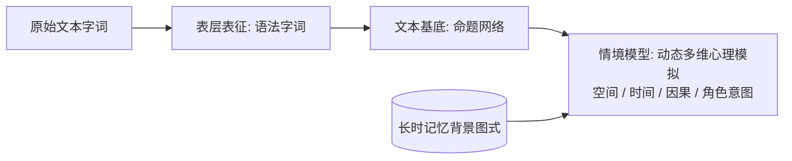

---

## 十四、思维、概念形成、逻辑推理与决策偏误

### 1. 概念形成与假设检验策略 (Bruner)
* **概念形成的本质**：从具体样例中辨别出共同关键属性并将规则内化的过程。
* **布鲁纳 (Bruner) 四大假设检验策略**：
  * **同时性扫描 (Simultaneous Scanning)**：在头脑中同时保留并追踪所有可能假设，根据每个反馈淘汰不合者（认知负荷极大）。
  * **继时性扫描 (Successive Scanning)**：一次只检验一个假设，证伪后彻底更换下一个假设（负荷轻但耗时长）。
  * **保守性聚焦 (Conservative Focusing)**：以一个正例为基准焦点，每次实验**仅改变一个特征维度**，系统性确认该维度的因果有效性（最稳妥高效）。
  * **博弈性聚焦 (Focus Gambling)**：每次同时改变多个特征维度以期快速突破，风险极高。

---

### 2. 演绎推理与逻辑偏差
* **三段论推理与氛围效应 (Atmosphere Hypothesis)**：前提中的量词（“所有/有些/没有”）制造出一种表面直觉氛围，使被试不假思索地接受符合该氛围的结论，忽视严密的逻辑形式。
* **沃森四卡片选择任务 (Wason Selection Task)**：
  * **规则**：“若一面是元音字母，则另一面必为偶数”（呈现：`E`、`K`、`4`、`7`）。
  * **确证偏见 (Confirmation Bias)**：绝大多数被试选择翻看 `E`（肯定前件）和 `4`（肯定后件的无效证实），忽视了必须翻看 `7`（否定后件以证伪假设）。
  * **作弊者检测机制 (Cheater Detection Algorithm)**：若将抽象字母转换为社会契约规则（“满18岁才能饮酒”，呈现：`喝啤酒`、`喝可乐`、`25岁`、`16岁`），正确翻看 `喝啤酒` 与 `16岁` 的比例跃升至近 100%，证明人类大脑演化出了专门针对违反社会契约的特异性逻辑检测模块。

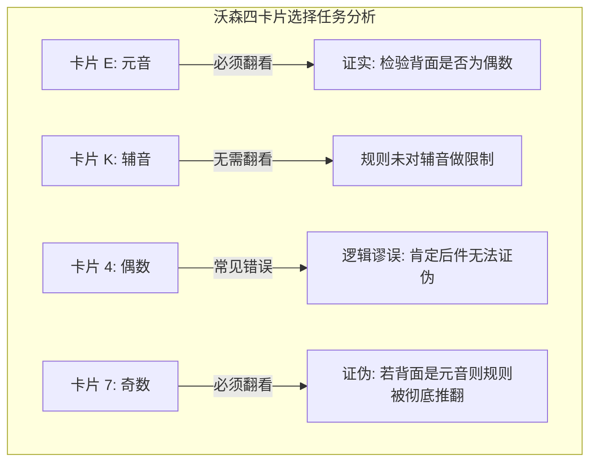

---

### 3. 卡尼曼与特沃斯基启发式判断与决策
* **有限理性与满意原则 (Herbert Simon)**：人类计算资源有限，决策并非追求数学期望最大化，而是追求“足够满意 (Satisficing)”。
* **三大经典启发式 (Heuristics)**：


1. **代表性启发式 (Representativeness Heuristic)**：
   * **忽视基线概率 (Base-rate Neglect)**：判断职业时完全依据人物性格与原型的相似度，无视该职业在总人口中的基础发生率。
   * **合取谬误 (Conjunction Fallacy)**：认为两个事件同时发生的概率高于单一天文事件（如判定“Linda 是女权主义银行职员”的概率大于“Linda 是普通银行职员”，即错误判定 $P(A \cap B) > P(A)$）。
   * **小数定律 (Law of Small Numbers)**：误以为小样本必然能够反映大总体的统计分布规律（如**赌徒谬误**：连续掷出5次正面后，坚信下一次必然是反面）。
2. **可得性启发式 (Availability Heuristic)**：
   * 极易在脑海中提取的事物（如空难、龙卷风、鲨鱼袭击）被严重高估发生概率；提取困难但致死率极高的疾病（如糖尿病、中风）被严重低估。
3. **锚定与调整启发式 (Anchoring and Adjustment)**：
   * 决策起点的初始数值（即使完全随机无关）会像锚一样将最终的估计结果牢牢拉向自身附近，后续调整极不充分。

---

### 4. 前景理论 (Prospect Theory) 与框架效应
* **卡尼曼与特沃斯基前景理论核心原则**：
  1. **参考点依赖**：人们评估的是相对于心理**参考点 (Reference Point)** 的相对损益，而非最终的绝对财富状态。
  2. **损失厌恶 (Loss Aversion)**：价值函数在损失区间的斜率显著陡于收益区间（对等损失带来的痛苦约为收益快乐的 **2~2.5倍**）。
  3. **S 型价值函数**：在**收益状态下表现为凹函数（风险规避）**；在**损失状态下表现为凸函数（风险偏好）**。

```
           心理价值 V(x)
                ▲
                │          . 收益区间 (凹曲线: 风险厌恶)
                │       . 
                │     .
                │   .
─────────────── ┼ ────────────────▶ 相对损益 (Δx)
        .       │ 参考点 (Reference Point)
      .         │
     .          │
    .           │ 损失区间 (陡峭凸曲线: 损失厌恶 + 风险偏好)
    ▼           │
```

* **框架效应 (Framing Effect)**：
  * **亚洲病症问题 (Asian Disease Problem)**：
    * **获救框架（收益）**：“方案A：确定救活200人；方案B：1/3概率救活600人” $\implies$ 多数人选择方案A（**风险规避**）。
    * **死亡框架（损失）**：“方案C：确定死亡400人；方案D：2/3概率死亡600人” $\implies$ 多数人选择方案D（**风险偏好**）。
    * *两个框架在数学期望上完全等价，但由于表述框架诱导的心理参考点改变，直接颠倒了被试的风险偏好。*

---

### 5. 日常生活中的典型决策陷阱与逻辑谬误汇总

| 决策偏误 / 逻辑谬误 | 心理机制与典型行为表现 |
| :--- | :--- |
| **心理账户 (Mental Accounting)** | 由 Thaler 提出；人们在心智中将资金划入不同虚拟账户（如“辛苦工资”与“意外横财”），打破了金钱的绝对等价可替代性。 |
| **沉没成本谬误 (Sunk Cost Fallacy)** | 仅仅因为前期已经投入了无法收回的成本（金钱、时间、精力），而决定在注定失败的项目上继续盲目追加投入。 |
| **后见之明偏差 (Hindsight Bias)** | “事后诸葛亮”心理，事件发生后产生“我早就料到会这样”的确定性幻觉，阻碍从错误中复盘学习。 |
| **热手效应 (Hot Hand Fallacy)** | 坚信在某一领域连续获得成功的个体，下一次尝试成功的概率会非随机地大幅上升。 |
| **物化谬误 (Reification)** | 将纯粹假设性、隐喻性或抽象的概念构念（如“智商”、“国民劣根性”）错误当做实体客观物质存在。 |
| **人身攻击 (Ad Hominem)** | 避开论点本身的逻辑与证据链条，转而通过攻击论述者的道德品质、个人背景或身份立场来否定其观点。 |
| **诉诸权威 / 声誉 (Appeal to Authority)** | 滥用权威人士或明星在非专业领域的断言作为论证自身合理性的唯一核心论据。 |
| **稻草人谬误 (Straw Man Fallacy)** | 刻意曲解、夸大或极端化对方的论点，树立一个极易被推翻的虚假靶子进行猛烈攻击。 |
| **过度自信偏差 (Overconfidence Bias)** | 个体对自身知识准确度、技能水平及未来判断的主观确信度系统性地高于客观实际表现。 |


<details class="md-source-page">
<summary>原图存档</summary>
<figure class="md-source-page__figure">

<figcaption>1 (1).png</figcaption>
</figure>
<figure class="md-source-page__figure">

<figcaption>1 (2).png</figcaption>
</figure>
<figure class="md-source-page__figure">

<figcaption>1 (3).png</figcaption>
</figure>
<figure class="md-source-page__figure">

<figcaption>1 (4).png</figcaption>
</figure>
<figure class="md-source-page__figure">

<figcaption>1 (5).png</figcaption>
</figure>
<figure class="md-source-page__figure">

<figcaption>1 (6).png</figcaption>
</figure>
<figure class="md-source-page__figure">

<figcaption>1 (7).png</figcaption>
</figure>
<figure class="md-source-page__figure">

<figcaption>1 (8).png</figcaption>
</figure>
<figure class="md-source-page__figure">

<figcaption>1 (9).png</figcaption>
</figure>
<figure class="md-source-page__figure">

<figcaption>1 (10).png</figcaption>
</figure>
<figure class="md-source-page__figure">

<figcaption>1 (11).png</figcaption>
</figure>
<figure class="md-source-page__figure">

<figcaption>1 (12).png</figcaption>
</figure>
<figure class="md-source-page__figure">

<figcaption>1 (13).png</figcaption>
</figure>
<figure class="md-source-page__figure">

<figcaption>1 (14).png</figcaption>
</figure>
<figure class="md-source-page__figure">

<figcaption>1 (15).png</figcaption>
</figure>
<figure class="md-source-page__figure">

<figcaption>1 (16).png</figcaption>
</figure>
<figure class="md-source-page__figure">

<figcaption>1 (17).png</figcaption>
</figure>
<figure class="md-source-page__figure">

<figcaption>1 (18).png</figcaption>
</figure>
<figure class="md-source-page__figure">

<figcaption>1 (19).png</figcaption>
</figure>
<figure class="md-source-page__figure">

<figcaption>1 (20).png</figcaption>
</figure>
</details>


