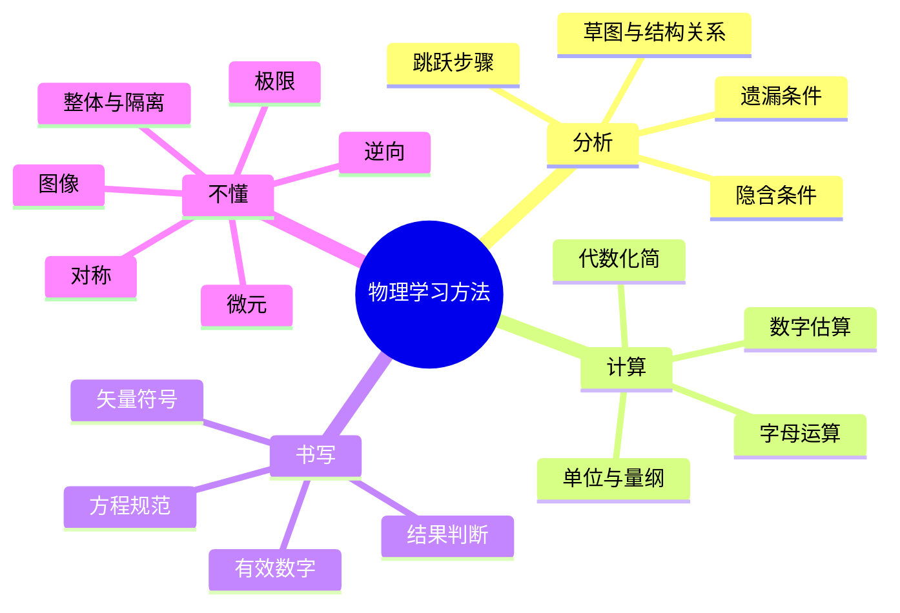
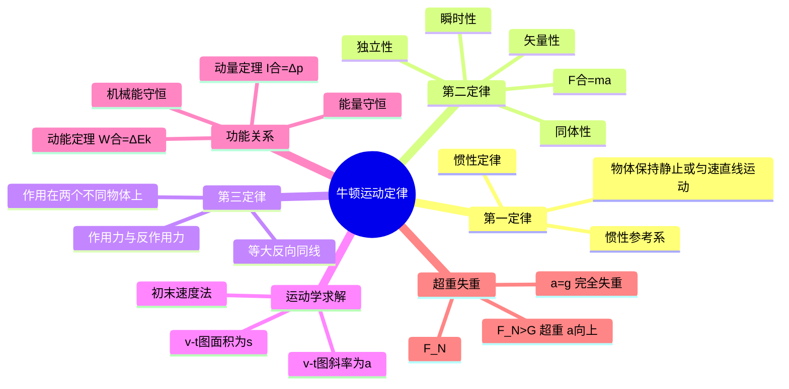
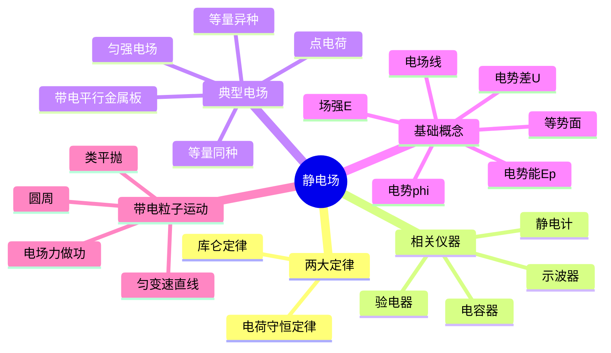
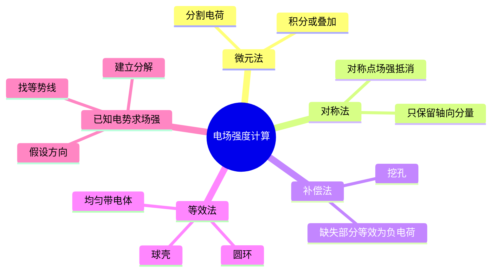
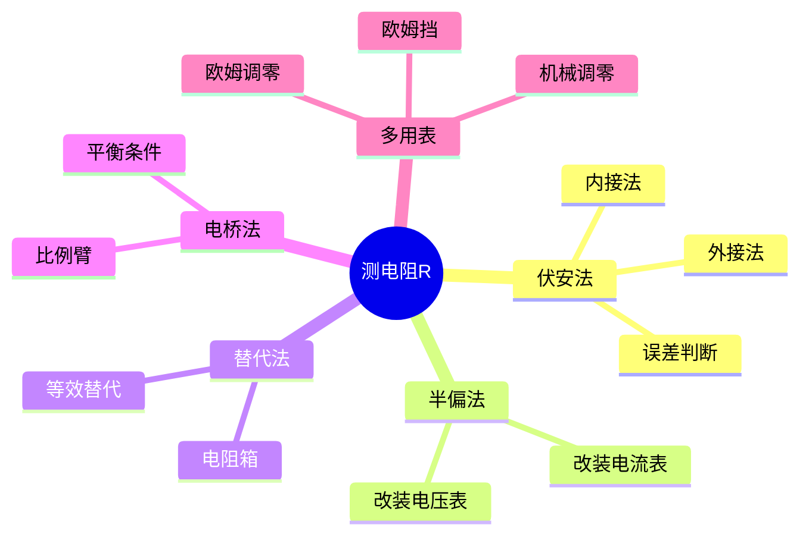
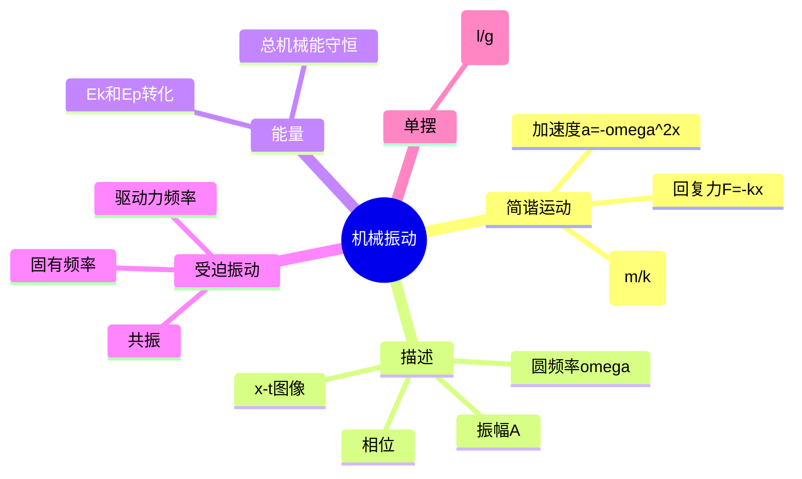
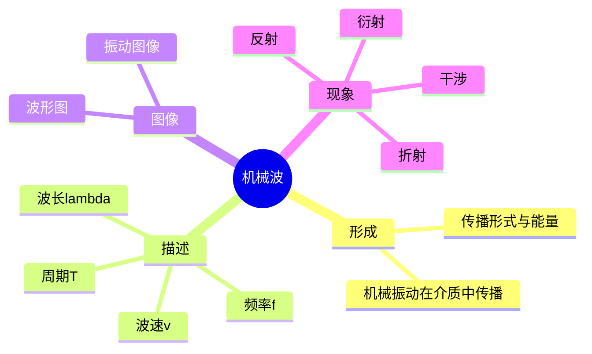

## 1. 物理题的基本分析框架



- 物理题三步走：读题、画图、列式。读题要圈出已知量、待求量、关键词；画图要标方向、标符号、标坐标系；列式要先写普适方程再代入数值。
- 分析题目的五个抓手：
  - 题设条件：什么物体、什么过程、什么状态。
  - 正方向选择：选定后整道题保持一致。
  - 全过程划分：把多过程题切成几个单过程。
  - 初末状态：初末两态决定动能、动量、机械能差。
  - 守恒判断：动量是否守恒？机械能是否守恒？能量是否守恒？
- 量纲与单位换算速查：

| 量 | SI 单位 | 常见易错 |
| --- | --- | --- |
| 温度 | $\mathrm{K}$ | 温差 $\Delta T$ 用 K 与 $^\circ\mathrm{C}$ 数值相同 |
| 速度 | $\mathrm{m/s}$ | $1\ \mathrm{km/h}=1/3.6\ \mathrm{m/s}$ |
| 加速度 | $\mathrm{m/s^2}$ | $g\approx9.8\ \mathrm{m/s^2}$，估算常取 $10$ |
| 能量 | $\mathrm{J}$ | $1\ \mathrm{eV}=1.6\times10^{-19}\ \mathrm{J}$ |
| 功率 | $\mathrm{W}$ | $1\ \mathrm{kW\cdot h}=3.6\times10^6\ \mathrm{J}$ |
| 冲量 | $\mathrm{N\cdot s}=\mathrm{kg\cdot m/s}$ | 与动量同量纲 |

- 常用方法：
  - 图像法：看斜率、看面积、看截距、看交点。$v\text{-}t$ 图斜率即加速度，面积即位移；$\varphi\text{-}x$ 图斜率即电场强度。
  - 解析式法：用函数、方程或参数表达过程，必要时引入参变量再消去。
  - 整体隔离法：先整体求外力（消去内力），再隔离求相互作用力。
  - 对称法：等量异号电荷的中垂面、抛体在最高点的左右对称、单摆的左右对称。
  - 逆向法：把末态反推为初态，常用于匀减速到零的过程（看作反向匀加速）。
  - 假设法：假设有无摩擦、是否接触、是否达到临界，看假设是否自洽。
  - 微元法：变力做功、连续质量流、变化磁通用 $dW=F\,ds$、$dq=I\,dt$。
  - 排除法：用极端情况（极限值、量级）排除明显错误的选项。
- 极限意义：当 $\Delta t\to0$、$\Delta x\to0$ 时定义瞬时量；初末状态和瞬时状态不能混用。
- 题型分类：选择题、填空题、实验题、计算题。计算题按"基础题、综合题、压轴题"分层，压轴题往往是动量+能量+几何约束的组合。

<details class="md-source-page">
<summary>原图 · Physics 第 1 页</summary>
<figure class="md-source-page__figure">

<figcaption>Physics_1.pdf</figcaption>
</figure>
</details>

## 2. 常用物理量与公式入口

按"力学—热学—电磁—近代"四大板块整理高频公式，便于做题时快速调取。

- 角速度（圆周运动 / 振动通用）：
  $$\omega=\frac{\Delta\theta}{\Delta t}=\frac{2\pi}{T}=2\pi f$$
  匀速圆周运动中 $\omega$、$v=\omega r$、$T=2\pi/\omega$、$a_n=\omega^2 r=v^2/r$ 相互关联。
- 热量与温度：
  $$Q=cm\Delta T,\qquad Q=\lambda m\ (\text{相变}),\qquad Q=I^2Rt\ (\text{电热})$$
  其中 $c$ 为比热容，$\lambda$ 为相变潜热。注意吸热取正、放热取负的符号约定。
- 摩尔与微观：
  $$N=nN_A,\qquad m=nM,\qquad V=nV_m$$
  $N_A=6.02\times10^{23}\ \mathrm{mol^{-1}}$。
- 功率与能量：
  $$W=Fs\cos\alpha,\qquad P=\frac{W}{t},\qquad P_{\text{瞬}}=Fv\cos\alpha$$
  平均功率 $\bar P=W/t$ 与瞬时功率 $P=Fv$ 概念不同，匀速时二者相等。
- 电流与电荷：
  $$I=\frac{q}{t},\qquad q=It,\qquad I=nqvS\ (\text{微观})$$
- 动量与冲量：
  $$p=mv,\qquad I=F\Delta t,\qquad I_{\text{合}}=\Delta p$$
  动量是矢量，列式时务必规定正方向。
- 周期与频率：
  $$T=\frac{1}{f},\qquad \omega=2\pi f,\qquad T=\frac{2\pi}{\omega}$$
- 弹簧振子周期：
  $$T=2\pi\sqrt{\frac{m}{k}}$$
  与振幅、初相无关，只取决于 $m$ 和 $k$。
- 单摆周期（小角度）：
  $$T=2\pi\sqrt{\frac{l}{g}}$$
- 气体做功：
  $$W=p\Delta V$$
  气体对外做功 $W>0$（体积增大），外界对气体做功 $W<0$。等压过程才能直接套用，变压过程需要积分 $W=\int p\,dV$。
- 压强：
  $$p=\frac{F}{S}$$
  气体压强还可用 $pV=nRT$（理想气体状态方程）联立求解。
- 质能关系：
  $$E=mc^2,\qquad \Delta E=\Delta m\cdot c^2$$
  用于核反应中亏损质量与释放能量的换算，$1\ \mathrm u\to 931.5\ \mathrm{MeV}$。

```
公式调取顺序（做综合题时）
力学：F=ma → 动能定理 → 动量定理 → 能量守恒
电学：U=IR → P=UI → ε=BLv → q=ΔΦ/R
热学：pV=nRT → Q=cmΔT → ΔU=Q+W
近代：E=hν → E=mc² → r=mv/qB
```

<details class="md-source-page">
<summary>原图 · Physics 第 2 页</summary>
<figure class="md-source-page__figure">

<figcaption>Physics_2.pdf</figcaption>
</figure>
</details>

## 3. 常见易混点

把"概念上长得像但物理含义不同"的成对量列出来。

- 真实值、测量值、方程值、刻度值：
  - 真实值：物理量本身的客观值。
  - 测量值：实验直接读出的值，含偶然误差和系统误差。
  - 方程值：代入公式算出的理论值。
  - 刻度值：仪器刻度直接指示的值，需结合最小分度估读。
- 有效数字：保留位数要与仪器精度一致，估读位为最后一位。
- 离轴高度 $h$、轨道半径 $r$、星球半径 $R$ 要明确：
  - 卫星绕地球时 $r=h+R_{\text{地}}$，不能把高度 $h$ 当半径。
- 摆长 $L$ 与悬线长 $l$：
  - 单摆线长 $l$ 不是摆长。
  - 摆长 $L=l+\dfrac{d}{2}$，$d$ 为小球直径（即悬点到球心的距离）。
- 薄膜光学：
  - 反射膜（增反膜）厚度 $d=\lambda/2$（半波长整数倍叠加增强反射）。
  - 增透膜厚度 $d=\lambda/4$（光程差半波长，反射相消）。
- 变压器原副线圈：
  - 原线圈接交流电源（输入侧）。
  - 副线圈接负载（输出侧）。
  - 不要把"原"和"副"与发电机/电动机的角色混淆。
- 电场强度 $E$、磁感应强度 $B$、速度 $v$ 方向要分别标注，不要混在一起做叉乘。
- 同步圆周或相遇问题：
  - 弧长对应圆心角 $\alpha$，时间为 $t=\dfrac{\alpha}{2\pi}T=\dfrac{\alpha}{\omega}$。
  - 反向相遇时弧长之和等于 $2\pi-\alpha$，时间为 $t=\dfrac{2\pi-\alpha}{2\pi}T$。
- 带电粒子偏转：
  - 正负号、$\Delta p$ 方向、电场方向、初速度方向必须四者协调。
- 合力恒定 ≠ 力不变；合力为 0 时各分力可能仍在做功（例如圆周运动）。
- 电场线、等势线与运动轨迹是三条不同的曲线：
  - 等势线与电场线处处垂直。
  - 带电粒子的轨迹一般既不沿电场线也不沿等势线。
  - 电场线指向电势降低方向。
- 能量损失要看质量、速度、是否弹性：
  $$\Delta E_{\text{损}}=\tfrac12 \dfrac{m_1m_2}{m_1+m_2}(v_1-v_2)^2\ \text{（完全非弹）}$$
- 安培力做功与产生的电热不一定相等：
  - 安培力做功 $=-\Delta E_k$（克服安培力做功）。
  - 电热 $Q=\int I^2R\,dt$。
  - 二者通过能量守恒联系：$W_{\text{外}}=\Delta E_k+Q$。
- 一个电子 vs 一群电子：
  - 单电子模型用 $e$、$m_e$、$v$。
  - 电流模型用 $I=nqvS$，电荷量按 $q=It$ 算总量。
- 电容器在不同电源条件下的不变量：
  - 电源不断开：$U$ 不变。
  - 电源断开：$Q$ 不变。
  - $C=\varepsilon S/(4\pi kd)$ 只与几何和介质有关。

```
易混对照（看到一边就要警觉另一边）
真实值  ↔ 测量值
线长 l ↔ 摆长 L
原线圈 ↔ 副线圈
W安培  ↔ Q电热
单电子 ↔ 电子流
U不变  ↔ Q不变
```

<details class="md-source-page">
<summary>原图 · Physics 第 3 页</summary>
<figure class="md-source-page__figure">

<figcaption>Physics_3.pdf</figcaption>
</figure>
</details>

## 4. 力学与电磁易错例

把 Physics_3 的易混点配上具体公式与典型情境。

- 物理量层级判断：
  - 真实值、测量值、方程值、刻度值四者关系：刻度值经过估读得到测量值，测量值代入方程得到方程值，方程值是对真实值的估计。
  - 有效数字与估读：最小分度的下一位为估读位。
  - 单位陷阱：$T$（开尔文）与 $^\circ\mathrm{C}$ 数值差 273.15，但温差 $\Delta T$ 数值相同。
- 离轴高度 $h$ 与轨道半径 $r$：
  $$r=h+R$$
  其中 $R$ 是中心天体半径。卫星周期、线速度都用 $r$ 而非 $h$。
- 摆线长 $l$ 与摆长 $L$：
  $$L=l+\frac{d}{2}$$
  $d$ 为摆球直径。实验题中容易把 $l$ 直接当 $L$ 代入 $T=2\pi\sqrt{L/g}$，导致 $g$ 偏大。
- 两力合成（平行四边形定则）：
  $$F=\sqrt{F_1^2+F_2^2+2F_1F_2\cos\theta}$$
  $$|F_1-F_2|\le F\le F_1+F_2$$
  $\theta$ 为两力夹角。$\theta=0$ 时合力最大，$\theta=\pi$ 时合力最小。
- 圆周运动时间与圆心角的对应：
  $$t=\frac{\alpha}{2\pi}T=\frac{\alpha}{\omega},\qquad t_{\text{反向}}=\frac{2\pi-\alpha}{2\pi}T$$
  对应弧长 $s=R\alpha$。
- 电容器串并联：
  - 串联（电荷相同，电压分配）：
    $$\frac1C=\frac1{C_1}+\frac1{C_2}+\cdots$$
    总电容比每个分电容都小。
  - 并联（电压相同，电荷分配）：
    $$C=C_1+C_2+\cdots$$
    总电容比每个分电容都大。
- 圆周运动中支持力（球面顶部、轨道内侧等情况）：
  - 物体沿圆形轨道在最高点（重力指向圆心）：
    $$mg+N=m\frac{v^2}{R}\quad\Rightarrow\quad N=m\frac{v^2}{R}-mg$$
  - 物体在球面外侧滑下，过某角度 $\theta$ 处：
    $$mg\cos\theta-N=m\frac{v^2}{R}\quad\Rightarrow\quad N=mg\cos\theta-m\frac{v^2}{R}$$
    $N=0$ 时离开球面。
- 磁场力两类：
  - 洛伦兹力（带电粒子受力）：
    $$F=qvB\sin\theta$$
    方向由右手定则（正电荷）/ 左手定则判断。
  - 安培力（载流导线受力）：
    $$F=BIL\sin\theta$$
    导线垂直磁场时取 $\sin\theta=1$。
- 易错符号约定：
  - 正方向一旦设定，全题各速度、力、动量都按该方向取正负。
  - 矢量减法 $\Delta p=p_2-p_1$ 要按正方向写正负号，不能直接用大小相减。

<details class="md-source-page">
<summary>原图 · Physics 第 4 页</summary>
<figure class="md-source-page__figure">

<figcaption>Physics_4.pdf</figcaption>
</figure>
</details>

## 5. 力与受力分析

- 力的四性：
  - 物质性：力必有施力物体和受力物体，"惯性"不是力。
  - 方向性：力是矢量，平移合成遵循平行四边形定则。
  - 相互性：作用力与反作用力等大、反向、共线，作用在两个不同物体上，同时存在同时消失。
  - 独立性：一个力的作用效果不因其他力存在而改变（叠加原理）。
- 力的作用效果：
  - 改变物体形状（形变）。
  - 改变物体运动状态（速度大小或方向）。
- 力的图示与示意图：

```
力的图示                力的示意图

    ↑F=20N (1cm 表 5N)        ↑F
    ┃                          ┃
    ┃                          ┃
    ●—————→                    ●
   (作用点、方向、大小、标度)  (只表方向和作用点)
```

- 受力分析顺序（"重弹摩"+ 已知力）：
  1. 已知力（题给的拉力、推力等）。
  2. 场力（重力、电场力、磁场力）。
  3. 弹力（绳、杆、面之间的接触力）。
  4. 摩擦力（先判断是否有滑动趋势再画方向）。
- 两力合成：
  $$F=\sqrt{F_1^2+F_2^2+2F_1F_2\cos\theta},\qquad |F_1-F_2|\le F\le F_1+F_2$$
- 三力平衡：
  - 三力平衡时，三力首尾相接构成闭合三角形。
  - 可用正交分解法或相似三角形法求解。
  - 拉密定理（三力共点平衡时）：
    $$\frac{F_1}{\sin\alpha}=\frac{F_2}{\sin\beta}=\frac{F_3}{\sin\gamma}$$
    $\alpha,\beta,\gamma$ 分别为对应力的对角。

```
三力平衡几何关系
            F1
             ↗
            ╱  γ
           ╱
          ●———→ F2
          β  α
             ↘
              F3

闭合三角形：F1 + F2 + F3 = 0
```

- 已知合力 $F$、其中一个分力大小 $F_2$、另一个分力方向（与 $F$ 成角 $\theta$）时，分解的解的个数：
  - $F_2<F\sin\theta$：无解。
  - $F_2=F\sin\theta$：一解（垂直方向）。
  - $F\sin\theta<F_2<F$：两解。
  - $F_2\ge F$：一解。
- 图解法常借助辅助圆、相似三角形、正弦定理判断分力变化趋势（动态平衡问题）。

<details class="md-source-page">
<summary>原图 · Physics 第 5 页</summary>
<figure class="md-source-page__figure">

<figcaption>Physics_5.pdf</figcaption>
</figure>
</details>

## 6. 轻绳、轻杆、轻弹簧与连接体

"轻"指质量忽略，三类元件的力学特性差异是高考常考点。

- 轻绳：
  - 只能受拉，不能受压。
  - 不打结时张力处处相等（绳不可伸长）。
  - 打结时不同段张力一般不等，需以结点为对象分析。
  - 张力可瞬间变化（绳被剪断瞬间，张力由 $T$ 突变为 $0$）。
- 轻杆：
  - 既能受拉也能受压。
  - 固定杆（两端无铰链）可传递任意方向的力，包含沿杆和垂直杆方向。
  - 活杆（两端铰接）只能沿杆方向传力。
  - 杆的内力可瞬变。
- 轻弹簧：
  - 弹力由形变量决定：$F=kx$，$x$ 为伸长（取正）或压缩（取负）量。
  - 弹簧的形变量不能突变，所以弹簧弹力不能瞬间改变。
  - 串联：每段弹簧受同一拉力，总形变是各段之和：
    $$\frac1k=\frac1{k_1}+\frac1{k_2}+\cdots+\frac1{k_n}$$
    串得越多越软。
  - 并联：总弹力为各弹簧弹力之和，总形变相同：
    $$k=k_1+k_2+\cdots+k_n$$
    并得越多越硬。

```
绳/杆/弹簧 突变性对比

剪断瞬间    | 绳     | 杆     | 弹簧
张力/弹力   | 突变→0 | 突变→0 | 不突变
此时分析受力| 立即更新| 立即更新| 保留原值
```

- 绳结问题：以结点为研究对象。结点不计质量时，结点处合力为 0，可用正交分解或三角形法。水平绳段是否绷紧需根据约束方向判断。
- 连接体问题：
  - 整体法：把若干物体看作一个整体，只算外力，可消去内部相互作用。
  - 隔离法：取出某一物体，画其受力图，列方程求相互作用力。
  - 接触面共同加速时，对 $A$、$B$ 两物体水平推 $F$，$A$ 推 $B$ 的接触力为：
    $$F_{AB}=\frac{m_B}{m_A+m_B}F$$
    （由对 $B$ 用 $F_{AB}=m_B a$，整体 $a=F/(m_A+m_B)$ 推得）

```
整体法 vs 隔离法（水平面光滑）
        F →  ┌──┐ ┌──┐
              │ A│ │ B│
              └──┘ └──┘
整体：F = (m_A+m_B)·a
隔离 B：F_AB = m_B·a = m_B·F/(m_A+m_B)
```

- 光滑斜面分量：
  - 沿斜面方向：$mg\sin\theta$。
  - 垂直斜面方向：$N=mg\cos\theta$。
  - 摩擦力为 0。
- 静摩擦方向：由相对运动趋势判断，可与实际运动方向相反，也可相同（如传送带托带物体）。
- 临界条件：
  - 滑动临界：$f=\mu N$，$f_{\max}=\mu_s N$。
  - 绳断临界：$T=T_{\max}$。
  - 接触脱离临界：$N=0$。

<details class="md-source-page">
<summary>原图 · Physics 第 6 页</summary>
<figure class="md-source-page__figure">

<figcaption>Physics_6.pdf</figcaption>
</figure>
</details>

## 7. 板块、传送带与机械能

- 板块模型（长板上叠物块，板水平面有/无摩擦）：
  - 第一步：假设两者共速，求所需共同加速度，反求摩擦力，看是否超过最大静摩擦。
  - 第二步：若需要的摩擦力超过 $\mu_s N$，则二者发生相对滑动；反之则一起运动。
  - 相对滑动时，滑动摩擦力方向与相对速度方向相反。
  - 摩擦生热只与"相对位移"有关。

```
板块受力分析（板上拉力 F）

           v_物 ←─→ v_板
   ┌─────────────────────┐
   │ ●     物块 m         │
   │═════════════════════│  ←  F →
   │     长板 M           │
   └─────────────────────┘
            ⌒地面摩擦⌒

物块：f₁ = μ₁mg → a₁ = μ₁g
板：F − f₁′ − μ₂(M+m)g = M·a₂
（f₁ 与 f₁′ 大小相等方向相反，作用反作用）
```

- 传送带模型：
  - 水平传送带 + 物块 $v_0$，传送带速度 $v$：
    - $v_0=0$，$v>0$：物块先匀加速到 $v$，然后随传送带匀速。
    - $v_0<v$：先加速直到达 $v$（如果带够长）。
    - $v_0>v$：先减速到 $v$，之后无摩擦匀速。
    - $v_0$ 与 $v$ 同向时摩擦力沿带的相对运动方向给物块加速或减速。
  - 是否能共速取决于带长是否足够。
  - 倾斜传送带：要比较 $mg\sin\theta$ 与 $\mu mg\cos\theta$，决定上行/下行时摩擦方向和能否匀速。
- 摩擦生热（系统内能增量）：
  $$Q=f\cdot\Delta s_{\text{相对}}$$
  $\Delta s_{\text{相对}}$ 是两物体相对位移的大小。
- 机械能定理（功能关系）：
  $$\Delta E_{\text{机}}=W_{\text{非保守力}}=W_{\text{合}}-W_{\text{重}}-W_{\text{弹}}$$
- 传送带做功 vs 摩擦生热：
  - 摩擦力对物体做功 = 改变物体动能（含正负功）。
  - 系统内能增加 = 摩擦力 × 相对位移。
  - 电动机做功 $W_{\text{电}}=\Delta E_k+\Delta E_p+Q$。

```
传送带 v_0=0 上小物块（v 带速）
位置  | 速度 | 摩擦方向 | 受力  | 阶段
─────┼──────┼─────────┼──────┼──────
A → C │ 0→v  │ 沿带     │ μmg→ │ 匀加速
C → B │ v=v  │ 0(静摩) │ 0    │ 匀速

物块位移 s₁ = v²/(2μg)
带的位移 s₂ = v·t = v · v/(μg) = v²/(μg)
相对位移 Δs = s₂ − s₁ = v²/(2μg)
摩擦生热 Q = μmg · Δs = mv²/2
即电动机多做功 = 物块动能 + 摩擦生热
W_电 = mv² ；E_k = mv²/2 ；Q = mv²/2
```

<details class="md-source-page">
<summary>原图 · Physics 第 7 页</summary>
<figure class="md-source-page__figure">

<figcaption>Physics_7.pdf</figcaption>
</figure>
</details>

## 8. 牛顿运动定律与功能关系图



- 关联速度：
  - 沿杆、沿绳方向的速度分量相等（杆/绳不可伸长）。
  - 垂直分量自由。

```
绳/杆关联速度（A 端速度 v_A，与绳夹角 θ_A；B 端速度 v_B，与绳夹角 θ_B）

         A v_A
          ●─┐
          ╲ │
       绳   ╲│
            ●
            B v_B

约束：v_A cos θ_A = v_B cos θ_B
（沿绳的分量相等）
```

- 双绳双杆问题：
  - 杆两端速度沿杆方向投影相等。
  - 双杆/双绳系统对应的瞬时关系常用速度合成与分解。
- 合运动判断：
  - $a=0$：物体作匀速直线运动或静止。
  - $a$ 与 $v$ 共线：直线运动（同向加速、反向减速）。
  - $a$ 与 $v$ 不共线：曲线运动，轨迹弯向 $a$ 所在一侧。
- 运动学图像：
  - $v\text{-}t$ 图：斜率为加速度 $a$，与时间轴围面积为位移 $x$。
  - $x\text{-}t$ 图：斜率为速度 $v$。
  - $a\text{-}t$ 图：与时间轴围面积为速度变化量 $\Delta v$。
- 牛顿第二定律：
  $$\vec F_{\text{合}}=m\vec a$$
  - 矢量性：要分方向列方程。
  - 瞬时性：合力变化，加速度立刻变化。
  - 同体性：合力和加速度对同一物体。
  - 独立性：各方向独立成立。
- 动量定理：
  $$\vec F_{\text{合}}=\frac{\Delta \vec p}{\Delta t}\Rightarrow \vec I_{\text{合}}=\Delta \vec p$$
- 动量守恒条件（按优先级）：
  - 系统所受合外力为 0。
  - 外力相比内力很小（碰撞、爆炸瞬间）。
  - 某方向上合外力为 0，则该方向动量守恒。
- 动能定理：
  $$W_{\text{合}}=\Delta E_k=\tfrac12mv_2^2-\tfrac12mv_1^2$$
- 机械能守恒条件：只有重力、弹力做功（或者其他力不做功）。
- 功能关系（六种力对应的能量变化）：

| 力 | 对应能量变化 |
| --- | --- |
| 合力做功 $W_{\text{合}}$ | $=\Delta E_k$ |
| 重力做功 $W_G$ | $=-\Delta E_p$（重力势能） |
| 弹力做功 $W_{\text{弹}}$ | $=-\Delta E_{p,\text{弹}}$ |
| 除重弹外其他力做功 $W_{\text{其他}}$ | $=\Delta E_{\text{机}}$ |
| 摩擦内力做功（系统） | $-Q=-f\Delta s_{\text{相}}$ |
| 电场力做功 $W_{\text{电}}$ | $=-\Delta E_{p,\text{电}}=qU_{AB}$ |

- 一对作用力做功之和：
  - 同向都做正功（如两个物体被弹簧推开）。
  - 同向都做负功（如压缩弹簧）。
  - 一正一负之和可正、负、零。
  - 一个做功一个不做功（如静摩擦力对地面）。

```
超重失重判断
   F_N > G  → 超重（加速度向上：上升加速 / 下降减速）
   F_N < G  → 失重（加速度向下：上升减速 / 下降加速）
   F_N = 0, a = g  → 完全失重（自由落体、抛体、绕地卫星）
   完全失重时：弹簧测力计读数 = 0，杯中水不流出
```

<details class="md-source-page">
<summary>原图 · Physics 第 8 页</summary>
<figure class="md-source-page__figure">

<figcaption>Physics_8.pdf</figcaption>
</figure>
</details>

## 9. 匀变速直线运动与抛体运动

- 匀变速直线运动三大基本式：
  $$v=v_0+at$$
  $$x=v_0t+\tfrac12at^2$$
  $$v^2-v_0^2=2ax$$
- 平均速度（匀变速专用）：
  $$\bar v=\frac{v_0+v}{2}=\frac{x}{t}=v_{t/2}$$
  即匀变速直线运动中，中间时刻的瞬时速度等于该段平均速度。
- 中间位置速度：
  $$v_{x/2}=\sqrt{\frac{v_0^2+v^2}{2}}$$
  注意 $v_{x/2}>v_{t/2}$。
- 初速度为 0 的匀加速：
  - 前 $1\mathrm{T}$、$2\mathrm{T}$、$\dots$ 末速度比：
    $$v_1:v_2:v_3:\cdots:v_n=1:2:3:\cdots:n$$
  - 前 $1\mathrm{T}$、$2\mathrm{T}$、$\dots$ 总位移比：
    $$x_1:x_2:x_3:\cdots:x_n=1:4:9:\cdots:n^2$$
  - 第 $n$ 个 $\mathrm{T}$ 内位移比：
    $$\Delta x_1:\Delta x_2:\cdots:\Delta x_n=1:3:5:\cdots:(2n-1)$$
  - 通过相等位移所用时间比：
    $$t_1:t_2:\cdots:t_n=1:(\sqrt2-1):(\sqrt3-\sqrt2):\cdots$$
  - 从静止开始到达连续相等位移的时间累计比：
    $$T_1:T_2:\cdots:T_n=1:\sqrt2:\sqrt3:\cdots:\sqrt n$$
- 逐差法（实验测加速度）：
  $$a=\frac{(x_4+x_5+x_6)-(x_1+x_2+x_3)}{9T^2}$$
  连续相邻 $\mathrm{T}$ 内位移之差为定值：$\Delta x=aT^2$。
- 自由落体：
  $$v=gt,\qquad h=\tfrac12gt^2,\qquad v^2=2gh$$
- 竖直上抛：
  $$t_{\text{上}}=\frac{v_0}{g},\qquad H=\frac{v_0^2}{2g},\qquad t_{\text{总}}=\frac{2v_0}{g}$$
  上下对称：上升所用时间 = 落回出发点所用时间；同一高度上升与下降速率相等、方向相反。

```
平抛运动分解（初速度水平 v_0，重力向下 g）

   ┃ y
   ┃●━━━━━━━━●
   ┃ ╲       ↓
   ┃   ╲     │
   ┃     ╲   │  vy=gt
   ┃   抛物线 ╲│
   ┗━━━━━━━━━●→ x
        x=v_0 t   v_x=v_0

水平：x=v_0 t      v_x=v_0
竖直：y=½gt²       v_y=gt
合速度：v=√(v_x²+v_y²)
速度方向：tan θ = v_y/v_x = gt/v_0
位移方向：tan α = y/x = gt/(2v_0)
关系：tan θ = 2 tan α
```

- 平抛运动重要结论：
  - 速度方向延长线交于水平位移中点（"中点定理"）。
  - $\tan\theta=2\tan\alpha$，速度偏角为位移偏角的两倍切值关系。
- 斜抛（仰角 $\theta$，初速度 $v_0$）：
  - 飞行时间：$t=\dfrac{2v_0\sin\theta}{g}$
  - 最大高度：$H=\dfrac{v_0^2\sin^2\theta}{2g}$
  - 水平射程：$R=\dfrac{v_0^2\sin 2\theta}{g}$
  - $\theta=45^\circ$ 时射程最大。
  - 关于最高点轨迹对称。

<details class="md-source-page">
<summary>原图 · Physics 第 9 页</summary>
<figure class="md-source-page__figure">

<figcaption>Physics_9.pdf</figcaption>
</figure>
</details>

## 10. 圆周运动

- 描述量：
  - 线速度 $v=\dfrac{\Delta s}{\Delta t}$，方向沿切线。
  - 角速度 $\omega=\dfrac{\Delta\theta}{\Delta t}=2\pi/T$。
  - 周期 $T$、频率 $f=1/T$。
  - 关系 $v=\omega r$。
- 向心加速度：
  $$a_n=\frac{v^2}{r}=\omega^2r=\frac{4\pi^2}{T^2}r$$
  方向始终指向圆心。
- 向心力（合外力沿径向的分量）：
  $$F_n=m a_n=\frac{mv^2}{r}=m\omega^2 r$$
  注意"向心力"不是新的力，而是对合外力径向分量的命名。

```
传动关系

同轴转动（共转）：       ω_A = ω_B
                        v = ωr，故 v 与 r 成正比

   ┌──┐  共一根轴
   │A │
   └──┘
   ┌────┐
   │ B  │
   └────┘
   v_A : v_B = r_A : r_B

皮带/齿轮（边缘共线）：   v_A = v_B
                        ω = v/r，故 ω 与 r 成反比

   ┌──┐         ┌────┐
   │A │═════════│ B  │   皮带相连
   └──┘         └────┘
   ω_A : ω_B = r_B : r_A
```

- 汽车在水平路面转弯（无侧倾时摩擦力提供向心力）：
  $$f=\frac{mv^2}{R}\le\mu mg\Rightarrow v_{\max}=\sqrt{\mu gR}$$
- 汽车在倾斜路面（碗形赛道）转弯：
  - 内倾角 $\theta$ 时若不靠摩擦，平衡条件 $\tan\theta=v^2/(gR)$。
- 圆锥摆：
  - 张力的水平分量提供向心力。
  - $T\sin\theta=m\omega^2 l\sin\theta\Rightarrow \omega^2=g/(l\cos\theta)$
  $$T=2\pi\sqrt{\frac{l\cos\theta}{g}}$$

```
圆锥摆受力

      ●━━━━━ 悬点
       \θ
        \    悬线长 l
         \
          ●  ──→ a_n
          m
         ↓ mg

水平：T sinθ = m·ω²·(l sinθ)
竖直：T cosθ = mg
得   tanθ = ω²l sinθ/g → ω = √(g/(l cosθ))
```

- 竖直平面内圆周运动两类临界：
  - 绳模型 / 内轨道（重力提供向心力，不能受压）：最高点 $v_{\min}=\sqrt{gR}$。
    $$mg=\frac{mv_{\min}^2}{R}\Rightarrow v_{\min}=\sqrt{gR}$$
  - 杆模型 / 双轨模型（可受压可受拉）：最高点速度可为 0，无最小速度限制。
    - 当 $v=\sqrt{gR}$ 时杆/轨道无作用力。
    - $v<\sqrt{gR}$：杆向上推（轨道外侧给压力）。
    - $v>\sqrt{gR}$：杆向下拉（轨道内侧给压力）。

```
最高点：绳/杆模型对比

绳/管内轨：       杆/管外轨：
    重力           重力 ↓
     ↓             支持力↑（可正可负）
   ●━━ 绳张力T≥0    ●═══ 杆力可拉可压
   v_min=√(gR)     v_min=0

竖直圆周临界点速度（同一圆轨道）
绳模型 最高点：v ≥ √(gR)
       最低点：v_最低² = v_最高² + 4gR
杆模型 最高点：v ≥ 0
```

- 周期与角速度通用：
  $$T=\frac{2\pi}{\omega}=\frac{2\pi r}{v}$$

<details class="md-source-page">
<summary>原图 · Physics 第 10 页</summary>
<figure class="md-source-page__figure">

<figcaption>Physics_10.pdf</figcaption>
</figure>
</details>

## 11. 万有引力与天体运动

- 万有引力定律：
  $$F=G\frac{Mm}{r^2}$$
  引力常量 $G=6.67\times10^{-11}\ \mathrm{N\cdot m^2/kg^2}$。$r$ 是两质点的距离，对均匀球壳/球体可看作集中在球心。
- 开普勒三定律：
  - 第一定律（轨道定律）：行星沿椭圆轨道绕太阳，太阳处于其中一个焦点。
  - 第二定律（面积定律）：连接行星与太阳的矢径在相等时间内扫过相等面积。
  - 第三定律（周期定律）：
    $$\frac{a^3}{T^2}=\frac{GM}{4\pi^2}=k$$
    对绕同一中心天体的所有行星 $k$ 是同一常数。
- "黄金代换"——重力近似等于万有引力（忽略地球自转）：
  $$mg=G\frac{Mm}{R^2}\Rightarrow GM=gR^2$$
  这一关系常用于把题中给出的 $g$、$R$ 替换 $GM$。
- 重力与万有引力差异（考虑自转）：
  - 两极：$mg_{\text{极}}=G\dfrac{Mm}{R^2}$，重力等于万有引力。
  - 赤道：$mg_{\text{赤}}=G\dfrac{Mm}{R^2}-m\omega^2R$，万有引力一部分提供向心力。
  - 由于 $\omega$ 很小，赤道与两极 $g$ 仅差约 $0.034\ \mathrm{m/s^2}$。
- 卫星运动（圆轨道）：
  $$G\frac{Mm}{r^2}=m\frac{v^2}{r}=m\omega^2 r=m\frac{4\pi^2}{T^2}r$$
  解出：
  $$v=\sqrt{\frac{GM}{r}},\qquad \omega=\sqrt{\frac{GM}{r^3}},\qquad T=2\pi\sqrt{\frac{r^3}{GM}}$$

```
轨道半径越大 → 越"高、慢、长"
   r ↑   →   v ↓
              ω ↓
              T ↑
              a_n ↓
（"近地走得快"："越靠近中心天体跑得越快"）
```

- 同步卫星（地球同步轨道）：
  - 周期等于地球自转周期：$T=24\ \mathrm{h}$。
  - 必须在赤道平面内。
  - 离地高度、半径、线速度都唯一确定（约 $h\approx3.6\times10^4\ \mathrm{km}$，$v\approx3.1\ \mathrm{km/s}$）。
- 三大宇宙速度（地球）：
  - 第一宇宙速度（环绕速度，最小发射速度也是最大环绕速度）：
    $$v_1=\sqrt{\frac{GM}{R}}=\sqrt{gR}\approx 7.9\ \mathrm{km/s}$$
  - 第二宇宙速度（脱离速度，挣脱地球引力）：$v_2\approx 11.2\ \mathrm{km/s}$。
  - 第三宇宙速度（脱离太阳系）：$v_3\approx 16.7\ \mathrm{km/s}$。
- 双星系统（两星互相绕共同质心运动）：
  - 角速度相同 $\omega_1=\omega_2=\omega$。
  - 万有引力提供向心力，二者引力大小相等：
    $$G\frac{m_1m_2}{L^2}=m_1\omega^2 r_1=m_2\omega^2 r_2$$
  - $m_1r_1=m_2r_2$（与杠杆类似），$r_1+r_2=L$，于是
    $$r_1=\frac{m_2}{m_1+m_2}L,\qquad r_2=\frac{m_1}{m_1+m_2}L$$
  - 周期：
    $$T=2\pi\sqrt{\frac{L^3}{G(m_1+m_2)}}$$

```
双星系统几何

       m_1 ●─────────●─────────● m_2
           |    r_1    r_2     |
           ←────────  L ──────→
           质心 在两星连线上
m_1 r_1 = m_2 r_2
两星总用相同 ω、T，在共同质心两侧同向公转
```

- 卫星变轨（椭圆 ↔ 圆）：
  - 在近地点点火加速 → 进入更高轨道（半长轴变大）。
  - 在远地点点火加速 → 圆化到外圈圆轨道。
  - 加速时机械能、半长轴、周期都增大；圆轨道动能反而比近地点小。

<details class="md-source-page">
<summary>原图 · Physics 第 11 页</summary>
<figure class="md-source-page__figure">

<figcaption>Physics_11.pdf</figcaption>
</figure>
</details>

## 12. 机械能守恒与功热关系

- 机械能守恒（基本形式）：
  $$E_{k1}+E_{p1}=E_{k2}+E_{p2}$$
  $$\Delta E_k=-\Delta E_p$$
- 系统机械能守恒（两个物体）：
  $$\Delta E_{p,A}+\Delta E_{p,B}+\Delta E_{k,A}+\Delta E_{k,B}=0$$
  或写为 $\Delta E_{p,A}=-\Delta E_{p,B}$（如果只有 $A,B$ 间通过保守力做功）。
- 机械能守恒的判据：
  - 只受重力（或只有重力做功）。
  - 系统内只有重力、弹力等保守力做功。
  - 摩擦力、空气阻力等非保守力存在但不做功。
- 功能关系（六大表达，做题时按"对谁列"决定用哪个）：
  - 重力做功：$W_G=-\Delta E_p$。
  - 弹力做功：$W_{\text{弹}}=-\Delta E_{p,\text{弹}}$。
  - 合力做功：$W_{\text{合}}=\Delta E_k$。
  - 除重力、弹力外的力做功：$W_{\text{其他}}=\Delta E_{\text{机}}$。
  - 摩擦内力做功：$W_{f,\text{对系统}}=-Q=-f\Delta s_{\text{相对}}$。
  - 一对作用力对一个物体可做功，对系统的合做功可为正、负、零。
- 摩擦生热：
  $$Q=f\cdot\Delta s_{\text{相对}}$$
  注意 $\Delta s_{\text{相对}}$ 是相对位移大小，不要用单个物体的位移。
- 摩擦力对单个物体的做功 vs 系统内能增加：
  - $W_{f,A}=-f\cdot s_A$（设摩擦力方向与 A 速度反向）。
  - $W_{f,B}=+f\cdot s_B$。
  - $W_{f,A}+W_{f,B}=-f(s_A-s_B)=-f\Delta s_{\text{相对}}=-Q$。
- 典型例题：质量 $m$ 的木块在质量 $M$ 的小车上滑动距离 $L$（相对滑动）：

```
分别列动能定理：
    对 m：F·s_m − f·s_m = ½ m v_m²
    对 M：       f·s_M = ½ M v_M²
摩擦生热：Q = f·L (L=s_m−s_M)
系统能量守恒：W_外 = ΔE_k(总) + Q

例：F = 10 N，m = 1 kg，M = 4 kg，μ = 0.2，
   初始静止，相对滑动 L = 0.5 m
   ⇒ Q = μmg·L = 0.2×1×10×0.5 = 1 J
```

- 力 $F$ 做的功 = 物体动能改变 + 系统内能增加：
  $$W_F=\Delta E_k+Q$$
- 弹簧（保守力）做功不需要单独算，可用势能差 $\Delta E_{p,\text{弹}}$ 代替。
- $P=Fv$ 与 $W=Pt$：
  - 启动加速过程：$P$ 恒定时 $F$ 减小、$v$ 增大；$F$ 恒定时 $P$ 随 $v$ 增大。
  - 额定功率下匀速 $v_{\max}=P_{\text{额}}/f$。

<details class="md-source-page">
<summary>原图 · Physics 第 12 页</summary>
<figure class="md-source-page__figure">

<figcaption>Physics_12.pdf</figcaption>
</figure>
</details>

## 13. 静电场思维导图



把静电场的关键关系整理成"基本量—仪器—典型场—粒子运动"四块。

- 库仑定律（真空中两点电荷间作用力）：
  $$F=k\frac{q_1q_2}{r^2}$$
  $k=9.0\times10^9\ \mathrm{N\cdot m^2/C^2}$。同号相斥，异号相吸。
- 电场强度（试探电荷视角）：
  $$E=\frac{F}{q}$$
  电场强度是矢量，与试探电荷无关，方向与正电荷受力方向相同。
- 匀强电场：
  $$E=\frac{U}{d}$$
  $d$ 为沿场强方向两点间距。
- 电势差（标量，由电场决定）：
  $$U_{AB}=\varphi_A-\varphi_B=\frac{W_{AB}}{q}$$
- 电势能：
  $$E_p=q\varphi$$
  正电荷在高电势处电势能高，负电荷相反。
- 电场力做功：
  $$W_{AB}=qU_{AB}=-(E_{p,B}-E_{p,A})=-\Delta E_p$$
  电场力做正功，电势能减小。
- 等势面要点：
  - 同一等势面上各点电势相等，移动电荷电场力不做功。
  - 等势面与电场线处处垂直。
  - 沿电场线方向电势降低。
  - 电场线越密，场强越大。

```
匀强电场（平行板电容器内部）

   +Q  ────────────────  上极板 高电势 φ_A
       │ E │ E │ E │ E
       ↓   ↓   ↓   ↓     电场线由 + → −
       │   │   │   │
   −Q  ────────────────  下极板 低电势 φ_B

   U_AB = φ_A − φ_B = E·d
   等势面：水平面，与电场线垂直
```

- 带电粒子在匀强电场中：
  - 沿电场线初速进入：作匀变速直线运动，$a=qE/m$。
  - 垂直电场线进入：作类平抛运动（电场方向类似重力）。
  - 一般方向进入：可分解为沿场强方向的匀变速 + 垂直方向匀速。

原图边缘补记把静电场各量之间的箭头关系连在一起：
- 基本换算：
  $$F=qE,\qquad W_{AB}=qU_{AB},\qquad E_p=q\varphi,\qquad C=\frac QU$$
- 点电荷场与电势：
  $$E=k\frac{|Q|}{r^2},\qquad \varphi=k\frac Qr$$
  $E$ 看大小和方向，$\varphi$ 带正负号；多点电荷场强要矢量叠加。
- 电势降低最快的方向是电场方向，沿电场线有近似关系：
  $$E\approx \frac{|\Delta \varphi|}{\Delta s}$$
- 仪器对应的物理量：
  - 验电器：判断带电与粗略比较电势高低。
  - 静电计：测两导体间电势差。
  - 电容器：看 $Q,U,C,E$ 是否因接电源/断电而变化。
  - 示波器：用偏转电场把电压信号转成光点位移。

<details class="md-source-page">
<summary>原图 · Physics 第 13 页</summary>
<figure class="md-source-page__figure">

<figcaption>Physics_13.pdf</figcaption>
</figure>
</details>

## 14. 库仑定律与电荷守恒

- 库仑定律适用条件：真空（或空气可近似）中静止的点电荷。带电体远大于其线度时也可视为点电荷。
  $$F=k\frac{q_1q_2}{r^2}$$
- 静电力常量：
  $$k=9.0\times10^9\ \mathrm{N\cdot m^2/C^2}$$
- 电荷守恒：电荷既不能创生也不能消灭，只能从一物体转移到另一物体或从物体的一部分转移到另一部分。
- 带电方式三种：
  - 摩擦起电：电子从一物体转移到另一物体（电子转移）。
  - 接触起电：电荷重新分配。两完全相同的导体接触后再分开，电荷平均分配。
  - 感应起电：导体内部电荷在外加电场下重新分布；接地后电荷流入/流出大地，断开接地、移走外电荷后导体带相反电荷。

```
反复接触递推（A 带 q，B、C 不带电）

第一次：A 与 B 接触
   A: q/2,  B: q/2
第二次：B 与 C 接触
   B: q/4,  C: q/4
第三次：C 与 A 接触
   A: (q/2 + q/4)/2 = 3q/8,  C: 3q/8
... 多次接触：每次都用"等量平分"递推
```

- 元电荷（电荷的最小单元）：
  $$e=1.60\times10^{-19}\ \mathrm C$$
  任何带电体的电量都是 $e$ 的整数倍。
- 电子质量：$m_e=9.11\times10^{-31}\ \mathrm{kg}$。
- 比荷（电子）：
  $$\frac{e}{m_e}\approx 1.76\times 10^{11}\ \mathrm{C/kg}$$
- 电场中正/负电荷受力方向：
  - 正电荷：与电场方向相同。
  - 负电荷：与电场方向相反。
- 电荷量、库仑力的方向用矢量法处理；多个点电荷相互作用力用矢量叠加。
- 实验中验电器、静电计的读数反映金属球（极板）相对接地端的电势差。

<details class="md-source-page">
<summary>原图 · Physics 第 14 页</summary>
<figure class="md-source-page__figure">

<figcaption>Physics_14.pdf</figcaption>
</figure>
</details>

## 15. 电容器与带电粒子偏转

- 电容定义（电容器储电本领的量度）：
  $$C=\frac{Q}{U}$$
  电容由电容器结构和电介质决定，与 $Q$、$U$ 无关。单位 F（法拉），常用 $\mu\mathrm F=10^{-6}\ \mathrm F$、$\mathrm{pF}=10^{-12}\ \mathrm F$。
- 平行板电容器（真空，板正对面积 $S$、板间距 $d$）：
  $$C=\frac{\varepsilon_r S}{4\pi k d}=\frac{\varepsilon_0\varepsilon_r S}{d}$$
  - $\varepsilon_0=8.85\times10^{-12}\ \mathrm{F/m}$。
  - 插入电介质（$\varepsilon_r>1$）后 $C$ 增大。
  - $S$ 增大、$d$ 减小、$\varepsilon_r$ 增大都会使 $C$ 增大。
- 平行板的两类操作：
  - 接电源（U 不变）：改变 $C$ 时 $Q=CU$ 同步变化，板间场强 $E=U/d$ 随 $d$ 变化。
  - 断开电源（Q 不变）：改变 $d$ 时，$U=Q/C=Qd/(\varepsilon S)$ 与 $d$ 成正比；但 $E=U/d=Q/(\varepsilon S)$ 不变。

| 情况 | $Q$ | $U$ | $E=U/d$ | $C=\varepsilon S/d$ |
| --- | --- | --- | --- | --- |
| 接电源、$d$ 增大 | 减小 | 不变 | 减小 | 减小 |
| 断开电源、$d$ 增大 | 不变 | 增大 | 不变 | 减小 |
| 接电源、插电介质 | 增大 | 不变 | 不变 | 增大 |
| 断开电源、插电介质 | 不变 | 减小 | 减小 | 增大 |

- 电容串并联：
  - 串联：$\dfrac{1}{C}=\dfrac{1}{C_1}+\dfrac{1}{C_2}+\cdots$（电荷相同）。
  - 并联：$C=C_1+C_2+\cdots$（电压相同）。
- 带电粒子在偏转电场中（类平抛）：
  - 沿场方向加速度 $a=\dfrac{qE}{m}=\dfrac{qU}{md}$。
  - 在板间运动时间 $t=\dfrac{L}{v_0}$。
  - 偏转量：
    $$y=\tfrac12at^2=\frac{qUL^2}{2mdv_0^2}$$
  - 出板时偏转角：
    $$\tan\theta=\frac{v_y}{v_0}=\frac{at}{v_0}=\frac{qUL}{mdv_0^2}$$
  - 出板后沿直线运动，延长线交板正中。

```
平行板偏转电场（粒子从左侧水平射入）

         上极板（接 +U/2）
   ┃━━━━━━━━━━━━━━━━━━━━━━┃
   ┃   ●→v_0 ╲━━━━━━━━━━━━━━━━━ 屏
   ┃           ╲           ┃
   ┃             ╲ y       ┃     L_2  延伸
   ┃               ╲       ┃
   ┃  L  → → → → →  ●      ┃
   ┃━━━━━━━━━━━━━━━━━━━━━━┃
         下极板（接 −U/2）

   y = qUL²/(2mdv_0²)   板内偏移
   tanθ = qUL/(mdv_0²)  出板时偏角
   屏上偏移 = y + L_2 · tanθ
   速度方向延长线交于板间中点
```

- 示波器原理：
  - $X$ 偏转板（水平偏转）通常加锯齿波（扫描电压）。
  - $Y$ 偏转板加待测信号。
  - 亮斑沿合速度方向移动，留下波形迹线。
  - 若 $X$、$Y$ 同时加正弦波且同频率，可形成李萨如图形。

<details class="md-source-page">
<summary>原图 · Physics 第 15 页</summary>
<figure class="md-source-page__figure">

<figcaption>Physics_15.pdf</figcaption>
</figure>
</details>

## 16. 电场基础与图像

- 电势：
  $$\varphi=\frac{E_p}{q}$$
  零势能位置可任选，常取无穷远或地面为 0。
- 电势能：
  $$E_p=q\varphi$$
  正电荷电势能与电势同号变化；负电荷与电势反号变化。
- 电势差：
  $$U_{AB}=\varphi_A-\varphi_B$$
  $U_{AB}>0$ 意味着 $A$ 点电势高于 $B$。
- 电场力做功：
  $$W_{AB}=qU_{AB}=q(\varphi_A-\varphi_B)=-(E_{p,B}-E_{p,A})$$
- 电场强度定义：
  $$E=\frac{F}{q}$$
- 匀强电场场强与电势差关系：
  $$E=\frac{U}{d}$$
  方向由高电势指向低电势。
- 等势线与电场线相对关系：
  - 等势面与电场线处处垂直。
  - 电势下降最快的方向就是电场方向。
  - 电场线越密 → 场强越大。
  - 等势面越密集 → 同样位移对应电势差越大 → 场强越大。
- 非匀强电场的"$E$ 与 $\varphi\text{-}x$ 图像"关系：
  - 电势差相同时，场强不一定相同（间距不同）。
  - $\varphi\text{-}x$ 图斜率绝对值等于场强大小：
    $$E=-\frac{d\varphi}{dx}$$
    $\varphi$ 递减处 $E>0$（指向 $x$ 增大方向）。
  - 斜率为 0 处 $E=0$。
- 点电荷电场（场和势的形式）：
  $$E=k\frac{|Q|}{r^2},\qquad \varphi=k\frac{Q}{r}\ \ (\text{无穷远为 0})$$
  $\varphi$ 与 $Q$ 同号；$E$ 指向远离正电荷或指向负电荷。
- 无限大均匀带电平面（面电荷密度 $\sigma$）：
  $$E=\frac{\sigma}{2\varepsilon_0}$$
  与距离无关，方向垂直于平面。
- 两平行无限大平面（异号 $\pm\sigma$）：
  - 两板之间：$E=\sigma/\varepsilon_0$（叠加）。
  - 板外：场强为 0。

```
   ┌─────────────────┐    +σ
   │ ↓ ↓ ↓ ↓ ↓ ↓ ↓   │   板间 E = σ/ε₀
   │ ↓ ↓ ↓ ↓ ↓ ↓ ↓   │
   └─────────────────┘    −σ

   单个无限大带电平面：E = σ/(2ε₀)
   两板叠加：板间 E = σ/ε₀，板外 0
```

- 电场强度叠加（多源场）：用矢量合成（如平行四边形或正交分解）。

<details class="md-source-page">
<summary>原图 · Physics 第 16 页</summary>
<figure class="md-source-page__figure">

<figcaption>Physics_16.pdf</figcaption>
</figure>
</details>

## 17. 电场强度的分析与计算



- 点电荷叠加（矢量和）：
  $$\vec E=\sum_i k\frac{q_i}{r_i^2}\hat r_i$$
  需先画出各分场强方向，再做正交分解。
- 圆环（均匀带电 $Q$，半径 $R$）轴线上某点 $x$ 处场强（沿轴方向）：
  $$E_x=\frac{kQx}{(R^2+x^2)^{3/2}}$$
  - $x=0$（环心）：$E=0$（对称抵消）。
  - $x\gg R$：$E\to kQ/x^2$（退化为点电荷）。
  - $E_x$ 在 $x=R/\sqrt2$ 处取极大。

```
均匀带电圆环轴线 P 点场强（对称分析）

         ●─dq
        ╱│
       ╱ │       水平分量：所有 dq 在 P 点引起的横向 E 因对称抵消
   E_x╱  │       轴向分量：dE·cosθ = dE·x/r
     ╱   │
    ●━━━━●━━→x   E_x = k·Q·x/(R²+x²)^(3/2)
    R    P
```

- 均匀带电线段、圆弧上某点场强：
  - 取微元 $dq=\lambda\,dl$。
  - 列出 $d\vec E$，利用对称性消去对称方向分量，保留轴向分量。
  - 对 $\theta$ 或 $l$ 积分。
- 补偿法（"挖孔"问题）：
  - 把缺口看成"原完整带电体 + 缺口处带相反电荷的同样形状"。
  - 适用于：均匀带电圆环挖小缺口、均匀带电球壳挖孔、半圆环等。
- 已知等势线求场强（图像题）：
  - 电场垂直等势线，从高电势指向低电势。
  - 用相邻等势线的电势差和间距估算：
    $$E\approx\frac{|\Delta\varphi|}{\Delta d}$$
    $\Delta d$ 是沿电场线方向相邻两等势线的最短距离。
- 等效法常用情况：
  - 均匀带电球壳外部：等效为电荷全部集中于球心。
  - 均匀带电球壳内部：场强为 0。
  - 实心均匀带电球体内部 $r<R$：$E\propto r$。

<details class="md-source-page">
<summary>原图 · Physics 第 17 页</summary>
<figure class="md-source-page__figure">

<figcaption>Physics_17.pdf</figcaption>
</figure>
</details>

## 18. 典型电场与电势图像

- 匀强电场：
  - 电场线平行、等间距。
  - 等势面是与电场线垂直的一组平行面。
  - $E\text{-}x$ 图：常数线；$\varphi\text{-}x$ 图：斜率为 $-E$ 的直线。
- 带电平行金属板内部：
  - 板间近似为匀强电场。
  - 板外边缘存在畸变（"边缘效应"）。
- 等量异种电荷的电场：
  - 中垂面（垂直两点连线的平面）：电势为 0。
  - 电场线由正电荷出发指向负电荷，关于中垂面对称。
  - 中垂线上各点电场方向沿两电荷连线方向。

```
等量异种电荷电场线/等势线（侧视）

   +q ●━━━━━━━━━━━━━━●  −q
        ╲╲╲     ╱╱╱
   电场线 由 + 弯向 −
   中垂线 φ = 0
   连线中点 E 沿 +→− 方向最大
```

- 等量同种电荷的电场：
  - 两电荷连线中点：场强为 0；电势为极大/极小值之一（取决于正负电荷）。
  - 中垂线上场强方向沿中垂线远离/指向中点。
- 点电荷与接地导体平面：
  - 接地导体面电势为 0。
  - 电场线垂直导体表面。
  - 可用镜像法在导体后侧放一镜像电荷分析场分布。
- $\varphi\text{-}x$ 图像判读：
  - 斜率为 0 处：$E=0$。
  - 斜率绝对值越大：场强越大。
  - $\varphi$ 单调递减：电场指向 $+x$ 方向。
- $E\text{-}x$ 图像判读：
  - 面积代表电势差：$\Delta\varphi=-\int E\,dx$。
  - $E>0$ 部分对应 $\varphi$ 下降。
- 综合判断要点：
  1. 看电势高低（哪个电荷正、哪个负）。
  2. 看场强大小（疏密、斜率）。
  3. 看方向（电场线指向）。
  4. 找零点、极值点（对称面、连线中点等）。

```
四种典型电场关键点

匀强电场       E 恒定     φ 直线下降
点电荷         E∝1/r²     φ∝1/r
等量异种       中垂面 φ=0  连线中点 E 最大
等量同种       中点 E=0    中点 φ 极值
```

<details class="md-source-page">
<summary>原图 · Physics 第 18 页</summary>
<figure class="md-source-page__figure">

<figcaption>Physics_18.pdf</figcaption>
</figure>
</details>

## 19. 恒定电流、电源与电阻

- 恒定电流：大小、方向不变。
- 电源：
  - 电源内部非静电力把正电荷从负极搬到正极。
  - 电动势：
    $$E=\frac{W_{\text{非静电力}}}{q}$$
  - 电动势由电源本身性质决定，与外电路无关。
  - 电池容量本质是电池放电时输出的总电荷量：
    $$q=It,\qquad 1\ \mathrm{mA\cdot h}=3.6\ \mathrm C$$
- 电流产生条件：
  - 存在自由电荷。
  - 导体两端存在电势差。
- 电流定义：
  $$I=\frac{q}{t}$$
  - 对电解液等正负离子同时定向移动的情形，穿过截面的总电荷量要把两种离子的电荷量绝对值相加。
  - 金属导体中可近似按电子定向移动处理。
- 微观表达式：
  $$I=nqvS$$
  其中 $n$ 为单位体积自由电荷数，$v$ 为定向移动速率，$S$ 为横截面积。
  图中同时区分三个速度量级：
  - 自由电子定向移动速率很小，约 $10^{-4}\ \mathrm{m/s}$。
  - 自由电子无规则热运动速率很大，约 $10^5\ \mathrm{m/s}$。
  - 电场建立和信号传播速度接近光速，所以电路闭合后各处几乎同时响应。
- 电阻：
  $$R=\frac{U}{I}$$
  $$R=\rho\frac{l}{S}$$
  几何变形时要同时改 $l$ 与 $S$：
  - 均匀拉长到原来的 $n$ 倍，体积不变，$l'=nl,\ S'=S/n$，
    $$R'=n^2R$$
  - 折成 $n$ 段并联等效时，要先求每段长度和横截面积，再并联，不能只凭外形判断。
- 金属电阻：
  - 温度升高，电阻通常增大。
- 半导体：
  - 温度升高，电阻通常减小。
- 合金电阻率受温度影响较小，可用于标准电阻。
- 电功：
  $$W=UIt$$
- 电功率：
  $$P=UI$$
- 电热：
  $$Q=I^2Rt$$
- 电动机输入：
  $$UI=I^2R+P_{\text{输出}}$$
- 非纯电阻电路不能直接用 $U=IR$ 求总能量。
  - 电动机等非纯电阻：
    $$UIt=I^2Rt+E_{\text{输出}},\qquad UI=I^2R+P_{\text{输出}}$$
    因而
    $$I<\frac UR$$
  - 非线性元件的 $I-U$ 图线不能简单用 $R=1/\tan\theta$；只有过原点的直线型欧姆元件才可把斜率与电阻直接对应。

<details class="md-source-page">
<summary>原图 · Physics 第 19 页</summary>
<figure class="md-source-page__figure">

<figcaption>Physics_19.pdf</figcaption>
</figure>
</details>

## 20. 电源输出功率与闭合电路

- 纯电阻电路中，外电阻为 $R$，内阻为 $r$：
  $$I=\frac{E}{R+r}$$
  $$P_{\text{外}}=I^2R=\frac{E^2R}{(R+r)^2}$$
- 当
  $$R=r$$
  时外电路输出功率最大：
  $$P_{\max}=\frac{E^2}{4r}$$
- 对同一输出功率，若存在两个外电阻 $R_1,R_2$，则：
  $$R_1R_2=r^2$$
- 电源效率：
  $$\eta=\frac{U}{E}=\frac{R}{R+r}$$
  随 $R$ 增大而增大，但输出功率不一定增大。
- 电源外特性曲线：
  $$U=E-Ir$$
  斜率绝对值为内阻：
  $$r=\left|\frac{\Delta U}{\Delta I}\right|$$
- 闭合电路动态分析：
  1. 先判断局部电阻变化。
  2. 再判断总电阻变化。
  3. 由 $I=E/(R+r)$ 判断干路电流。
  4. 再判断路端电压、支路电流和功率。
- 多电源等效时：
  - 串联电源电动势相加，内阻相加。
  - 并联电源要按等效电动势和等效内阻处理。

原图还画了三类输出功率图像，判断时把自变量先固定清楚：
- 以外电阻 $R$ 为自变量：
  $$P_R=\frac{E^2R}{(R+r)^2}$$
  图像单峰；$R=r$ 时最大，同一 $P$ 对应的两个外电阻满足 $R_1R_2=r^2$。
- 以电流 $I$ 为自变量：
  $$P_I=UI=(E-Ir)I=EI-I^2r$$
  是开口向下抛物线；最大值在 $I=\dfrac{E}{2r}$，此时 $U=\dfrac E2$。
- 以路端电压 $U$ 为自变量：
  $$I=\frac{E-U}{r},\qquad P_U=\frac{U(E-U)}r$$
  最大值同样在 $U=\dfrac E2$。

```
输出功率图像速记

P-R：峰值在 R=r，左右两个 R 等功率且 R1R2=r^2
P-I：P=EI-I^2r，I=0 与 I=E/r 处 P=0
P-U：P=U(E-U)/r，U=0 与 U=E 处 P=0
```

- 动态电路的"串反并同"只在完成总量判断后使用：
  1. 局部电阻变大 -> 总电阻变大 -> 干路电流变小。
  2. 路端电压 $U=E-Ir$ 与干路电流反向变化。
  3. 与变阻器串联的元件通常随干路电流同变；与变阻器并联的支路要先看并联部分电压，再判断支路电流。
- 电源等效：
  - 同向串联：$E'=E_1+E_2,\ r'=r_1+r_2$。
  - 反向串联：$E'=|E_1-E_2|,\ r'=r_1+r_2$。
  - 相同电动势并联：$E'=E,\ r'=r/n$（$n$ 个相同电源）。

<details class="md-source-page">
<summary>原图 · Physics 第 20 页</summary>
<figure class="md-source-page__figure">

<figcaption>Physics_20.pdf</figcaption>
</figure>
</details>

## 21. 电表改装与测量电路



- 电压表内阻：
  - 与表头串联大电阻。
  - 量程越大，串联电阻越大。
  - 表头满偏电流为 $I_g$、内阻为 $R_g$，串联电阻为 $R$ 时：
    $$R_V=R_g+R,\qquad U=I_g(R_g+R)$$
    若量程扩大为原来的 $n$ 倍，则
    $$R=(n-1)R_g$$
- 电流表内阻：
  - 与表头并联小电阻。
  - 量程越大，并联电阻越小。
  - 并联分流电阻为 $R$ 时：
    $$R_A=\frac{RR_g}{R+R_g},\qquad I=I_g\left(1+\frac{R_g}{R}\right)$$
    若量程扩大为原来的 $n$ 倍，则
    $$R=\frac{R_g}{n-1},\qquad R_A=\frac{R_g}{n}$$
- 伏安法：
  - 内接法适用于大电阻，电流表分压影响小。
  - 外接法适用于小电阻，电压表分流影响小。
- 若 $R>\sqrt{R_A R_V}$，常选内接法；若 $R<\sqrt{R_A R_V}$，常选外接法。
- 伏安法误差关系（图中红字"大内大、小外小"）：
  - 内接法：电流表读数是真实支路电流，电压表读数含电流表压降，
    $$R_{\text{测}}=R_x+R_A>R_x,\qquad R_x=R_{\text{测}}-R_A$$
  - 外接法：电压表读数为真实电压，电流表读数含电压表分流，
    $$R_{\text{测}}=\frac{R_xR_V}{R_x+R_V}<R_x,\qquad R_x=\frac{R_{\text{测}}R_V}{R_V-R_{\text{测}}}$$
- 分压式接法：
  - 滑动变阻器可使被测电阻两端电压从 0 连续调节。
  - 适合要求电压变化范围大或从零开始的实验。
- 限流式接法：
  - 电路简单。
  - 若不能满足电流/电压范围，要改用分压式。
- 电表内阻需要与电表本身一起考虑，不能忽略。
- 电桥平衡：
  $$\frac{R_1}{R_2}=\frac{R_3}{R_x}$$
- 替代法：保持电源、电表和滑动变阻器状态不变，用电阻箱替换未知电阻，若电表示数不变，则
  $$R_x=R_{\text{箱}}$$
- 半偏法：
  - 改装/测量电流表时，通过并联电阻使表头由满偏变为半偏，图中标注"半偏"并把 $A,V$ 分开讨论。
  - 若电源内阻和干路电阻足够大，可近似认为干路电流不变；调到半偏时常有 $R_g\approx R_{\text{并}}$。
  - 误差方向要结合电路判断，不能只背结论。
- 测电源电动势与内阻：
  - 伏安法基本式：
    $$U=E-Ir$$
    $U-I$ 图线斜率为 $-r$，纵截距为 $E$。
  - 也可用两组数据：
    $$E=U_1+I_1r=U_2+I_2r,\qquad r=\frac{U_1-U_2}{I_2-I_1}$$
  - 用电阻箱时：
    $$I=\frac{E}{R+r},\qquad \frac1I=\frac1E R+\frac rE$$
    图像斜率和截距可反求 $E,r$。
- 欧姆表：
  - 红表笔接内部电源负极，黑表笔接正极。
  - 测量前机械调零和欧姆调零。
  - 换挡后必须重新欧姆调零。

```
测电阻方法速图
伏安法：内接(大电阻, R测偏大) / 外接(小电阻, R测偏小)
半偏法：满偏 -> 接入分流/串联 -> 半偏 -> 估表头内阻
替代法：未知电阻 -> 电阻箱，示数相同即等效
电桥法：检流计 Ig=0 时 R1/R2 = R3/Rx
电源内阻：U-I 图像，纵截距 E，斜率 -r
```

<details class="md-source-page">
<summary>原图 · Physics 第 21 页</summary>
<figure class="md-source-page__figure">

<figcaption>Physics_21.pdf</figcaption>
</figure>
</details>

## 22. 电阻测量实验、游标卡尺和螺旋测微器

- 测量电阻时可用：
  - 伏安法。
  - 替代法。
  - 电桥法。
  - 半偏法。
  - 多用表欧姆挡。
- 选择电路先看两件事：
  1. 电压、电流是否要求从 $0$ 开始变化；若要求从 $0$ 开始或调节范围大，优先分压式。
  2. 电表量程是否合适；估算最大电流、最大电压，避免实验前指针冲出量程。
- 半偏法估计电表内阻：
  - 电源电压较大、滑动变阻器较大时误差较小。
  - 注意半偏时电路总电阻变化。
  - 表头先调到满偏 $I_g$，再接入电阻箱使指针半偏。若干路电流近似不变，则
    $$R_g\approx R_{\text{箱}}$$
  - 原图提醒：半偏法的误差方向要结合"接入后总电阻是否明显改变"判断。
- 滑动变阻器选择：
  - 限流式要求滑动变阻器最大电阻足够大。
  - 分压式可用较小总阻值，但要承受电流。
  - 限流式负载电压不能从 0 起调，典型关系为
    $$U_x=\frac{R_x}{R_x+R_{\text{滑}}}U$$
  - 分压式可近似做到 $0\sim U$ 连续变化，但总电流较大，实验前滑片应放在使被测支路电压最小的位置。
- 多用表读数：
  - 欧姆挡读数乘倍率。
  - 量程选择使指针靠近中间刻度。
  - 电流从红表笔流入或流出要看表内部结构；常见记忆是“红进黑出”对电流电压挡，欧姆挡内部电源相反。
- 欧姆表内部关系（图中右侧红蓝公式）：
  - 短接红黑表笔调零时：
    $$I_g=\frac{E}{R_0+R_g+r}$$
  - 接入未知电阻 $R_x$ 后：
    $$I_x=\frac{E}{R_0+R_g+r+R_x}$$
  - 若设 $R_{\text{内}}=R_0+R_g+r$，且 $I_x=nI_g\ (0<n<1)$，则
    $$R_x=\left(\frac1n-1\right)R_{\text{内}}$$
  - 中值电阻等于欧姆表内阻：当 $I_x=\tfrac12I_g$ 时，$R_x=R_{\text{内}}$。
  - 欧姆刻度不均匀：右端为 $0\ \Omega$，左端为 $\infty$，越靠近左侧刻度越密。
- 螺旋测微器：
  - 精度常为 $0.01\ \mathrm{mm}$。
  - 读数 = 固定刻度 + 可动刻度估读。
  - 可动刻度要看与基准线重合的格数；半毫米线露出时要加 $0.5\ \mathrm{mm}$。
  - 原图例：固定刻度 $14.0\ \mathrm{mm}$，可动刻度 $43.0\times0.01\ \mathrm{mm}$，读数约 $14.430\ \mathrm{mm}$。
- 游标卡尺：
  - 主尺读数加游标读数。
  - 10 分度游标精度 $0.1\ \mathrm{mm}$；20 分度 $0.05\ \mathrm{mm}$；50 分度 $0.02\ \mathrm{mm}$。
  - 游标读数看第几条刻线与主尺刻线对齐，不再额外估读。
  - 外测量爪测外径，内测量爪测内径，深度尺测孔深/槽深。
- 读数时注意：
  - 半刻度线是否露出。
  - 零误差修正。
  - 估读位数与仪器精度一致。
  - 多用表使用顺序：机械调零 → 选挡/选倍率 → 欧姆挡短接调零 → 测量 → 读数乘倍率 → 用毕拨到 OFF 或交流电压最高挡。

```
欧姆表刻度逻辑
短接：Rx=0, 指针满偏到右端
断开：Rx=∞, 指针在左端
中值：Ix=Ig/2, Rx=R内
读数：表盘读数 × 倍率
```

<details class="md-source-page">
<summary>原图 · Physics 第 22 页</summary>
<figure class="md-source-page__figure">

<figcaption>Physics_22.pdf</figcaption>
</figure>
</details>

## 23. 动量、冲量与碰撞

- 动量：
  $$p=mv$$
- 动能与动量关系：
  $$E_k=\frac{p^2}{2m}=\frac12mv^2$$
- 冲量：
  $$I=F\Delta t=\Delta p$$
- 动量定理：
  $$I_{\text{合}}=\Delta p$$
- 动能定理：
  $$W_{\text{合}}=\Delta E_k$$
- 洛伦兹力冲量：
  - 若电荷在磁场中做圆周运动，冲量等于动量变化。
  - 安培力冲量可写为：
    $$I=BIL\Delta t$$
    并与电荷量、电势差、路径相关联。
- 动量守恒定律：
  $$m_1v_1+m_2v_2=m_1v_1'+m_2v_2'$$
  条件：
  - 系统外力为零。
  - 或外力冲量远小于内力冲量。
  - 或某一方向外力冲量为零，则该方向动量守恒。
- 弹性碰撞：
  - 动量守恒。
  - 动能守恒。
- 非弹性碰撞：
  - 动量守恒。
  - 动能损失：
    $$\Delta E=\frac12\frac{m_1m_2}{m_1+m_2}(v_1-v_2)^2$$
- 完全非弹性碰撞：
  $$v=\frac{m_1v_1+m_2v_2}{m_1+m_2}$$
- 判断碰后状态：
  - 动量是否守恒。
  - 动能是否守恒。
  - 是否满足不穿透、接触、绳约束或弹簧约束。

原图把动量题按"碰撞、爆炸/反冲、模型约束"三类分开：
- 一维弹性碰撞通式：
  $$v_1'=\frac{m_1-m_2}{m_1+m_2}v_1+\frac{2m_2}{m_1+m_2}v_2$$
  $$v_2'=\frac{2m_1}{m_1+m_2}v_1+\frac{m_2-m_1}{m_1+m_2}v_2$$
  若 $v_2=0$，则 $v_1'=\dfrac{m_1-m_2}{m_1+m_2}v_1$，$v_2'=\dfrac{2m_1}{m_1+m_2}v_1$。
- 恢复系数：
  $$e=\frac{v_2'-v_1'}{v_1-v_2}$$
  $e=1$ 为弹性碰撞，$e=0$ 为完全非弹性碰撞。
- 爆炸/反冲：
  - 初态静止时 $m_1v_1+m_2v_2=0$，两部分速度方向相反。
  - 动能通常增加，增加量来自内能/化学能，不能再列机械能守恒。
- 子弹打木块、滑块压弹簧、绳/杆约束等题：
  1. 先定系统和守恒方向；
  2. 碰撞瞬间优先列动量；
  3. 碰后滑动或弹簧过程再列能量；
  4. 若有摩擦，损失写成 $Q=f s_{\text{相对}}$。

<details class="md-source-page">
<summary>原图 · Physics 第 23 页</summary>
<figure class="md-source-page__figure">

<figcaption>Physics_23.pdf</figcaption>
</figure>
</details>

## 24. 人船模型、流体冲量与多次碰撞

- 人船模型：
  - 系统水平方向外力为零时，水平方向动量守恒。
  - 初态静止时，质心位置不变。
  - 若人相对船移动距离 $L$，可由
    $$Mx_M+mx_m=\text{常量}$$
    求船或人的位移。
- 连续抛袋 / 抛沙模型（图顶端例题）：
  - 船和人总质量为 $M$，每次向后以相对船速 $v$ 抛出质量 $m$ 的沙袋。
  - 第一次后船速 $v_1$ 满足
    $$(M-m)v_1=m(v-v_1)$$
  - 第二次后船速 $v_2$ 满足
    $$(M-m)v_1=(M-2m)v_2-m(v-v_2)$$
  - 图中给出递推结果：
    $$v_2=\frac{mv}{M}+\frac{mv}{M-m}$$
    一般做法是每抛一次都对"剩余船人系统 + 新抛出沙袋"列动量守恒。
- 质量流冲击：
  - 单位时间质量：
    $$\frac{\Delta m}{\Delta t}=\rho vS$$
  - 动量变化率对应作用力：
    $$F=\rho v^2S$$
  - 若只取水流横截面上的动能通量，功率常写为
    $$P=\frac12\rho v^3S$$
  - 若入射速度为 $v_0$，出射速度改变为 $v$，则先写
    $$\Delta m=\rho v_0S\Delta t$$
    再由冲量
    $$F\Delta t=\Delta m\,\Delta v$$
    判断作用力大小与方向。
  - 若有重力、压力等，还要把外力冲量计入。
- 与流体相关的动量题要比较时间尺度：
  - $\Delta t$ 很小时，重力冲量可能忽略。
  - 质量流率、速度、截面积决定冲击力。
- 斜面多次碰撞：
  - 沿斜面方向列动量或能量关系。
  - 若每次碰撞后速度按固定比例变化，可用等比数列求总路程。
  - 摩擦做功：
    $$W_f=-\mu mg\cos\alpha\cdot s$$
  - 沿斜面重力分力：
    $$mg\sin\alpha$$
  - 图中 AB 多次碰撞例把每一段速度写成递推。若碰后速度按
    $$\left(\frac{v_{n+1}}{v_n}\right)^2=\frac14$$
    变化，则每段路程也按 $1/4$ 成比缩小。
  - B 的总路程写成双倍往返和：
    $$S_B=2(S_1+S_2+\cdots+S_n+\cdots)$$
  - 若每段由摩擦减速给出
    $$2\mu g\,S_n=v_n^2$$
    则可把 $S_n$ 写成以 $v_n^2$ 为首项的等比数列。
- 斜面上等质量小块追碰（图底端）：
  - 沿斜面方向外力为 $mg\sin\alpha$，若 B 无摩擦、A 有摩擦，先分别列加速度。
  - 两次碰撞间位移可写成平均速度形式：
    $$v_{n+1}t_{n+1}=\frac{v_{n+1}+v_{n+2}}{2}t_{n+1}$$
  - 图中由相对运动推出
    $$2v_{n+1}=v_n-v_{n+2}$$
    即速度序列可转化为等差关系处理。

```
多次碰撞题固定流程
1. 每次碰撞瞬间：列动量守恒或碰撞关系。
2. 两次碰撞之间：列匀变速运动和摩擦做功。
3. 找 v_{n+1}/v_n 或 S_{n+1}/S_n。
4. 总路程常用等比数列求和。
```

<details class="md-source-page">
<summary>原图 · Physics 第 24 页</summary>
<figure class="md-source-page__figure">

<figcaption>Physics_24.pdf</figcaption>
</figure>
</details>

## 25. 简谐运动与机械振动



- 简谐运动定义：物体在平衡位置附近做往复运动，回复力与位移大小成正比、方向相反：
  $$F=-kx$$
- 运动方程：
  $$x=A\sin(\omega t+\varphi)$$
  $$v=A\omega\cos(\omega t+\varphi)$$
  $$a=-A\omega^2\sin(\omega t+\varphi)=-\omega^2x$$
- 动力学方程：
  $$a=-\omega^2x$$
- 能量：
  $$E=\frac12kx^2+\frac12mv^2=\frac12kA^2$$
- 周期：
  $$T=2\pi\sqrt{\frac{m}{k}}$$
- 全振动：
  - 一个完整振动过程路程 $s=4A$。
  - $\Delta t=T/2$ 时，$|x|$、$|v|$、$|a|$ 相等，弹簧伸长量不一定相等。
- 受迫振动：
  - 稳定后振动频率等于驱动力频率。
  - 当驱动力频率接近固有频率时发生共振。
- 单摆：
  $$T=2\pi\sqrt{\frac{l}{g}}$$
  若测得 $T$ 偏大，则计算出的 $g$ 偏小；若 $T$ 偏小，则 $g$ 偏大。

原图把简谐运动看作匀速圆周运动在直径上的投影：
- 角速度、周期和相位：
  $$\omega=\frac{2\pi}{T},\qquad x=A\sin(\omega t+\varphi)$$
  初相 $\varphi$ 由 $t=0$ 时的位移和速度方向共同确定，同一 $x$ 往往对应两个速度方向。
- 速度和加速度的消元式：
  $$v^2=\omega^2(A^2-x^2),\qquad a=-\omega^2x$$
  平衡位置 $x=0$ 速度最大、加速度为 0；端点 $|x|=A$ 速度为 0、加速度最大。
- 竖直弹簧振子平衡伸长量为 $\Delta l$ 时：
  $$mg=k\Delta l,\qquad T=2\pi\sqrt{\frac{\Delta l}{g}}$$
  周期由平衡附近的等效劲度系数决定，和振幅无关（小振幅近似）。
- 单摆必须满足小角度近似：
  $$\sin\theta\approx\theta,\qquad g=\frac{4\pi^2l}{T^2}$$
  $l$ 是悬点到摆球质心的距离，不能只取绳长。
- 阻尼、受迫、共振：
  - 阻尼振动振幅逐渐变小，机械能减少。
  - 受迫振动稳定后频率等于驱动力频率。
  - 驱动力频率接近固有频率时振幅最大，阻尼越小共振越明显。

<details class="md-source-page">
<summary>原图 · Physics 第 25 页</summary>
<figure class="md-source-page__figure">

<figcaption>Physics_25.pdf</figcaption>
</figure>
</details>

## 26. 机械波、干涉与衍射



- 机械波形成条件：
  - 波源。
  - 介质。
- 波动传播的是振动形式和能量，介质质点不随波迁移。
- 波速、频率、波长：
  $$v=\lambda f=\frac{\lambda}{T}$$
- 机械波特点：
  - 质点在各自平衡位置附近振动。
  - 质点不随波传播方向迁移。
  - 相邻质点振动方向可相同或相反，取决于相位。
- 波形图是某一时刻各质点位移随位置变化。
- 振动图像是某一质点位移随时间变化。
- 横波与纵波：
  - 横波：质点振动方向与传播方向垂直。
  - 纵波：质点振动方向与传播方向平行。
- 干涉：
  - 两列频率相同、相位差恒定的相干波源可产生稳定干涉。
  - 路程差：
    $$\Delta x=k\lambda\quad\text{加强}$$
    $$\Delta x=(2k+1)\frac{\lambda}{2}\quad\text{减弱}$$
- 衍射：
  - 障碍物或孔的尺寸与波长相近或小于波长时明显。
- 反射：
  - 固定端反射可能发生相位突变。
  - 自由端反射相位不变。
- 多普勒效应与波的反射在雷达测速等问题中常见。

原图对"波形图"和"振动图像"反复作区分：

```
波形图 y-x：某一时刻，整条介质上各质点的位置
振动图 y-t：某一质点，随时间上下振动的过程

横轴是 x  -> 找波长 λ、传播方向、各质点此刻速度方向
横轴是 t  -> 找周期 T、频率 f、该质点的相位变化
```

- 传播方向与质点瞬时速度：
  - 右行波 $y=f(x-vt)$：$\dfrac{\partial y}{\partial t}=-v\dfrac{\partial y}{\partial x}$。
  - 左行波 $y=f(x+vt)$：$\dfrac{\partial y}{\partial t}=v\dfrac{\partial y}{\partial x}$。
  先看波形斜率，再按传播方向判断质点是向上还是向下运动。
- 相位差与距离：
  $$\Delta\varphi=2\pi\frac{\Delta x}{\lambda}$$
  $\Delta x=k\lambda$ 同相，$\Delta x=(k+\tfrac12)\lambda$ 反相。
- 波的叠加：
  - 相遇时位移代数相加，过后各自保持原传播状态。
  - 两列相干波加强点振幅最大，减弱点振幅最小；若两波振幅相同，减弱点可近似静止。
- 驻波判断：
  - 波节：振幅为 0。
  - 波腹：振幅最大。
  - 相邻波节或相邻波腹间距为 $\lambda/2$。

<details class="md-source-page">
<summary>原图 · Physics 第 26 页</summary>
<figure class="md-source-page__figure">

<figcaption>Physics_26.pdf</figcaption>
</figure>
</details>

## 27. 光的折射、干涉、衍射和激光

- 折射定律：
  $$n_1\sin\theta_1=n_2\sin\theta_2$$
- 相对折射率：
  $$n_{21}=\frac{\sin\theta_1}{\sin\theta_2}$$
- 绝对折射率：
  $$n=\frac{c}{v}$$
- 全反射条件：
  - 光从光密介质射向光疏介质。
  - 入射角大于等于临界角。
  - 临界角：
    $$\sin C=\frac1n$$
  - 折射角有负的情形表示折射光与入射光可能在法线同侧，作图时先定方向再带符号。
- 光密介质中光速较小，频率不变，波长变短。
- 双缝干涉：
  $$\Delta x=\frac{L}{d}\lambda$$
  条纹间距与波长、屏距成正比，与双缝间距成反比。
  - 相邻亮暗条纹的距离为 $\Delta x/2$。
  - 明纹：光程差 $\Delta r=k\lambda$；暗纹：$\Delta r=(2k+1)\lambda/2$。
- 薄膜干涉：
  - 同一条纹对应薄膜厚度相同。
  - 楔形空气膜条纹等间距。
  - 可用于检测平整度。
  - 增透膜常取 $d=\lambda/4$，使反射光相消；增强反射常取 $d=\lambda/2$ 的整数倍条件。
  - 若四陷向尖端移动，表示同级厚度位置向薄处移动，常用于判断膜厚变化。
- 圆孔衍射：出现中央亮斑和同心圆环。
- 圆盘衍射：影子中心可出现亮斑。
- 单缝衍射：明暗条纹不等距，中间主亮纹最宽最亮。
- 圆孔越小，衍射越明显；圆盘衍射中心亮斑又称泊松亮斑。
- 光栅：
  - 透射光栅和反射光栅。
  - 等距刻痕使光发生稳定干涉。
  - 透射光栅依靠狭缝等距平行刻痕；反射光栅常依靠高反射率金属表面的等距刻痕。
- 激光：
  - 相干性好。
  - 平行度高，可用于测距、存储、通信。
  - 亮度高，可用于切割、焊接、医疗。
  - 相干性好还可用于全息投影；亮度高对应能量集中。

<details class="md-source-page">
<summary>原图 · Physics 第 27 页</summary>
<figure class="md-source-page__figure">

<figcaption>Physics_27.pdf</figcaption>
</figure>
</details>

## 28. 磁场、带电粒子和电磁感应

- 洛伦兹力：
  $$F=qvB\sin\theta$$
  垂直进入匀强磁场时：
  $$qvB=m\frac{v^2}{r}$$
  $$r=\frac{mv}{qB},\qquad T=\frac{2\pi m}{qB}$$
- 半圆运动：
  - 弧长、半径、速度决定时间。
  - 轨迹半径由 $mv/qB$ 决定。
- 速度选择器：
  $$qE=qvB\Rightarrow v=\frac{E}{B}$$
- 回旋加速器：
  $$T=\frac{2\pi m}{qB}$$
  加速电压只改变动能，磁场决定半径。
- 霍尔效应：
  $$qE=qvB$$
  金属中载流子常为电子，电荷正负影响横向电势差方向。
- 感生电场：
  - 变化磁场产生涡旋电场。
  - 感生电动势：
    $$\mathcal E=n\frac{\Delta\Phi}{\Delta t}$$
- 动生电动势：
  $$\mathcal E=BLv$$
- 电磁感应中的能量：
  - 外力做功转化为电能与热。
  - 焦耳热：
    $$Q=I^2Rt$$
  - 若导体棒进入磁场：
    $$I=\frac{BLv}{R}$$
    安培力：
    $$F=BIL=\frac{B^2L^2v}{R}$$
- 涡流应用：
  - 电磁炉、探雷器、安检门。
  - 防止涡流可用硅钢片、增大电阻或开槽。

原图中的磁场页补充：
- 洛伦兹力方向用左手定则；洛伦兹力始终垂直速度，不做功，只改变速度方向。
- 圆周运动几何：
  $$t=\frac{\theta}{2\pi}T=\frac{\theta m}{qB},\qquad s=r\theta$$
  先由入射、出射方向找圆心，再用弦、圆心角、半径列几何关系。
- 速度选择器：
  $$qE=qvB\Rightarrow v=\frac EB$$
  只有满足该速度的粒子不偏转；偏转方向由 $q$ 的正负和 $E,B$ 方向共同决定。
- 质谱仪：
  $$r=\frac{mv}{qB},\qquad \frac qm=\frac{v}{Br}$$
  若先经电压 $U$ 加速，$\tfrac12mv^2=qU$，再与半径公式联立。
- 霍尔效应：
  $$qE_H=qvB,\qquad U_H=E_H d=Bvd$$
  金属载流子为电子时，电势高低与正电荷模型相反。
- 法拉第与楞次：
  $$\mathcal E=n\left|\frac{\Delta\Phi}{\Delta t}\right|,\qquad \Phi=BS\cos\theta$$
  感应电流方向总是阻碍磁通量变化；判断时先定原磁场方向，再看 $\Phi$ 增减。

<details class="md-source-page">
<summary>原图 · Physics 第 28 页</summary>
<figure class="md-source-page__figure">

<figcaption>Physics_28.pdf</figcaption>
</figure>
</details>

## 29. 电磁感应综合

- 线框或导体棒在磁场中运动时：
  $$\mathcal E=BLv$$
  $$I=\frac{\mathcal E}{R}$$
  $$F=BIL$$
- 冲量关系：
  $$I_{\text{安}}\Delta t=\Delta p$$
  若安培力为变力，可用电荷量表达：
  $$q=\int I\,dt=\frac{\Delta\Phi}{R}$$
  $$I_{\text{安}}=BLq$$
- 导体棒进入磁场：
  - 初速度、磁场、回路电阻决定减速。
  - 最终可能达到匀速、停止或离开磁场。
- 双棒模型：
  - 两棒在同一磁场中运动，感应电动势与相对速度有关。
  - 稳定状态可能满足：
    $$BLv_1=2BLv_2$$
    具体比例由回路结构、棒长和电阻决定。
- 能量关系：
  $$W_{\text{外}}=\Delta E_k+Q$$
  $$Q=\int I^2R\,dt$$
- 题中常见步骤：
  1. 判断磁通量变化。
  2. 确定感应电流方向。
  3. 写出感应电动势。
  4. 列安培力和运动方程。
  5. 必要时用动量或能量简化。
- 若回路总电阻为 $R_{\text{总}}$：
  $$I=\frac{B L v}{R_{\text{总}}}$$
  $$F=\frac{B^2L^2v}{R_{\text{总}}}$$
  方向总是阻碍相对运动或磁通量变化。

原图底部的导体棒/线框模型可整理为：
- 切割磁感线：
  $$\mathcal E=B L v_{\perp}=B\frac{dS}{dt}$$
  有效长度 $L$ 是在磁场中切割的那一段，斜轨或三角形线框常使 $L$ 随位置变化。
- 通过回路的电荷量只由磁通量改变量决定：
  $$q=\int I\,dt=\frac{\Delta\Phi}{R_{\text{总}}}$$
  单杆、$B,L$ 恒定时，$\Delta\Phi=BLx$，所以 $q=\dfrac{BLx}{R}$。
- 安培力冲量：
  $$J_A=\int BIL\,dt=BLq=\frac{B^2L^2x}{R}$$
  若一根杆在水平光滑轨道上最终停下：
  $$mv_0=\frac{B^2L^2x}{R},\qquad x=\frac{mv_0R}{B^2L^2},\qquad Q=\frac12mv_0^2$$
- 匀速拉杆：
  $$F=\frac{B^2L^2v}{R},\qquad P=Fv=\frac{B^2L^2v^2}{R}=I^2R$$
  外力功全部转化为电热。
- 分段线框：
  1. 进入磁场：$\Phi$ 变，存在感应电流；
  2. 完全进入匀强磁场：$\Phi$ 不变，$\mathcal E=0$；
  3. 离开磁场：$\Phi$ 再变，电流方向与进入时相反。

<details class="md-source-page">
<summary>原图 · Physics 第 29 页</summary>
<figure class="md-source-page__figure">

<figcaption>Physics_29.pdf</figcaption>
</figure>
</details>
