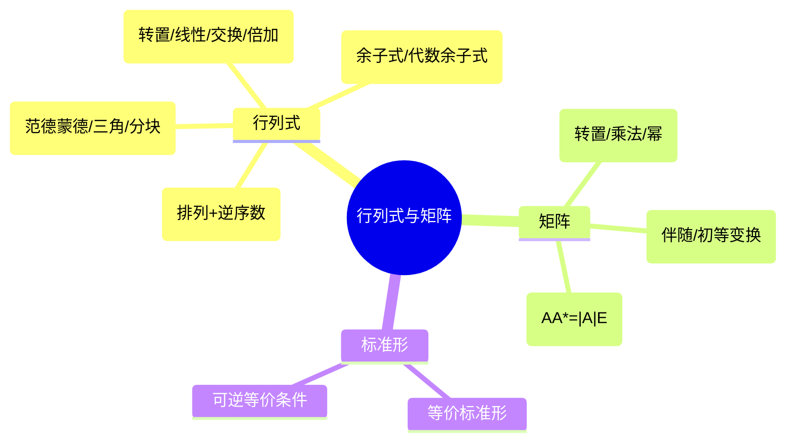

## 1. 全章导图



### 行列式的求解与性质

- 行列式可以按排列定义（$n$ 阶行列式共 $n!$ 项，每项取自不同行不同列）：
  $$D_n=\sum_{s_1s_2\cdots s_n}(-1)^{\tau(s_1s_2\cdots s_n)}a_{1s_1}a_{2s_2}\cdots a_{ns_n}$$
  其中 $\tau$ 为排列的逆序数。
- 二阶、三阶行列式的对角线法则：
  $$\begin{vmatrix}a_{11}&a_{12}\\a_{21}&a_{22}\end{vmatrix}=a_{11}a_{22}-a_{12}a_{21}$$
  $$\begin{vmatrix}a_{11}&a_{12}&a_{13}\\a_{21}&a_{22}&a_{23}\\a_{31}&a_{32}&a_{33}\end{vmatrix}=\sum a_{1s_1}a_{2s_2}a_{3s_3}\cdot(-1)^{\tau}$$
  共 $6$ 项，正负号由排列奇偶决定（Sarrus 法则只对三阶适用）。
- 三类典型行列式：
  - 上、下三角行列式 $=$ 主对角线元素之积。
  - 主对角行列式：$\det\operatorname{diag}(a_1,\ldots,a_n)=a_1a_2\cdots a_n$。
  - 副对角行列式：
    $$\begin{vmatrix}&&&a_1\\&&a_2&\\&\cdot&&\\a_n&&&\end{vmatrix}=(-1)^{\frac{n(n-1)}{2}}a_1a_2\cdots a_n$$
- 行列式六条基本性质：
  1. $|A^T|=|A|$（行列互换不变）。
  2. 互换两行（列）符号变号。
  3. 某行（列）有公因子 $k$ 可以提取：$|kA_{\text{某行}}|=k|A|$，注意 $|kA|=k^n|A|$。
  4. 某行（列）全为 0 时 $|A|=0$。
  5. 两行（列）相同或成比例时 $|A|=0$。
  6. 把某行（列）的 $k$ 倍加到另一行（列）行列式不变（倍加不变性）。
- 余子式与代数余子式：
  - 在 $|A|$ 中划去 $a_{ij}$ 所在的第 $i$ 行第 $j$ 列，剩余元素按原顺序构成的 $(n-1)$ 阶行列式叫 $a_{ij}$ 的**余子式** $M_{ij}$。
  - **代数余子式**：
    $$A_{ij}=(-1)^{i+j}M_{ij}$$
- 按行（列）展开定理：
  $$|A|=\sum_{j=1}^n a_{ij}A_{ij}\quad(\text{按第 }i\text{ 行})$$
  $$|A|=\sum_{i=1}^n a_{ij}A_{ij}\quad(\text{按第 }j\text{ 列})$$
- 代数余子式的正交关系（异行/异列展开为 0）：
  $$\sum_{k=1}^n a_{ki}A_{kj}=|A|\delta_{ij}=
  \begin{cases}
  |A|,&i=j\\
  0,&i\ne j
  \end{cases}$$
  $$\sum_{k=1}^n a_{ik}A_{jk}=|A|\delta_{ij}$$
- $|A|=0$ 的常见情形：
  - 某行或某列全为 0。
  - 两行或两列对应相同。
  - 两行或两列对应成比例。
  - 某行（列）是其他行（列）的线性组合。
  - 奇数阶反对称矩阵（$A^T=-A$）必有 $|A|=0$。证明：$|A|=|A^T|=|-A|=(-1)^n|A|$，$n$ 奇时 $|A|=-|A|\Rightarrow|A|=0$。
- 行列式对某一行或某一列具有线性性。例如固定第二行：
  $$\lambda\begin{vmatrix}a&b\\c&d\end{vmatrix}
  +\begin{vmatrix}m&n\\c&d\end{vmatrix}
  =
  \begin{vmatrix}\lambda a+m&\lambda b+n\\c&d\end{vmatrix}$$
- 转置不改变行列式：
  $$|A|=|A^T|$$
- 数乘、乘积、逆矩阵的行列式：
  $$|kA|=k^n|A|,\qquad |AB|=|A||B|,\qquad |A^{-1}|=|A|^{-1}$$
- 块三角行列式：
  $$\begin{vmatrix}A&*\\0&B\end{vmatrix}=|A||B|,\qquad
  \begin{vmatrix}A&0\\*&B\end{vmatrix}=|A||B|$$
  反对角块行列式（$A$ 为 $m$ 阶、$B$ 为 $n$ 阶）：
  $$\begin{vmatrix}0&A\\B&*\end{vmatrix}=(-1)^{mn}|A||B|,\qquad
  \begin{vmatrix}*&A\\B&0\end{vmatrix}=(-1)^{mn}|A||B|$$
- 范德蒙德行列式（典型不同列均为变量幂次）：
  $$V_n=\begin{vmatrix}
  1&1&\cdots&1\\
  x_1&x_2&\cdots&x_n\\
  x_1^2&x_2^2&\cdots&x_n^2\\
  \vdots&\vdots&&\vdots\\
  x_1^{n-1}&x_2^{n-1}&\cdots&x_n^{n-1}
  \end{vmatrix}
  =\prod_{1\le i<j\le n}(x_j-x_i)$$
  当 $x_1,\ldots,x_n$ 互不相同时 $V_n\ne0$。

### 矩阵运算、逆矩阵与伴随矩阵

- 矩阵乘法定义：若 $A=(a_{ij})_{m\times s}$，$B=(b_{ij})_{s\times n}$，则
  $$C=AB=(c_{ij})_{m\times n},\qquad c_{ij}=\sum_{k=1}^s a_{ik}b_{kj}$$
  要求**前者列数 $=$ 后者行数**，结果维数 $=$ 前者行数 $\times$ 后者列数。
- 转置公式：
  $$(AB)^T=B^TA^T,\qquad (A_1A_2\cdots A_k)^T=A_k^T\cdots A_2^TA_1^T$$
  $$\left(\sum_i A_i\right)^T=\sum_i A_i^T,\qquad (kA)^T=kA^T,\qquad (A^T)^T=A$$
- 乘积幂常用化简（当 $BA=kE$ 时）：
  $$(AB)^n=A(BA)^{n-1}B=k^{n-1}AB$$
- 逆矩阵公式：
  $$(A_1A_2\cdots A_k)^{-1}=A_k^{-1}\cdots A_2^{-1}A_1^{-1}$$
  $$(kA)^{-1}=\frac1kA^{-1},\qquad (A^T)^{-1}=(A^{-1})^T,\qquad (A^{-1})^{-1}=A$$
- 伴随矩阵 $A^*$ 的定义（注意元素位置是**代数余子式的转置**）：
  $$A^*=\begin{pmatrix}A_{11}&A_{21}&\cdots&A_{n1}\\A_{12}&A_{22}&\cdots&A_{n2}\\\vdots&\vdots&&\vdots\\A_{1n}&A_{2n}&\cdots&A_{nn}\end{pmatrix}=(A_{ji})$$
  基本恒等式：
  $$AA^*=A^*A=|A|E$$
  当 $|A|\ne0$ 时：
  $$A^{-1}=\frac1{|A|}A^*,\qquad A^*=|A|A^{-1}$$
- 伴随矩阵的常用性质：
  $$|A^*|=|A|^{n-1},\qquad (A^*)^*=|A|^{n-2}A,\qquad (kA)^*=k^{n-1}A^*$$
  $$(A^T)^*=(A^*)^T,\qquad (AB)^*=B^*A^*$$
  当 $A$ 可逆：
  $$(A^*)^{-1}=(A^{-1})^*=\frac1{|A|}A$$
- 二阶矩阵逆矩阵（"主对调，副变号"）：
  $$\begin{pmatrix}a&b\\c&d\end{pmatrix}^{-1}
  =\frac1{ad-bc}\begin{pmatrix}d&-b\\-c&a\end{pmatrix}\quad(ad-bc\ne0)$$
- 对角矩阵的逆：
  $$\operatorname{diag}(a_1,\ldots,a_n)^{-1}=\operatorname{diag}\!\left(\tfrac1{a_1},\ldots,\tfrac1{a_n}\right)\quad(a_i\ne0)$$

### 矩阵方程与标准形

- 若 $A_{m\times n}$ 的秩为 $r$，则存在 $m$ 阶可逆矩阵 $P$、$n$ 阶可逆矩阵 $Q$，使
  $$PAQ=\Lambda=\begin{pmatrix}E_r&0\\0&0\end{pmatrix}_{m\times n}\quad\Longleftrightarrow\quad
  A=P^{-1}\Lambda Q^{-1}$$
  右端称为 $A$ 的**等价标准形**。维度示意：

  ```
  m×n        m×m   m×n     n×n
   A    =    P  ·  Λ   ·   Q
                  ┌─────┬───┐
              Λ = │ E_r │ 0 │  上面 r 行
                  ├─────┼───┤
                  │  0  │ 0 │  下面 m-r 行
                  └─────┴───┘
                    r 列  n-r 列
  ```

- 可逆变换不改变秩：
  $$r(A)=r(PA)=r(AQ)=r(PAQ)$$
  这是因为 $P$、$Q$ 可分解为初等矩阵之积，初等变换保秩。
- 伴随矩阵的秩：
  $$r(A^*)=
  \begin{cases}
  n,&r(A)=n\\
  1,&r(A)=n-1\\
  0,&r(A)\le n-2
  \end{cases}$$
  推导关键：当 $r(A)=n$ 时 $A^*=|A|A^{-1}$ 可逆；$r(A)=n-1$ 时 $A$ 至少存在一个非零的 $(n-1)$ 阶子式，故 $A^*\ne0$ 且由 $AA^*=0$ 得 $r(A^*)\le n-r(A)=1$；$r(A)\le n-2$ 时所有 $(n-1)$ 阶子式都为 0，故 $A^*=0$。
- 块对角或反对角矩阵的逆矩阵可按块求：
  $$\begin{pmatrix}A&0\\0&B\end{pmatrix}^{-1}
  =\begin{pmatrix}A^{-1}&0\\0&B^{-1}\end{pmatrix}$$
  $$\begin{pmatrix}0&A\\B&0\end{pmatrix}^{-1}
  =\begin{pmatrix}0&B^{-1}\\A^{-1}&0\end{pmatrix}$$
- 若 $A,B,A+B$ 均可逆，则
  $$|A^{-1}+B^{-1}|=\frac{|A+B|}{|A||B|}$$
  证明：$A^{-1}+B^{-1}=A^{-1}(B+A)B^{-1}=A^{-1}(A+B)B^{-1}$，两边取行列式即得。

### 可逆矩阵的等价条件

对 $n$ 阶矩阵 $A$，以下条件等价：

- $|A|\ne0$。
- $A$ 可逆（存在唯一 $A^{-1}$ 使 $AA^{-1}=A^{-1}A=E$）。
- 存在 $B$ 使 $BA=E_n$ 或 $AB=E_n$（**方阵情形单边即可**）。
- $r(A)=n$，即 $A$ 满秩。
- 齐次方程 $Ax=0$ 只有零解。
- 非齐次方程 $Ax=b$ 对任意 $b$ 都有唯一解。
- $A$ 的行向量组、列向量组线性无关。
- $A$ 的行（列）向量组是 $\mathbb R^n$ 的一组基。
- $A$ 可由初等矩阵的乘积表示，或 $A$ 可经初等行变换化为单位矩阵。
- $0$ 不是 $A$ 的特征值。

<details class="md-source-page">
<summary>原图 · Linear Algebra 第 1 页</summary>
<figure class="md-source-page__figure">

<figcaption>LinearAlgebra_1.pdf</figcaption>
</figure>
</details>

## 2. 化标准形与特征值方法

- 设 $A$ 为 $n$ 阶矩阵，**特征值** $\lambda$ 与**特征向量** $\xi$ 满足
  $$A\xi=\lambda\xi,\qquad \xi\ne0$$
- 求特征值：解特征方程
  $$|\lambda E-A|=0\quad\text{或}\quad |A-\lambda E|=0$$
  $|\lambda E-A|$ 是 $\lambda$ 的 $n$ 次多项式，叫**特征多项式**。
- 对每个特征值 $\lambda_i$，求齐次方程
  $$(\lambda_iE-A)x=0$$
  的非零解，即对应的特征向量；其全部解构成**特征子空间** $V_{\lambda_i}=\ker(\lambda_iE-A)$。
- 特征值的两条根与系数关系：
  $$\sum_{i=1}^n\lambda_i=\operatorname{tr}(A),\qquad \prod_{i=1}^n\lambda_i=|A|$$
- 若能取到 $n$ 个线性无关的特征向量 $\eta_1,\ldots,\eta_n$，令
  $$P=(\eta_1,\eta_2,\ldots,\eta_n),\qquad x=Py$$
  则
  $$P^{-1}AP=\Lambda=\operatorname{diag}(\lambda_1,\ldots,\lambda_n)$$
  二次型中也可写为 $f(x)=g(y)=y^T\Lambda y=\sum_i\lambda_iy_i^2$。
- 常用结论：$A$ 与 $A^T$ 有相同的特征值；若 $\lambda$ 是 $A$ 的特征值，则
  $$f(\lambda)\ \text{是}\ f(A)\ \text{的特征值},\quad
  \frac1\lambda\ \text{是}\ A^{-1}\ \text{的特征值}\,(\lambda\ne0),\quad
  \frac{|A|}\lambda\ \text{是}\ A^*\ \text{的特征值}$$

### 二次型化标准形

- $n$ 元二次型的矩阵形式：
  $$f(x_1,\ldots,x_n)=\sum_{i,j}a_{ij}x_ix_j=x^TAx,\qquad A=A^T$$
  其中**对称矩阵** $A$ 称为二次型的矩阵。
- 若二次型含有平方项，可用**配方法**。例如先围绕 $a_{11}x_1^2$ 配方：
  $$a_{11}\!\left(x_1+\tfrac{a_{12}}{a_{11}}x_2+\cdots+\tfrac{a_{1n}}{a_{11}}x_n\right)^2-\frac1{a_{11}}\!\left(a_{12}x_2+\cdots+a_{1n}x_n\right)^2+\cdots$$
  再继续处理剩余变量，得到全平方和的标准形。
- 若不含平方项（即所有 $a_{ii}=0$），先作可逆线性替换制造平方项，例如对存在 $a_{12}\ne0$ 的情形令
  $$x_1=y_1+y_2,\qquad x_2=y_1-y_2,\qquad x_3=y_3,\ldots,x_n=y_n$$
  则 $2a_{12}x_1x_2=2a_{12}(y_1^2-y_2^2)$，出现了平方项，再用配方法继续。
- 二次型的等价变换叫**合同**：
  $$A\simeq B\iff \exists\,\text{可逆 }C\ \text{使}\ C^TAC=B$$
  合同变换的核心形式：
  $$C^TAC=\Lambda$$
  其中 $\Lambda$ 为对角标准形，对角元为 $\pm1,0$ 时称为**规范形**。
- 三类化二次型为标准形的方法：
  1. **配方法**（初等变换思想）。
  2. **正交变换法**（用正交矩阵 $Q$ 使 $Q^TAQ=\operatorname{diag}(\lambda_1,\ldots,\lambda_n)$，对角元为特征值）。
  3. **初等合同变换**（对 $\begin{pmatrix}A\\E\end{pmatrix}$ 同时进行相同的行、列初等变换，下半部得到 $C$）。

### 惯性定理与正定性

- **惯性定理**：实二次型经过非退化（可逆）线性变换化为标准形后，正平方项个数 $p$ 与负平方项个数 $q$ 不变；$p+q=r$，其中 $r$ 为二次型的秩。
  - $p$ 称为**正惯性指数**，$q$ 称为**负惯性指数**，$p-q$ 称为**符号差**。
- 标准形（规范形）可写作：
  $$C^TAC=\operatorname{diag}(\underbrace{1,\ldots,1}_{p},\underbrace{-1,\ldots,-1}_{q},\underbrace{0,\ldots,0}_{n-r})=\begin{pmatrix}E_p&&\\&-E_q&\\&&0\end{pmatrix}$$
- 两个实对称矩阵合同当且仅当它们有相同的秩与正惯性指数。
- 对称矩阵 $A$ **正定**的常用等价条件：
  - 对任意 $x\ne0$，有 $x^TAx>0$。
  - $A$ 的特征值全为正。
  - $A$ 的各阶顺序主子式全为正（**Sylvester 判别**）。
  - 正惯性指数 $p=n$（负惯性指数 $q=0$，秩 $=n$）。
  - 存在可逆矩阵 $C$，使 $A=C^TC$。
  - $A$ 与单位矩阵合同。
- 半正定（$x^TAx\ge0$）等价条件：
  - 特征值全为非负。
  - 负惯性指数 $q=0$。
  - 存在矩阵 $C$（不要求可逆）使 $A=C^TC$。
- 正定矩阵的常用性质：$A$ 正定 $\Rightarrow$ $A^{-1}$、$A^*$、$A^k$、$kA(k>0)$ 也正定；正定矩阵的对角元全为正；$|A|>0$。

### 矩阵幂

- 若 $A$ 可对角化：
  $$P^{-1}AP=\Lambda=\operatorname{diag}(\lambda_1,\ldots,\lambda_n)$$
  则
  $$A^k=P\Lambda^kP^{-1}
  =P\operatorname{diag}(\lambda_1^k,\ldots,\lambda_n^k)P^{-1}$$
- 若不可对角化，常见三种处理：
  1. 把矩阵写成 $A=\lambda E+B$ 的形式，用二项式展开
     $$A^k=(\lambda E+B)^k=\sum_{i=0}^k\binom{k}{i}\lambda^{k-i}B^i$$
     当 $B$ 幂零（存在 $m$ 使 $B^m=0$）时只剩有限项。
  2. 利用秩 $1$ 矩阵 $A=\alpha\beta^T$，则 $A^n=(\beta^T\alpha)^{n-1}\alpha\beta^T=(\operatorname{tr}A)^{n-1}A$。
  3. 利用 Cayley-Hamilton 定理：$A$ 满足自身的特征多项式 $\varphi(A)=0$，从而 $A^n$ 可由 $E,A,\ldots,A^{n-1}$ 线性表出。

<details class="md-source-page">
<summary>原图 · Linear Algebra 第 2 页</summary>
<figure class="md-source-page__figure">

<figcaption>LinearAlgebra_2.pdf</figcaption>
</figure>
</details>

## 3. 相似矩阵

- **相似的定义**：若存在可逆矩阵 $P$，使
  $$B=P^{-1}AP$$
  则称 $A$ 与 $B$ **相似**，记作 $A\sim B$。等价地：
  $$A=PBP^{-1},\qquad A^n=PB^nP^{-1}$$
- 相似关系是等价关系：自反 $A\sim A$（取 $P=E$）、对称 $A\sim B\Rightarrow B\sim A$、传递 $A\sim B,\,B\sim C\Rightarrow A\sim C$。
- 相似矩阵具有相同的特征多项式：
  $$|\lambda E-B|=|\lambda E-P^{-1}AP|=|P^{-1}(\lambda E-A)P|=|\lambda E-A|$$
  因而特征值（含重数）相同，对应的特征值正定性、可逆性等结论也随之保持。
- 相似矩阵的常用不变量：
  $$|A|=|B|,\qquad \operatorname{tr}(A)=\operatorname{tr}(B),\qquad r(A)=r(B)$$
  $$A^n\sim B^n,\qquad kA\sim kB,\qquad A+kE\sim B+kE$$
  当 $A$ 可逆时：
  $$A^{-1}\sim B^{-1},\qquad A^*\sim B^*$$
- 多项式保持相似：对任意多项式 $f$
  $$f(A)\sim f(B),\qquad f(A)=Pf(B)P^{-1}\ \text{当}\ A=PBP^{-1}$$
- 块对角矩阵的特征多项式按块相乘：
  $$|\lambda E-A|=|\lambda E-A_1||\lambda E-A_2|\cdots|\lambda E-A_m|$$
  当 $A=\operatorname{diag}(A_1,\ldots,A_m)$。
- 迹的常用公式：
  $$\operatorname{tr}(AB)=\operatorname{tr}(BA),\qquad
  \operatorname{tr}(\lambda A+B)=\lambda\operatorname{tr}(A)+\operatorname{tr}(B)$$
  $$\operatorname{tr}(A)=\sum_{i=1}^na_{ii}=\sum_{i=1}^n\lambda_i$$

### 可对角化判据

- 设 $\lambda_i$ 是 $A$ 的互异特征值，**代数重数** $k_i$ 是 $\lambda_i$ 在特征多项式 $|\lambda E-A|$ 中的重数；**几何重数** $s_i$ 是特征子空间 $V_{\lambda_i}=\ker(\lambda_iE-A)$ 的维数：
  $$s_i=\dim V_{\lambda_i}=n-r(\lambda_iE-A)$$
  这一条来自秩-零度定理 $\dim\ker T+\dim\operatorname{im}T=n$。
- 普遍不等式：对任意特征值都有
  $$1\le s_i\le k_i$$
  下界来自至少存在一个非零特征向量；上界是矩阵论中代数重数支配几何重数的事实。
- $A$（$n$ 阶）**可对角化**的等价条件：
  - $A$ 有 $n$ 个线性无关的特征向量。
  - $\sum_i s_i=n$，即 $\sum_i\dim V_{\lambda_i}=n$。
  - 对**每一个**特征值 $\lambda_i$ 都有 $s_i=k_i$（几何重数 $=$ 代数重数）。
- 充分（非必要）条件：
  - 若 $A$ 有 $n$ 个互异特征值，则一定可对角化（每个 $k_i=1$，自动 $s_i=1=k_i$）。
  - **实对称矩阵**必可对角化，且可由正交矩阵对角化（见下节）。
- 不可对角化的典型例：$A=\begin{pmatrix}\lambda&1\\0&\lambda\end{pmatrix}$，特征值 $\lambda$ 二重，但 $r(\lambda E-A)=1$ 使 $s=1<2=k$。
- 实际步骤：
  1. 由 $|\lambda E-A|=0$ 求全部特征值及代数重数 $k_i$。
  2. 对每个 $\lambda_i$ 求 $s_i=n-r(\lambda_iE-A)$。
  3. 若存在 $s_i<k_i$，则 $A$ 不可对角化；否则可对角化。
  4. 在每个 $V_{\lambda_i}$ 中取一组基，按列拼成 $P=(\eta_1,\ldots,\eta_n)$，则
     $$P^{-1}AP=\operatorname{diag}(\lambda_1,\ldots,\lambda_n)$$
     特征值在对角线上的顺序与 $P$ 中向量的排列顺序一致。

### 内积、正交化与正交矩阵

- $n$ 维实向量内积的基本性质：
  $$(\alpha,\beta)=(\beta,\alpha),\qquad (k\alpha,\beta)=k(\alpha,\beta)=(\alpha,k\beta)$$
  $$(\alpha+\gamma,\beta)=(\alpha,\beta)+(\gamma,\beta),\qquad
  (\alpha,\beta+\gamma)=(\alpha,\beta)+(\alpha,\gamma)$$
  $$(\alpha,\alpha)\ge0,\quad (\alpha,\alpha)=0\iff\alpha=0,\qquad
  \|\alpha\|=\sqrt{(\alpha,\alpha)}$$
- Cauchy-Schwarz 不等式：
  $$(\alpha,\beta)^2\le(\alpha,\alpha)(\beta,\beta),\qquad
  |(\alpha,\beta)|\le\|\alpha\|\,\|\beta\|$$
  等号成立 $\iff\alpha,\beta$ 线性相关。
- 正交、单位化：
  - $\alpha\perp\beta\iff(\alpha,\beta)=0$。
  - 标准化：$\eta=\dfrac{\alpha}{\|\alpha\|}$，使 $\|\eta\|=1$。
  - **标准正交向量组**：两两正交且每个都是单位向量。
- Schmidt 正交化（把线性无关组 $\alpha_1,\ldots,\alpha_m$ 化为正交组 $\xi_1,\ldots,\xi_m$）：
  $$\xi_1=\alpha_1$$
  $$\xi_2=\alpha_2-\frac{(\alpha_2,\xi_1)}{(\xi_1,\xi_1)}\xi_1$$
  $$\xi_3=\alpha_3-\frac{(\alpha_3,\xi_1)}{(\xi_1,\xi_1)}\xi_1-\frac{(\alpha_3,\xi_2)}{(\xi_2,\xi_2)}\xi_2$$
  一般地
  $$\xi_k=\alpha_k-\sum_{j=1}^{k-1}\frac{(\alpha_k,\xi_j)}{(\xi_j,\xi_j)}\xi_j\quad(k=2,\ldots,m)$$
  再单位化得到 $\eta_k=\xi_k/\|\xi_k\|$，即得标准正交组。
- 正交矩阵 $A$ 的等价刻画（$A$ 为 $n$ 阶实方阵）：
  $$A^TA=AA^T=E\iff A^{-1}=A^T$$
  $$|A|^2=1,\qquad |A|=\pm1$$
  - $A$ 的列向量组为 $\mathbb R^n$ 的标准正交基。
  - $A$ 的行向量组为 $\mathbb R^n$ 的标准正交基。
  - 正交变换保持内积、长度、夹角：$(A\alpha,A\beta)=(\alpha,\beta)$，$\|A\alpha\|=\|\alpha\|$。
- 正交矩阵的乘积、逆仍是正交矩阵：若 $A,B$ 正交，则 $AB$、$A^{-1}=A^T$ 都正交。

### 实对称矩阵

- 实对称矩阵的特征值都是**实数**。
- 实对称矩阵的属于**不同特征值的特征向量必相互正交**。
  - 证明思路：设 $A\xi_1=\lambda_1\xi_1$，$A\xi_2=\lambda_2\xi_2$，$\lambda_1\ne\lambda_2$。由 $\xi_1^TA\xi_2=\lambda_2\xi_1^T\xi_2$ 与 $(A\xi_1)^T\xi_2=\lambda_1\xi_1^T\xi_2$（用到 $A^T=A$）相减得 $(\lambda_1-\lambda_2)(\xi_1,\xi_2)=0$，故 $(\xi_1,\xi_2)=0$。
- 实对称矩阵的同一特征值对应的特征向量组**可再 Schmidt 正交化、单位化**，并仍属于该特征子空间。
- 实对称矩阵**一定可对角化**，且可由**正交矩阵**实现：存在 $n$ 阶正交矩阵 $P$（$P^TP=E$），使
  $$P^TAP=P^{-1}AP=\operatorname{diag}(\lambda_1,\ldots,\lambda_n)$$
  对角元为 $A$ 的特征值（按重数计数）。
- 实际步骤：
  1. 求出全部特征值 $\lambda_1,\ldots,\lambda_n$（含重数）。
  2. 对每个 $\lambda_i$ 求 $\ker(\lambda_iE-A)$ 的一组基。
  3. 同一特征值的基用 Schmidt 正交化，再统一单位化。
  4. 不同特征值的特征向量已自动正交，故合起来就是 $\mathbb R^n$ 的一组标准正交基。
  5. 按列拼成正交矩阵 $P$，即得 $P^TAP=\operatorname{diag}(\lambda_1,\ldots,\lambda_n)$。

<details class="md-source-page">
<summary>原图 · Linear Algebra 第 3 页</summary>
<figure class="md-source-page__figure">

<figcaption>LinearAlgebra_3.pdf</figcaption>
</figure>
</details>

## 4. 秩与极大无关组

- 矩阵 $A$ 的秩 $r(A)$ 有三种等价刻画：
  - **子式定义**：$A$ 中**非零子式的最高阶数**。
  - **行/列向量定义**：行向量组、列向量组的极大线性无关组中向量的个数。
  - **阶梯形定义**：$A$ 经初等行变换化为行阶梯形后，**非零行的个数**。
- 行秩、列秩、矩阵秩三者相等：
  $$r(A)=r(A^T)$$
- 对 $A_{m\times n}$：
  $$0\le r(A)\le\min(m,n)$$
  $r(A)=0\iff A=0$。
- 子阵的秩不超过原矩阵：若 $B$ 是 $A$ 的子阵，则
  $$r(B)\le r(A)$$
- 初等行/列变换、可逆矩阵左/右乘**不改变秩**：
  $$r(A)=r(PA)=r(AQ)=r(PAQ)\quad(P,Q\ \text{可逆})$$
- 极大无关组的两条等价描述（设向量组 $A:\alpha_1,\ldots,\alpha_m$，秩为 $r$）：
  - 在 $A$ 中能找到 $r$ 个线性无关的向量，且**任意 $r+1$ 个向量都线性相关**。
  - 任一极大无关组都能**唯一线性表示**原向量组中的其它向量；任意两个极大无关组**互相等价**且向量个数都为 $r$。
- 线性无关与秩的关系：
  - $\alpha_1,\ldots,\alpha_m$ 线性无关 $\iff r(A)=m$。
  - $\alpha_1,\ldots,\alpha_m$ 线性相关 $\iff r(A)<m$。
- 添加向量对秩的影响：若 $\beta$ 可由 $\alpha_1,\ldots,\alpha_r$ 线性表示，则
  $$r(\alpha_1,\ldots,\alpha_r,\beta)=r(\alpha_1,\ldots,\alpha_r)$$
  否则秩**严格增加 1**。

### 秩的不等式

- 数乘、转置：
  $$r(kA)=r(A)\ (k\ne0),\qquad r(A^T)=r(A^TA)=r(AA^T)=r(A)$$
- 和的秩：
  $$r(A+B)\le r(A)+r(B)$$
- 积的秩：
  $$r(AB)\le\min\{r(A),r(B)\}$$
- Sylvester 不等式（$A$ 为 $m\times n$，$B$ 为 $n\times s$）：
  $$r(AB)\ge r(A)+r(B)-n$$
  特别地，若 $AB=0$ 则
  $$r(A)+r(B)\le n$$
- 行（列）拼接矩阵：
  $$\max\{r(A),r(B)\}\le r(A,B)\le r(A)+r(B)$$
- 块对角矩阵：
  $$r\!\begin{pmatrix}A&0\\0&B\end{pmatrix}=r(A)+r(B)$$
- 伴随矩阵的秩仍按三档处理：
  $$r(A^*)=
  \begin{cases}
  n,&r(A)=n\\
  1,&r(A)=n-1\\
  0,&r(A)\le n-2
  \end{cases}$$
- 若 $A$ 列满秩（$r(A)=n$），则 $AB=0\Rightarrow B=0$、$AB=AC\Rightarrow B=C$；行满秩同理可右消去。

### 线性方程组

- 用增广矩阵 $(A\mid b)$ 的秩判定 $Ax=b$（$A$ 为 $m\times n$）的解结构：

  | 条件 | 结论 |
  | --- | --- |
  | $r(A)<r(A\mid b)$ | 无解（不相容） |
  | $r(A)=r(A\mid b)=n$ | 唯一解 |
  | $r(A)=r(A\mid b)<n$ | 有无穷多解，自由变量个数 $=n-r(A)$ |

- 齐次方程 $Ax=0$ 的解结构：
  - 若 $r(A)=n$（列满秩），只有零解。
  - 若 $r(A)<n$，存在非零解，且解空间 $N(A)=\{x:Ax=0\}$ 是 $\mathbb R^n$ 的子空间。
  - 当 $A$ 为 $n$ 阶方阵：只有零解 $\iff |A|\ne0$；有非零解 $\iff |A|=0$。
- **维数公式**（秩-零度定理）：
  $$r(A)+\dim N(A)=n,\qquad \dim N(A)=n-r(A)$$
- **基础解系**：齐次方程解空间 $N(A)$ 的一组基；个数为 $n-r(A)$。
- 非齐次方程通解 $=$ 一个特解 $+$ 齐次通解：
  $$x=\eta+k_1\alpha_1+k_2\alpha_2+\cdots+k_{n-r}\alpha_{n-r}$$
  其中 $A\eta=b$，$\alpha_1,\ldots,\alpha_{n-r}$ 为 $Ax=0$ 的基础解系，$k_i\in\mathbb R$ 任意。
- 齐次方程解的两条性质：
  - 解的线性组合仍是解（解集对加法、数乘封闭）。
  - 非齐次方程**任意两解之差**是对应齐次方程的解：$A(\eta_1-\eta_2)=b-b=0$。
- 克拉默法则（适用于 $n$ 阶方阵 $A$ 且 $|A|\ne0$）：
  $$x_i=\frac{|A_i|}{|A|}\quad(i=1,\ldots,n)$$
  其中 $A_i$ 由 $A$ 的第 $i$ 列换成 $b$ 得到。

### 最小二乘

- 当 $Ax=b$ 不相容（$r(A)<r(A\mid b)$）时，可求**最小二乘解** $\hat x$：
  $$\hat x=\arg\min_{x}\|Ax-b\|^2$$
- 几何意义：把 $b$ 投影到 $\operatorname{im}A$ 上，$A\hat x$ 即为 $b$ 在列空间上的正交投影；残差 $b-A\hat x$ 与 $\operatorname{im}A$ 正交。
- 由 $A^T(b-A\hat x)=0$ 得**正规方程**：
  $$A^TA\,\hat x=A^Tb$$
- 若 $A$ 列满秩（$r(A)=n$），则 $A^TA$ 可逆，正规方程**唯一解**：
  $$\hat x=(A^TA)^{-1}A^Tb$$
- 若 $A$ 不列满秩，正规方程仍相容，但 $\hat x$ 不唯一（有无穷多最小二乘解）。

<details class="md-source-page">
<summary>原图 · Linear Algebra 第 4 页</summary>
<figure class="md-source-page__figure">

<figcaption>LinearAlgebra_4.pdf</figcaption>
</figure>
</details>

## 5. 特殊行列式与代数余子式技巧

- 稀疏（含很多零）的行列式，按定义展开时**只剩很少几项非零排列**，因此可以直接列出有效排列再计算逆序数。例如
  $$D=\begin{vmatrix}
  0&a&b&0\\
  a&0&0&b\\
  b&0&a&0\\
  0&b&0&a
  \end{vmatrix}$$
  非零项要求每行每列各取一个非零元，可行的列序号排列只有 $(2,1,3,4)$ 与 $(3,4,1,2)$（其余排列都会碰到 0）。计算两项的逆序数：
  $$\tau(2,1,3,4)=1,\qquad \tau(3,4,1,2)=4$$
  故
  $$D=(-1)^1\cdot a\cdot a\cdot a\cdot a+(-1)^4\cdot b\cdot b\cdot b\cdot b=-a^4+b^4$$
- 由代数余子式构造行列式：若题目给出形如 $a_1A_{i1}+a_2A_{i2}+\cdots+a_nA_{in}$ 的表达，可视为**把第 $i$ 行换成 $(a_1,a_2,\ldots,a_n)$** 后按第 $i$ 行展开得到的新行列式。
  - 例如 $a_1A_{11}+a_2A_{21}+\cdots+a_nA_{n1}$ 等于把 $A$ 的**第一列**换成 $(a_1,\ldots,a_n)^T$ 后的行列式。
- 涉及 $a_{ij}$ 与代数余子式的恒等式时，要分清是同行/同列展开（结果为 $|A|$）还是异行/异列展开（结果为 0）：
  $$\sum_{k=1}^n a_{ik}A_{jk}=|A|\delta_{ij},\qquad \sum_{k=1}^n a_{ki}A_{kj}=|A|\delta_{ij}$$
- 注意伴随矩阵中元素位置是**转置**关系：
  $$A^*=(A_{ji})_{n\times n}\quad(\text{第 }i\text{ 行第 }j\text{ 列是 }A_{ji})$$

### 矩阵乘法注意事项

- 一般 $AB\ne BA$（**没有交换律**），因此下列展开式都要小心保留乘法顺序：
  $$(AB)^k\ne A^kB^k\quad(\text{除非 }AB=BA)$$
  $$(A+B)^2=A^2+AB+BA+B^2$$
  $$(A-B)^2=A^2-AB-BA+B^2$$
  $$(A+B)(A-B)=A^2-AB+BA-B^2$$
  只有当 $AB=BA$ 时，才能像数值情形那样合并 $AB+BA=2AB$。
- $AB=0$ **不**能推出 $A=0$ 或 $B=0$。例如取 $A=\begin{pmatrix}1&0\\0&0\end{pmatrix}$，$B=\begin{pmatrix}0&0\\0&1\end{pmatrix}$，则 $AB=0$ 但 $A,B$ 都非零。
- $AC=BC$ 且 $C\ne0$ 也**不**能推出 $A=B$。**仅当 $C$ 可逆**时可右乘 $C^{-1}$ 消去。
- 若 $C=AB$ 且 $BA=kE$（$k$ 为常数），则
  $$C^n=(AB)^n=A(BA)^{n-1}B=k^{n-1}AB=k^{n-1}C$$
  这条在做 $C$ 高次幂时极常用。
- 若 $A,B$ 同阶且 $AB=BA$，则可像数那样运用二项式定理：
  $$(A+B)^n=\sum_{k=0}^n\binom{n}{k}A^kB^{n-k}$$

### 初等矩阵

- 三类初等矩阵（对单位矩阵 $E$ 作一次初等变换得到）：
  - $E(i,j)$：交换第 $i,j$ 行（列）。
  - $E(i(k))$（$k\ne0$）：把第 $i$ 行（列）乘以 $k$。
  - $E(i,j(k))$：把第 $j$ 行的 $k$ 倍加到第 $i$ 行（或对应列变换）。
- **左乘 $\Rightarrow$ 行变换，右乘 $\Rightarrow$ 列变换**：
  - 初等矩阵 $E_0$ 左乘 $A$，相当于对 $A$ 做与 $E_0$ 相同的初等**行**变换；
  - $E_0$ 右乘 $A$，相当于对 $A$ 做与 $E_0$ 相同的初等**列**变换。
  - 例如 $E(i,j(k))A$ 是把 $A$ 的第 $j$ 行的 $k$ 倍加到第 $i$ 行；$AE(i,j(k))$ 是把第 $i$ 列的 $k$ 倍加到第 $j$ 列。
- 三类初等矩阵均可逆，且其逆仍是同类型的初等矩阵：
  $$E(i,j)^{-1}=E(i,j)$$
  $$E(i(k))^{-1}=E\!\left(i\!\left(\tfrac1k\right)\right)$$
  $$E(i,j(k))^{-1}=E(i,j(-k))$$
- 可逆矩阵都能分解为有限个初等矩阵的乘积：$A$ 可逆 $\iff$ $A$ 是若干初等矩阵的乘积 $\iff$ $A$ 可经初等行变换化为 $E$。
- 非方阵的单边逆**不能反推另一边逆**：若 $A_{m\times n}$、$B_{n\times m}$ 不是方阵，即使 $AB=E_n$，当 $m>n$ 时也不能推出 $BA=E_m$（事实上由 $r(BA)\le\min\{r(A),r(B)\}\le n<m$ 知 $BA\ne E_m$）。

### 秩为 1 的矩阵

- $B_{m\times n}$ 满足 $r(B)=1$ 当且仅当存在非零列向量 $\alpha\in\mathbb R^m$、非零行向量 $\beta^T\in\mathbb R^n$，使
  $$B=\alpha\beta^T$$
- 充要性证明思路：
  - **必要性**（$r(B)=1\Rightarrow B=\alpha\beta^T$）：由秩 $1$ 的等价标准形 $B=P\begin{pmatrix}1&0\\0&0\end{pmatrix}Q$，把分块 $\begin{pmatrix}1&0\\0&0\end{pmatrix}$ 写成 $e_1e_1^T$，再吸收 $P,Q$ 即得 $B=p_1\cdot q_1^T$。也可直接观察：$B$ 所有列都与第一个非零列成比例。
  - **充分性**（$B=\alpha\beta^T\Rightarrow r(B)=1$）：$B$ 的每一列都是 $\alpha$ 的倍数（系数为 $\beta$ 的对应分量），故列空间是 $\operatorname{span}\{\alpha\}$，秩为 $1$。
- 秩 $1$ 矩阵的高次幂公式（令 $k=\beta^T\alpha=\operatorname{tr}(B)$）：
  $$B^2=\alpha\beta^T\alpha\beta^T=(\beta^T\alpha)\alpha\beta^T=k B$$
  $$B^n=k^{n-1}B=(\operatorname{tr}B)^{n-1}B\quad(n\ge1)$$
- 秩 $1$ 矩阵的特征值：$0$（$n-1$ 重）与 $\operatorname{tr}(B)=\beta^T\alpha$（$1$ 重）。
- 矩阵方程中也常用一般标准形：
  $$r(A)=r\Rightarrow \exists\,P,Q\ \text{可逆},\ A=P\begin{pmatrix}E_r&0\\0&0\end{pmatrix}Q$$
  把右端块矩阵写作 $\sum_{i=1}^r e_ie_i^T$ 即把 $A$ 化为 $r$ 个秩 $1$ 矩阵之和。

<details class="md-source-page">
<summary>原图 · Linear Algebra 第 5 页</summary>
<figure class="md-source-page__figure">

<figcaption>LinearAlgebra_5.pdf</figcaption>
</figure>
</details>

## 6. 满秩与转置

- $A$ 行满秩等价于 $A^T$ 列满秩。
- 若 $A^TA=AA^T$ 且 $A$ 为三角矩阵，则 $A$ 为对称矩阵。

### 旋转矩阵的幂

- 对旋转矩阵
  $$A=\begin{pmatrix}\cos\theta&\sin\theta\\-\sin\theta&\cos\theta\end{pmatrix}$$
  有
  $$A^n=\begin{pmatrix}\cos n\theta&\sin n\theta\\-\sin n\theta&\cos n\theta\end{pmatrix}$$
- 页面例子取 $\theta=\frac{\pi}{6}$：
  $$A=\begin{pmatrix}\cos\frac{\pi}{6}&\sin\frac{\pi}{6}\\-\sin\frac{\pi}{6}&\cos\frac{\pi}{6}\end{pmatrix},
  \quad
  A^n=\begin{pmatrix}\cos\frac{n\pi}{6}&\sin\frac{n\pi}{6}\\-\sin\frac{n\pi}{6}&\cos\frac{n\pi}{6}\end{pmatrix}$$

### 块矩阵与线性空间

- 块对角矩阵的性质通常可分解到各对角块。例如
  $$\begin{pmatrix}E_n&0\\0&A_n\end{pmatrix}$$
  的正交性、可逆性、正定性都与 $A_n$ 的对应性质有关。
- 线性空间 $V$ 的核心要求：
  - 若 $x,y\in V$，则 $x+y\in V$。
  - 若 $\lambda\in\mathbb R$ 且 $x\in V$，则 $\lambda x\in V$。
  - 存在零元 $0$。
  - 每个 $x$ 有负元 $-x$。
  - 加法交换律、结合律成立。
  - 数乘分配律与结合律成立：
    $$(\lambda+\mu)x=\lambda x+\mu x,\qquad
    \lambda(x+y)=\lambda x+\lambda y,\qquad
    \lambda(\mu x)=(\lambda\mu)x,\qquad 1x=x$$

<details class="md-source-page">
<summary>原图 · Linear Algebra 第 6 页</summary>
<figure class="md-source-page__figure">

<figcaption>LinearAlgebra_6.pdf</figcaption>
</figure>
</details>

## 7. 求逆矩阵与矩阵方程

- 伴随矩阵法：
  $$A^{-1}=\frac1{|A|}A^*\quad(|A|\ne0)$$
- Gauss-Jordan 法：
  $$(A:E)\xrightarrow{\text{行变换}}(E:A^{-1})$$
- 解 $AX=B$：
  $$(A:B)\xrightarrow{\text{行变换}}(E:X),\qquad X=A^{-1}B$$
- 解 $XA=B$：
  $$X=BA^{-1}$$
  可通过对转置方程或按列/行增广的方式求。

### 极大无关组与基础解系

- 对向量组 $A=(\alpha_1,\ldots,\alpha_n)$ 作初等行变换，得到行最简形；初等行变换不改变列向量之间的线性关系。
- 行最简形中主元列对应原向量组的极大无关组。
- 齐次方程 $Ax=0$ 的基础解系有 $n-r(A)$ 个向量：
  $$r(N(A))=n-r(A)$$
- 行最简形中自由变量依次取 1，其余自由变量取 0，可得到基础解系向量。

### 非齐次方程通解

- 方程 $Ax=b$：
  - 无解时先由秩判定排除。
  - 唯一解时直接求解。
  - 无穷多解时写作：
    $$x=\eta+k_1\alpha_1+\cdots+k_{n-r}\alpha_{n-r}$$
    其中 $\eta$ 是一个特解，$\alpha_i$ 为齐次方程基础解系。

### 矩阵多项式与逆

- 若矩阵满足多项式方程，例如
  $$B^2+a_1B+a_2E=0$$
  求 $B-kE$ 的逆时，可把多项式因式分解，构造出
  $$(B-kE)C=E$$
  的形式。
- 页面例子思路：
  若 $B^2=\lambda B$ 且 $\lambda\ne1$，则可由
  $$(E-B)((\lambda-1)E-B)=(\lambda-1)E$$
  构造 $(E-B)^{-1}$。

### 证明基础解系的步骤

要证明一组向量是 $Ax=0$ 的基础解系，需要同时证明：

- 每个向量都是方程的解。
- 这些向量线性无关。
- 向量个数等于 $n-r(A)$。

此外，若 $AB=0$，则 $B$ 的每一列都是齐次方程 $Ax=0$ 的解。

<details class="md-source-page">
<summary>原图 · Linear Algebra 第 7 页</summary>
<figure class="md-source-page__figure">

<figcaption>LinearAlgebra_7.pdf</figcaption>
</figure>
</details>

## 8. 向量组等价

- 向量组 $A$ 与 $B$ 等价，记作 $A\leftrightarrow B$，含义是二者可以相互线性表示。
- 等价向量组有相同的秩：
  $$A\leftrightarrow B\Rightarrow r(A)=r(B)$$
- 等价也可通过线性方程组表示：
  $$AX=B,\qquad BY=A$$
  若两个方程均有解，则两个向量组相互线性表示。
- 若存在可逆矩阵 $P$ 使 $AP=B$，则 $A$ 与 $B$ 等价，且
  $$A=BP^{-1}$$
- 两个向量组等价时，它们的极大无关组个数相同。

### 线性相关与线性无关

- 向量组线性相关：至少有一个向量可由其余向量线性表示。
- 向量组整体线性无关：只有全零系数能使线性组合为 0。
- 若向量组中向量个数大于秩，则线性相关；若向量个数等于秩，则线性无关。
- 对 $A=(\alpha_1,\ldots,\alpha_m)$：
  $$r(A)<m\Rightarrow \alpha_1,\ldots,\alpha_m\text{ 线性相关}$$

### 行等价与矩阵等价

- $A,B$ 行等价，当且仅当存在可逆矩阵 $P$，使
  $$PA=B$$
- 行等价保持行向量组的线性关系，也保持矩阵的秩。
- 证明两个向量组秩相等，可证明它们等价；证明等价时常用“相互线性表示”。

### 同解方程组

- 若两个方程组 $Ax=\beta$ 与 $Bx=\gamma$ 同解，则对应的齐次方程也同解。
- 可通过增广矩阵的行等价、解空间包含关系、相互表示关系来证明两个方程组同解。
- 思路：把一个方程组的每个方程表示为另一个方程组的线性组合，再反向证明。

<details class="md-source-page">
<summary>原图 · Linear Algebra 第 8 页</summary>
<figure class="md-source-page__figure">

<figcaption>LinearAlgebra_8.pdf</figcaption>
</figure>
</details>
