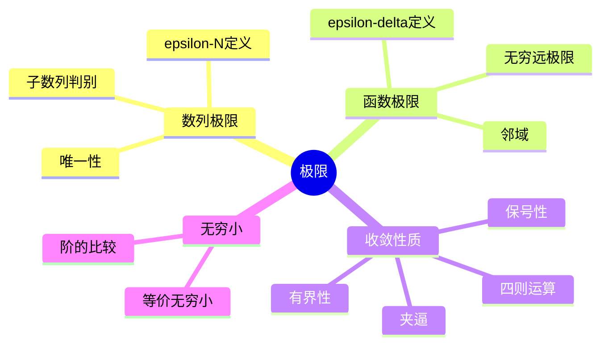
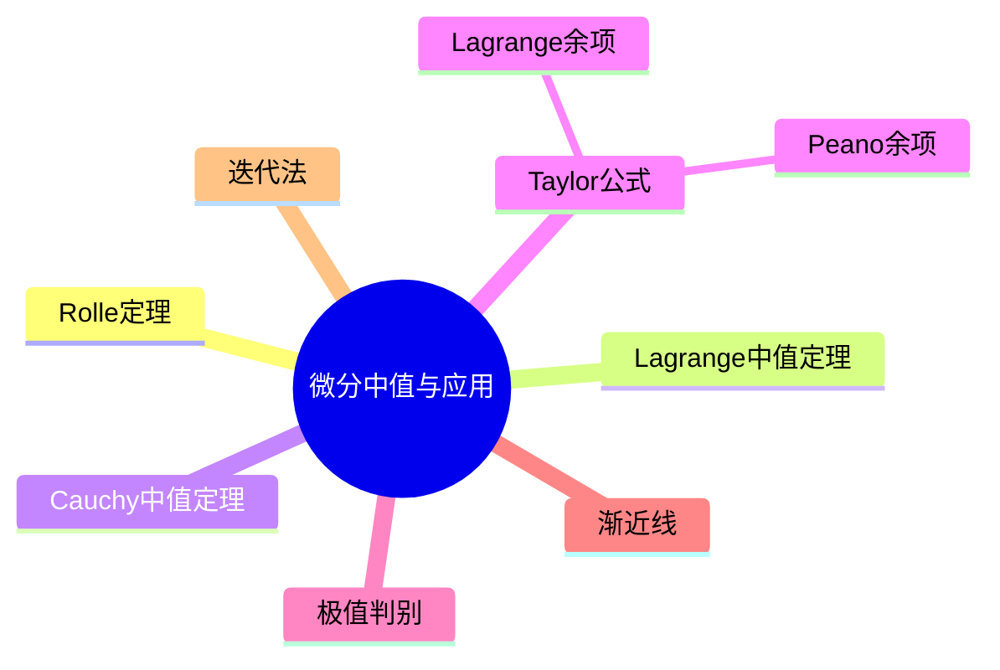
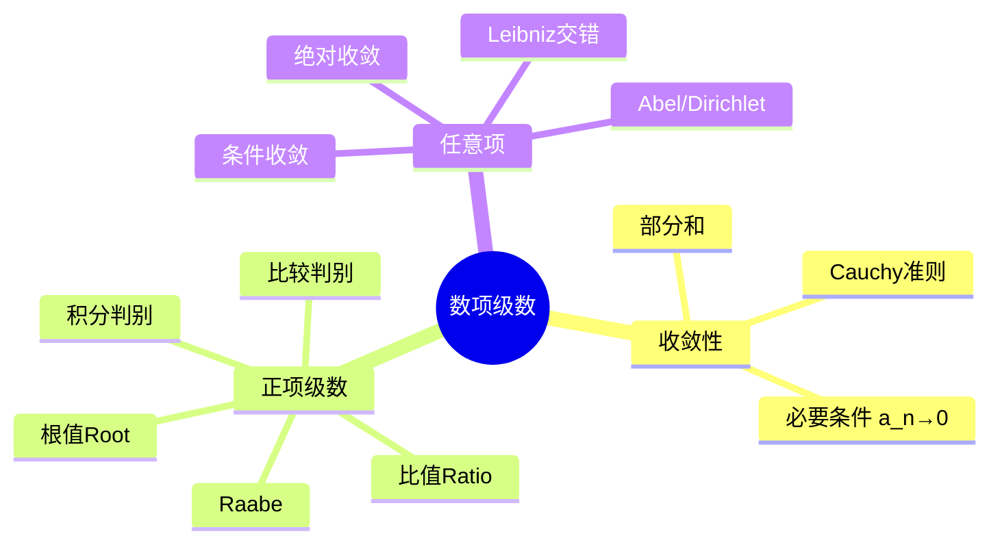

## 1. 极限定义与收敛/发散



- 数列极限：
  $$
  \forall \varepsilon>0,\ \exists N\in\mathbb N,\ \forall n>N,\ |x_n-A|<\varepsilon
  $$
  记作 $\lim_{n\to\infty}x_n=A$。
- 数列收敛的 Cauchy 判别：
  $$
  \forall\varepsilon>0,\ \exists N\in\mathbb N,\ \forall m,n>N,\ |x_m-x_n|<\varepsilon
  $$
  图中注明“不知极限时利用柯西准则”。
- 函数极限：
  $$
  \lim_{x\to x_0}f(x)=A
  \Longleftrightarrow
  \forall\varepsilon>0,\ \exists\delta>0,\ 0<|x-x_0|<\delta\Rightarrow |f(x)-A|<\varepsilon
  $$
- 无穷远处函数极限：
  $$
  \lim_{x\to\infty}f(x)=A
  \Longleftrightarrow
  \forall\varepsilon>0,\ \exists K>0,\ |x|>K\Rightarrow |f(x)-A|<\varepsilon
  $$
- 发散到 $+\infty$ 的写法：
  $$
  \forall G>0,\ \exists N,\ n>N\Rightarrow x_n>G
  $$
  函数形式为 $\exists\delta>0,\ 0<|x-x_0|<\delta\Rightarrow f(x)>G$。
- 子数列判别：
  - 若 $\{x_n\}$ 有极限 $A$，任意子数列也收敛到 $A$；
  - 若存在两个子数列极限不同，则原数列发散。
- 确界存在公理：非空有界集合必有上确界 $\sup S$ 和下确界 $\inf S$。
- 极限唯一性：同一极限过程下极限唯一。
- 有界性：若 $\lim f(x)=A$，则在去心邻域内 $f(x)$ 有界。
- 保号性：若 $A>0$，则足够靠近极限点时 $f(x)>0$；更一般地，存在 $d<|A|$ 使 $|f(x)|>d$。
- 四则运算法则：
  $$
  \lim(X+Y)=A+B,\quad
  \lim(XY)=AB,\quad
  \lim\frac XY=\frac AB\ (B\ne0)
  $$
- 夹逼准则：若 $X\le Y\le Z$ 且 $\lim X=\lim Z=A$，则 $\lim Y=A$。

### 无穷小与等价

- 无穷小定义：
  $$
  \lim X=A\Longleftrightarrow X=A+\alpha,\quad \alpha\to0
  $$
- 无穷小与有界量之积仍为无穷小。
- 等价无穷小：
  $$
  \alpha\sim\beta\Longleftrightarrow \lim\frac{\alpha}{\beta}=1
  $$
- 阶的比较：
  $$
  \lim\frac{\alpha}{\beta}=0 \Rightarrow \alpha=o(\beta)
  $$
  若极限为有限非零常数，则为同阶；若极限为 $\infty$，则 $\alpha$ 是比 $\beta$ 高阶的量。
- 等价代换要求整体相乘或相除；加减中不能随意替换。原图红字标注“不要漏全部”。
- 常见等价无穷小：
  $$
  e^x-1\sim x,\quad \ln(1+x)\sim x,\quad \sin x\sim x,\quad \tan x\sim x
  $$
  $$
  1-\cos x\sim \frac{x^2}{2},\quad (1+x)^a-1\sim ax
  $$
- 连续意味着微小增量下
  $$
  \Delta y=f(x+\Delta x)-f(x)\approx f'(x)\Delta x
  $$
  图中写作“$dy$ 是 $\Delta y$ 的线性主部”。

<details class="md-source-page">
<summary>原图 · Calculus 第 1 页</summary>
<figure class="md-source-page__figure">

<figcaption>Calculus_1.pdf</figcaption>
</figure>
</details>

## 2. 连续性与间断点

- 连续的序列刻画：
  $$
  \lim_{x\to x_0}f(x)=f(x_0)
  \Longleftrightarrow
  x_n\to x_0,\ x_n\in N(x_0)\Rightarrow f(x_n)\to f(x_0)
  $$
- $\varepsilon$-$\delta$ 一致连续：
  $$
  \forall\varepsilon>0,\ \exists\delta(\varepsilon)>0,\ |x_1-x_2|<\delta\Rightarrow |f(x_1)-f(x_2)|<\varepsilon
  $$
- 连续函数在一点附近有界；若 $f(x)$ 在 $a$ 点连续且 $\lim_{x\to x_0}g(x)=a$，则
  $$
  \lim_{x\to x_0}f(g(x))=f\left(\lim_{x\to x_0}g(x)\right)=f(a)
  $$
- 连续函数的运算封闭：和、差、积、商、反函数、复合函数在定义合理时连续。
- 一点连续的三个条件：
  1. $f(x_0)$ 有定义；
  2. $\lim_{x\to x_0}f(x)$ 存在；
  3. $\lim_{x\to x_0}f(x)=f(x_0)$。
- 间断点分类：
  - 第一类间断点：左、右极限都存在。
    - 可去间断：左右极限相等，但函数值不存在或不等于极限；
    - 跳跃间断：左右极限都存在但不相等。
  - 第二类间断点：至少一个单侧极限不存在，常见为无穷间断或振荡间断。

### 闭区间定理

- 闭区间套定理：若
  $$
  [a_1,b_1]\supset[a_2,b_2]\supset\cdots\supset[a_n,b_n]\supset\cdots,\qquad
  \lim_{n\to\infty}(b_n-a_n)=0
  $$
  则存在唯一 $\xi$ 属于所有闭区间，并且
  $$
  \lim a_n=\lim b_n=\xi
  $$
  原图特别用 $\exists!\,\xi$ 强调 $\xi$ 的唯一性，并标注 $\forall n\in\mathbb N,\ \xi\in[a_n,b_n]$。
- 图中把闭区间定理与连续函数的有界、最值、介值零点定理放在一起，提示这些结论都依赖闭区间连续性。
- 反函数求导（图右下）：若 $y=f(x)$ 在 $x_0$ 处可导且 $f'(x_0)\ne0$，则反函数在 $y_0=f(x_0)$ 处可导，
  $$
  (f^{-1})'(y_0)=\frac{1}{f'(x_0)}=\frac{1}{f'(f^{-1}(y_0))}
  $$

<details class="md-source-page">
<summary>原图 · Calculus 第 2 页</summary>
<figure class="md-source-page__figure">

<figcaption>Calculus_2.pdf</figcaption>
</figure>
</details>

## 3. 中值定理与 Taylor 展开



- 介值定理：若 $f$ 在 $[a,b]$ 连续，且 $f(a)\ne f(b)$，则对介于二者之间的任意 $\mu$，存在
  $$
  \xi\in(a,b),\quad f(\xi)=\mu
  $$
  特别地，若 $[f(a)-0][f(b)-0]<0$，则有零点。
- Rolle 定理：
  $$
  f(a)=f(b),\ f\in C[a,b],\ f\in D(a,b)
  \Rightarrow \exists\xi\in(a,b),\ f'(\xi)=0
  $$
- Lagrange 中值定理：
  $$
  f'(\xi)=\frac{f(b)-f(a)}{b-a}
  $$
  等价写法：
  $$
  f(b)-f(a)=f'(\xi)(b-a)
  $$
- Cauchy 中值定理：
  $$
  \frac{f(b)-f(a)}{g(b)-g(a)}=\frac{f'(\xi)}{g'(\xi)}
  $$
  条件中要求 $g'(x)$ 在区间内不为 $0$。
- 有限增量公式：
  $$
  f(x_0+\Delta x)=f(x_0)+f'(x_0+\theta\Delta x)\Delta x,\qquad 0<\theta<1
  $$
- Taylor 公式：
  $$
  f(x)=\sum_{k=0}^{n}\frac{f^{(k)}(x_0)}{k!}(x-x_0)^k+R_n(x)
  $$
  Peano 余项：
  $$
  R_n(x)=o((x-x_0)^n)
  $$
  Lagrange 余项：
  $$
  R_n(x)=\frac{f^{(n+1)}(\xi)}{(n+1)!}(x-x_0)^{n+1}
  $$
  其中 $\xi$ 介于 $x$ 与 $x_0$ 之间。
- Maclaurin 展开（$x_0=0$，原图所列基本展开）：
  $$
  e^x=\sum_{n=0}^{\infty}\frac{x^n}{n!},\qquad
  \sin x=\sum_{n=0}^{\infty}\frac{(-1)^n x^{2n+1}}{(2n+1)!}
  $$
  $$
  \cos x=\sum_{n=0}^{\infty}\frac{(-1)^n x^{2n}}{(2n)!},\qquad
  \ln(1+x)=\sum_{n=1}^{\infty}\frac{(-1)^{n-1}x^n}{n}
  $$
  $$
  (1+x)^\alpha=\sum_{n=0}^{\infty}\binom{\alpha}{n}x^n,\qquad
  \frac1{1-x}=\sum_{n=0}^{\infty}x^n
  $$

### 极值、渐近线与迭代法

- 极值判别法：
  - 一阶导法（I）：若在 $x_0$ 附近 $(x-x_0)f'(x)\ge0$，则 $x_0$ 是极小点；若 $(x-x_0)f'(x)\le0$ 则为极大点；
  - 二阶导法（II）：$f'(x_0)=0,\ f''(x_0)>0$ 为极小，$f''(x_0)<0$ 为极大；$f''(x_0)=0$ 时无法判定，需查更高阶或拐点。
- 拐点：$f''$ 变号的点；图中红字提示要"找拐点"。
- 渐近线：
  - 铅直渐近线：$x\to x_0^\pm$ 时 $y\to\infty$ 或 $-\infty$；
  - 水平渐近线：$x\to\pm\infty$ 时 $y\to c$；
  - 斜渐近线：
    $$
    y=ax+b,\qquad a=\lim_{x\to\infty}\frac{f(x)}x,\quad
    b=\lim_{x\to\infty}(f(x)-ax)
    $$
- 弹性：
  $$
  E_x=\frac{d y/y}{d x/x}=\frac{x f'(x)}{f(x)}
  $$
- 近似解法：
  - 牛顿法/切线法：
    $$
    x_{k+1}=x_k-\frac{f(x_k)}{f'(x_k)}
    $$
  - 割线法：
    $$
    x=a-\frac{b-a}{f(b)-f(a)}f(a)
    $$
    或用两点斜率迭代。

<details class="md-source-page">
<summary>原图 · Calculus 第 3 页</summary>
<figure class="md-source-page__figure">

<figcaption>Calculus_3.pdf</figcaption>
</figure>
</details>

## 4. 不定积分与换元

- 原函数关系：
  $$
  dF(x)=f(x)\,dx,\qquad \int f(x)\,dx=F(x)+C
  $$
- 分部积分：
  $$
  \int u\,dv=uv-\int v\,du
  $$
- 有理函数分解：
  - 因式 $(x-a)^k$ 对应
    $$
    \frac{A_1}{x-a}+\cdots+\frac{A_k}{(x-a)^k}
    $$
  - 二次不可约因式 $(x^2+px+q)^k$ 对应
    $$
    \frac{M_1x+N_1}{x^2+px+q}+\cdots+\frac{M_kx+N_k}{(x^2+px+q)^k}
    $$
- 三角有理化换元：
  $$
  t=\tan\frac x2,\quad
  \sin x=\frac{2t}{1+t^2},\quad
  \cos x=\frac{1-t^2}{1+t^2},\quad
  \tan x=\frac{2t}{1-t^2}
  $$
  并有 $dx=\dfrac{2}{1+t^2}\,dt$，称为万能代换；图中红字提示遇 $\sin,\cos$ 的有理函数都可化为有理函数积分。
- 第二类换元（根式）：
  - $\sqrt{a^2-x^2}$：令 $x=a\sin t$；
  - $\sqrt{a^2+x^2}$：令 $x=a\tan t$；
  - $\sqrt{x^2-a^2}$：令 $x=a\sec t$；
  - $\sqrt[n]{ax+b}$：令 $t=\sqrt[n]{ax+b}$。
- 和式极限转积分：
  $$
  \lim_{n\to\infty}\sum f(x_i)\Delta x_i=\int_a^b f(x)\,dx
  $$
  图中例子：
  $$
  \lim_{n\to\infty}\sum_{i=1}^{n}\frac1{1+(i/n)^2}\cdot\frac1n=\int_0^1\frac1{1+x^2}\,dx
  $$

### 定积分性质与几何应用

- 积分中值定理：
  $$
  \int_a^b f(x)g(x)\,dx=f(\xi)\int_a^b g(x)\,dx
  $$
  当 $g(x)=1$ 时：
  $$
  \int_a^b f(x)\,dx=f(\xi)(b-a)
  $$
  即平均值思想。
- 变上限积分：
  $$
  \frac{d}{dx}\int_{\psi(x)}^{\varphi(x)}f(t)\,dt
  =f(\varphi(x))\varphi'(x)-f(\psi(x))\psi'(x)
  $$
  特别地
  $$
  \frac{d}{dx}\int_c^{\varphi(x)}f(t)\,dt=f(\varphi(x))\varphi'(x)
  $$
- 比较性质：
  $$
  f(x)\ge g(x)\Rightarrow \int_a^b f(x)\,dx\ge\int_a^b g(x)\,dx
  $$
  $$
  \left|\int_a^b f(x)\,dx\right|\le\int_a^b|f(x)|\,dx
  $$
  若 $f(x)\ge0$ 且连续，则 $\int_a^bf(x)\,dx=0$ 等价于 $f$ 在区间上恒为 0。
- 平面面积：
  $$
  A=\int_a^b |y_1-y_2|\,dx
  $$
  参数方程面积可写成
  $$
  A=\int_{\alpha}^{\beta}(x(t)y'(t)-y(t)x'(t))\,dt
  $$
  图中也写出极坐标面积：
  $$
  A=\frac12\int_{\alpha}^{\beta}\rho^2(\theta)\,d\theta
  $$
- 旋转体体积：
  $$
  V_x=\pi\int_a^b[f(x)]^2\,dx,\qquad
  V_y=2\pi\int_a^b x f(x)\,dx
  $$
  参数式、极坐标情形按 $x(t),y(t)$ 或 $\rho(\theta)$ 代入。原图给出参数式 $V$ 的展开：
  $$
  V_x=\pi\int_{\alpha}^{\beta}[\psi(t)]^2\varphi'(t)\,dt,\qquad
  V_y=2\pi\int_{\alpha}^{\beta}\varphi(t)\psi(t)\varphi'(t)\,dt
  $$
- 弧长：
  $$
  s=\int_a^b\sqrt{1+[f'(x)]^2}\,dx
  $$
  参数方程：
  $$
  s=\int_{\alpha}^{\beta}\sqrt{[\varphi'(t)]^2+[\psi'(t)]^2}\,dt
  $$
  极坐标：
  $$
  s=\int_{\alpha}^{\beta}\sqrt{\rho^2(\theta)+[\rho'(\theta)]^2}\,d\theta
  $$
- 曲率：
  $$
  \kappa=\frac{|f''(x)|}{(1+[f'(x)]^2)^{3/2}}
  $$
  参数曲线：
  $$
  \kappa=\frac{|\varphi'(t)\psi''(t)-\psi'(t)\varphi''(t)|}
  {([\varphi'(t)]^2+[\psi'(t)]^2)^{3/2}}
  $$

<details class="md-source-page">
<summary>原图 · Calculus 第 4 页</summary>
<figure class="md-source-page__figure">

<figcaption>Calculus_4.pdf</figcaption>
</figure>
</details>

## 5. 空间向量与混合积

- 方向余弦满足：
  $$
  \cos^2\alpha+\cos^2\beta+\cos^2\gamma=1
  $$
- 向量投影：
  $$
  \operatorname{Prj}_{\vec b}\vec a=\frac{\vec a\cdot\vec b}{|\vec b|}
  $$
  且投影满足线性：
  $$
  \operatorname{Prj}_{\vec u}(\vec a+\vec b)=\operatorname{Prj}_{\vec u}\vec a+\operatorname{Prj}_{\vec u}\vec b
  $$
- 向量积：
  $$
  |\vec a\times\vec b|=|\vec a||\vec b|\sin\angle(\vec a,\vec b)
  $$
  行列式形式：
  $$
  \vec a\times\vec b=
  \begin{vmatrix}
  \vec i&\vec j&\vec k\\
  a_1&a_2&a_3\\
  b_1&b_2&b_3
  \end{vmatrix}
  $$
- 平行判别：
  $$
  \vec a\times\vec b=\vec0\quad(\vec a,\vec b\ne\vec0)
  $$
- 三向量共面：
  $$
  [\vec a,\vec b,\vec c]=0
  $$
  其中混合积
  $$
  [\vec a,\vec b,\vec c]=(\vec a\times\vec b)\cdot\vec c
  =
  \begin{vmatrix}
  a_1&a_2&a_3\\
  b_1&b_2&b_3\\
  c_1&c_2&c_3
  \end{vmatrix}
  $$
- 混合积轮换：
  $$
  [\vec a,\vec b,\vec c]=[\vec b,\vec c,\vec a]=[\vec c,\vec a,\vec b]=-[\vec b,\vec a,\vec c]
  $$
- Lagrange 恒等式：
  $$
  (\vec a\times\vec b)^2=|\vec a|^2|\vec b|^2-(\vec a\cdot\vec b)^2
  $$
- 四面体体积：
  $$
  V=\frac16|\Delta|
  $$
  其中 $\Delta$ 是三条棱向量组成的混合积。
- 向量三重积：
  $$
  \vec a\times(\vec b\times\vec c)=\vec b(\vec a\cdot\vec c)-\vec c(\vec a\cdot\vec b)
  $$
  $$
  (\vec a\times\vec b)\times\vec c=\vec b(\vec c\cdot\vec a)-\vec a(\vec c\cdot\vec b)
  $$

### 空间直线与平面

- 直线点向式：
  $$
  \frac{x-x_0}{l}=\frac{y-y_0}{m}=\frac{z-z_0}{n}
  $$
  方向向量为 $\vec s=(l,m,n)$。
- 直线参数式：
  $$
  x=x_0+lt,\quad y=y_0+mt,\quad z=z_0+nt
  $$
- 直线的一般式可由两个平面交线给出：
  $$
  \begin{cases}
  A_1x+B_1y+C_1z+D_1=0\\
  A_2x+B_2y+C_2z+D_2=0
  \end{cases}
  $$
- 平面点法式：
  $$
  A(x-x_0)+B(y-y_0)+C(z-z_0)=0
  $$
- 平面一般式：
  $$
  Ax+By+Cz+D=0
  $$
  法向量为 $\vec n=(A,B,C)$。
- 截距式：
  $$
  \frac xa+\frac yb+\frac zc=1
  $$
- 平面三点式：
  $$
  \begin{vmatrix}
  x-x_1&y-y_1&z-z_1\\
  x_2-x_1&y_2-y_1&z_2-z_1\\
  x_3-x_1&y_3-y_1&z_3-z_1
  \end{vmatrix}=0
  $$
- 点到平面距离：
  $$
  d=\frac{|Ax_0+By_0+Cz_0+D|}{\sqrt{A^2+B^2+C^2}}
  $$
- 点到直线距离：
  $$
  d=\frac{|\overrightarrow{M_0M}\times\vec s|}{|\vec s|}
  $$
- 异面直线距离：
  $$
  d=\frac{|[\overrightarrow{M_1M_2},\vec s_1,\vec s_2]|}{|\vec s_1\times\vec s_2|}
  $$
- 直线与直线、直线与平面、平面与平面夹角：
  - 两直线 $\vec s_1,\vec s_2$ 夹角 $\theta$：$\cos\theta=\dfrac{|\vec s_1\cdot\vec s_2|}{|\vec s_1||\vec s_2|}$；
  - 直线 $\vec s$ 与平面 $\vec n$ 夹角 $\varphi$：$\sin\varphi=\dfrac{|\vec s\cdot\vec n|}{|\vec s||\vec n|}$；
  - 两平面 $\vec n_1,\vec n_2$ 夹角 $\theta$：$\cos\theta=\dfrac{|\vec n_1\cdot\vec n_2|}{|\vec n_1||\vec n_2|}$。

<details class="md-source-page">
<summary>原图 · Calculus 第 5 页</summary>
<figure class="md-source-page__figure">

<figcaption>Calculus_5.pdf</figcaption>
</figure>
</details>

## 6. 平面束与投影

- 过两平面交线的平面束：
  $$
  \Pi_1+\lambda\Pi_2=0
  $$
  即
  $$
  A_1x+B_1y+C_1z+D_1+\lambda(A_2x+B_2y+C_2z+D_2)=0
  $$
- 若平面法向量为单位向量
  $$
  \vec n=(\cos\alpha,\cos\beta,\cos\gamma)
  $$
  且常数项写为 $D=-p\le0$，平面方程可写成法式：
  $$
  x\cos\alpha+y\cos\beta+z\cos\gamma-p=0
  $$
- 离差：
  $$
  \delta(M)=x\cos\alpha+y\cos\beta+z\cos\gamma-p
  $$
  点 $M$ 与 $O$ 在平面同侧或异侧可由离差符号判断。
- 求垂线：
  - 一般式：设点 $M(x,y,z)$，令 $\overrightarrow{M_1M}\cdot(\vec s_1\times\vec s_2)=0$、$\overrightarrow{M_2M}\cdot(\vec s_1\times\vec s_2)=0$；
  - 或用点向标准对称式。
- 求投影：图中画出平面 $\Pi_1,\Pi_2$ 的交线 $L$ 与过点的垂线，思路是先求垂线，再与目标平面或直线联立取交点。

```
两平面交线与投影思路

Π1 ∩ Π2 = L
方向向量：s = s1 × s2

点 P 到 L 的投影 H：
1. 设 H 在直线 L 上；
2. 令 PH ⟂ L，即 PH · s = 0；
3. 若求两异面直线公垂线，同时令公垂线方向垂直 s1、s2。
```

<details class="md-source-page">
<summary>原图 · Calculus 第 6 页</summary>
<figure class="md-source-page__figure">

<figcaption>Calculus_6.pdf</figcaption>
</figure>
</details>

## 7. 多元极限、偏导与全微分


- $n$ 重极限：若 $D\subset\mathbb R^n$，$P_0$ 为 $D$ 的聚点，
  $$
  \forall\varepsilon>0,\ \exists\delta>0,\ P\in D,\ 0<\rho(P,P_0)<\delta
  \Rightarrow |f(P)-A|<\varepsilon
  $$
- 累次极限需按变量先后取极限；多重极限存在不必推出所有累次极限相同，反过来也要额外验证。
- 若 $f''_{xy}(x,y)$ 与 $f''_{yx}(x,y)$ 在点附近连续，则
  $$
  f''_{xy}(x,y)=f''_{yx}(x,y)
  $$
- 全微分：
  $$
  dz=A\Delta x+B\Delta y+o(\rho),\qquad \rho=\sqrt{(\Delta x)^2+(\Delta y)^2}
  $$
  若可微，则
  $$
  dz=\frac{\partial z}{\partial x}dx+\frac{\partial z}{\partial y}dy
  =f'_x(x,y)\,dx+f'_y(x,y)\,dy
  $$
- $n$ 元函数全微分：
  $$
  du=\sum_{i=1}^{n}f'_{x_i}\,dx_i
  $$
- 二阶全微分：
  $$
  d^2z=f''_{xx}dx^2+2f''_{xy}dxdy+f''_{yy}dy^2
  $$
- 高阶微分算子形式：
  $$
  d^nz=\left(dx\frac{\partial}{\partial x}+dy\frac{\partial}{\partial y}\right)^n f(x,y)
  $$
  展开为
  $$
  \sum_{k=0}^{n}C_n^k
  \frac{\partial^n f}{\partial x^k\partial y^{n-k}}dx^kdy^{n-k}
  $$
- 误差估计：
  - 绝对误差：$|A-a|\le\delta$；
  - 相对误差：$\frac{|A-a|}{|A|}$，常用近似为 $\frac{\delta}{|a|}$。
- 充分条件：若 $f_x,f_y$ 在 $(x_0,y_0)$ 的某邻域内存在且在 $(x_0,y_0)$ 连续，则 $f$ 在该点可微。原图标注"偏导连续 $\Rightarrow$ 可微 $\Rightarrow$ 偏导存在 + 连续"，但反向通常不成立。

### 隐函数与方向导数

- 隐函数 $F(x,y)=0$，若 $F_y\ne0$，则
  $$
  y'=-\frac{F_x}{F_y}
  $$
- 隐函数 $F(x,y,z)=0$，若 $F_z\ne0$，则
  $$
  \frac{\partial z}{\partial x}=-\frac{F_x}{F_z},\qquad
  \frac{\partial z}{\partial y}=-\frac{F_y}{F_z}
  $$
  并有符号关系：
  $$
  \frac{\partial z}{\partial x}\frac{\partial x}{\partial y}\frac{\partial y}{\partial z}=-1
  $$
- 方程组隐函数：
  $$
  F(x,y,u,v)=0,\qquad H(x,y,u,v)=0
  $$
  用 Jacobi 行列式
  $$
  \frac{D(F,H)}{D(u,v)}=
  \begin{vmatrix}
  F_u&F_v\\
  H_u&H_v
  \end{vmatrix}\ne0
  $$
  计算 $\partial u/\partial x,\partial v/\partial y$ 等偏导。
- 方向导数：
  $$
  \frac{\partial f}{\partial l}(x,y)=f'_x(x,y)\cos\alpha+f'_y(x,y)\cos\beta
  $$
  三元函数：
  $$
  \frac{\partial f}{\partial l}(x,y,z)
  =f_x\cos\alpha+f_y\cos\beta+f_z\cos\gamma
  $$
  方向单位向量 $\vec l=(\cos\alpha,\cos\beta,\cos\gamma)$。

<details class="md-source-page">
<summary>原图 · Calculus 第 7 页</summary>
<figure class="md-source-page__figure">

<figcaption>Calculus_7.pdf</figcaption>
</figure>
</details>

## 8. 二重积分与换元

- 二重积分可按区域类型化为累次积分：
  $$
  \iint_D f(x,y)\,dxdy
  =
  \int_a^b dx\int_{\varphi_1(x)}^{\varphi_2(x)}f(x,y)\,dy
  $$
  或
  $$
  \int_c^d dy\int_{\psi_1(y)}^{\psi_2(y)}f(x,y)\,dx
  $$
- 一般换元：
  $$
  \iint_D f(x,y)\,d\sigma
  =
  \iint_{D'}f(x(u,v),y(u,v))|J(u,v)|\,dudv
  $$
  $$
  J(u,v)=\frac{D(x,y)}{D(u,v)}
  $$
- 极坐标换元：
  $$
  x=\rho\cos\theta,\qquad y=\rho\sin\theta,\qquad d\sigma=\rho\,d\rho\,d\theta
  $$
  所以
  $$
  \iint_D f(x,y)\,dxdy
  =
  \int_{\alpha}^{\beta}d\theta\int_{\rho_1(\theta)}^{\rho_2(\theta)}
  f(\rho\cos\theta,\rho\sin\theta)\rho\,d\rho
  $$
- 广义极坐标/椭圆换元：
  $$
  \frac{x^2}{a^2}+\frac{y^2}{b^2}\le1,\qquad
  x=a\rho\cos\theta,\quad y=b\rho\sin\theta
  $$
  $$
  d\sigma=ab\rho\,d\rho\,d\theta
  $$

### 三重积分与坐标变换

- 三重积分按 $x,y,z$ 次序可写作：
  $$
  \iiint_{\Omega} f(x,y,z)\,dV
  =
  \int_a^b dx\int_{\varphi_1(x)}^{\varphi_2(x)}dy
  \int_{z_1(x,y)}^{z_2(x,y)}f(x,y,z)\,dz
  $$
  也可按 $y,x,z$ 或先投影到 $D(z)$ 的方式改变积分顺序。
- 一般换元：
  $$
  dV=|J(u,v,w)|\,dudvdw
  $$
  $$
  J(u,v,w)=\frac{D(x,y,z)}{D(u,v,w)}
  =
  \begin{vmatrix}
  x_u&x_v&x_w\\
  y_u&y_v&y_w\\
  z_u&z_v&z_w
  \end{vmatrix}
  $$
- 柱坐标：
  $$
  x=\rho\cos\theta,\quad y=\rho\sin\theta,\quad z=z,\qquad dV=\rho\,d\rho\,d\theta\,dz
  $$
  图中给出 $\theta$ 可取 $(-\pi,\pi)$ 或 $[0,2\pi]$，$\rho\ge0$。
- 球坐标：
  $$
  x=r\sin\varphi\cos\theta,\quad y=r\sin\varphi\sin\theta,\quad z=r\cos\varphi
  $$
  $$
  dV=r^2\sin\varphi\,dr\,d\varphi\,d\theta
  $$
- 广义球坐标：
  $$
  x=ar\sin\varphi\cos\theta,\quad
  y=br\sin\varphi\sin\theta,\quad
  z=cr\cos\varphi
  $$
  Jacobi 因子：
  $$
  J=abcr^2\sin\varphi
  $$

<details class="md-source-page">
<summary>原图 · Calculus 第 8 页</summary>
<figure class="md-source-page__figure">

<figcaption>Calculus_8.pdf</figcaption>
</figure>
</details>

## 9. 重积分应用

- 体积：
  $$
  V=\iiint_{\Omega}dxdydz
  $$
  若上下曲面为 $z_1(x,y),z_2(x,y)$，投影区域为 $D$，则
  $$
  V=\iint_D[z_2(x,y)-z_1(x,y)]\,dxdy
  $$
  也可在球坐标或柱坐标中写成 $\iiint_{\Omega'}r^2\sin\varphi\,dr\,d\varphi\,d\theta$ 或 $\iiint_{\Omega'}\rho\,d\rho\,d\theta\,dz$。
- 曲面面积：
  $$
  S=\iint_{D'}\sqrt{A^2+B^2+C^2}\,dudv
  $$
  其中
  $$
  A=\frac{D(y,z)}{D(u,v)},\quad
  B=\frac{D(z,x)}{D(u,v)},\quad
  C=\frac{D(x,y)}{D(u,v)}
  $$
  或用第一基本形式：
  $$
  S=\iint_{D'}\sqrt{EG-F^2}\,dudv
  $$
  $E=\vec r_u\cdot\vec r_u,\ F=\vec r_u\cdot\vec r_v,\ G=\vec r_v\cdot\vec r_v$。
- 若曲面为 $z=f(x,y)$：
  $$
  S=\iint_D\sqrt{1+f_x^2+f_y^2}\,dxdy
  $$

### 曲线积分

- 第一类曲线积分，对弧长积分：
  $$
  \int_C f(x,y)\,ds
  =
  \int_{\alpha}^{\beta}f(x(t),y(t))\sqrt{[x'(t)]^2+[y'(t)]^2}\,dt
  $$
  空间曲线：
  $$
  \int_C f(x,y,z)\,ds
  =
  \int_{\alpha}^{\beta}f(x(t),y(t),z(t))
  \sqrt{[x'(t)]^2+[y'(t)]^2+[z'(t)]^2}\,dt
  $$
- 若曲线写作 $y=\varphi(x)$：
  $$
  \int_C f(x,y)\,ds=\int_a^b f(x,\varphi(x))\sqrt{1+[\varphi'(x)]^2}\,dx
  $$
- 第二类曲线积分，对坐标积分：
  $$
  \int_C P(x,y)\,dx+Q(x,y)\,dy
  =
  \int_{\alpha}^{\beta}[P(x(t),y(t))x'(t)+Q(x(t),y(t))y'(t)]\,dt
  $$
  空间情形：
  $$
  \int_C Pdx+Qdy+Rdz
  =
  \int_{\alpha}^{\beta}[P x'(t)+Q y'(t)+R z'(t)]\,dt
  $$
- 若 $du=Pdx+Qdy$，则沿路径积分
  $$
  \int_{AB}Pdx+Qdy=u(B)-u(A)
  $$
  说明路径无关。
- Green 公式：
  $$
  \oint_C Pdx+Qdy
  =
  \iint_D\left(\frac{\partial Q}{\partial x}-\frac{\partial P}{\partial y}\right)dxdy
  $$
  面积公式：
  $$
  A=\frac12\oint_C x\,dy-y\,dx
  $$

<details class="md-source-page">
<summary>原图 · Calculus 第 9 页</summary>
<figure class="md-source-page__figure">

<figcaption>Calculus_9.pdf</figcaption>
</figure>
</details>

## 10. 曲面积分与 Gauss/Stokes

- 第二类曲面积分可写成通量：
  $$
  \iint_S \vec F\cdot\vec n\,dS
  =
  \iint_S P\,dy\,dz+Q\,dz\,dx+R\,dx\,dy
  $$
  也可写作
  $$
  \iint_S(P\cos\alpha+Q\cos\beta+R\cos\gamma)\,dS
  $$
- 若 $S:z=f(x,y)$ 且取上侧方向，则
  $$
  \iint_S P\,dy\,dz+Q\,dz\,dx+R\,dx\,dy
  =
  \iint_{D_{xy}}[P(-f_x)+Q(-f_y)+R]\,dxdy
  $$
- 若曲面参数方程 $\vec r(u,v)=(x(u,v),y(u,v),z(u,v))$，且
  $$
  A=\frac{D(y,z)}{D(u,v)},\quad B=\frac{D(z,x)}{D(u,v)},\quad C=\frac{D(x,y)}{D(u,v)}
  $$
  则
  $$
  \iint_S P\,dy\,dz+Q\,dz\,dx+R\,dx\,dy
  =
  \pm\iint_D(PA+QB+RC)\,dudv
  $$
  符号由曲面侧向决定。
- Gauss 公式：
  $$
  \iint_S P\,dy\,dz+Q\,dz\,dx+R\,dx\,dy
  =
  \iiint_V\left(\frac{\partial P}{\partial x}
  +\frac{\partial Q}{\partial y}
  +\frac{\partial R}{\partial z}\right)dV
  $$
- Stokes 公式：
  $$
  \oint_{\Gamma}Pdx+Qdy+Rdz
  =
  \iint_S
  \begin{vmatrix}
  \cos\alpha&\cos\beta&\cos\gamma\\
  \frac{\partial}{\partial x}&\frac{\partial}{\partial y}&\frac{\partial}{\partial z}\\
  P&Q&R
  \end{vmatrix}
  dS
  $$
  等价于
  $$
  \oint_{\Gamma}\vec A\cdot d\vec r=\iint_S(\operatorname{rot}\vec A)\cdot\vec n\,dS
  $$

<details class="md-source-page">
<summary>原图 · Calculus 第 10 页</summary>
<figure class="md-source-page__figure">

<figcaption>Calculus_10.pdf</figcaption>
</figure>
</details>

## 11. 可微、隐函数与极值

- 多元可微判据图中写为：
  $$
  \lim_{(h,k)\to(0,0)}
  \frac{f(x_0+h,y_0+k)-f(x_0,y_0)-f_x(x_0,y_0)h-f_y(x_0,y_0)k}
  {\sqrt{h^2+k^2}}=0
  $$
- 在 $(0,0)$ 处可微时，可令
  $$
  u=f(x,y)-f(0,0)-f_x(0,0)x-f_y(0,0)y,\qquad
  \rho=\sqrt{x^2+y^2}
  $$
  并检查 $\lim_{\rho\to0}u/\rho=0$。
- 链式法则：
  $$
  z_x=f_x+f_u u_x+f_v v_x
  $$
  也可按 $z=f(u,v),\ u=\varphi(x,y),\ v=\psi(x,y)$ 写：
  $$
  \frac{\partial z}{\partial x}=\frac{\partial z}{\partial u}\frac{\partial u}{\partial x}
  +\frac{\partial z}{\partial v}\frac{\partial v}{\partial x}
  $$
  $$
  \frac{\partial z}{\partial y}=\frac{\partial z}{\partial u}\frac{\partial u}{\partial y}
  +\frac{\partial z}{\partial v}\frac{\partial v}{\partial y}
  $$
- 隐函数存在定理：
  - $y=f(x),\ F(x,y)=0$：
    $$
    y'=-\frac{F_x}{F_y}
    $$
  - $z=f(x,y),\ F(x,y,z)=0$：
    $$
    z_x=-\frac{F_x}{F_z},\qquad z_y=-\frac{F_y}{F_z}
    $$
  - 方程组：
    $$
    F(x,y,u,v)=0,\ H(x,y,u,v)=0
    $$
    由 $F_u,F_v,H_u,H_v$ 组成的 Jacobi 行列式非零时可解出隐函数。
- 曲线切向量与曲面法向量：
  - 空间曲线 $\vec r(t)=(x(t),y(t),z(t))$，切向量 $\vec r'(t)$；
  - 曲线由 $F=0,H=0$ 给出时，切向量可取
    $$
    \vec n_F\times\vec n_H
    $$
  - 曲面 $F(x,y,z)=0$ 的法向量为
    $$
    \vec n=(F_x,F_y,F_z)
    $$
- 二元函数极值判别：
  $$
  A=f_{xx}'',\quad B=f_{xy}'',\quad C=f_{yy}''
  $$
  若 $B^2-AC<0$ 且 $A>0$，为极小；若 $B^2-AC<0$ 且 $A<0$，为极大；若 $B^2-AC>0$，不是极值。
- 条件极值可用 Lagrange 乘子法；图中强调“约束、对称，先看后一项”。
- 边界检查：若定义域边界存在，要检查内部临界点与边界值。

<details class="md-source-page">
<summary>原图 · Calculus 第 11 页</summary>
<figure class="md-source-page__figure">

<figcaption>Calculus_11.pdf</figcaption>
</figure>
</details>

## 12. 向量微分算子

- 梯度：
  $$
  \operatorname{grad}f=\nabla f,\qquad
  \nabla=\frac{\partial}{\partial x}\vec i+
  \frac{\partial}{\partial y}\vec j+
  \frac{\partial}{\partial z}\vec k
  $$
- 梯度运算法则：
  $$
  \nabla C=\vec0
  $$
  $$
  \nabla(u\pm v)=\nabla u\pm\nabla v
  $$
  $$
  \nabla(uv)=u\nabla v+v\nabla u
  $$
  $$
  \nabla\left(\frac uv\right)=\frac1{v^2}(v\nabla u-u\nabla v)
  $$
  $$
  \nabla\varphi(u)=\varphi'(u)\nabla u
  $$
- 散度：
  $$
  \operatorname{div}\vec A=\frac{\partial P}{\partial x}+
  \frac{\partial Q}{\partial y}+
  \frac{\partial R}{\partial z}=\nabla\cdot\vec A
  $$
  其中 $\vec A=P\vec i+Q\vec j+R\vec k$。
- 散度运算法则：
  $$
  \operatorname{div}(\lambda\vec A)=\lambda\operatorname{div}\vec A
  $$
  $$
  \operatorname{div}(\vec A_1\pm\vec A_2)=\operatorname{div}\vec A_1\pm\operatorname{div}\vec A_2
  $$
  $$
  \operatorname{div}(\varphi\vec A)=\varphi\operatorname{div}\vec A+\vec A\cdot\nabla\varphi
  $$
  $$
  \operatorname{div}(\nabla\varphi)=\Delta\varphi
  $$
- Laplace 算子：
  $$
  \Delta=\frac{\partial^2}{\partial x^2}+
  \frac{\partial^2}{\partial y^2}+
  \frac{\partial^2}{\partial z^2}
  $$
  若 $\Delta u=0$，则 $u$ 是调和函数。
- 旋度：
  $$
  \operatorname{rot}\vec A=\nabla\times\vec A
  =
  \begin{vmatrix}
  \vec i&\vec j&\vec k\\
  \frac{\partial}{\partial x}&\frac{\partial}{\partial y}&\frac{\partial}{\partial z}\\
  P&Q&R
  \end{vmatrix}
  $$
- 旋度运算法则：
  $$
  \operatorname{rot}(C\vec A)=C\operatorname{rot}\vec A
  $$
  $$
  \operatorname{rot}(\vec A\pm\vec B)=\operatorname{rot}\vec A\pm\operatorname{rot}\vec B
  $$
  $$
  \operatorname{rot}(u\vec A)=u\operatorname{rot}\vec A+\nabla u\times\vec A
  $$
  $$
  \operatorname{div}(\vec A\times\vec B)=\vec B\cdot\operatorname{rot}\vec A-\vec A\cdot\operatorname{rot}\vec B
  $$
  $$
  \operatorname{rot}(\nabla u)=\vec0,\qquad \operatorname{div}(\operatorname{rot}\vec A)=0
  $$
- Gauss 通量形式：
  $$
  \iint_S \vec A\cdot\vec n\,dS=\iiint_{\Omega}\operatorname{div}\vec A\,dV
  $$
- 有势场/无旋场：
  $$
  \operatorname{rot}\vec A=\vec0\Rightarrow \vec A=\nabla f
  $$
  调和场与势函数满足 Laplace 方程。
- 沿曲线 $C$ 的环流量：
  $$
  \oint_C\vec A\cdot d\vec r
  =
  \iint_S(\operatorname{rot}\vec A)\cdot\vec n\,dS
  $$
  展开分量：
  $$
  \iint_S\left[
  \left(\frac{\partial R}{\partial y}-\frac{\partial Q}{\partial z}\right)\cos\alpha+
  \left(\frac{\partial P}{\partial z}-\frac{\partial R}{\partial x}\right)\cos\beta+
  \left(\frac{\partial Q}{\partial x}-\frac{\partial P}{\partial y}\right)\cos\gamma
  \right]dS
  $$
- 调和函数与无源无旋场（图中下方汇总）：
  - 无旋场：$\operatorname{rot}\vec A=\vec0\Rightarrow$ 存在势函数 $\varphi$，$\vec A=\nabla\varphi$；
  - 无源场：$\operatorname{div}\vec A=0\Rightarrow$ 存在向量势 $\vec B$，$\vec A=\operatorname{rot}\vec B$；
  - 调和场：既无旋又无源，$\Delta\varphi=0$。

<details class="md-source-page">
<summary>原图 · Calculus 第 12 页</summary>
<figure class="md-source-page__figure">

<figcaption>Calculus_12.pdf</figcaption>
</figure>
</details>

## 13. 常微分方程基本类型

```mermaid
mindmap
  root((常微分方程))
    n阶方程
      F(x,y,y',...,y^(n))=0
      通解含n个常数
    一阶方程
      可分离变量
      可化分离
      一阶线性
      Bernoulli
    全微分方程
      Pdx+Qdy=0
      积分因子
    高阶可降阶
```

- $n$ 阶常微分方程：
  $$
  F(x,y,y',\ldots,y^{(n)})=0
  $$
  若
  $$
  \frac{D(\varphi,\varphi',\ldots,\varphi^{(n-1)})}
  {D(C_1,C_2,\ldots,C_n)}\ne0
  $$
  则通解可写为
  $$
  y=\varphi(x,C_1,C_2,\ldots,C_n)
  $$
- 一阶微分方程：
  $$
  \frac{dy}{dx}=f(x,y)
  $$
- 可分离变量：
  $$
  \frac{dy}{dx}=f(x)g(y)
  \Rightarrow
  \int\frac{dy}{g(y)}=\int f(x)\,dx+C
  $$
- 可化为分离变量的类型：
  1. $y'=f(ax+by+c)$，令 $u=ax+by+c$；
  2. 齐次型 $y'=f(y/x)$，令 $u=y/x$；
  3. 分式线性型
     $$
     y'=f\left(\frac{a_1x+b_1y+c_1}{a_2x+b_2y+c_2}\right)
     $$
     令
     $$
     u=a_1x+b_1y+c_1,\qquad v=a_2x+b_2y+c_2
     $$
     解出 $dx,dy$ 后化简。

### 一阶线性方程与 Bernoulli 方程

- 一阶线性方程：
  $$
  \frac{dy}{dx}+P(x)y=Q(x)
  $$
- 齐次情形 $Q(x)\equiv0$：
  $$
  y=Ce^{-\int P(x)\,dx}
  $$
- 非齐次通解：
  $$
  y=e^{-\int P(x)\,dx}
  \left(C+\int Q(x)e^{\int P(x)\,dx}\,dx\right)
  $$
  若记 $t=\int P(x)\,dx$，则
  $$
  y=e^{-t}\left(C+\int Q(x)e^{t}\,dx\right)
  $$
- 若反过来把 $x$ 视为 $y$ 的函数：
  $$
  \frac{dx}{dy}+P(y)x=Q(y)
  $$
  通解同理：
  $$
  x=e^{-\int P(y)\,dy}\left(C+\int Q(y)e^{\int P(y)\,dy}\,dy\right)
  $$
- Bernoulli 方程：
  $$
  \frac{dy}{dx}+P(x)y=Q(x)y^\alpha,\qquad \alpha\ne0,1
  $$
  当 $y\ne0$ 时令
  $$
  u=y^{1-\alpha}
  $$
  得
  $$
  \frac{du}{dx}+(1-\alpha)P(x)u=(1-\alpha)Q(x)
  $$
  原图提醒：若 $\alpha>0$，$y=0$ 也可能满足原方程，需要单独考虑奇解。

<details class="md-source-page">
<summary>原图 · Calculus 第 13 页</summary>
<figure class="md-source-page__figure">

<figcaption>Calculus_13.pdf</figcaption>
</figure>
</details>

## 14. 全微分方程与积分因子

- 全微分方程：
  $$
  P(x,y)\,dx+Q(x,y)\,dy=0
  $$
  若存在势函数 $u(x,y)$ 使
  $$
  du=Pdx+Qdy
  $$
  则通解为
  $$
  u(x,y)=C
  $$
- 势函数可由路径积分构造：
  $$
  u(x,y)=\int_{x_0}^{x}P(t,y_0)\,dt+\int_{y_0}^{y}Q(x,s)\,ds
  $$
  图中标注 $(x_0,y_0)\in A\cap B$，并说明可分项组合。
- 恰当方程条件：
  $$
  \frac{\partial P}{\partial y}=\frac{\partial Q}{\partial x}
  $$
  若不满足，可寻找积分因子 $\mu$ 使
  $$
  \mu P\,dx+\mu Q\,dy=du
  $$
- 若
  $$
  \varphi(x)=\frac{Q_x-P_y}{Q}
  $$
  只与 $x$ 有关，则积分因子
  $$
  \mu(x)=\exp\left(-\int\varphi(x)\,dx\right)
  $$
- 若
  $$
  \psi(y)=\frac{Q_x-P_y}{P}
  $$
  只与 $y$ 有关，则
  $$
  \mu(y)=\exp\left(\int\psi(y)\,dy\right)
  $$
- 常见微分凑式：
  $$
  d(xy)=y\,dx+x\,dy
  $$
  $$
  d(x^2\pm y^2)=2(x\,dx\pm y\,dy)
  $$
  $$
  d\left(\frac yx\right)=\frac{x\,dy-y\,dx}{x^2},\qquad
  d\left(\frac xy\right)=\frac{y\,dx-x\,dy}{y^2}
  $$
  $$
  d\left(\arctan\frac yx\right)=\frac{x\,dy-y\,dx}{x^2+y^2}
  $$
  $$
  d\left(\ln\frac{x+y}{x-y}\right)=\frac{2(x\,dy-y\,dx)}{x^2-y^2}
  $$
  $$
  d\left(\frac{x+y}{x-y}\right)=\frac{2(x\,dy-y\,dx)}{(x-y)^2}
  $$

<details class="md-source-page">
<summary>原图 · Calculus 第 14 页</summary>
<figure class="md-source-page__figure">

<figcaption>Calculus_14.pdf</figcaption>
</figure>
</details>

## 15. 高阶微分方程与可降阶

- 可降阶高阶方程：
  1. 若
     $$
     y^{(n)}=f(x)
     $$
     直接逐次积分，通解含 $C_1,C_2,\ldots,C_n$。
  2. 若
     $$
     f(x,y',y'')=0
     $$
     令 $p=y'$，则 $y''=\frac{dp}{dx}$，得到一阶方程；解出
     $$
     p=\varphi(x,C_1)
     $$
     再积分得
     $$
     y=\psi(x,C_1,C_2)
     $$
  3. 若
     $$
     f(y,y',y'')=0
     $$
     令 $p=y'$，则
     $$
     y''=\frac{dp}{dx}=\frac{dp}{dy}\frac{dy}{dx}=p\frac{dp}{dy}
     $$
     解出 $p(y)$ 后再求 $y$。
- 二阶线性方程：
  $$
  y''+p(x)y'+q(x)y=f(x)
  $$
- 线性齐次解结构：若 $y_1,y_2$ 为两个线性无关解，则
  $$
  y=C_1y_1+C_2y_2
  $$
- Wronski 行列式：
  $$
  W(x)=
  \begin{vmatrix}
  y_1&y_2\\
  y_1'&y_2'
  \end{vmatrix}
  $$
  图中给出 Abel 公式：
  $$
  W(x)=W(x_0)e^{-\int_{x_0}^{x}P(t)\,dt}
  $$
- 非齐次二阶线性方程的解：
  $$
  y=C_1y_1+C_2y_2+y^*
  $$
  即由齐次通解加一个特解得到。原图同时强调："对应齐次解 + 非齐特解"。
- 叠加原理：若 $y_1^*,y_2^*$ 分别为 $y''+py'+qy=f_1(x)$ 与 $y''+py'+qy=f_2(x)$ 的特解，则 $y_1^*+y_2^*$ 是 $y''+py'+qy=f_1(x)+f_2(x)$ 的特解。

<details class="md-source-page">
<summary>原图 · Calculus 第 15 页</summary>
<figure class="md-source-page__figure">

<figcaption>Calculus_15.pdf</figcaption>
</figure>
</details>

## 16. 重积分与曲线面积典型例题

- 二重积分例题：
  $$
  I_2=\iint_{x^2+y^2\le1}\left|\frac{x+y}{\sqrt2}-x^2-y^2\right|dxdy
  $$
  图中令
  $$
  u=\frac{x+y}{\sqrt2},\qquad v=\frac{-x+y}{\sqrt2},\qquad J=1
  $$
  区域变为 $u^2+v^2\le1$。
- 再用极坐标：
  $$
  I_2=\iint_{u^2+v^2\le1}|u-(u^2+v^2)|\,dudv
  =
  \int_0^{2\pi}d\varphi\int_0^1|r^2-r\cos\varphi|r\,dr
  $$
  根据 $\cos\varphi$ 的正负和 $r\le\cos\varphi$ 分段。
- 图中分段提示：
  - 当 $\cos\varphi\ge0$，$\varphi\in[0,\pi/2]\cup[3\pi/2,2\pi]$，比较 $r$ 与 $\cos\varphi$；
  - 当 $\cos\varphi<0$，$\varphi\in(\pi/2,3\pi/2)$；
  - 最后得到
    $$
    I_2=\frac{8\pi}{15}
    $$
- 摆线面积例题：
  $$
  x=a(t-\sin t),\qquad y=a(1-\cos t),\qquad 0\le t\le2\pi
  $$
  面积 $S$ 的两倍：
  $$
  2S=2\iint_D dxdy
  =2\int_0^{2\pi a} y(x)\,dx
  =2\int_0^{2\pi}a(1-\cos t)\,d[a(t-\sin t)]
  $$
  $$
  =2a^2\int_0^{2\pi}(1-\cos t)^2\,dt=6\pi a^2
  $$
  所以单拱面积为 $3\pi a^2$。
- 方向导数定义：
  $$
  \frac{\partial f}{\partial \vec l}(P_0)=
  \lim_{t\to0^+}
  \frac{f(x_0+t\cos\alpha,y_0+t\cos\beta,z_0+t\cos\gamma)-f(x_0,y_0,z_0)}{t}
  $$
- 极坐标面积例：
  $$
  \rho=1+\cos\theta,\qquad
  S=\iint_D dxdy=\int_0^\pi d\theta\int_0^{1+\cos\theta}\rho\,d\rho
  $$
- 高斯积分：
  $$
  \int_0^{\infty}e^{-x^2}\,dx
  =
  \sqrt{\lim_{A\to\infty}\int_0^Ae^{-x^2}\,dx\int_0^Ae^{-y^2}\,dy}
  =
  \frac{\sqrt\pi}{2}
  $$
- 第一象限积分例：
  $$
  \iint_{x>0,y>0}e^{-x-y}\,dxdy=1
  $$

<details class="md-source-page">
<summary>原图 · Calculus 第 16 页</summary>
<figure class="md-source-page__figure">

<figcaption>Calculus_16.pdf</figcaption>
</figure>
</details>

## 17. 常用不定积分公式

- 基本幂函数：
  $$
  \int 0\,dx=C,\qquad
  \int x^\mu dx=\frac{x^{\mu+1}}{\mu+1}+C\quad(\mu\ne-1)
  $$
- 对数与指数：
  $$
  \int\frac1x\,dx=\ln|x|+C
  $$
  $$
  \int a^x\,dx=\frac{a^x}{\ln a}+C\quad(a>0,\ a\ne1)
  $$
  $$
  \int e^x\,dx=e^x+C
  $$
- 三角函数：
  $$
  \int\sin x\,dx=-\cos x+C,\qquad
  \int\cos x\,dx=\sin x+C
  $$
  $$
  \int\sec^2x\,dx=\tan x+C,\qquad
  \int\csc^2x\,dx=-\cot x+C
  $$
  $$
  \int\tan x\,dx=-\ln|\cos x|+C
  $$
  $$
  \int\csc x\,dx=\ln|\csc x-\cot x|+C
  =\ln\left|\tan\frac x2\right|+C
  $$
  $$
  \int\sec x\,dx=\ln|\sec x+\tan x|+C
  $$
- 常见三角幂：
  $$
  \int\cos^2x\,dx=\frac12x+\frac14\sin2x+C
  $$
  $$
  \int\sin^2x\,dx=\frac12x-\frac14\sin2x+C
  $$
  $$
  \int\cos^4x\,dx=\frac38x+\frac14\sin2x+\frac1{32}\sin4x+C
  $$
  $$
  \int\sin^4x\,dx=\frac38x-\frac14\sin2x+\frac1{32}\sin4x+C
  $$
  $$
  \int\sec^3\theta\,d\theta=
  \frac12\sec\theta\tan\theta+
  \frac12\ln|\sec\theta+\tan\theta|+C
  $$
- 反三角/根式：
  $$
  \int\frac{dx}{\sqrt{1-x^2}}=\arcsin x+C
  $$
  $$
  \int\frac{dx}{1+x^2}=\arctan x+C
  $$
  $$
  \int\frac{dx}{x^2+a^2}=\frac1a\arctan\frac xa+C
  $$
  $$
  \int\frac{dx}{a^2-x^2}=\frac1a\operatorname{arctanh}\frac xa+C
  $$
  $$
  \int\frac{dx}{\sqrt{a^2-x^2}}=\arcsin\frac xa+C
  $$
  $$
  \int\frac{dx}{\sqrt{x^2\pm a^2}}=
  \ln|x+\sqrt{x^2\pm a^2}|+C
  $$
- 双曲函数：
  $$
  \int\sinh x\,dx=\cosh x+C,\qquad
  \int\cosh x\,dx=\sinh x+C
  $$
  $$
  \int\frac{dx}{\sinh^2x}=-\coth x+C,\qquad
  \int\frac{dx}{\cosh^2x}=\tanh x+C
  $$
- 分段积分常数提醒：
  $$
  \int e^{|x|}dx=
  \begin{cases}
  e^x+C,&x\ge0\\
  -e^{-x}+C_1,&x<0
  \end{cases}
  $$
  若要求原函数连续，需要调整常数，例如 $C_1=C+2$。

<details class="md-source-page">
<summary>原图 · Calculus 第 17 页</summary>
<figure class="md-source-page__figure">

<figcaption>Calculus_17.pdf</figcaption>
</figure>
</details>

## 18. 常见导数与特殊函数

- 图中列出的常见函数包括：
  $$
  e^{x^2},\quad \sin(x^2),\quad \frac{\sin x}{x},\quad \tan x,\quad \sqrt{1-k^2\sin^2x}
  $$
  这些常在级数、积分或椭圆积分中出现。
- 常见商函数求导形式：
  $$
  \left(\frac{e^x}{x}\right)'=\frac{xe^x-e^x}{x^2}
  $$
  $$
  \left(\frac{x}{\tan x}\right)'=\frac{\tan x-x\sec^2x}{\tan^2x}
  $$
  $$
  \left(\frac{\cos x}{x}\right)'=\frac{-x\sin x-\cos x}{x^2}
  $$
- 根式复合函数求导示例：
  $$
  y=\sqrt{1-k^2\sin^2x}
  $$
  时需链式法则：
  $$
  y'=\frac{-k^2\sin x\cos x}{\sqrt{1-k^2\sin^2x}}
  $$
- 该页更像提示卡：遇到 $e^{x^2}$、$\sin x/x$、椭圆积分核等函数时，通常不能只套初等原函数公式，要判断是否需要级数、特殊函数或近似。
- 原图右上同时列出椭圆积分相关核：
  $$
  \frac{1}{\sqrt{(1-x^2)(1-k^2x^2)}},\qquad
  \frac{x^2}{\sqrt{(1-x^2)(1-k^2x^2)}}\qquad (0<|k|<1)
  $$
  分别对应第一、第二类完全/不完全椭圆积分的被积函数，并附以 $1/\ln x$、$\dfrac{x}{\ln x}$ 等"积不出"型函数样例。

<details class="md-source-page">
<summary>原图 · Calculus 第 18 页</summary>
<figure class="md-source-page__figure">

<figcaption>Calculus_18.pdf</figcaption>
</figure>
</details>

## 19. 经典不等式与放缩

- 二项放缩（图中第一行）：对 $n\ge2$，
  $$
  \frac{n}{2^n}=\frac{n}{1+n+\dfrac{n(n-1)}{2}+\cdots+n+1}<\frac{n}{\dfrac{n(n-1)}{2}}=\frac{2}{n-1}
  $$
  说明 $n/2^n\to0$，可用于级数收敛判断。
- $\sqrt[n]{n}\to1$ 的放缩：令 $x_n=\sqrt[n]{n}-1\ge0$，则
  $$
  n=(1+x_n)^n=1+nx_n+\frac{n(n-1)}{2}x_n^2+\cdots\ge1+\frac{n(n-1)}{2}x_n^2
  $$
  故
  $$
  x_n\le\sqrt{\frac{2}{n}}\to0\Rightarrow \sqrt[n]{n}\to1
  $$
- 调和均值估计 $\dfrac{1}{\sqrt[n]{n!}}$（柯西不等式放缩）：
  $$
  \frac{1}{\sqrt[n]{n!}}\le
  \frac{1+\tfrac12+\cdots+\tfrac1n}{n}
  \le\sqrt{\frac{(1^2+1^2+\cdots+1^2)\left(1^2+\tfrac1{2^2}+\cdots+\tfrac1{n^2}\right)}{n^2}}
  $$
  进一步利用
  $$
  1+\frac1{2^2}+\cdots+\frac1{n^2}\le1+\frac1{1\cdot2}+\frac1{2\cdot3}+\cdots+\frac1{(n-1)n}=2-\frac1n
  $$
  得
  $$
  \frac{1}{\sqrt[n]{n!}}\le\sqrt{\frac{2-\tfrac1n}{n}}<\sqrt{\frac{2}{n}}
  $$
  所以 $\sqrt[n]{n!}\to\infty$，速度不超过 $\sqrt{n/2}$。
- 重要的对数夹挤估计：对 $k>0,n>0$，
  $$
  \frac{k}{n+k}\le\ln\!\left(1+\frac{k}{n}\right)\le\frac{k}{n}
  $$
  来源于 $\ln(1+x)$ 在 $[0,k/n]$ 上的 Lagrange 中值定理；常用于级数与调和数 $H_n$ 的渐近估计。

<details class="md-source-page">
<summary>原图 · Calculus 第 19 页</summary>
<figure class="md-source-page__figure">

<figcaption>Calculus_19.pdf</figcaption>
</figure>
</details>

## 20. Taylor / Maclaurin 展开汇总

- 指数与三角函数：
  $$
  e^x=1+x+\frac{x^2}{2!}+\frac{x^3}{3!}+\cdots+\frac{x^n}{n!}+\frac{e^{\theta x}}{(n+1)!}x^{n+1}
  $$
  $$
  \sin x=x-\frac{x^3}{3!}+\frac{x^5}{5!}-\cdots+(-1)^{m-1}\frac{x^{2m-1}}{(2m-1)!}+\frac{\sin\!\left(\theta x+\tfrac{2m+1}{2}\pi\right)}{(2m+1)!}x^{2m+1}
  $$
  $$
  \cos x=1-\frac{x^2}{2!}+\frac{x^4}{4!}-\cdots+(-1)^m\frac{x^{2m}}{(2m)!}+\frac{\cos\!\left(\theta x+(m+1)\pi\right)}{[2(m+1)]!}x^{2(m+1)}
  $$
  其中 $0<\theta<1$。
- 对数函数：
  $$
  \ln(1+x)=x-\frac{x^2}{2}+\frac{x^3}{3}-\cdots+\frac{(-1)^{n-1}}{n}x^n+\frac{(-1)^n}{(n+1)(1+\theta x)^{n+1}}x^{n+1}
  $$
- 二项级数（一般幂）：
  $$
  (1+x)^\alpha=1+\alpha x+\frac{\alpha(\alpha-1)}{2!}x^2+\cdots+\frac{\alpha(\alpha-1)\cdots(\alpha-n+1)}{n!}x^n
  +\frac{\alpha(\alpha-1)\cdots(\alpha-n)}{(n+1)!}(1+\theta x)^{\alpha-n-1}x^{n+1}
  $$
- 常用特例 $(1+x)^{1/2}$：
  $$
  (1+x)^{1/2}=1+\frac{x}{2}-\frac{1}{8}x^2+\frac{1}{16}x^3-\frac{5}{128}x^4+o(x^4)
  $$
- $\tan x$ 的展开（图中蓝笔补）：
  $$
  \tan x=x+\frac{x^3}{3}+\frac{2x^5}{15}+\frac{17x^7}{315}+\cdots
  $$
  （奇函数，仅奇数幂；系数为 Bernoulli 数构造，不存在简洁通项）。
- 双曲函数：
  $$
  \operatorname{sh}x=x+\frac{x^3}{3!}+\frac{x^5}{5!}+\cdots+\frac{x^{2n-1}}{(2n-1)!}+o(x^{2n})
  $$
  $$
  \operatorname{ch}x=1+\frac{x^2}{2!}+\frac{x^4}{4!}+\cdots+\frac{x^{2n}}{(2n)!}+o(x^{2n})
  $$

<details class="md-source-page">
<summary>原图 · Calculus 第 20 页</summary>
<figure class="md-source-page__figure">

<figcaption>Calculus_20.pdf</figcaption>
</figure>
</details>

## 21. 微分形式与高阶微分

- 微分的代数运算：
  $$
  d(u\pm v)=du\pm dv,\qquad d(uv)=u\,dv+v\,du,\qquad d(Cu)=C\,du
  $$
  $$
  d\!\left(\frac uv\right)=\frac{v\,du-u\,dv}{v^2},\qquad d\!\left(\frac1v\right)=-\frac{dv}{v^2}
  $$
- 一阶微分形式不变性：无论 $u$ 是自变量还是中间变量，
  $$
  dy=f'(u)\,du
  $$
  写法相同；这是链式法则的紧凑表述。
- 高阶微分：
  $$
  d^n y=f^{(n)}(x)\,dx^n,\qquad d^n(u\pm v)=d^n u\pm d^n v
  $$
- 二阶微分形式不变性失效：当 $y=f(u),\,u=u(x)$ 时
  $$
  d^2 y=f''(u)\,du^2+f'(u)\,d^2u
  $$
  比一阶情形多出 $f'(u)\,d^2u$ 项。
- Leibniz 高阶导数公式：
  $$
  (uv)^{(n)}=\sum_{k=0}^{n}C_n^k\,u^{(n-k)}v^{(k)}
  $$
  对应微分形式：
  $$
  d^n(uv)=\sum_{k=0}^{n}C_n^k\,d^{n-k}u\cdot d^k v
  $$

<details class="md-source-page">
<summary>原图 · Calculus 第 21 页</summary>
<figure class="md-source-page__figure">

<figcaption>Calculus_21.pdf</figcaption>
</figure>
</details>

## 22. 常见导数公式与 $n$ 阶导

- 三角与反三角导数：
  $$
  (\tan x)'=\sec^2 x=\frac{1}{\cos^2 x},\qquad (\sec x)'=\sec x\tan x
  $$
  $$
  (\cot x)'=-\csc^2 x=-\frac{1}{\sin^2 x},\qquad (\csc x)'=-\csc x\cot x
  $$
  $$
  (\arcsin x)'=\frac{1}{\sqrt{1-x^2}},\qquad (\arccos x)'=-\frac{1}{\sqrt{1-x^2}}
  $$
  $$
  (\arctan x)'=\frac{1}{1+x^2},\qquad (\operatorname{arccot} x)'=-\frac{1}{1+x^2}
  $$
- 双曲函数：
  $$
  (\operatorname{sh}x)'=\operatorname{ch}x,\quad (\operatorname{ch}x)'=\operatorname{sh}x,\quad
  (\operatorname{th}x)'=\frac{1}{\operatorname{ch}^2 x}
  $$
  $$
  (\operatorname{arsh}x)'=\frac{1}{\sqrt{x^2+1}},\quad
  (\operatorname{arch}x)'=\frac{1}{\sqrt{x^2-1}},\quad
  (\operatorname{arth}x)'=\frac{1}{1-x^2}
  $$
- 重要逆变换：
  $$
  \left(\frac{1}{\sqrt x}\right)'=-\frac{1}{2x\sqrt x},\qquad
  \int\tan x\,dx=-\ln|\cos x|+C
  $$
- 常用 $n$ 阶导：
  $$
  (x^m)^{(n)}=\frac{m!}{(m-n)!}x^{m-n}\ (n\le m),\qquad (x^m)^{(m)}=m!
  $$
  $$
  (\ln x)^{(n)}=(-1)^{n-1}\frac{(n-1)!}{x^n},\qquad
  (a^x)^{(n)}=a^x(\ln a)^n,\qquad (e^x)^{(n)}=e^x
  $$
  $$
  \left(\frac1x\right)^{(n)}=\frac{(-1)^n n!}{x^{n+1}},\qquad
  (x^k)^{(n)}=\frac{k!}{(k-n)!}x^{k-n}\ (1\le n\le k)
  $$
  $$
  (\sin x)^{(n)}=\sin\!\left(x+\frac{n\pi}{2}\right),\qquad
  (\cos x)^{(n)}=\cos\!\left(x+\frac{n\pi}{2}\right)
  $$
  $$
  (\log_a x)^{(n)}=\frac{1}{\ln a}\cdot\frac{(-1)^{n-1}(n-1)!}{x^n}
  $$
- $y=\arcsin x$ 的 $n$ 阶导递推（图中给出）：由
  $$
  y'=\frac{1}{\sqrt{1-x^2}}\Rightarrow (1-x^2)(y')^2=1
  $$
  对 $x$ 求导得 $(1-x^2)y''-xy'=0$，再用 Leibniz 求高阶得
  $$
  (1-x^2)y^{(n+2)}-(2n+1)x\,y^{(n+1)}-n^2 y^{(n)}=0
  $$
  从而 $y^{(n)}(0)$：$n$ 偶为 $0$；$n=2k+1$ 时为 $((2k-1)!!)^2$（图中红字"$n$ 偶 $0$"）。
- $y=\arctan x$ 的 $n$ 阶导（图中下方推导）：
  $$
  y^{(n)}=(n-1)!\,\cos^n(\arctan x)\,\sin\!\left[n\!\left(\arctan x+\frac{\pi}{2}\right)\right]
  $$

<details class="md-source-page">
<summary>原图 · Calculus 第 22 页</summary>
<figure class="md-source-page__figure">

<figcaption>Calculus_22.pdf</figcaption>
</figure>
</details>

## 23. 数项级数与判别法



- 级数 $\sum a_n$ 收敛即部分和 $S_n=\sum_{k=1}^{n}a_k$ 收敛；记 $S=\lim S_n$。
- 必要条件：若 $\sum a_n$ 收敛则 $a_n\to0$。反之不成立（如调和级数）。
- Cauchy 准则：
  $$
  \forall\varepsilon>0,\ \exists N,\ \forall n>N,\ \forall p\ge1,\ |a_{n+1}+a_{n+2}+\cdots+a_{n+p}|<\varepsilon
  $$
- 正项级数比较判别：若 $0\le a_n\le b_n$，$\sum b_n$ 收敛 $\Rightarrow\sum a_n$ 收敛；$\sum a_n$ 发散 $\Rightarrow\sum b_n$ 发散。极限形式 $\lim a_n/b_n=l$ 时同敛散（$l\in(0,\infty)$）。
- D'Alembert 比值法：
  $$
  \lim_{n\to\infty}\frac{a_{n+1}}{a_n}=\rho
  $$
  $\rho<1$ 收敛、$\rho>1$ 发散、$\rho=1$ 失效。
- Cauchy 根值法：
  $$
  \lim_{n\to\infty}\sqrt[n]{a_n}=\rho
  $$
  判据同上。
- Cauchy 积分判别：若 $f(x)\ge0$ 单调递减且 $a_n=f(n)$，则
  $$
  \sum_{n=1}^{\infty}a_n\ \text{与}\ \int_1^{\infty}f(x)\,dx\ \text{同敛散}
  $$
- Raabe 判别：
  $$
  \lim_{n\to\infty}n\!\left(\frac{a_n}{a_{n+1}}-1\right)=r
  $$
  $r>1$ 收敛、$r<1$ 发散、$r=1$ 失效。
- Leibniz 准则：若 $b_n\ge0$ 单调递减、$b_n\to0$，则交错级数 $\sum(-1)^{n-1}b_n$ 收敛，且 $|S-S_n|\le b_{n+1}$。
- 绝对收敛 $\sum|a_n|<\infty$ 蕴含收敛；收敛但不绝对收敛称条件收敛。绝对收敛级数可任意重排极限不变；条件收敛级数重排可改变和（Riemann 重排定理）。
- Abel 判别：若 $\{a_n\}$ 单调有界，$\sum b_n$ 收敛，则 $\sum a_nb_n$ 收敛。
- Dirichlet 判别：若 $\{a_n\}$ 单调趋 0，$\sum b_n$ 部分和有界，则 $\sum a_nb_n$ 收敛。

<details class="md-source-page">
<summary>原图 · Calculus 第 23 页</summary>
<figure class="md-source-page__figure">

<figcaption>Calculus_23.pdf</figcaption>
</figure>
</details>

## 24. 函数项级数与一致收敛

- 函数项级数 $\sum u_n(x)$ 在区域 $D$ 上一致收敛于 $S(x)$：
  $$
  \forall\varepsilon>0,\ \exists N=N(\varepsilon),\ \forall n>N,\ \forall x\in D,\ |S_n(x)-S(x)|<\varepsilon
  $$
  注意 $N$ 与 $x$ 无关，否则只是逐点收敛。
- Cauchy 一致收敛准则：
  $$
  \forall\varepsilon>0,\ \exists N,\ \forall n>N,\ \forall p\ge1,\ \forall x\in D,\ |u_{n+1}(x)+\cdots+u_{n+p}(x)|<\varepsilon
  $$
- Weierstrass 优级数判别（M-test）：若 $|u_n(x)|\le M_n$（$x\in D$）且 $\sum M_n<\infty$，则 $\sum u_n(x)$ 在 $D$ 上一致收敛且绝对收敛。
- 一致收敛和函数的性质（图中三大定理）：
  1. 连续性传递：若每个 $u_n$ 连续且 $\sum u_n$ 一致收敛于 $S$，则 $S$ 连续；
  2. 可逐项积分：
     $$
     \int_a^b S(x)\,dx=\sum_{n=1}^{\infty}\int_a^b u_n(x)\,dx
     $$
  3. 可逐项求导：若 $\sum u_n(x_0)$ 收敛、$\sum u_n'(x)$ 一致收敛，则
     $$
     S'(x)=\sum_{n=1}^{\infty}u_n'(x)
     $$
- Abel 第二判别（一致版）：$\{a_n(x)\}$ 关于 $n$ 单调且关于 $x$ 一致有界，$\sum b_n(x)$ 一致收敛，则 $\sum a_n(x)b_n(x)$ 一致收敛。
- Dirichlet 一致版：$\{a_n(x)\}$ 关于 $n$ 单调且 $a_n(x)\rightrightarrows0$，$\sum b_n(x)$ 部分和一致有界，则 $\sum a_n(x)b_n(x)$ 一致收敛。

<details class="md-source-page">
<summary>原图 · Calculus 第 24 页</summary>
<figure class="md-source-page__figure">

<figcaption>Calculus_24.pdf</figcaption>
</figure>
</details>

## 25. 幂级数

- 幂级数 $\sum_{n=0}^{\infty}a_n(x-x_0)^n$ 收敛半径 $R$：由 Cauchy-Hadamard 公式
  $$
  \frac1R=\overline{\lim_{n\to\infty}}\sqrt[n]{|a_n|}
  $$
  或比值
  $$
  \frac1R=\lim_{n\to\infty}\left|\frac{a_{n+1}}{a_n}\right|
  $$
  收敛域为 $(x_0-R,x_0+R)$ 内必绝对收敛、外必发散，端点需另判。
- Abel 第一定理：若幂级数在 $x=x_1$ 收敛，则在 $|x-x_0|<|x_1-x_0|$ 内绝对收敛；若在 $x=x_2$ 发散，则 $|x-x_0|>|x_2-x_0|$ 时发散。
- Abel 端点连续定理：若 $\sum a_n R^n$ 收敛，则 $S(x)$ 在 $x=x_0+R$ 处左连续。
- 内闭一致收敛：在收敛区间任一闭子区间 $[x_0-r,x_0+r]\subset(x_0-R,x_0+R)$ 上一致收敛。
- 幂级数可逐项求导、逐项积分（在收敛区间内）：
  $$
  S'(x)=\sum_{n=1}^{\infty}n a_n(x-x_0)^{n-1},\qquad
  \int_{x_0}^{x}S(t)\,dt=\sum_{n=0}^{\infty}\frac{a_n}{n+1}(x-x_0)^{n+1}
  $$
  收敛半径不变。
- 解析函数：在某点附近能展为幂级数的函数，即
  $$
  f(x)=\sum_{n=0}^{\infty}\frac{f^{(n)}(x_0)}{n!}(x-x_0)^n
  $$
- 求和典例：
  $$
  \sum_{n=1}^{\infty}n x^{n-1}=\frac{1}{(1-x)^2},\qquad
  \sum_{n=1}^{\infty}\frac{x^n}{n}=-\ln(1-x)\quad(|x|<1)
  $$
  $$
  \sum_{n=0}^{\infty}\frac{x^n}{n!}=e^x,\qquad
  \sum_{n=0}^{\infty}\frac{(-1)^n x^{2n+1}}{2n+1}=\arctan x\quad(|x|\le1)
  $$

<details class="md-source-page">
<summary>原图 · Calculus 第 25 页</summary>
<figure class="md-source-page__figure">

<figcaption>Calculus_25.pdf</figcaption>
</figure>
</details>

## 26. Fourier 级数

- 周期 $2\pi$ 函数的 Fourier 级数：
  $$
  f(x)\sim\frac{a_0}{2}+\sum_{n=1}^{\infty}(a_n\cos nx+b_n\sin nx)
  $$
  $$
  a_n=\frac1\pi\int_{-\pi}^{\pi}f(x)\cos nx\,dx,\qquad
  b_n=\frac1\pi\int_{-\pi}^{\pi}f(x)\sin nx\,dx
  $$
- 周期 $2l$ 情形：换元 $t=\pi x/l$，
  $$
  a_n=\frac1l\int_{-l}^{l}f(x)\cos\frac{n\pi x}{l}dx,\qquad
  b_n=\frac1l\int_{-l}^{l}f(x)\sin\frac{n\pi x}{l}dx
  $$
- Dirichlet 收敛定理：若 $f$ 在 $[-\pi,\pi]$ 上分段单调且只有有限个第一类间断点，则 Fourier 级数处处收敛，连续点处和为 $f(x)$，间断点处和为 $\dfrac{f(x^+)+f(x^-)}{2}$。
- 奇偶性化简：偶函数 $b_n=0$，只含余弦；奇函数 $a_n=0$，只含正弦。
- 半区间展开：$f$ 定义在 $[0,l]$ 上，可奇延拓为正弦级数
  $$
  b_n=\frac{2}{l}\int_0^{l}f(x)\sin\frac{n\pi x}{l}dx
  $$
  或偶延拓为余弦级数
  $$
  a_n=\frac{2}{l}\int_0^{l}f(x)\cos\frac{n\pi x}{l}dx
  $$
- Bessel 不等式与 Parseval 等式：
  $$
  \frac{a_0^2}{2}+\sum_{n=1}^{\infty}(a_n^2+b_n^2)\le\frac1\pi\int_{-\pi}^{\pi}f^2(x)\,dx
  $$
  对平方可积函数取等号即 Parseval。
- 复指数形式：
  $$
  f(x)\sim\sum_{n=-\infty}^{\infty}c_n e^{inx},\qquad
  c_n=\frac{1}{2\pi}\int_{-\pi}^{\pi}f(x)e^{-inx}dx
  $$

<details class="md-source-page">
<summary>原图 · Calculus 第 26 页</summary>
<figure class="md-source-page__figure">

<figcaption>Calculus_26.pdf</figcaption>
</figure>
</details>

## 27. 二阶常系数线性方程

- 齐次方程
  $$
  y''+py'+qy=0
  $$
  特征方程
  $$
  \lambda^2+p\lambda+q=0
  $$
  有三种情形：
  1. 实异根 $\lambda_1\ne\lambda_2$：$y=C_1 e^{\lambda_1 x}+C_2 e^{\lambda_2 x}$；
  2. 实重根 $\lambda_1=\lambda_2=\lambda$：$y=(C_1+C_2 x)e^{\lambda x}$；
  3. 共轭复根 $\lambda=\alpha\pm i\beta$：$y=e^{\alpha x}(C_1\cos\beta x+C_2\sin\beta x)$。
- $n$ 阶常系数齐次：特征方程 $\lambda^n+p_1\lambda^{n-1}+\cdots+p_n=0$，按重根重数与共轭复根成对生成解；$k$ 重实根 $\lambda$ 贡献 $(C_1+C_2 x+\cdots+C_k x^{k-1})e^{\lambda x}$。
- 非齐次 $y''+py'+qy=f(x)$ 待定系数法（图中给出标准型）：
  - $f(x)=P_m(x)e^{\alpha x}$：设 $y^*=x^k Q_m(x)e^{\alpha x}$，$k$ 为 $\alpha$ 作为特征根的重数；
  - $f(x)=e^{\alpha x}[P_l(x)\cos\beta x+P_n(x)\sin\beta x]$：设
    $$
    y^*=x^k e^{\alpha x}[R_m^{(1)}(x)\cos\beta x+R_m^{(2)}(x)\sin\beta x],\quad m=\max(l,n)
    $$
    $k$ 为 $\alpha+i\beta$ 作为特征根的重数。
- 常数变易：齐次基础解 $y_1,y_2$，设 $y=C_1(x)y_1+C_2(x)y_2$，由
  $$
  \begin{cases}
  C_1'y_1+C_2'y_2=0\\
  C_1'y_1'+C_2'y_2'=f(x)
  \end{cases}
  $$
  解出 $C_1',C_2'$ 再积分。

<details class="md-source-page">
<summary>原图 · Calculus 第 27 页</summary>
<figure class="md-source-page__figure">

<figcaption>Calculus_27.pdf</figcaption>
</figure>
</details>

## 28. Euler 方程与方程组

- Euler 方程：
  $$
  x^n y^{(n)}+p_1 x^{n-1}y^{(n-1)}+\cdots+p_{n-1}xy'+p_n y=f(x)
  $$
  做变换 $x=e^t$（或 $t=\ln|x|$），记 $D=\dfrac{d}{dt}$，则
  $$
  xy'=Dy,\qquad x^2y''=D(D-1)y,\qquad x^k y^{(k)}=D(D-1)\cdots(D-k+1)y
  $$
  化为常系数线性方程。
- 二阶 Euler 例：$x^2 y''+pxy'+qy=0$ $\Rightarrow$ 特征方程 $\lambda(\lambda-1)+p\lambda+q=0$；按根的情形写解。
- 一阶线性方程组：
  $$
  \frac{d\vec y}{dx}=A\vec y+\vec f(x)
  $$
  齐次解空间维数为 $n$，由基本解组 $\Phi(x)$ 张成；通解 $\vec y=\Phi(x)\vec C$。
- 常系数情形 $A$ 为常矩阵：通解
  $$
  \vec y=e^{Ax}\vec C
  $$
  其中 $e^{Ax}=\sum_{k=0}^{\infty}\dfrac{(Ax)^k}{k!}$。可借助特征值与 Jordan 标准型计算。
- 非齐次常数变易：
  $$
  \vec y=\Phi(x)\!\left[\vec C+\int\Phi^{-1}(x)\vec f(x)\,dx\right]
  $$

<details class="md-source-page">
<summary>原图 · Calculus 第 28 页</summary>
<figure class="md-source-page__figure">

<figcaption>Calculus_28.pdf</figcaption>
</figure>
</details>

## 29. 含参变量积分

- 含参变量定积分：
  $$
  I(y)=\int_{a(y)}^{b(y)}f(x,y)\,dx
  $$
- 连续性：若 $f$ 在 $[a,b]\times[c,d]$ 连续，则 $I(y)=\int_a^b f(x,y)\,dx$ 在 $[c,d]$ 连续。
- 可微性（Leibniz 法则）：若 $f$ 与 $f_y$ 在矩形内连续，且 $a(y),b(y)$ 可导，则
  $$
  I'(y)=f(b(y),y)b'(y)-f(a(y),y)a'(y)+\int_{a(y)}^{b(y)}f_y(x,y)\,dx
  $$
- 可积性：连续条件下可交换积分次序
  $$
  \int_c^d dy\int_a^b f(x,y)\,dx=\int_a^b dx\int_c^d f(x,y)\,dy
  $$
- 含参变量反常积分一致收敛：若
  $$
  I(y)=\int_a^{\infty}f(x,y)\,dx
  $$
  对 $y\in D$ 一致收敛，连续性、可积性、Leibniz 求导可对应推广（一致收敛是关键条件）。
- Weierstrass 优函数法：若 $|f(x,y)|\le g(x)$ 且 $\int_a^{\infty}g(x)\,dx<\infty$，则 $I(y)$ 关于 $y$ 一致收敛。
- 经典积分（图中所列）：
  $$
  \int_0^{\infty}e^{-x^2}dx=\frac{\sqrt\pi}{2},\qquad
  \int_0^{\infty}\frac{\sin x}{x}dx=\frac{\pi}{2}
  $$
  $$
  \Gamma(s)=\int_0^{\infty}x^{s-1}e^{-x}dx,\quad
  B(p,q)=\int_0^{1}x^{p-1}(1-x)^{q-1}dx=\frac{\Gamma(p)\Gamma(q)}{\Gamma(p+q)}
  $$

<details class="md-source-page">
<summary>原图 · Calculus 第 29 页</summary>
<figure class="md-source-page__figure">

<figcaption>Calculus_29.pdf</figcaption>
</figure>
</details>

## 30. 反常积分

- 无穷限反常积分：
  $$
  \int_a^{\infty}f(x)\,dx=\lim_{A\to\infty}\int_a^{A}f(x)\,dx
  $$
  极限存在则收敛。$\int_{-\infty}^{\infty}f(x)\,dx$ 拆为两段，要两端独立收敛。
- 瑕积分（无界函数）：若 $f$ 在 $b$ 附近无界，
  $$
  \int_a^b f(x)\,dx=\lim_{\eta\to0^+}\int_a^{b-\eta}f(x)\,dx
  $$
- $p$-判据：
  $$
  \int_1^{\infty}\frac{dx}{x^p}\ \text{收敛}\iff p>1,\qquad
  \int_0^{1}\frac{dx}{x^p}\ \text{收敛}\iff p<1
  $$
- 比较判别（正函数）：若 $0\le f(x)\le g(x)$，$\int g$ 收敛 $\Rightarrow\int f$ 收敛；反之 $\int f$ 发散 $\Rightarrow\int g$ 发散。极限形式同正项级数。
- 绝对收敛 $\Rightarrow$ 收敛；条件收敛见 Abel/Dirichlet 反常积分判别：
  - Abel：$g(x)$ 单调有界、$\int_a^{\infty}f(x)\,dx$ 收敛 $\Rightarrow\int_a^{\infty}f(x)g(x)\,dx$ 收敛；
  - Dirichlet：$g(x)$ 单调趋零、$\int_a^{A}f(x)\,dx$ 一致有界 $\Rightarrow\int_a^{\infty}f(x)g(x)\,dx$ 收敛。
- Cauchy 主值：当 $f$ 在 $c\in(a,b)$ 处有奇点，
  $$
  \mathrm{P.V.}\!\int_a^b f(x)\,dx=\lim_{\eta\to0^+}\!\left[\int_a^{c-\eta}+\int_{c+\eta}^{b}\right]f(x)\,dx
  $$
  无穷限亦类似。

<details class="md-source-page">
<summary>原图 · Calculus 第 30 页</summary>
<figure class="md-source-page__figure">

<figcaption>Calculus_30.pdf</figcaption>
</figure>
</details>

## 31. 曲线积分与曲面积分综合

- 第一类曲线积分对弧长，结果与方向无关；第二类对坐标，与方向有关，反向取负号。
- 积分类型互化：
  $$
  \int_C P\,dx+Q\,dy=\int_C(P\cos\alpha+Q\cos\beta)\,ds
  $$
  其中 $(\cos\alpha,\cos\beta)$ 为切向量方向余弦。
- Green 公式（平面）：
  $$
  \oint_{\partial D}P\,dx+Q\,dy=\iint_D(Q_x-P_y)\,dxdy
  $$
  路径无关条件（单连通域）：$P_y=Q_x$。
- 第一类曲面积分对面积：
  $$
  \iint_S f(x,y,z)\,dS=\iint_{D_{xy}}f(x,y,z(x,y))\sqrt{1+z_x^2+z_y^2}\,dxdy
  $$
- 第二类曲面积分对坐标，与曲面侧有关；上侧 $\cos\gamma>0$，下侧 $\cos\gamma<0$。
- Gauss 散度公式：
  $$
  \oiint_{\partial V}\vec F\cdot d\vec S=\iiint_V\operatorname{div}\vec F\,dV
  $$
- Stokes 公式：
  $$
  \oint_{\partial S}\vec F\cdot d\vec r=\iint_S\operatorname{rot}\vec F\cdot d\vec S
  $$
- 路径/面积无关性：
  - 平面：$P_y=Q_x$；
  - 空间：$\operatorname{rot}\vec F=\vec0$（在单连通区域内），存在势函数 $u$ 使 $du=\vec F\cdot d\vec r$。

<details class="md-source-page">
<summary>原图 · Calculus 第 31 页</summary>
<figure class="md-source-page__figure">

<figcaption>Calculus_31.pdf</figcaption>
</figure>
</details>

## 32. 多元函数极值与条件极值

- 无约束极值必要条件：$f_x=f_y=0$（驻点）。
- 二元二阶判别（图中重述）：
  $$
  A=f_{xx}(x_0,y_0),\ B=f_{xy}(x_0,y_0),\ C=f_{yy}(x_0,y_0),\ \Delta=AC-B^2
  $$
  - $\Delta>0,A>0$：极小；
  - $\Delta>0,A<0$：极大；
  - $\Delta<0$：鞍点；
  - $\Delta=0$：判别失效，需更高阶讨论。
- 多元情形：$n$ 元函数在驻点的 Hessian 矩阵 $H=(f_{x_ix_j})$。$H$ 正定 $\Rightarrow$ 极小；负定 $\Rightarrow$ 极大；不定 $\Rightarrow$ 非极值。
- 条件极值与 Lagrange 乘子：求 $f(x,y,z)$ 在约束 $\varphi(x,y,z)=0$ 下极值，构造
  $$
  L=f+\lambda\varphi
  $$
  令 $L_x=L_y=L_z=0,\ \varphi=0$ 联立求解。多约束推广为
  $$
  L=f+\sum_i\lambda_i\varphi_i
  $$
- 边界与端点也是候选极值点；闭区域上连续函数必有最大、最小值（Weierstrass 定理）。
- 图中提到的几何应用：求点到曲面/曲线的最短距离、椭球内接长方体最大体积、平面与曲面相切条件等，均归结为条件极值。

<details class="md-source-page">
<summary>原图 · Calculus 第 32 页</summary>
<figure class="md-source-page__figure">

<figcaption>Calculus_32.pdf</figcaption>
</figure>
</details>

## 33. 综合速查与常见反常/特殊积分

- $\Gamma$ 函数性质：
  $$
  \Gamma(s+1)=s\,\Gamma(s),\qquad \Gamma(n+1)=n!,\qquad \Gamma(\tfrac12)=\sqrt\pi
  $$
  反射公式：
  $$
  \Gamma(s)\Gamma(1-s)=\frac{\pi}{\sin\pi s}\quad(0<s<1)
  $$
- $B$ 函数与 $\Gamma$ 关系：
  $$
  B(p,q)=\int_0^1 x^{p-1}(1-x)^{q-1}dx=\frac{\Gamma(p)\Gamma(q)}{\Gamma(p+q)}
  $$
  三角形式：
  $$
  B(p,q)=2\int_0^{\pi/2}\sin^{2p-1}\theta\cos^{2q-1}\theta\,d\theta
  $$
- Wallis 公式（$\sin^n,\cos^n$ 在 $[0,\pi/2]$ 上的积分）：
  $$
  \int_0^{\pi/2}\sin^n x\,dx=\int_0^{\pi/2}\cos^n x\,dx=
  \begin{cases}
  \dfrac{(n-1)!!}{n!!}\cdot\dfrac{\pi}{2},&n\ \text{偶}\\[2mm]
  \dfrac{(n-1)!!}{n!!},&n\ \text{奇}
  \end{cases}
  $$
- Frullani 积分（图中收尾）：若 $f$ 连续且 $f(0),f(\infty)$ 存在，
  $$
  \int_0^{\infty}\frac{f(ax)-f(bx)}{x}dx=[f(0)-f(\infty)]\ln\frac{b}{a}
  $$
- Dirichlet 积分及推广：
  $$
  \int_0^{\infty}\frac{\sin x}{x}dx=\frac{\pi}{2},\qquad
  \int_0^{\infty}\frac{\sin^2 x}{x^2}dx=\frac{\pi}{2}
  $$
- 常用反常积分速查：
  $$
  \int_0^{\infty}e^{-ax^2}dx=\frac12\sqrt{\frac\pi a}\ (a>0),\qquad
  \int_0^{\infty}x^{n}e^{-ax}dx=\frac{n!}{a^{n+1}}
  $$
  $$
  \int_0^{\infty}\frac{x^{s-1}}{e^x-1}dx=\Gamma(s)\zeta(s)\ (s>1)
  $$
- 全书收束提示：实战中"看见 $\sqrt{a^2\pm x^2}$ 想三角换元、看见 $e^{ax}$ 配 IBP、看见对称区域用奇偶/极坐标、看见周期想 Fourier、看见线性 ODE 想特征方程"。

<details class="md-source-page">
<summary>原图 · Calculus 第 33 页</summary>
<figure class="md-source-page__figure">

<figcaption>Calculus_33.pdf</figcaption>
</figure>
</details>
