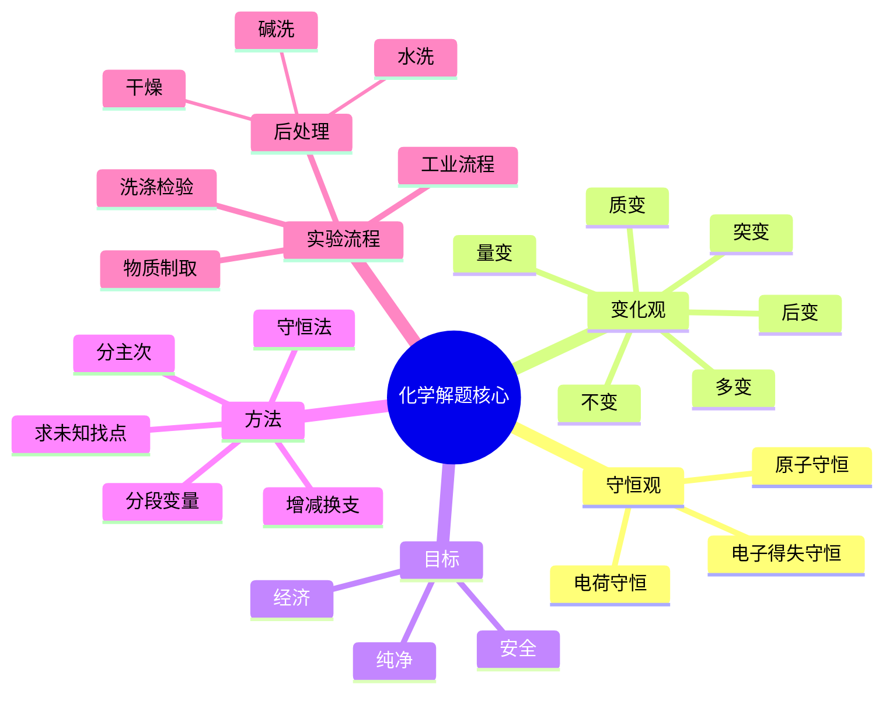

## 1. 化学做题总原则（优先检查有无遗漏，错的多想几种可能）

- 化学题要有"透过现象看本质"的意识，每做完一步都要回头检查有没有遗漏。
- **一、守恒观**：原子守恒、电荷守恒、电子得失守恒。
  - 方程式 → 1. 判断正误；2. 书写。
  - 实验现象 → 结论判断。
  - 计算 → 电子转移数、纯度。
  - 涉及化学变化时三种守恒要同时套用。
- **二、变化观**：质变、量变、多变、后变、不变、突变。反应前后要追踪这六种变化。
- **三、反应的本质是异性相吸**（微粒间相互作用）。
- **四、分离要关注性质的差异** → 同时写清"方法"和"结果"。
- **五、做物质：安全、经济、纯净**。
  - 1. 物质制取实验：考虑操作可行性。
  - 2. 工业流程：考虑成本、转化率、杂质控制。
- **六、事物的影响因素及变化有多个，要分主次**。
  - 1. 实验图像 → 分析。
  - 2. 多反应体系结果 → 分析。
  - 主次地位也能因时间或条件变化而变化。
- **七、价-类二维观** → 推测物质性质和变化。
- **八、两点法、全面、一分为二（正反）** → 用于工业流程中条件控制的原因分析。
- **九、定量实验**：转化率、准确度。
- **十、具体情况具体分析**，不能只套模板。
- **十一、同分异构体数目的关键：有序对称**。

### 解题方法（图 1 底部蓝/红字汇总）

- 解题：**增谁换谁、减谁判谁**；**求未知就找点**。
- 反应：找残基、分主次。
- 图像：明确坐标含义、趋势、拐点、终点。
- 多酸/多碱、分段变量、守恒法（处理复杂体系核心三招）。

<details class="md-source-page">
<summary>原图 · Chemistry 第 1 页</summary>
<figure class="md-source-page__figure">

<figcaption>Chemistry_1.pdf</figcaption>
</figure>
</details>

## 2. 思维革命：用观念解决问题

- **知识 → 理解 → 思维**，三者连成一体。
- **变**：质变、量变、多变、后变、不变、突变（与第 1 节呼应）。
- **安全、经济、纯净**始终是实验与流程题核心要求。
- **证据意识**：一定要干完（每条证据都要走到底）。
- **定量实验**：催化、推动是常见手段。
- **"有现象"不一定证实，"无现象"不一定证伪**。
- **增链、换链、减谁判谁**（与解题方法呼应）。
- 事物影响因素多方面化，**不正常的现象一定有外因起作用**。
- 价-类一维观或"一对一"对应关系要熟练运用。

### 电性、键与相互作用

- **成键与电性有关，断键与极性有关**。
- **催化剂改变电性**，让不易成键的粒子更容易成键或断键。
- 电子量达到一定范围会形成特殊物质或特殊状态。
- 看到化学键、离子键、分子间作用力、氢键等，要立刻联想其对**稳定性、沸点、溶解性、反应性**的影响。
- **"因力强所以弱"**：有时强相互作用反而会导致某一变化难以发生。

### 求 K、平衡与多反应体系

- 求 $K$ 或求拐点时，先判断变量关系和主次。
- **多反应体系计算 → 分段变量法**。
- 选择题或平衡题：
  - 先分离方法与结果。
  - 先看现象，再由反应实质解释。
  - 把大问题拆成小问题。
  - 第三类问题：找离子去推动反应进行。
- 离子交换膜题要关注**有序对称、接入、定一移一**等结构关系。

<details class="md-source-page">
<summary>原图 · Chemistry 第 2 页</summary>
<figure class="md-source-page__figure">

<figcaption>Chemistry_2.pdf</figcaption>
</figure>
</details>

## 3. 常见易漏点

- **① 正常的实验器材**：$x\ \mathrm{mL}$ 容量瓶常见规格 **50、100、250、500、1000 mL**；容量瓶不能用于反应或长期贮存。
- **② $\sigma$ 键、$\pi$ 键和杂化**：要**展开**结构式再判断。
  - 常见基团：$-OH$、$-CONH_2$、$-COOH$、$H_2C=NH_2$ 等。
  - 单键为 $\sigma$ 键，双键含 1 个 $\sigma$ 键 + 1 个 $\pi$ 键，故双键中 $\pi:\sigma=3:1$（含主链）需展开计数。
- **③ 单水解 / 双水解**：
  - 不彻底时写可逆 $\rightleftharpoons$。
  - 彻底时（双水解）用气体或沉淀符号推动：
    $$3HCO_3^-+Al^{3+}\rightarrow Al(OH)_3\downarrow+3CO_2\uparrow$$
  - 联想脱氧体系等类似反应。
- **④ 离子方程式**：注意氧化物、弱酸、反应前后都存在的沉淀或气体；漏写水、气体、沉淀符号会导致错误。例：$AgNO_3\cdot H_2O$ 等结晶水形式书写要规范。
- **漏 $Al(OH)_3$ 可**：在厨房（家用）、收集中（试液有局限）等场景容易遗漏。
- **⑤ 为酸或为碱时**：结合环境强弱判断，不要只看局部结构（一般情况、急性情况、熔融态都要考虑）。
- **⑥ 溶液为电性（酸/碱性）**：可能来自强碱，也可能来自弱酸根水解；要分清来源。
- **⑦ 不要忘记单键、孤对电子和配位键**（如 $P_4O_6$ 类结构）。
- **状态标注**：
  - 气体、沉淀、溶液符号要符合题意。
  - 例：$N\equiv N$ 写成路易斯结构应为 $:N\equiv N:$（标注孤对电子）。
  - 固体不一定标沉淀符号。
- **⑩ 装置题**：前面已经口/X 气流上设计也算结。
- **⑪ 蒸发浓缩 → 过滤、洗涤、干燥**（结晶常规步骤）。
  - 如果结晶？连接管 e.g. 玻砖以下 → 结晶。

### 装置与流程的"三可能"

装置或流程题要看：

1. **可能反应完？**
2. **可能没反应？**
3. **可能发生改变？**

<details class="md-source-page">
<summary>原图 · Chemistry 第 3 页</summary>
<figure class="md-source-page__figure">

<figcaption>Chemistry_3.pdf</figcaption>
</figure>
</details>

## 4. 溶液与守恒

- **① $pH=6$ 附近要注意**：酸碱性判断不能只看"6"，还要看温度和 $K_w$。例如 $100\ ^\circ C$ 时中性水的 $pH$ 可能 $<7$，此时 $pH=6$ 不一定是酸性。
- **⑤ 向 $AgNO_3$ 中滴 $NaCl$**（涉及银氯配合物）：
  $$[NO_3^-]=2[AgCl_2^-]+[AgCl]$$
  $$[Ag^+]=[AgCl_2^-]$$
  需要根据配合物、沉淀和剩余离子综合列守恒。
- **⑥ 同周期性质比较**：出现"比较所有元素"时，要确认周期、族和实际元素是否都在讨论范围内。
- 沸点：**$H_2O>HF$**。
  - 1 个 $H_2O$ 分子可形成 **4 个氢键**。
  - 1 个 $HF$ 分子通常形成 **2 个氢键**。
- **⑥ 物料守恒例** $Na_2CO_3$ ($0.2$) 与 $NaHCO_3$ ($0.3$) 混合：
  $$3c(Na^+)=5[c(CO_3^{2-})+c(HCO_3^-)+c(H_2CO_3)]$$
  具体系数依配比而定。
- **⑦ 含离子的体系**：将必加加用极强对原则恢复（即用最强守恒原则验证）。

### 氧化还原与电子结构

- $Q_c$ 与 $K$ 比较：若 $Q_c<K$，反应**正向进行**。
- 沸点比较要综合氢键数、分子间作用、相对分子质量。
- **不满足 8 电子稳定结构的常见元素**：
  - $H$ → 2 电子稳定。
  - $B$ → 常见 6 电子。
  - $P$ → 可能 10 电子或 8 电子（如 $PCl_5$ vs $PCl_3$）。
  - $S$ → 可扩展八隅体（10 电子、12 电子等，如 $SF_6$）。
  - 图中用红字把 $H$、$B$、$P$、$S$ 分成分支，提醒不要把"八电子稳定结构"当作所有主族元素的硬规则。
- **酸性条件下 $KMnO_4$ 氧化 $Na_2C_2O_4$**：
  $$5C_2O_4^{2-}+2MnO_4^-+16H^+\rightarrow10CO_2\uparrow+2Mn^{2+}+8H_2O$$
  $Mn$：$+7\rightarrow+2$；$C$：$+3\rightarrow+4$。
- 电负性与原子半径：
  - 同周期左→右：电负性增大。
  - 同主族上→下：电负性减小。
  - 稀有气体一般不参与普通电负性比较。
- 底部紫色示意图把 **第一电离能、熔沸点、氧化性** 放在一起比较：
  - 稀有气体 $He,Ne$ 第一电离能很高，不能简单并入普通同周期递变。
  - 第二周期常见异常要单独记：$Be>B$，$N>O$，本质来自全充满/半充满电子构型更稳定。
  - 氧化性通常随非金属性增强而增强，卤素方向要结合 $F_2,Cl_2,Br_2,I_2$ 的实际反应性与键能判断。

```
第二周期第一电离能与异常点
Li  <  B  <  Be  <  C  <  O  <  N  <  F  <  Ne
       ↑      ↑          ↑      ↑
       2p起填 2s全满      成对排斥 半充满稳定

稀有气体：He、Ne 第一电离能高；熔沸点比较看分子间作用与相对原子质量。
```
- 注意：原上易消去也是反应的一种途径。

<details class="md-source-page">
<summary>原图 · Chemistry 第 4 页</summary>
<figure class="md-source-page__figure">

<figcaption>Chemistry_4.pdf</figcaption>
</figure>
</details>

## 5. 分辨题清单（容易混淆的"名词对子"）

| 编号 | 容易混淆的概念 | 区分要点 |
| --- | --- | --- |
| ① | 溶质成分 / 溶液成分 / 溶质主要成分 | 三者外延不同，必须按题意写 |
| ② | 电子排布式 / 电子排布图 / 轨道表示式 | 用于判断元素构型 |
| | 外围电子排布式 / 最外层电子（数）/ 价层电子排布式 | 特征电子≠最外层 |
| ③ | 电子运动状态 / 电子空间运动状态 | 前者含自旋，后者不含 |
| ④ | 热化学方程式 / 燃烧的热化学方程式 | 注意状态和 $\Delta H$ |
| ⑤ | $K$ 的表达式 / 计算式 / "为"的写法 | 表达式写形式，计算式代入数 |
| ⑥ | "下列…合金"类 | 注意"最适合"——只选一个 |
| ⑦ | 某的同分异构体 / 同系物 / 同素异形体 | 三者完全不同 |
| ⑧ | 分子式 / 最简式（实验式）/ 结构式 / 结构简式 / 键线式 | 按题干要求写 |
| ⑨ | 空间构型（化学型）/ 球棍模型 | 描述对象不同 |
| ⑩ | 同分异构体 / 同系物 / 同素异形体 | 同 ⑦ |
| ⑪ | 化学键 / 氢键 / 共价键 / 极性键 / 非极性键 / 离子键 / 金属键 / 范德华力 | 不能混用 |
| ⑫ | 金属晶体 / 离子晶体 / 共价晶体 / 分子晶体 | 按结构粒子与作用力判断 |
| ⑬ | 转化率 / 平衡转化率 | 不能混淆 |
| ⑭ | 离子方程式 / 化学方程式 | 按题意书写 |
| ⑮ | 苯二酚 / 苯酚；乙二酸（草酸）/ 乙酸乙酯 | 名称易混 |
| ⑯ | 坩埚 / 蒸发皿；长颈漏斗 / 短颈漏斗；圆底烧瓶 / 平底烧瓶 / 蒸馏烧瓶 | 玻璃仪器名称 |
| ⑰ | 分液漏斗 / 恒压滴液漏斗 / 球形冷凝管 / 直形冷凝管 | 装置名称 |
| ⑱ | 溶质计 / 水结晶量 / 眼睛俯视或仰视 / 试管夹位置 / 橡皮塞放入试管内 | 实验操作细节 |

### 空间构型常见例

- 甲烷：正四面体。
- 乙烯：平面（六原子共面）。
- 苯：平面（十二原子共面）。

<details class="md-source-page">
<summary>原图 · Chemistry 第 5 页</summary>
<figure class="md-source-page__figure">

<figcaption>Chemistry_5.pdf</figcaption>
</figure>
</details>

## 6. 后处理与状态条件

- **① 后处理**：$CHCl_3\rightarrow P\rightarrow$ 易降解。
  - 前法：通水（除杂）。
  - 后法：先**碱洗除酸**，再**水洗除碱**，再**干燥**。
- **② 标况**：$0\ ^\circ C$、$101\ \mathrm{kPa}$。
- **燃烧热**：$25\ ^\circ C$、$101\ \mathrm{kPa}$，$CH_4$ 中 $C$ 和 $H$ 的氧化物均为稳定态（$CO_2$ 气态、$H_2O$ 液态）。
- **③ 酸碱滴定**：
  - 酚酞：终点**浅红色**（不写"红"或"粉"）。
  - 甲基橙：终点**橙色 / 橙黄色**。
- **23 滴定、分液漏斗 → 蒸馏**：使用前要润洗，读数注意视线。
- **24 进一步提纯**：重结晶；蒸馏与萃取分液适用场景不同。
- **25 混合溶剂**：$CH_2Cl_2$、$CHCl_3$、$CCl_4$ 常用于萃取或作有机相，要根据密度判断上层 / 下层。

### 仪器精度

| 仪器 | 精度 |
| --- | --- |
| 托盘天平 | $0.1\ \mathrm{g}$ |
| 酸碱滴定管 | $0.01\ \mathrm{mL}$ |
| 量筒 | $0.1\ \mathrm{mL}$ |
| 容量瓶 | $0.1\ \mathrm{mL}$ |

### V 末 / V 始读数

- **27 $V_\text{末}$**：
  - 液体 → $V_\text{末}\rightarrow V_\text{始}$（液面读数）。
  - $V_\text{末}\rightarrow$ 无气泡。
  - 导气：$V_\text{末}\rightarrow$ 反应后开始读取。
  - 滴定：$V_\text{末}\rightarrow V_\text{始}$。
- 注水后产生水蒸气，要区分气体体积和液体体积。

### 有机方程检查与验证

- 乙醇被水蒸气重整（书写常错）：
  $$CH_3CH_2OH+2H_2O\xrightarrow{\text{催化剂}}2CO_2+4H_2\uparrow$$
  这类方程要检查 $H$、$O$ 是否配平，并注意 $H_2O$ 是否参与。
- **关键提示**：$O$ 不止 $H_2O$ 中有（醇、醚、酮、酯等多种来源都要考虑）。
- 常见验证试剂：
  - 醛基：$[Ag(NH_3)_2]^+$（银镜反应）、新制 $Cu(OH)_2$（砖红色沉淀）。
  - 还原性糖：葡萄糖、麦芽糖。
  - 葡萄糖 $C_6H_{12}O_6$ 与淀粉 $(C_6H_{10}O_5)_n$ 要分清。
  - 实验用 $PbO$（剧毒）需注意安全。

<details class="md-source-page">
<summary>原图 · Chemistry 第 6 页</summary>
<figure class="md-source-page__figure">

<figcaption>Chemistry_6.pdf</figcaption>
</figure>
</details>

## 7. 热点和有机结构判断

- **上下求索**：原文可能不止一个写法，能写也要多写一个；但要判断是否重复或无关。
- **① 题目中 $T,P$ 选 'C' / 'D' 的原因**：分析时要列出"安全""经济""朝鲜（指代某条件）"等多角度。
- **② 能写也写一个**（避免漏分点）。
- $NaR$：**无晒板（无显色）**，故 $[NaR]$ 在某些显色反应中要特别说明。
- 分子间作用力包括**范德华力**和**氢键**。
- 加成反应要关注**不饱和键**。
- $Fe^{2+}$ 基态价电子排布：$3d^6$（注意是 $3d^6$ 而非 $3d^54s^1$）。
- **判断对错**："2 价侯式"类判断题：$Q\times$、$5\times$、$\checkmark$ 要逐项验证。
- $CrO_4^{2-}$ 与 $MnO_4^-$ 都是**四面体结构**（$CrCl_4$、$(CH_3)_4$ 等同样为四面体）。
- $HSO_3^-$ 或焦亚硫酸根结构：
  $$\left[O=\overset{\displaystyle O}{\underset{\displaystyle O}{S}}-OH\right]^-$$
  注意 $S\text{-}O$ 键和 $O\text{-}H$ 键的区别。
- **规范写法**：
  - "**滴入最后一滴**…"。
  - "**…变为**…色"。
  - "自身相对"（对照实验描述）。
  - "在**锥形瓶**中滴定"。
- 氢键个数与沸点：
  - 1 个 $H_2O$：**4 个**氢键。
  - 1 个 $HF$：**2 个**氢键。
  - 故 $H_2O>HF$（沸点）。
- 酸性强弱比较：结合**酸性、酸酐两侧、相邻基团诱导效应**。
- **$Cu(OH)_2$ 呈沉淀时为蓝色**；与氨水等形成 $[Cu(NH_3)_4]^{2+}$ 配合物时呈**深蓝色溶液**。
- **顺反异构**：

```
     R1        R2          R1       R3
       \      /              \     /
        C == C                C = C
       /      \              /     \
     R3        R4          R2       R4
        顺式 cis          反式 trans
```

- 双键两端相同取代基在同侧（cis）或异侧（trans）。
- 若两端取代基种类不满足条件（如同端有两个相同基团），则不存在顺反异构。
- 苯环、苯基不同处相同；丰富的子结构离子基有同种相似性也亦稳定。

<details class="md-source-page">
<summary>原图 · Chemistry 第 7 页</summary>
<figure class="md-source-page__figure">

<figcaption>Chemistry_7.pdf</figcaption>
</figure>
</details>

## 8. 计算类核心量

- **① 质量分数 $w$**：比例关系！e.g. 原物质 $MgN_2O_3$ 中各元素质量分数：
  $$w=\frac{\text{溶质质量}}{\text{溶液质量}}\times 100\%$$
  注意百分数和比例关系。
- **② $\Delta H$**：单位常为 $\mathrm{kJ/mol}$，**有 $\pm$ 数字**，别把符号忘了！一定要对应反应方程式的计量数。
- **③ 各种 $K$**：$K,\ K_x,\ K_p,\ K_a,\ K_b,\ K_h,\ K_{sp},\ K_w$ 要看题目指定。
  - **不要在不该算时硬算**！要表示就算，看到没有就算。
  - 用反应系数和浓度表达即可，倍数分文清晰。
- **④ 晶胞**：
  $$\rho=\frac{m}{V}=\frac{nM}{V\cdot N_A}=\frac{pM}{RT}$$
  单位 $\mathrm{pm}$、$\mathrm{cm}$ 等三个原子间距离要注意换算。
- **⑤ $Cu(OH)_2$ 在弱酸 $HA$ 中的溶解平衡**（联立法）：
  $$Cu(OH)_2(s)\rightleftharpoons Cu^{2+}+2OH^-\quad K_{sp}$$
  $$HA\rightleftharpoons H^+ + A^-\quad K_a$$
  $$H_2O\rightleftharpoons H^+ + OH^-\quad K_w$$
  最终组合为：
  $$Cu(OH)_2+2HA\rightleftharpoons Cu^{2+}+2A^-+2H_2O$$
  $$K=\frac{K_{sp}\cdot K_a^2}{K_w^2}$$

### 结果检查清单

- **你的结果是不是题目问的？**
- **空后有没有单位？** 常见单位：$\mathrm{kJ/mol}$、$\%$、$\mathrm{mol}$、$N_A$、$\mathrm{g/cm^3}$、$\mathrm{pm}$、$\mathrm{kPa}$。
- **单位换算？取整？**
- **有效数字、几位小数**要符合题意。

<details class="md-source-page">
<summary>原图 · Chemistry 第 8 页</summary>
<figure class="md-source-page__figure">

<figcaption>Chemistry_8.pdf</figcaption>
</figure>
</details>

## 9. 重要反应与条件

- **① 氧化反应（含 $O$ 的）**：
  - 常见氧化剂：$O_2$、$HClO$、$Cl_2$。
  - 注意"附址（位置）与之反应"和"排空气"操作。
  - 常见被氧化对象：$Mn^{2+}$、$S^{2-}$、$SO_2$、$NO$、$I^-$、$Fe^{2+}$、$Na_2SO_3$ 等。
- **② 与高锰酸根反应** → 高价态保留，e.g. 高锰酸钾 → $AgCl_2$（视具体反应）。
- **高锰酸根氧化时要看环境**：
  - 酸性 → 还原为 $Mn^{2+}$。
  - 中性 / 弱碱性 → 生成 $MnO_2$。
  - 强碱性 → 生成 $MnO_4^{2-}$。
- **③ 金属离子反应**：
  - 常见现象：沉淀、氧化、显色。
  - 要结合溶液酸碱性、水解程度和络合反应。
- **④ 含氧体系**：溶液、固体、酸、碱、不会电离、氧化、还原、电解都要分场景讨论。
- **⑤ 温度影响**：
  - $H_2O_2$ 受热易分解、变色。
  - 各种 $K$（$K_w,\ K_a,\ K_b,\ K_{sp}$）随温度变化。
  - 催化剂可加速 / 减慢、不改变平衡常数。
  - 受热水解、受热分解要分清。
  - 全转化为分解 / 蒸发 / 状态改变 / 气化 / 变量都要考虑。
- **⑥ 催化剂**：考虑因素包括 $pH$、$T$、浓度。
- **⑦ 阶段控温**：
  - 沉淀降解 → 加热熔解 → 升温分解。
  - $T$ 太高易使产物分解或挥发。
- **空间位阻和取代基定位效应**会影响有机反应位置与速率。
- **晶体与水**：
  - 结晶水合物加热失水。
  - 小于 / 大于特定温度时水合物稳定性不同。
  - 多孔结构可吸附水或气体。
- 注意分批加少量酸 / 碱以控制反应剧烈程度。

<details class="md-source-page">
<summary>原图 · Chemistry 第 9 页</summary>
<figure class="md-source-page__figure">

<figcaption>Chemistry_9.pdf</figcaption>
</figure>
</details>

## 10. 冰水浴、反应速率与分离

- **① 控温（冰水浴 / 冷水浴）**：
  - 考虑保温、保温物（试管控温）。
  - 防止某物受高温熔化 / 分解。
  - 控制反应速率，防止副反应。
  - 控制放热。
  - 促进晶体析出、提高产物纯度。
  - 减少挥发。
- **② 反应速率影响因素**：
  - 反应物隔离、降解、温度。
  - 升温→副反应、容器中易产生杂质或产物被异化。
  - 温度升高一般速率增大。
  - 催化剂降低活化能。
  - 浓度、压强、接触面积都会影响速率。
- **③ 产率相关**：
  - 制得物质要稳定，防止后续水解、副反应。
  - 及时分离产物可推动平衡。

### 趁热过滤 / 重结晶 / 洗涤

- **后续 $T$ 控制**：
  1. 让产生晶体析出。
  2. 不利于晶体生长 → 用于过滤掉杂质。
  - $T$ 完后：$V_\text{末}$ → 避免亲水溶物；$V_\text{末}$ → 改善冷却以防止凝固。
- **趁热过滤**：防止晶体提前析出，除去不溶性杂质。
- **重结晶**：利用溶解度随温度变化不同；常见步骤：**溶解、热过滤、冷却结晶、过滤、洗涤、干燥**。
- **洗涤**：
  - 冷水 / 冰水洗去可溶性杂质。
  - 有机溶剂洗涤可除有机杂质或减少产品溶解损失。

### 定量实验中的体积

- 多体积变化要用体积移动规律。
- 例：注水后产生水蒸气，要区分气体体积和液体体积。
- 反应中较高浓度的物质先反应、先消耗。

### pH 与沉淀（重要的 pH=9 分界）

| pH 范围 | 现象 |
| --- | --- |
| $pH>9$ | $Mg^{2+}\rightarrow Mg(OH)_2$，$Mn(H_2PO_4)_2\rightarrow Mg_2PO_4$ 类沉淀 |
| $pH<9$ | $PHCl,\ PO_4^{3-},\ SO_4^{2-}$ 等可能水解 |
| $pH<9$ | $Mg,\ MnH_2,\ Mn$ 类不形成氢氧化物 |

- **分批加入 $HNO_3$**：防止反应过激或剧烈，避免酸引入杂质 / 变质。

<details class="md-source-page">
<summary>原图 · Chemistry 第 10 页</summary>
<figure class="md-source-page__figure">

<figcaption>Chemistry_10.pdf</figcaption>
</figure>
</details>

## 11. 实验流程与洗涤检验

- **① 萃取剂**：使其溶液完全溶解目标物，得到清液。
- **② 滤液（过滤）**：分离液固，可使更彻底，便于干燥。
- **③ 互溶液体蒸馏**：e.g. 水、乙醇互溶体系，直接萃取再分离可能形成共沸物，需要根据沸点差处理。
- **加少量水**（如浓 $H_2SO_4$ 稀释时**应酸入水**）：主要由稀释放热的能量决定操作顺序。
- **加少量 $H_2SO_4$**：注意强酸性、强氧化性、强脱水性（有机的高级反应中可能使有机物炭化），加入时需控制温度和顺序。

### 工艺流程：选用与滤渣

- **沉淀剂选用**：
  - 例：$F^-$ 沉淀 $Ca^{2+}/Mg^{2+}$；$S^{2-}$ 沉淀 $Cu^{2+}$ 等。
  - 不能引入新的干扰离子。
  - 应使目标离子沉淀完全。
- **滤渣（不溶或难反应物）**：$SO_2$、$MnO_2$、$S$、$PbSO_4$ 等可能成为滤渣。
- **滤渣处理**：不与硫酸反应的物质，可能形成或不形成滤液（要灵活运用，不要套一份固定答案）。
- **沉淀剂选择原则**：成本低、易分离；过滤的不溶杂质要少且能控制。

### 洗涤沉淀

- 在过滤器中加少量水，浸没沉淀；待水自然流下；重复 **2–3** 次。
- **洗涤液可选**：（冷）水、稀盐酸（或不干扰的酸）、结晶水、有机溶剂 → 看目标物与杂质溶解度。
- **干燥**：得到品质好的晶体 / 产品。

### 洗涤目的

- 除去可溶性杂质。
- 减少产物损失。
- 保持晶体或沉淀纯度。

### 检验洗涤是否干净

- 取**最后一次洗涤液**。
- 加合适试剂检验杂质离子。
- 若无沉淀、无颜色变化或无特征反应，说明洗涤较充分。

### 常用检验

| 待检 | 试剂与现象 |
| --- | --- |
| $Cl^-$ | $AgNO_3$ + 稀 $HNO_3$ → 白色沉淀（不溶于稀 $HNO_3$）|
| $Cl^-$ 与浓酸 | 浓 $H_2SO_4$ 反应放 $HCl$ |
| $SO_4^{2-}$ | 加 $BaCl_2$ + 稀 $HCl$ → 白色沉淀 |
| $SO_2$ | 使品红褪色，加热（$\Delta$）后红色恢复 |
| $Br^-$ | 用 $HNO_3$ 酸化后加 $AgNO_3$ → 浅黄色 $AgBr$ 沉淀 |
| $NH_4^+$ / 水解产物 | 加 $NaOH$ 加热 → $NH_3\uparrow$，用**湿润的红色石蕊试纸**检验（变蓝）|
| $Na_2SiO_3$ | 与酸反应生成硅酸胶体或沉淀 |

### 思维导图



> **关于图像清晰度**：图 4 底部 He–O–N₂–He 类电荷分布示意图、图 7 中部"2 价侯式"判断符号、图 9 底部"沉淀降解"流程箭头、图 10 顶部"考虑要保温"小字处字迹较潦草，已按上下文最合理解读补入；图 2 中段"力位是这个材料力了稳定"与图 7 顶部红字"能分写就分写但最多写 3 个"已尽量还原原意。如需精确还原可对照原图复核。

<details class="md-source-page">
<summary>原图 · Chemistry 第 11 页</summary>
<figure class="md-source-page__figure">

<figcaption>Chemistry_11.pdf</figcaption>
</figure>
</details>
