## 1. 审题与总策略

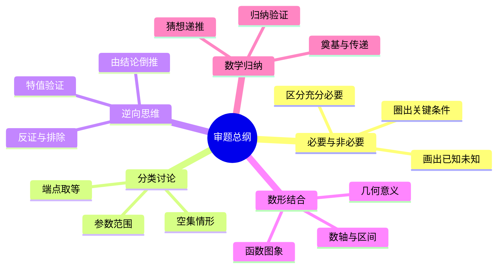
```mermaid
mindmap
  root((审题总纲))
    必要与非必要
      圈出关键条件
      区分充分必要
      画出已知未知
    分类讨论
      参数范围
      端点取等
      空集情形
    逆向思维
      由结论倒推
      反证与排除
      特值验证
    数形结合
      函数图象
      几何意义
      数轴与区间
    数学归纳
      猜想递推
      归纳验证
      奠基与传递
```

- 拿到题先审题：圈出"必要"与"非必要"条件，把已知量、未知量、隐含条件分别列清楚。
- 重要题要多次回看题干，避免漏读"非负""整数""恰好"等关键限定词。
- 分类讨论要看清动参数 / 动点的范围，尤其端点取等、空集、判别式为零等边界情形。
- 逆向求解：先从答案或结论倒推。结论常隐藏"左闭右开""至少一个""存在唯一"等限定，要据此判断条件强弱。
- 数形结合：零点问题、根的分布、不等式恒成立都可以画图，函数图象 + 几何意义往往直接给答案。
- 数学归纳：先找规律 → 提出猜想 → 用 $n=k$ 推 $n=k+1$，要写清奠基。
- 常见小题套路：特殊值代入、排除法、反证假设、猜周期 / 猜根、对称代换。

### 常用小操作

- 三大基本功：通分、因式分解、先换元后整理（"先元后式"）。
- 换元法：复杂组合式 → 设新变量；三角式 → 三角换元 $x=\sin\theta$ / $x=\tan\theta$。
- 放缩法：用于不等式、数列估计、函数极值范围；常用 $\dfrac{1}{n^2}<\dfrac{1}{n(n-1)}$ 等。
- 同构法：把不等式两边凑成相同结构，例如对数指数同构
  $$
  e^x+x>e^a+a \iff f(x)>f(a),\quad f(t)=e^t+t
  $$
- 构造法：构造函数、构造直线、构造齐次式、构造对偶式。
- 代入与赋值：特殊值、特殊点、坐标代入快速排除选项。
- 建系坐标化：几何题难以纯几何处理时建立坐标系。
- 设而不求：把未知常数、未知角设出来，用韦达定理或方程组消元。
- 割补法：立体几何中通过补形或分割来求体积、表面积。
- 升降维：空间问题降到平面、平面问题升到向量 / 复数。
- 数列分段：按奇偶或模数分段处理，例如
  $$
  \begin{cases}
  a_{2n-1}=1-\dfrac{1}{p}, & n\ \text{为奇数}\\[4pt]
  a_{2n}=\dfrac{1}{3}-\dfrac{2}{p}, & n\ \text{为偶数}
  \end{cases}
  $$
  分子列分别处理后再合并求 $S_n$。
- 同构提示：求 $x\ln a$ 这类表达式，可用
  $$
  x\ln a=1 \iff \ln a^x=1 \iff a^x=e
  $$
  化简为指数同构形式。
- **检查习惯**：交卷前留 5 分钟，公式、数据、结论三项都过一遍；尤其检查符号、单位、定义域。

<details class="md-source-page">
<summary>原图 · Maths 第 1 页</summary>
<figure class="md-source-page__figure">

<figcaption>Maths_1.pdf</figcaption>
</figure>
</details>

## 2. 化简与不等式拆解

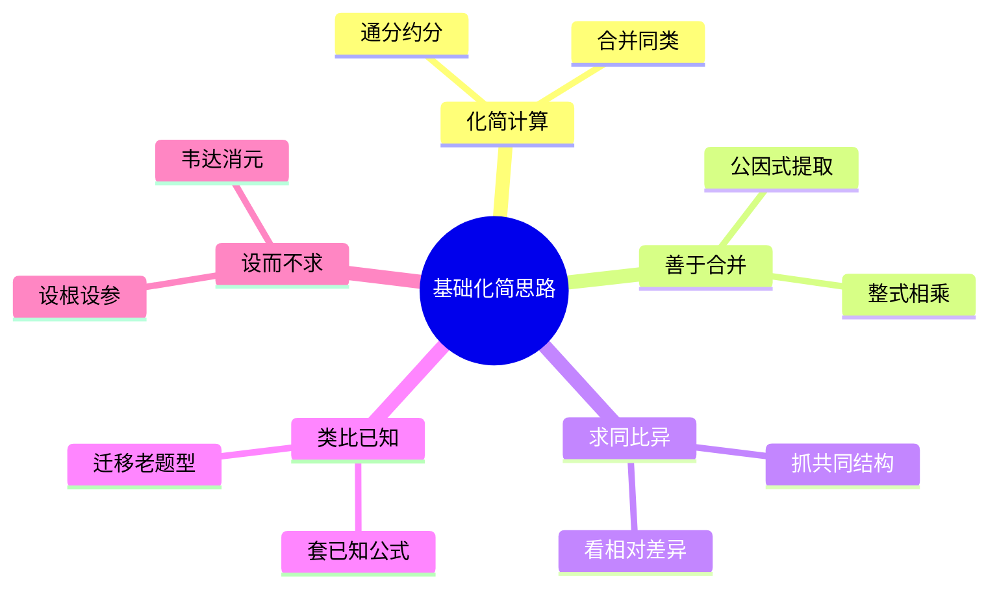
```mermaid
mindmap
  root((基础化简思路))
    化简计算
      通分约分
      合并同类
    善于合并
      公因式提取
      整式相乘
    求同比异
      抓共同结构
      看相对差异
    类比已知
      套已知公式
      迁移老题型
    设而不求
      设根设参
      韦达消元
```

- 化简前先看：能不能合并、能不能求同比异、能不能与已知式类比；优先用 **设而不求**。
- 不等式拆解常用 "齐证"，把要证目标化为乘积或差的符号判断：
  $$
  b<a<c \iff (a-b)(a-c)<0
  $$
- 自设范围：当对称未指定时不妨设 $x_1<x_2$，区间也可缩小到 $[0,1]$ 等便于讨论。
- 数字化：抽象参数难处理时，先代特殊数（如 $a=1,2,\tfrac12$）观察规律再推广。
- 对称设法：已知 $a+b=4$ 时，可设
  $$
  a=2-t,\qquad b=2+t,\quad t\in\mathbb R
  $$
  把双变量问题转为单变量。
- 几何中边长—面积传递关系：相似比 $k$ → 面积比 $k^2$；同底高比 → 面积比即高比。例如同一图形中
  $$
  S_{\triangle ACD}=2\,S_{\triangle ACB}=4\,S_{\triangle OAB}
  $$
  这种比例链在中点弦、三角形重心问题中很常见。
- 几何题"无图自画图"：先按条件估计图的大致形状（位置、共线、夹角范围），再画准确图，避免凭空想象。

### 数列、递推与求导

- 递推题先识别通项关系，将递推式整理到 **同一下标**，再考察可否裂项 / 累乘 / 累加。
- 累乘技巧：若 $(2n+1)\,a_n=(2n-1)\,a_{n-1}$，则
  $$
  a_n=\frac{2n-1}{2n+1}\,a_{n-1}
  $$
  逐项相乘消去中间项：
  $$
  a_n=\frac{1}{2n+1}\cdot\frac{2\cdot 1+1}{1}\,a_1=\frac{3a_1}{2n+1}
  $$
  套路是 **配对、消去、留头尾**。
- 裂项与配方混合（恒等变形提防点）：
  $$
  \frac{4n^2}{(2n-1)(2n+1)}=1+\frac{1}{2(2n-1)}-\frac{1}{2(2n+1)}\cdot(-1)\;\Rightarrow\;1+\frac{1}{2}\!\left(\frac{1}{2n-1}+\frac{1}{2n+1}\right)
  $$
  整理后做和直接望远镜消去（telescoping）。
- 隐含 $t$ 的求解：遇到形如
  $$
  \frac{y_1-t}{x_1-4}+\frac{y_2-t}{x_2-4}+\frac{2t}{3}=4
  $$
  先把含 $t$ 的项合并，再判断 $t$ 的系数能否化零：若系数为 0 → $t$ 可取任意值（恒等）；否则解出唯一 $t$。
- 复杂函数求导一般化技巧：若
  $$
  f(x)=\sqrt{\frac{(x+4)^5}{x^4}}=\frac{(x+4)^{5/2}}{x^2}
  $$
  直接求导易错。设广义函数 $g(x)=\dfrac{(x+4)^5}{x^p}$，对 $g$ 求导：
  $$
  g'(x)=\frac{x^p\cdot 5(x+4)^4 - p\,x^{p-1}(x+4)^5}{x^{2p}}=\frac{(x+4)^4\bigl[(5-p)x-4p\bigr]}{x^{p+1}}
  $$
  通过对 $p$ 取值讨论单调性与临界点（取 $p=2$ 即得原 $f$ 的导数），避免硬算。
- 求导后单调性 / 极值的判断流程：分子分母分别因式分解 → 找零点 → 数轴标符号 → 写区间。

<details class="md-source-page">
<summary>原图 · Maths 第 2 页</summary>
<figure class="md-source-page__figure">

<figcaption>Maths_2.pdf</figcaption>
</figure>
</details>

## 3. 集合与分类讨论

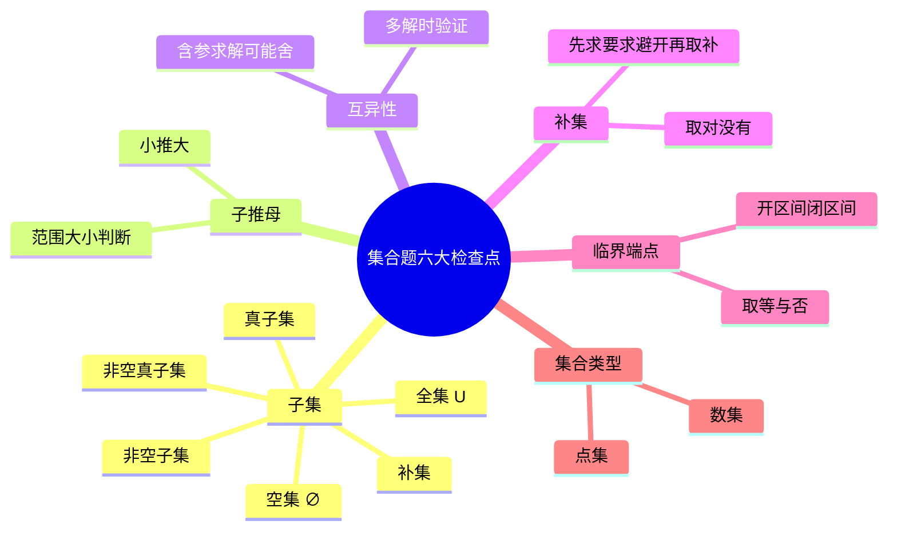
```mermaid
mindmap
  root((集合题六大检查点))
    子集
      真子集
      空集 ∅
      全集 U
      补集
      非空子集
      非空真子集
    子推母
      小推大
      范围大小判断
    互异性
      含参求解可能舍
      多解时验证
    补集
      取对没有
      先求要求避开再取补
    临界端点
      取等与否
      开区间闭区间
    集合类型
      点集
      数集
```

- 集合题先分类型再做题：**子集 / 真子集 / 空集 / 全集 / 补集 / 非空子集 / 非空真子集**。
- "子推母"：小集合是大集合的子集，得到 $p\Rightarrow q$，对应 **范围 $p$ 小、$q$ 大**。
- 互异性：集合元素必须两两不同，含参数时求出的解要回代检验是否引起重复，重复则舍。
- 补集：取对集 / 找出 "不满足" 的元素再取补，"先求要求避开 再取补集" 通常比正面求更方便。
- 临界端点：始终判断 $\le$ 还是 $<$；端点取不取关系到答案的开闭。
- 集合类型判断：点集（坐标对 $(x,y)$）和数集（实数集合）不要混淆，运算规则不同。

### 不等式（求参范围）

- **取等条件**：求参时尽量（有时必须）求出 "等号能否取到"；特别是连用 $\ge,\le$ 时要逐个验证。
- **符号方向**：公式不能记反，例如不等式两边乘以负数要变号；开根、平方都要保号。

### 三角函数

- 审清式子：是 $\sin\alpha,\cos\alpha,\tan\alpha$，还是 $\sin 2\omega x$ / $\sin(\omega x+\varphi)$。
- 符号与方向：诱导公式如
  $$
  \sin\!\left(\alpha-\tfrac{\pi}{2}\right)=-\cos\alpha,\qquad
  \cos\!\left(\alpha+\tfrac{\pi}{2}\right)=-\sin\alpha
  $$
- 概念辨析：象限角、终边相同的角、参考角、负象限角；象限决定符号。
- 容易遗漏的周期：
  $$
  T_{\sin\omega x}=\frac{2\pi}{|\omega|},\quad T_{|\sin\omega x|}=\frac{\pi}{|\omega|},\quad T_{\tan\omega x}=\frac{\pi}{|\omega|}
  $$
- 反三角值：$\arcsin$ 主值在 $[-\tfrac\pi2,\tfrac\pi2]$，$\arccos$ 主值在 $[0,\pi]$，要分清。
- 复合函数示例：
  $$
  f(x)=|\sin x|+\cos x
  $$
  周期 $T=2\pi$（绝对值改变了 $\sin$ 周期，但 $\cos$ 仍是 $2\pi$，整体仍 $2\pi$）；最大值 = 1（不是 $\sqrt 2$，因 $|\sin|$ 与 $\cos$ 同时取最大不能实现）。
- 题目图像常出现复合束，建议先画 $|\sin x|$、再叠加 $\cos x$。

### 向量

- 零向量、共线（平行）向量、投影与投影向量、$\vec a$ 方向上的单位向量 $\dfrac{\vec a}{|\vec a|}$ 等基本量要清。
- 向量 **无消去律**、**有结合律**：
  $$
  \vec a\cdot \vec b=\vec a\cdot \vec c \;\not\Rightarrow\; \vec b=\vec c
  $$
  必须移项化为 $\vec a\cdot(\vec b-\vec c)=0$，只能得 $\vec a\perp(\vec b-\vec c)$。
- 作图要直观、几何法优先；符号与方向（夹角是锐 / 钝 / 直）不能马虎。

### 复数

- 辐角主值通常规定在 $(-\pi,\pi]$；模 $|z|=\sqrt{a^2+b^2}$。
- 虚部 **不含** $\mathrm i$：$z=a+b\mathrm i$ 的虚部是 $b$，不是 $b\mathrm i$。
- 基本关系 $\mathrm i^2=-1$，$\mathrm i^3=-\mathrm i$，$\mathrm i^4=1$（每 4 次循环）。
- 几何意义：$|z_1-z_2|$ 是两点距离；$\arg z$ 是与正实轴的有向夹角。

<details class="md-source-page">
<summary>原图 · Maths 第 3 页</summary>
<figure class="md-source-page__figure">

<figcaption>Maths_3.pdf</figcaption>
</figure>
</details>

## 4. 立体几何

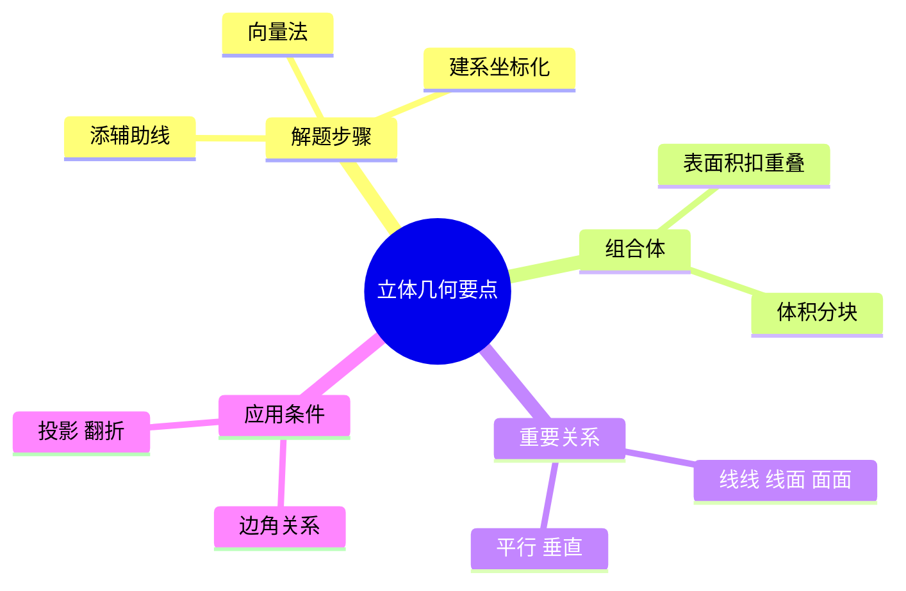
```mermaid
mindmap
  root((立体几何要点))
    解题步骤
      添辅助线
      建系坐标化
      向量法
    组合体
      表面积扣重叠
      体积分块
    重要关系
      线线 线面 面面
      平行 垂直
    应用条件
      边角关系
      投影 翻折
```

- 立体几何常用步骤：
  1. **添加辅助线 / 建系**：草图也要让线、面、空间关系清楚；建立空间坐标系时尽量让多个棱与坐标轴重合，原点选垂足或顶点。
  2. **基本法选择**：综合几何法、向量法、坐标法；垂直关系优先用向量。
  3. **组合体表面积**：重叠、重复、遮盖部分要扣除；分块再求和。
  4. **应用条件**：尤其是边角关系、垂直关系、平行关系，写出 "由...得..."。
- 翻折问题：折前折后 **不变量**（同一图形上不动的边、不动的角）和 **变量**（折起来后产生的二面角）要分清。

### 数列

- 项数配对：注意 $n=1,\ n\ge 2$ 等起始条件，分段验证 $a_1$ 是否符合通项。
- 由 $S_n$ 求 $a_n$ 公式：
  $$
  a_n=\begin{cases}
  S_1, & n=1\\
  S_n-S_{n-1}, & n\ge 2
  \end{cases}
  $$
  最后必须验证 $a_1$ 是否满足 $n\ge 2$ 的通项，不一致就要写分段。
- 求 $S_n$ 时常用：列项相消、分组求和（按奇偶 / 按段拆分）、错位相减、倒序相加。
- 正负交错（如 $(-1)^n a_n$）、相邻奇偶项分开列式。
- 等比数列示例：若 $a_3=2,\ a_5=8$，则
  $$
  a_4^2=a_3\,a_5=16\;\Rightarrow\;a_4=\pm 4
  $$
  要分公比正负讨论；红字提醒 "$\pm$ 都要写出"，不能只取正。

### 概率与排列组合

- 先看是否 **等可能**：古典概型 / 几何概型先判断。
- "大分类 → 小分类"：先按类别拆，再在类内做排列组合，最后求和。
- 二项式定理通项：
  $$
  T_{k+1}=\binom{n}{k} a^{n-k}b^{k},\qquad k=0,1,2,\ldots,n
  $$
- 相互独立要先验证，不能凭感觉。常见关系：
  $$
  P(B\mid A)+P(\bar B\mid A)=1
  $$
  但
  $$
  P(B\mid A)+P(B\mid \bar A)\ne 1\ \text{(一般不成立)}
  $$
- 全概率公式（条件概率链合并）：
  $$
  P(B)=P(A)P(B\mid A)+P(\bar A)P(B\mid \bar A)
  $$
  贝叶斯反推：
  $$
  P(A\mid B)=\dfrac{P(A)P(B\mid A)}{P(B)}
  $$
  不要混淆条件概率与全概率。

### 函数与圆锥曲线

- 函数题先 **画草图**：抓重点（极值点、零点、渐近线、拐点）和特殊点；单调区间、零点个数、对称区间要明确。
- **定义域** 第一步定下来：分段函数还要看每段适用区间，分界点处值是否相等 / 取不取等。
- 含参二次：二次项系数为 0 时退化为一次，要单独讨论；$a=0$ 是常见漏点。
- 圆 / 圆锥曲线：
  - 直线与曲线交点先讨论 **相切 / 相交两点 / 相离 / 一公共点**。
  - 端点、焦点、顶点、坐标都要标清。
  - 抛物线 $y=ax^2$ 与 $x^2=\dfrac{1}{a}\cdot y$ 之间的对应：开口、$\dfrac{1}{4a}$ 是焦准距（焦点到顶点 = $\dfrac{1}{4a}$）。
  - 计算前先 **猜测结论**（特殊位置代入）再证明，避免只算局部。
- 圆锥曲线常用结论：
  - 抛物线 $y^2=2px$ 焦点弦长 $|AB|=x_1+x_2+p$；
  - 椭圆 $\dfrac{x^2}{a^2}+\dfrac{y^2}{b^2}=1$ 通径 $=\dfrac{2b^2}{a}$，焦半径 $r_1+r_2=2a$；
  - 双曲线 $|r_1-r_2|=2a$；
  - 准线垂距等关系要熟。

<details class="md-source-page">
<summary>原图 · Maths 第 4 页</summary>
<figure class="md-source-page__figure">

<figcaption>Maths_4.pdf</figcaption>
</figure>
</details>

## 5. 解析几何总览

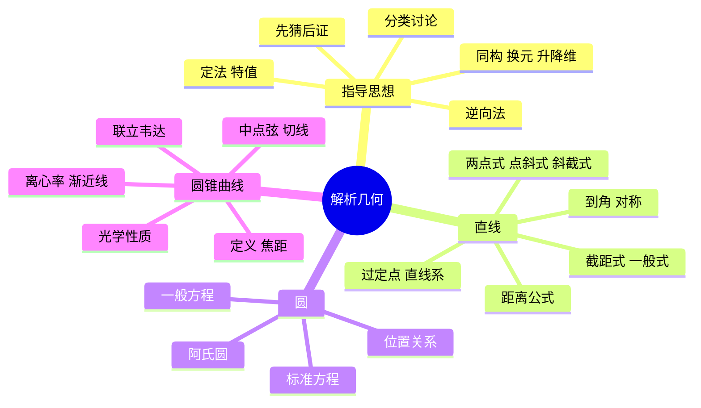
```mermaid
mindmap
  root((解析几何))
    指导思想
      分类讨论
      先猜后证
      逆向法
      同构 换元 升降维
      定法 特值
    直线
      两点式 点斜式 斜截式
      截距式 一般式
      过定点 直线系
      距离公式
      到角 对称
    圆
      标准方程
      一般方程
      阿氏圆
      位置关系
    圆锥曲线
      定义 焦距
      离心率 渐近线
      中点弦 切线
      联立韦达
      光学性质
```

- 指导思想：
  - **分类讨论**：例如直线 $k$ 存在与否、直线与双曲线交点在同支或异支。
  - **先猜后证**（对称、特值、极限）。
  - 辅助方法：逆向法、同构、换元、升降维、定法 / 特值代入。

### 直线

- 直线确定方式：
  - 两点确定一条直线；
  - 一点 + 方向（方向向量 / 倾斜角 / 斜率）确定直线。
- 常见限制（容易遗漏）：
  - $\perp x$ 轴时斜率不存在；
  - 当涉及到 "斜率 $k$ 在右支" 时要单独讨论 $k=0$ 或 $k$ 不存在。
- 直线方程五形式（适用条件不同）：

  | 形式 | 方程 | 限制 |
  | --- | --- | --- |
  | 点斜式 | $y-y_0=k(x-x_0)$ | $k$ 存在 |
  | 斜截式 | $y=kx+b$ | $k$ 存在 |
  | 两点式 | $\dfrac{y-y_1}{y_2-y_1}=\dfrac{x-x_1}{x_2-x_1}$ | $x_1
e x_2,\ y_1
e y_2$ |
  | 截距式 | $\dfrac{x}{a}+\dfrac{y}{b}=1$ | $a,b
e 0$ |
  | 一般式 | $Ax+By+C=0$ | $A,B$ 不同时为 0 |

- 直线过定点：把方程化成点斜式，参数系数置 0；过定点的直线系是把含参方程整理为 "已知点 + 参数族"，注意 **不能表示** 的特殊直线（如过定点且垂直 $x$ 轴的那条）。
- 距离公式（变量含义不要混）：
  - 点到点：$d=\sqrt{(x_2-x_1)^2+(y_2-y_1)^2}$；
  - 点到线：$d=\dfrac{|Ax_0+By_0+C|}{\sqrt{A^2+B^2}}$；
  - 平行线间：$d=\dfrac{|C_1-C_2|}{\sqrt{A^2+B^2}}$；
  - 弦长 $\ell=\sqrt{1+k^2}\,|x_1-x_2|=\sqrt{1+\tfrac{1}{k^2}}\,|y_1-y_2|$。
- 到角 / 对称（中心对称、轴对称）：点关于点 / 线的对称坐标用中点公式 + 垂直条件求。

### 圆

- 标准方程 $(x-a)^2+(y-b)^2=r^2$；一般方程 $x^2+y^2+Dx+Ey+F=0$ 要满足
  $$
  D^2+E^2-4F>0
  $$
  才表示实圆，$=0$ 退化为点，$<0$ 无实图。
- 阿氏圆：到两定点 $P_1,P_2$ 距离比为常数 $\lambda\ne 1$ 的轨迹是圆：
  $$
  \dfrac{|PP_1|}{|PP_2|}=\lambda \;(\lambda\ne 1)
  $$
  圆心在 $P_1P_2$ 所在直线上，可用相似比 / 垂直确定圆心坐标。
- 位置关系：相交 / 切 / 离 用 **圆心距 $d$ 与 $r_1\pm r_2$ 比较** 判断。

### 圆锥曲线

- 三种定义都要记：
  - **第一定义**：到两焦点距离的 **和 / 差** 为定值（椭圆 / 双曲线）；
  - **第二定义**：到焦点距离与到准线距离的比为离心率 $e$（统一定义）；
  - **第三定义**：到两焦点连线的斜率乘积 $k_1k_2$ 为定值（椭圆 $-\dfrac{b^2}{a^2}$，双曲线 $\dfrac{b^2}{a^2}$）。
- 焦距、通径、焦准距、焦三角形、等轴共轭双曲线、旋转轴、轴面截形成圆锥曲线等几何特征要熟。
- 重要量：焦距 $2c$、通径 $\dfrac{2b^2}{a}$、离心率 $e=\dfrac{c}{a}$、双曲线渐近线 $y=\pm\dfrac{b}{a}x$。
- 切线 / 中点弦 / 切点弦：
  - 椭圆 $\dfrac{x^2}{a^2}+\dfrac{y^2}{b^2}=1$ 在点 $(x_0,y_0)$ 的切线 $\dfrac{xx_0}{a^2}+\dfrac{yy_0}{b^2}=1$；
  - 中点弦斜率公式（点差法）：椭圆中弦 $AB$ 中点 $(x_0,y_0)$，则 $k_{AB}=-\dfrac{b^2 x_0}{a^2 y_0}$。
- 联立技巧：直线与圆锥曲线联立 → 韦达定理给 $x_1+x_2,\ x_1x_2$ → 判别式 $\Delta>0$ 保证两交点 → 弦长 / 面积用 $|x_1-x_2|$ 表达。
- 光学性质：椭圆焦点反射 → 另一焦点；抛物线平行轴入射 → 过焦点反射；双曲线焦点反射 → 远焦点的反向延长线。

### 常用操作

- 设点设线、联立表达、非对称表达式（和积互化、配凑代换）。
- 参数方程：齐次化解双斜率 + 第二定义 ⇔ 极坐标方程。
- 定比点差、坐标互换、三角换元、交叉相乘。

### 常见轨迹

- 一点 → 定圆：到定点距离 = 定长 → 圆。
- 两点 → 椭圆 / 双曲线：到两定点距离和 / 差为定值。
- 一点 + 一直线（焦点 + 准线）→ 抛物线、椭圆、双曲线（统一定义，按 $e$ 区分）。

<details class="md-source-page">
<summary>原图 · Maths 第 5 页</summary>
<figure class="md-source-page__figure">

<figcaption>Maths_5.pdf</figcaption>
</figure>
</details>

## 6. 函数与方程根

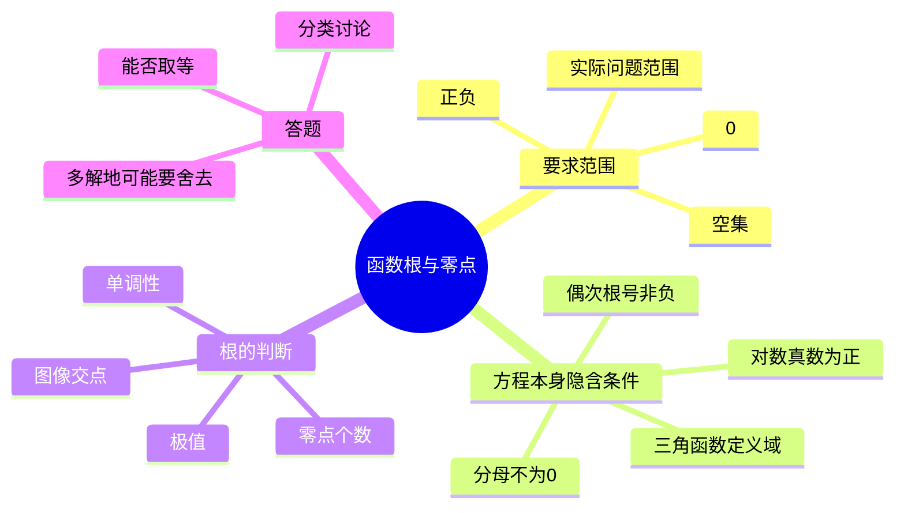
```mermaid
mindmap
  root((函数根与零点))
    要求范围
      0
      正负
      空集
      实际问题范围
    方程本身隐含条件
      分母不为0
      偶次根号非负
      对数真数为正
      三角函数定义域
    根的判断
      单调性
      极值
      零点个数
      图像交点
    答题
      能否取等
      分类讨论
      多解地可能要舍去
```

- 函数题容易漏掉的范围：$0$、正负、空集、实际问题范围。
- 方程本身隐含条件：
  - 分母 $f(x)\ne0$；
  - 偶次根号内非负；
  - 对数真数 $>0$；
  - 三角式中要排除无定义点（如 $\tan x$ 中 $x\ne\frac{\pi}{2}+k\pi$）。
- "取值范围"要看题目结论范围，而不只是代数变形后的范围。
- 单调性与极值：
  - 单调递增/递减可由导数符号判断；
  - 分段函数要分别看区间端点和连续性；
  - 交点个数等价于方程根的个数。
- 典型图像判断（图中画了三种典型情形）：
  ```
   y                y                 y
   |   /            |  *              | /\
   |  /             | / \             |/  \
   |─/────x         |/   \────x       /────\── x
   | /              /                 /
  ```
  分别对应"指数函数与直线相切""抛物线与直线相切""二次函数过两实根"。
- 例：若 $a>f(x)$ 对所有 $x$ 成立，则 $a>f_{\max}$；若 $a<f(x)$ 对所有 $x$ 成立，则 $a<f_{\min}$；
  - 若 $a>f(x)$ 在某 $x$ 上成立，则 $a>f_{\min}$；
  - 若 $a<f(x)$ 在某 $x$ 上成立，则 $a<f_{\max}$。
  四种"对所有/存在"要严格分清。
- 对带重根的函数，图中提醒：重根附近曲线可能"切过"或"穿过"。常用结论：偶次重根处图象 **穿不过**（与 $x$ 轴相切），奇次重根处 **穿过**。

### 答题与多解排查

- 答题时要从"能否取等、方程或不等式、是否同区间"三个方向检查。
- 绝对值不等式可用三角不等式：
  $$
  |f(x_1)-f(x_2)|\le |f(x_1)-f(0)|+|f(0)-f(x_2)|
  $$
  原图特别在 $x_1,x_2$ 同号或异号时分别讨论：异号时插入 $0$ 这个"中转点"，同号时直接拆。
- 多解题要画多个可能图像，检查"球内还是球面""曲线上还是曲线内"等几何含义。
- 图中列了圆锥图像、双曲线与切线等模型，提醒几何意义可能是 **"在区域内"**（不等式），而不是只有边界（方程）。

<details class="md-source-page">
<summary>原图 · Maths 第 6 页</summary>
<figure class="md-source-page__figure">

<figcaption>Maths_6.pdf</figcaption>
</figure>
</details>

## 7. 集合、不等式与三角函数

- 集合题：
  - 分类讨论、补集、逆向、端点最值边界；
  - 列举、描述、区间、图示（Venn 图或数轴）；
  - 互异性可通过“小田雅大图”式枚举避免漏解。
- 不等式题：
  - 分类讨论、补集逆向、端点最值边界；
  - 整体齐次、常数代换、特定系数；
  - 分而治之、判号法、构造同构；
  - 数形结合、几何图象、数学归纳、分离；
  - 判别式、单调性、向量、求同比异。
- 等式与方程题常用：
  - 满根、多项式除法、零针引线、序轴标根；
  - 指对互化；
  - 作差作商；
  - 对称性、同向同正、可乘方；
  - 双向糖水/辅助角/斜向量；
  - 注意函数值不等式与不等式链。

### 三角函数与式子整理

- 正定等与凑边系数：奇偶项可能不等，因分配而变化。
- 含参一元二次不等式与二次函数：
  - 能用判别式；
  - 要看开口方向；
  - 要看根的范围与端点。
- 三角函数常用：
  - 八卦图、五点法作图；
  - 一正一弦、正切线；
  - $\alpha$ 扩散不影响符号和极限；
  - 升降级、切法、角和差、高炮半坡、拿前一角等。
- 周期法和完整单集：
  - 平移法、找范围；
  - $k$ 不断取数或取交集；
  - 正弦余弦切线的单调区间、特殊角、符号、通分因方要统一。

<details class="md-source-page">
<summary>原图 · Maths 第 7 页</summary>
<figure class="md-source-page__figure">

<figcaption>Maths_7.pdf</figcaption>
</figure>
</details>

## 8. 三角、向量与复数

- 三角题：
  - 平移余弦、等同变道、互补角、诱导公式；
  - 对角、半角、张角公式、角的确定；
  - 分解：大角对大边、内角和、$a+b>c$、$a-b<c$；
  - 瓜叶结构：边与圆、三角最小角，图中提示可用
    $$
    R\sin\theta
    $$
    类关系。
- 向量题：
  - 投影向量、数量积、共线向量；
  - 共线定理、极化恒等式、等和线、定比分点；
  - 定义投影、极化、基底、题型转化。
- 复数题：
  - 去模公式、辐角主值；
  - 几何意义：代数基本定理、模数根题、三角形式。

原图旁注的公式清单：
- 同角与倍角：
  $$\sin^2x+\cos^2x=1,\qquad \tan x=\frac{\sin x}{\cos x}$$
  $$\sin2x=2\sin x\cos x,\qquad \cos2x=\cos^2x-\sin^2x=1-2\sin^2x=2\cos^2x-1$$
  $$\tan2x=\frac{2\tan x}{1-\tan^2x}$$
- 解三角形时先定角的范围，再由函数值确定角；大边对大角，三角形内角和与边长不等式要同时检查。
- 向量投影与数量积：
  $$\vec a\cdot\vec b=|\vec a||\vec b|\cos\theta,\qquad
  \operatorname{proj}_{\vec b}\vec a=\frac{\vec a\cdot\vec b}{|\vec b|^2}\vec b$$
  $$\vec a\cdot\vec b=\frac{|\vec a+\vec b|^2-|\vec a-\vec b|^2}{4}$$
  共线用 $\vec a=\lambda\vec b$，垂直用 $\vec a\cdot\vec b=0$。
- 复数：
  $$z=a+bi=r(\cos\theta+i\sin\theta),\qquad z\bar z=|z|^2$$
  乘除法看模长乘除和辐角加减；共轭复数关于实轴对称，方程根常转化为圆或直线的几何位置。

### 立体几何

- 分类讨论：数量向量、转化零点（穿针）、空间等角定理和无垂定理。
- 线面关系：
  - 斜二测、正等测；
  - 空间等角；
  - 交线痕迹、平行线、相交线；
  - 三视直观。
- 点线面综合：
  - 纳入平面；
  - 三正弦、三余弦；
  - 三垂线；
  - 垂点堵截。
- 空间角度：折叠相等、对称相等、垂面、汉堡；切入重线相交时要看半等、侧角。
- 圆锥、圆柱、球等题要结合平面截面、对称轴和截面圆。

<details class="md-source-page">
<summary>原图 · Maths 第 8 页</summary>
<figure class="md-source-page__figure">

<figcaption>Maths_8.pdf</figcaption>
</figure>
</details>

## 9. 数列、递推与导数清单

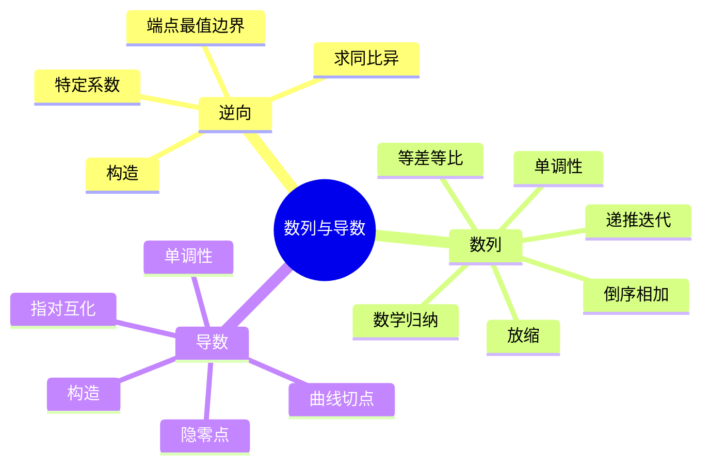
```mermaid
mindmap
  root((数列与导数))
    逆向
      端点最值边界
      求同比异
      特定系数
      构造
    数列
      单调性
      数学归纳
      放缩
      等差等比
      递推迭代
      倒序相加
    导数
      构造
      指对互化
      单调性
      曲线切点
      隐零点
```

- 分类讨论时继续强调“逆向、端点最值边界、求同比异、特定系数、构造”。
- 数列题要关注单调性、数学归纳、放缩、等差/等比结构。
- 累加、累乘、迭代常用“不动点推对比、不动点周期数列、特征根”来处理。
- 倒序相加或倒序相乘常出现在等差、等比、分组求和里。
- 斐波那契类递推可联想“倒序、组合求和、细次递推数列”的整理方法。
- 特殊数列要注意：
  - $q=1$、负数、公差 $d=0$ 等特殊情形；
  - $n=1$ 时整数、整点、有理无理、同构与有界导数；
  - 猜想与递推可能出现“数字对称”。

### 参数、函数与导数操作

- 列表图像解析式要关注“一对一、多对一、少于一”等映射关系。
- 单调函数与方程根：
  - 同增异减；
  - 偶增奇减与同偶异奇要分清；
  - 单调函数的反函数与复合函数要看定义域。
- 指数和对数题要特别注意“驻点不一定是极值点”，先判断是否有切点，再看是否有公切线。
- 导数常用清单：
  1. 构造：转为单调性解不等式，或用同构思想。
  2. 指对互化：指数式、对数式互化后再求导。
  3. 对数单调和极值找零点。
  4. 导数与不等式、数列递推结合。
  5. 放缩法与不等式链。
  6. 曲线切点和切线斜率。
  7. 分而治之、参数范围。
  8. 变换数列长度、递推放缩。
  9. 切线、边线、交缩、乘法拆分。
  10. 双变量、极值点偏移、对称值。
  11. 反剪法、每三段说明单调趋势。
  12. 曲线切点。
  13. 分而治之。
  14. 斜分相链。
  15. 极差较差。
  16. 控制旧范围或新范围。
  17. 绝交缩。
  18. 联想构图。

<details class="md-source-page">
<summary>原图 · Maths 第 9 页</summary>
<figure class="md-source-page__figure">

<figcaption>Maths_9.pdf</figcaption>
</figure>
</details>

## 10. 排列组合与概率

- 排列组合常用：
  - 排队、特殊位置、捆绑法；
  - 定序问题、等概率、隔板法；
  - 分类分步，避免重复和遗漏；
  - 染色问题要看同色、异色和重复次数；
  - 组合与排列区别：组合不管顺序，排列要管顺序。
- 计数题要先判断：
  1. 是否等可能；
  2. 是否互斥；
  3. 是否独立；
  4. 是否需要分组或分配；
  5. 是否有特殊元素、特殊位置或特殊顺序。
- 二项式定理要关注“通项、系数、常数项、奇偶项、二项系数与系数本身”的区别。
- 条件概率、全概率与独立性要分开：
  - 先列样本空间；
  - 再列事件；
  - 最后判断互斥、独立、条件限制。
- 古典概型、几何概型、条件概型、加乘法公式、概率和为 1、正态分布、超几何分布都要按题型区分。
- 统计量与概率模型：
  - 期望、方差、标准差；
  - 最有可能事件；
  - $n$ 定 $p$ 定，二项分布；
  - 对称与无限局要转化为“变量增减”或“二项分布”。

### 统计算法与线性回归

- 统计图表常见：条形图、折线图、饼图、茎叶图、频率分布直方图。
- 回归与相关：
  - 相关关系不等于因果关系；
  - 线性回归要看残差、相关系数；
  - 样本点不能随意删，除非题目明确异常点或要求剔除。
- 随机抽样包括简单随机抽样、系统抽样、分层抽样。
- 平均数、方差、标准差、频率、概率要区分。
- 算法题要看流程图、循环条件、变量初值和输出结果。

<details class="md-source-page">
<summary>原图 · Maths 第 10 页</summary>
<figure class="md-source-page__figure">

<figcaption>Maths_10.pdf</figcaption>
</figure>
</details>

## 11. 不等式性质与证明框架

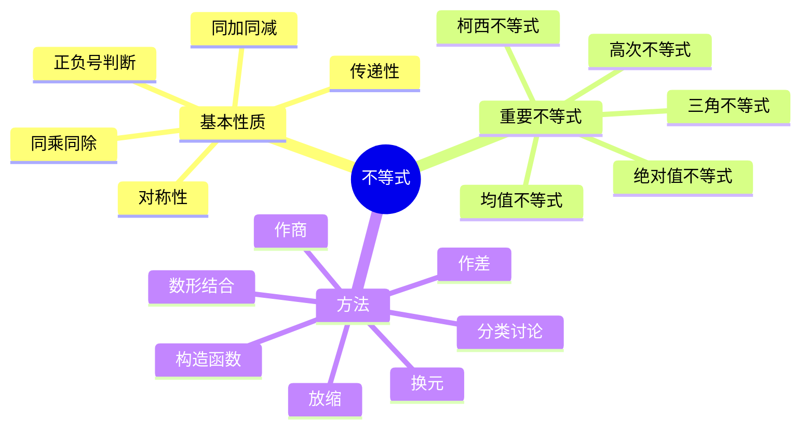
```mermaid
mindmap
  root((不等式))
    基本性质
      同加同减
      同乘同除
      正负号判断
      传递性
      对称性
    重要不等式
      均值不等式
      柯西不等式
      绝对值不等式
      三角不等式
      高次不等式
    方法
      作差
      作商
      构造函数
      放缩
      换元
      数形结合
      分类讨论
```

- 基本事实：
  $$
  a>b \Longleftrightarrow a-b>0
  $$
  这是不等式比较的底层依据。
- 重要不等式：
  $$
  a^2+b^2\ge 2ab
  $$
  $$
  \sqrt{ab}\le \frac{a+b}{2}\quad (a,b\ge0)
  $$
- 平均值链：
  $$
  H_n\le G_n\le A_n\le Q_n
  $$
  其中调和平均、几何平均、算术平均、平方平均要按条件使用。
- 基本性质清单（图中编号 ①–⑨）：
  1. 对称：$a>b\Leftrightarrow b<a$。
  2. 传递：$a>b,\ b>c\Rightarrow a>c$。
  3. 可加：$a>b\Rightarrow a+c>b+c$。
  4. 正数可乘：$a>b,\ c>0\Rightarrow ac>bc$。
  5. 负数可乘反号：$a>b,\ c<0\Rightarrow ac<bc$。
  6. 同向相加：$a>b,\ c>d\Rightarrow a+c>b+d$。
  7. 正同向相乘：$a>b>0,\ c>d>0\Rightarrow ac>bd$。
  8. 正可乘方：$a>b>0,\ n\in\mathbb{N}^*,n\ge2\Rightarrow a^n>b^n$。
  9. 正可开方：$a>b>0,\ n\in\mathbb{N}^*,n\ge2\Rightarrow \sqrt[n]{a}>\sqrt[n]{b}$。
  10. 倒数反号：$a>b>0\Rightarrow \dfrac1a<\dfrac1b$；$a<b<0$ 同理 $\dfrac1a>\dfrac1b$。
- 柯西不等式常见形式：
  $$
  \left(\sum_{i=1}^n a_i^2\right)\left(\sum_{i=1}^n b_i^2\right)
  \ge \left(\sum_{i=1}^n a_i b_i\right)^2
  $$
- Jensen/凸性思路：
  $$
  f\!\left(\frac{\sum x_i}{n}\right)\le \frac{\sum f(x_i)}{n}
  $$
  使用时要先确认凸凹性和权重条件。

### 常用重要不等式

- 绝对值不等式：
  $$
  ||a|-|b||\le |a-b|\le |a|+|b|
  $$
- 三角函数基本不等式：
  $$
  \sin x<x<\tan x,\qquad x\in\left(0,\frac{\pi}{2}\right)
  $$
- 对数与指数常用：
  $$
  1-\frac1x\le \ln x\le x-1,\qquad x>0
  $$
  $$
  e^{2x}>x^2+2x+1
  $$
- 处理高次不等式可用：
  - 因式分解（穿根法/数轴标根）：化为 $(x-x_1)(x-x_2)\cdots(x-x_n)>0$ 后由右上向左穿，奇次穿过、偶次回弹；
  - 换元（令 $t=x^2,\ t=\sqrt{f(x)}$ 等降次）；
  - 构造函数 $g(x)=f(x)-h(x)$，转单调性问题；
  - 取导数证明单调或凹凸；
  - 超越不等式转为函数单调或切线比较。
- 重要切线放缩与超越不等式（图右下角）：
  $$
  e^x\ge x+1,\qquad e^x\ge ex,\qquad e^x\ge \frac{x^2}{2}+x+1\ (x\ge0)
  $$
  $$
  \ln x\le x-1,\qquad \ln x\ge 1-\frac1x,\qquad \frac{x-1}{x}\le \ln x\le x-1\ (x>0)
  $$
- 重量级不等式（图右下"重量级"区）：
  $$
  1-\frac1x\le \ln x\le x-1\le \frac12(x-\frac1x)\quad(x>0)
  $$
  $$
  \sin x<x<\tan x\quad\left(x\in\left(0,\tfrac{\pi}{2}\right)\right)
  $$
  $$
  a^x\ge e^{x\ln a}\Leftrightarrow x\ln a\ge \ln x+1\quad(a>0)
  $$

<details class="md-source-page">
<summary>原图 · Maths 第 11 页</summary>
<figure class="md-source-page__figure">

<figcaption>Maths_11.pdf</figcaption>
</figure>
</details>

## 12. 函数概念总图

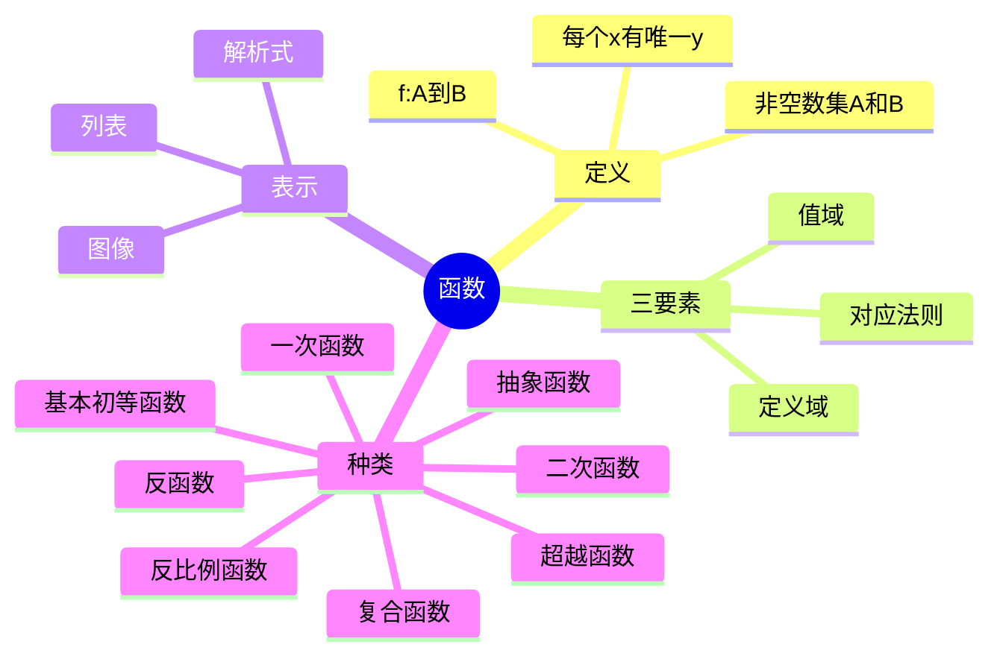
```mermaid
mindmap
  root((函数))
    定义
      非空数集A和B
      每个x有唯一y
      f:A到B
    三要素
      定义域
      对应法则
      值域
    表示
      列表
      图像
      解析式
    种类
      基本初等函数
      一次函数
      二次函数
      反比例函数
      超越函数
      抽象函数
      复合函数
      反函数
```

- 函数定义：非空数集 $A,B$，对任意 $x\in A$，存在唯一的 $y=f(x)$，且 $f:A\to B$。
- 同一函数必须满足：定义域、对应法则完全相同。若定义域不同，即使解析式形式相同，也不是同一函数。
- 函数三要素：定义域、对应法则、值域。
- 函数表示方法：列表、图像、解析式。
- 函数值域：$f(x)$ 在定义域内所有取值构成值域。
- 基本初等函数：
  - 常函数 $f(x)=C$；
  - 幂函数 $f(x)=x^\alpha$；
  - 三角函数 $y=\sin x,\ y=\cos x,\ y=\tan x$；
  - 指数函数 $f(x)=a^x\ (a>0,a\ne1)$；
  - 对数函数 $f(x)=\log_a x\ (a>0,a\ne1)$；
  - 一次函数 $y=kx+b$；
  - 二次函数 $y=ax^2+bx+c$；
  - 正比例函数、反比例函数、一次分式函数、二次分式函数等。

### 具体函数的限制与反函数

- 具体函数常见限制：
  - 分母不为 $0$；
  - 偶次根号下非负；
  - $\tan(f(x))$ 要满足
    $$
    f(x)\ne \frac{\pi}{2}+k\pi,\qquad k\in Z
    $$
  - $\log_a f(x)$ 要满足 $f(x)>0$，且 $a>0,a\ne1$；
  - $\sqrt[n]{f(x)}$ 在偶次根时要求 $f(x)\ge0$。
- 常见恒等型抽象函数（图中"抽象函数"分支）：
  - 加法型：$f(x)+f(y)=f(x+y)$，对应一次函数 $f(x)=kx$；
  - 乘法型：$f(x)f(y)=f(x+y)$，对应指数函数 $f(x)=a^x$；
  - 对数型：$f(x)+f(y)=f(xy)$，对应对数函数 $f(x)=\log_a x$；
  - 差比型：$f(x)-f(y)=f\!\left(\dfrac{x}{y}\right)$，亦对应对数函数；
  - 幂型：$f(xy)=f(x)f(y)$，对应幂函数 $f(x)=x^\alpha$。
- 复合函数：
  - 若 $f$ 的定义域为 $A$，$g$ 的定义域为 $B$，则 $f(g(x))$ 的定义域要求 $x\in B$ 且 $g(x)\in A$。
  - 内层值域必须落入外层定义域：先由 $x\in B$ 解出 $g(x)$ 的取值集合 $g(B)$，再令 $g(B)\subseteq A$。
  - 值域要先看内层函数值域，再进入外层函数；外层单调递增则内外值域同向，单调递减则反向。
  - 已知 $f(g(x))$ 的定义域反求 $f(x)$ 的定义域：把 $g(x)$ 整体看作新变量 $u$，由 $x$ 的范围算出 $u$ 的范围即可。
- 反函数：
  - 单调函数必有反函数；非单调函数需先分段使其单调。
  - 互为反函数的两个函数图像关于 $y=x$ 对称；
  - 它们的定义域和值域互换：$D(f^{-1})=R(f),\ R(f^{-1})=D(f)$；
  - 单调性相同（同增同减）；
  - 求反函数三步：解出 $x=g(y)$、交换 $x,y$、写出定义域。
- 图中提醒：若 $(a,b)$ 在 $f(x)$ 图像上，则 $(b,a)$ 在 $f^{-1}(x)$ 图像上；故有恒等式 $f^{-1}(f(x))=x$ 与 $f(f^{-1}(y))=y$。

<details class="md-source-page">
<summary>原图 · Maths 第 12 页</summary>
<figure class="md-source-page__figure">

<figcaption>Maths_12.pdf</figcaption>
</figure>
</details>

## 13. 函数性质总表

```mermaid
mindmap
  root((函数性质))
    单调性
      定义域或区间
      图像
      导数
      复合函数单调性
    奇偶性
      定义域关于原点对称
      f(-x)=f(x)
      f(-x)=-f(x)
      奇偶运算表
    凹凸性
      二阶导数
      Jensen
      上凸下凸
    对称性
      点对称
      轴对称
      二次函数对称轴
    周期性
      最小正周期
      平移周期
      奇偶叠加周期
    图像变换
      平移
      对称
      翻折
      伸缩
```

- 单调性的定义：设区间 $I\subset D$，若任意 $x_1,x_2\in I$ 且 $x_1<x_2$，有 $f(x_1)<f(x_2)$，则 $f$ 在 $I$ 上单调递增；反号则单调递减。
- 判断单调性时可从定义、图像、导数、复合函数结构入手：
  $$
  \frac{f(x_1)-f(x_2)}{x_1-x_2}>0
  $$
  对应增函数。
- 复合函数单调性：同增异减；若两个函数同向单调则复合后递增，异向则递减。可记成表：

| 外层 $f$ | 内层 $g$ | $f\circ g$ |
| --- | --- | --- |
| 增 | 增 | 增 |
| 增 | 减 | 减 |
| 减 | 增 | 减 |
| 减 | 减 | 增 |
- 奇偶性：
  - 定义域必须关于原点对称。
  - 偶函数：$f(-x)=f(x)$，图像关于 $y$ 轴对称。
  - 奇函数：$f(-x)=-f(x)$，图像关于原点对称；若 $0$ 在定义域内，则 $f(0)=0$。
- 奇偶运算表（图中表格）：

| 运算 | 偶 + 偶 | 奇 + 奇 | 奇 + 偶 | 偶 × 偶 | 奇 × 奇 | 偶 × 奇 |
| --- | --- | --- | --- | --- | --- | --- |
| 结果 | 偶 | 奇 | 非奇非偶 | 偶 | 偶 | 奇 |

  - 复合函数奇偶性：内偶则复合为偶；内奇外偶为偶；内奇外奇为奇。
- 凹凸性：
  - 若 $f''(x)<0$，图像上凸；
  - 若 $f''(x)>0$，图像下凸。
  - 可用 Jensen 型思想：
    $$
    f\left(\frac{x_1+x_2}{2}\right)\ge \frac{f(x_1)+f(x_2)}{2}
    $$
    或反向不等式判断。
- 对称性：
  - $f(a+x)=f(a-x)$ 表示关于直线 $x=a$ 对称；等价于 $f(x)=f(2a-x)$。
  - $f(a+x)+f(a-x)=0$ 表示关于点 $(a,0)$ 对称；等价于 $f(x)+f(2a-x)=0$。
  - $f(a+x)+f(b-x)=c$ 表示关于点 $\left(\frac{a+b}{2},\frac c2\right)$ 对称。
  - 二次函数 $y=ax^2+bx+c$ 的对称轴为 $x=-\dfrac{b}{2a}$。
  - "两轴对称推周期"：若 $f$ 同时关于 $x=a$、$x=b$ 对称，则 $T=2|a-b|$；
  - "两点对称推周期"：若 $f$ 同时关于 $(a,0)$、$(b,0)$ 对称，则 $T=2|a-b|$；
  - "一轴一点对称推周期"：若 $f$ 关于 $x=a$ 与点 $(b,0)$ 对称，则 $T=4|a-b|$ 且 $f$ 为奇函数式结构。
- 周期性：
  - 若 $f(x+T)=f(x)$，则 $T$ 为周期，最小正周期取最小者；
  - 若 $f(x+a)=f(x+b)$，则 $T=|a-b|$；
  - 若 $f(x+a)=-f(x)$，则 $2a$ 为周期；
  - 若 $f(x+a)=\dfrac1{f(x)}$ 或 $f(x+a)=-\dfrac1{f(x)}$，则 $2a$ 为周期；
  - 奇函数 $\times$ 周期 $T$ 的偶函数，仍以 $T$ 为周期。

### 图像变换

- 平移：
  - $y=f(x+a)$：左加右减；
  - $y=f(x)\pm b$：上加下减。
- 对称：
  - $y=f(-x)$ 关于 $y$ 轴；
  - $y=-f(x)$ 关于 $x$ 轴；
  - $y=-f(-x)$ 关于原点。
- 翻折：
  - $y=f(|x|)$：右侧保留并向左翻折；
  - $y=|f(x)|$：下方翻到上方。
- 伸缩：
  - $y=f(\omega x)$：横向按 $1/\omega$ 缩放；
  - $y=Af(x)$：纵向按 $A$ 缩放。
- 解题次序可按：定义域、奇偶性、特值、符号、极限、单调性、凹凸性。

<details class="md-source-page">
<summary>原图 · Maths 第 13 页</summary>
<figure class="md-source-page__figure">

<figcaption>Maths_13.pdf</figcaption>
</figure>
</details>

## 14. 导数基础与切线

- 导数几何意义：函数在某点的切线斜率。
  $$
  f'(x_0)=\lim_{\Delta x\to0}\frac{f(x_0+\Delta x)-f(x_0)}{\Delta x}
  $$
- 平均变化率：
  $$
  \frac{\Delta y}{\Delta x}=\frac{f(x_2)-f(x_1)}{x_2-x_1}
  $$
- 瞬时变化率就是导数，记作 $f'(x)$ 或 $y'$。
- 四则运算：
  $$
  (f\pm g)'=f'\pm g'
  $$
  $$
  (fg)'=f'g+fg'
  $$
  $$
  \left(\frac fg\right)'=\frac{f'g-fg'}{g^2}
  $$
- 复合函数求导：
  $$
  y=f(g(x))\Rightarrow y'=f'(g(x))g'(x)
  $$
- 常用导数（图中导数表）：

| $f(x)$ | $f'(x)$ |
| --- | --- |
| $C$（常数）| $0$ |
| $x^n$ | $nx^{n-1}$ |
| $\sin x$ | $\cos x$ |
| $\cos x$ | $-\sin x$ |
| $\tan x$ | $\sec^2 x=\dfrac{1}{\cos^2 x}$ |
| $a^x$ | $a^x\ln a$ |
| $e^x$ | $e^x$ |
| $\log_a x$ | $\dfrac{1}{x\ln a}$ |
| $\ln x$ | $\dfrac{1}{x}$ |
- 若 $f'(x_0)=0$，$x_0$ 不一定是极值点；还要看 $f'$ 在两侧是否变号。

### 公切线与单调区间

- 切线问题三步：
  1. 求导得 $f'(x)$；
  2. 设切点 $(x_0,f(x_0))$，斜率为 $k=f'(x_0)$；
  3. 写切线方程 $y-f(x_0)=f'(x_0)(x-x_0)$ 并代入条件求 $x_0$。
- "过某点"切线 vs "在某点"切线：过点 $P$ 求切线时，$P$ 不一定是切点，需先设切点 $x_0$，再用 $P$ 在切线上联立方程；可能有多条切线。
- 两曲线公切线：
  - 共切点情形：$f(x_0)=g(x_0)$ 且 $f'(x_0)=g'(x_0)$，两个条件解 $x_0$；
  - 不共切点情形：分别设切点 $x_1,x_2$，要求斜率相同且直线方程相同：
    $$
    f'(x_1)=g'(x_2),\qquad
    f(x_1)-f'(x_1)x_1=g(x_2)-g'(x_2)x_2
    $$
  - 公切线条数问题转化为关于 $x_1$（或 $x_2$）的方程根的个数问题。
- 单调区间判断：
  - $f'(x)>0$，函数在对应区间递增；
  - $f'(x)<0$，函数在对应区间递减；
  - 要先找定义域、驻点和不可导点，再列表判断。
- 极值与最值：
  - 连续函数在闭区间上必有最大值和最小值；
  - 求最值时要比较端点值与极值点值。
- 隐零点题：不能直接解出零点时，先证明零点存在（介值定理），再用零点关系替换复杂项。
  - 设 $f'(x_0)=0$ 即 $x_0$ 为隐零点，由方程导出 $x_0$ 满足的恒等式（如 $e^{x_0}=\dfrac{1}{x_0}$ 或 $\ln x_0=1-x_0$）；
  - 把 $f(x_0)$ 中所有出现的 $e^{x_0}$ 或 $\ln x_0$ 用恒等式替换为 $x_0$ 的有理式，再用基本不等式或单调性估值；
  - 隐零点的范围常通过夹逼法限定到一个小区间，再据此放缩 $f(x_0)$。

<details class="md-source-page">
<summary>原图 · Maths 第 14 页</summary>
<figure class="md-source-page__figure">

<figcaption>Maths_14.pdf</figcaption>
</figure>
</details>

## 15. 函数解题与导数解题套路

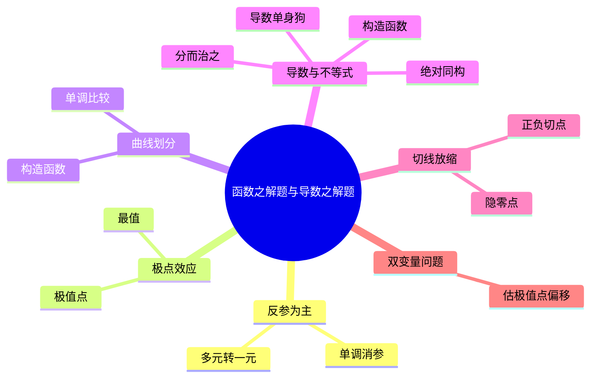
```mermaid
mindmap
  root((函数之解题与导数之解题))
    反参为主
      多元转一元
      单调消参
    极点效应
      极值点
      最值
    曲线划分
      构造函数
      单调比较
    导数与不等式
      构造函数
      绝对同构
      导数单身狗
      分而治之
    切线放缩
      正负切点
      隐零点
    双变量问题
      估极值点偏移
```

- 反参为主：含参不等式或方程常把参数反解出来，转成单变量函数 $a\ge g(x)$ 或 $a\le g(x)$，再讨论 $g$ 的单调与最值。"反参"的关键是把参数 $a$ 放到一边、把变量 $x$ 放到另一边。
- 极点效应：右边是极值点时常等价于最值问题。常见的"端点效应"指：若 $f(x)\ge0$ 在 $[a,b]$ 恒成立，先验 $f(a)\ge0,f(b)\ge0$，再补充导数对内部极值的限制条件，常能筛掉一大批参数。
- 曲线划分：把区间分成若干段，分别讨论单调和极值；常按 $f'(x)$ 的零点把定义域切成"驻点—不可导点—端点"段。
- 例题思路：若
  $$
  f(x)=axe^x-(a+1)(2x+1)\ge0,\quad x>0
  $$
  可构造关于 $a$ 的函数（"反客为主"），转为
  $$
  h(a)=(xe^x-2x-1)\,a-(2x+1)
  $$
  再结合关于 $a$ 的单调性讨论：当 $xe^x-2x-1>0$ 时 $h$ 关于 $a$ 递增，把临界 $a$ 由 $h(a)=0$ 解出即可。
- 常见构造：
  $$
  xe^x>x,\qquad f(x)=xe^x-x>0\ (x>0)
  $$
  或构造
  $$
  (x-1)e^x-\ln x+\frac12>0
  $$
  通过导数和已知不等式 $e^x\ge x+1,\ \ln x\le x-1$ 证明。
- 绝对同构（"同位相同"原则）：把不等式两侧化成同一个函数 $\varphi(t)$ 在不同点的取值，再用 $\varphi$ 的单调性比较。例如 $a^b<b^a\Leftrightarrow \dfrac{\ln a}{a}<\dfrac{\ln b}{b}$，构造 $\varphi(t)=\dfrac{\ln t}{t}$。
- 对数单身狗：含 $\ln x$ 又含指数 $e^x$ 时常配对——"对数单身狗找指数当基友"，把 $\ln x$ 替换为 $\ln x=\ln(e^{\ln x})$ 或反过来用 $e^x=u\Rightarrow x=\ln u$ 换元，使得不等式两侧只剩同一个超越函数。
- 解题清单：
  1. 构造函数之导数与单调性解不等式；
  2. 绝对同构：同位相同原则；
  3. 对数单身狗：指数找基友；
  4. 导数与数列证明不等式；
  5. 放缩法找正负点，隐零点问题；
  6. 导数与三角；
  7. 超越函数与凹凸反转证明不等式；
  8. 端点效应；
  9. 切线放缩证明不等式；
  10. 双变量问题估极值点偏移。

<details class="md-source-page">
<summary>原图 · Maths 第 15 页</summary>
<figure class="md-source-page__figure">

<figcaption>Maths_15.pdf</figcaption>
</figure>
</details>

## 16. 等差数列与等比数列对照

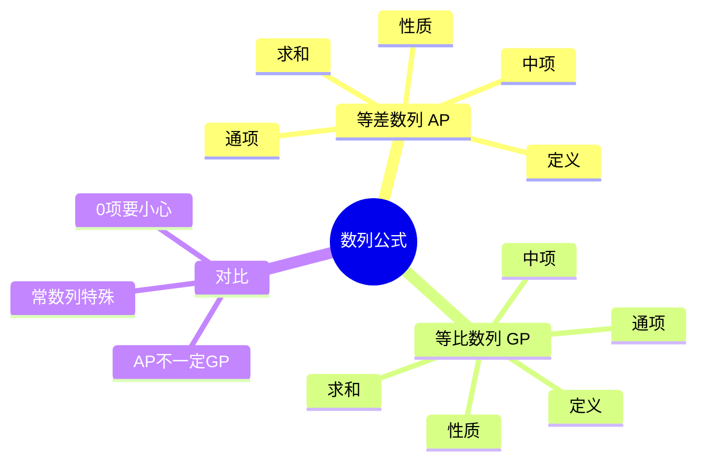
```mermaid
mindmap
  root((数列公式))
    等差数列 AP
      定义
      通项
      求和
      性质
      中项
    等比数列 GP
      定义
      通项
      求和
      性质
      中项
    对比
      AP不一定GP
      常数列特殊
      0项要小心
```

- 等差数列定义：
  $$
  a_{n+1}-a_n=d,\qquad a_n-a_{n-1}=d\quad(n\ge2)
  $$
- 等差通项：
  $$
  a_n=a_1+(n-1)d
  $$
  $$
  a_n=a_m+(n-m)d
  $$
  也可写成
  $$
  a_n=kn+b
  $$
- 等差求和：
  $$
  S_n=\frac{n(a_1+a_n)}2
  $$
  $$
  S_n=na_1+\frac{n(n-1)}2d
  $$
  $$
  S_n=\frac d2n^2+\left(a_1-\frac d2\right)n
  $$
- 等差性质：
  - 若 $m+n=p+q$，则 $a_m+a_n=a_p+a_q$；特例 $a_m+a_{n-m+1}=a_1+a_n$（首尾配对）。
  - 若 $a_m,a_{m+k},a_{m+2k},\ldots$ 等距抽取，仍是等差，公差为 $kd$。
  - 分段求和：$S_k,\ S_{2k}-S_k,\ S_{3k}-S_{2k},\ldots$ 仍为等差，公差为 $k^2 d$。
  - 奇偶项分别求和：$S_{2n}=n(a_1+a_{2n})$；奇数项和 $-$ 偶数项和 $=nd$（项数偶）或 $=a_{\text{中}}$（项数奇）。
  - $S_n/n$ 是关于 $n$ 的等差数列，公差为 $d/2$。
  - $\{a_n\}$ 为 AP $\Leftrightarrow S_n=An^2+Bn$ 无常数项。
- 等差中项：
  $$
  A=\frac{a+b}{2}
  $$

### 等比数列公式

- 等比数列定义：
  $$
  \frac{a_{n+1}}{a_n}=q,\qquad a_n\ne0
  $$
- 等比通项：
  $$
  a_n=a_1q^{n-1}
  $$
  $$
  a_n=a_mq^{n-m}
  $$
- 等比求和：
  $$
  S_n=
  \begin{cases}
  na_1,&q=1\\
  \dfrac{a_1(1-q^n)}{1-q}=\dfrac{a_1-a_nq}{1-q},&q\ne1
  \end{cases}
  $$
- 等比性质：
  - 若 $m+n=p+q$，则 $a_ma_n=a_pa_q$；
  - 若 $a_m,a_{m+k},a_{m+2k},\ldots$ 等距抽取，公比为 $q^k$。
  - 分段求和：$S_k,\ S_{2k}-S_k,\ S_{3k}-S_{2k},\ldots$ 在 $q\ne -1$ 时仍为等比，公比为 $q^k$。
  - 若各项为正，$\{\log_a a_n\}$ 是等差数列，公差 $\log_a q$。
  - $\{a_n\}$ 为 GP $\Leftrightarrow S_n=A q^n-A$（无常数项加 $A$，公比与系数 $A$ 配套）。
- 等比中项：
  $$
  G=\pm\sqrt{ab}\quad (ab>0)
  $$
- 常数列既可能是等差，也可能在非零时为等比；若含 $0$ 项，等比数列定义可能失效，必须单独判断。

<details class="md-source-page">
<summary>原图 · Maths 第 16 页</summary>
<figure class="md-source-page__figure">

<figcaption>Maths_16.pdf</figcaption>
</figure>
</details>

## 17. 求通项与递推转化

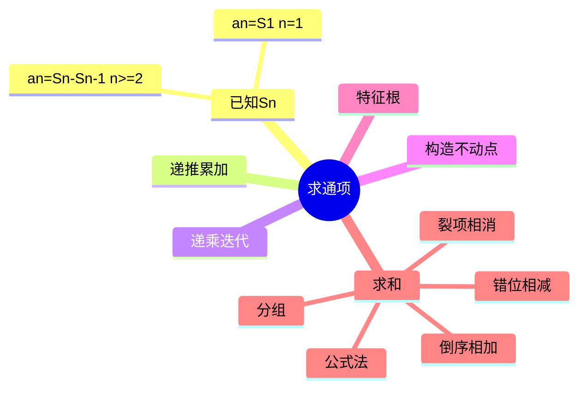
```mermaid
mindmap
  root((求通项))
    已知Sn
      an=S1 n=1
      an=Sn-Sn-1 n>=2
    递推累加
    递乘迭代
    构造不动点
    特征根
    求和
      公式法
      倒序相加
      分组
      错位相减
      裂项相消
```

- 若给出 $S_n$，则
  $$
  a_n=
  \begin{cases}
  S_1,&n=1\\
  S_n-S_{n-1},&n\ge2
  \end{cases}
  $$
- 递推可用累加、累乘、迭代处理；遇到 $n=1$ 要单独检验。
- 常见形式：
  $$
  a_n-a_{n-1}=f(n)
  $$
  可累加；
  $$
  \frac{a_n}{a_{n-1}}=f(n)
  $$
  可累乘。
- 线性递推可构造不动点：
  - 一阶：
    $$
    a_{n+1}=ka_n+b
    $$
    先解不动点方程 $x=kx+b\Rightarrow x=\dfrac{b}{1-k}$（$k\ne1$），再令 $b_n=a_n-x$，则 $\{b_n\}$ 成公比 $k$ 的等比数列。
    通项：$a_n=x+(a_1-x)k^{n-1}$。
  - 一阶含 $n$：$a_{n+1}=ka_n+f(n)$ 时两边除以 $k^{n+1}$，令 $b_n=\dfrac{a_n}{k^n}$，化为
    $$
    b_{n+1}-b_n=\frac{f(n)}{k^{n+1}}
    $$
    再累加。
  - 分式型：
    $$
    a_{n+1}=\frac{Aa_n+B}{Ca_n+D}
    $$
    令 $\dfrac{Ax+B}{Cx+D}=x$ 找不动点 $x_1,x_2$；
    - 两不动点不同：$\dfrac{a_{n+1}-x_1}{a_{n+1}-x_2}=\lambda\cdot\dfrac{a_n-x_1}{a_n-x_2}$，构成等比；
    - 两不动点相同：$\dfrac{1}{a_{n+1}-x_0}-\dfrac{1}{a_n-x_0}=$ 常数，构成等差。
- 二阶线性递推可用特征根：
  $$
  a_{n+2}=ma_{n+1}+na_n
  $$
  特征方程
  $$
  x^2=mx+n
  $$
  若有两根 $x_1,x_2$，可转化为
  $$
  a_{n+2}-x_1a_{n+1}=x_2(a_{n+1}-x_1a_n)
  $$
  以及对称的另一式。
- 求和方法：
  1. 公式法：
     $$
     \sum_{k=1}^n k=\frac{n(n+1)}2,\qquad
     \sum_{k=1}^n k^2=\frac{n(n+1)(2n+1)}6,\qquad
     \sum_{k=1}^n k^3=\left[\frac{n(n+1)}2\right]^2
     $$
  2. 倒序相加、周期构造。
  3. 分组：奇数组、偶数组、并项。
  4. 错位相减：形如 $(An+B)q^n$ 的和，两边乘 $q$ 错位再相减；化为等比求和加修正项。
     $$
     S_n=\sum_{k=1}^n (Ak+B)q^k\Rightarrow (1-q)S_n=\text{(等比和)}-(An+B)q^{n+1}+(\text{首项})
     $$
  5. 裂项相消：拆成前后两项差，剩首尾几项：$\sum (b_n-b_{n+1})=b_1-b_{n+1}$。

### 常见裂项公式

- 对数差：
  $$
  \log_a(n+1)-\log_a n=\log_a\frac{n+1}{n}
  $$
- 平方差：
  $$
  (n+1)^2-n^2=2n+1
  $$
- 组合数恒等：
  $$
  C_n^{r+1}=C_{n+1}^{r+1}-C_n^r
  $$
- 等差倒数裂项：
  $$
  \frac1{a_na_{n+k}}=\frac1{kd}\left(\frac1{a_n}-\frac1{a_{n+k}}\right)
  $$
- 根式有理化：
  $$
  \frac1{\sqrt{n+k}+\sqrt n}=\frac1k(\sqrt{n+k}-\sqrt n)
  $$
- 指数裂项：
  $$
  \frac{a_n}{(a^n+b)(a^{n+1}+b)}
  =
  \frac1{a-1}\left(\frac1{a^n+b}-\frac1{a^{n+1}+b}\right)
  $$

<details class="md-source-page">
<summary>原图 · Maths 第 17 页</summary>
<figure class="md-source-page__figure">

<figcaption>Maths_17.pdf</figcaption>
</figure>
</details>

## 18. 数列放缩常用式

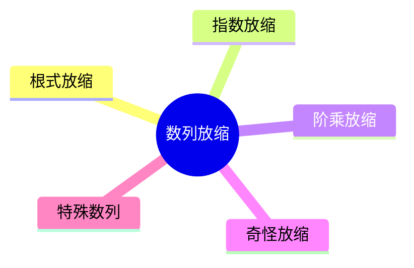
```mermaid
mindmap
  root((数列放缩))
    根式放缩
    指数放缩
    阶乘放缩
    奇怪放缩
    特殊数列
```

- 根式常用放缩（图首行的链式不等式）：
  $$
  \frac{1}{\sqrt n}>\frac{2}{\sqrt n+\sqrt{n+1}}=2(\sqrt{n+1}-\sqrt n)
  $$
  $$
  \frac{1}{\sqrt n}<\frac{2}{\sqrt n+\sqrt{n-1}}=2(\sqrt n-\sqrt{n-1})
  $$
  $$
  \frac1{n^2}<\frac1{n(n-1)}=\frac1{n-1}-\frac1n
  $$
  $$
  \frac1{\sqrt n}=\frac{2}{2\sqrt n}<\frac{2}{\sqrt{n-1}+\sqrt n}=2(\sqrt n-\sqrt{n-1})
  $$
  $$
  \frac1{\sqrt n}>2(\sqrt{n+1}-\sqrt n)
  $$
  $$
  \frac1{\sqrt{n^3}}<\frac{2}{\sqrt{n-1}\sqrt n\sqrt{n+1}}
  $$
- 典型应用（图中"望远镜"例）：
  $$
  \sum_{k=1}^n\frac1{\sqrt k}>2(\sqrt{n+1}-1),\qquad \sum_{k=1}^n\frac1{\sqrt k}<2\sqrt n-1
  $$
  $$
  \sum_{k=1}^n\frac1{k^2}<2-\frac1n
  $$
- 指数型放缩：
  $$
  \frac1{4^n}<\frac1{3\cdot4^{n-1}}
  $$
  $$
  \frac1{4^n-1}<\frac1{4^n}
  $$
  或拆成相邻项差：
  $$
  \frac{4^{n+1}}{(4^{n+1}-1)(4^n-1)}
  =
  \frac43\left(\frac1{4^n-1}-\frac1{4^{n+1}-1}\right)
  $$
- 指数比较：
  $$
  \frac{2^n}{(2^n-1)^2}>\frac1{2^n-1}-\frac1{2^{n+1}-1}
  $$
  $$
  \frac{2^n}{3^n+2^n}<\left(\frac23\right)^n
  $$
- 阶乘与组合放缩：
  $$
  n(n-1)(n-2)\cdots(n-r+1)<n^r
  $$
  $$
  \frac{n!}{(n-r)!n^r}<1
  $$
  $$
  C_n^r\cdot\frac1{n^r}<\frac1{r!}
  $$
  $$
  \left(1+\frac1n\right)^n<\sum_{r=0}^n\frac1{r!}<3
  $$
  应用：$(1+\tfrac1n)^n$ 单调递增有界，极限为 $e$。
- 经典放缩例（图中段）：
  $$
  \sum_{k=1}^n\frac{1}{k^2}<1+\sum_{k=2}^n\frac{1}{k(k-1)}=1+1-\frac1n=2-\frac1n
  $$
  $$
  1+\frac{1}{2!}+\frac{1}{3!}+\cdots+\frac{1}{n!}<1+\frac{1}{2}+\frac{1}{2\cdot3}+\cdots+\frac{1}{(n-1)n}<3
  $$
  $$
  \sum_{k=1}^n\frac1{\sqrt k}<2\sqrt n,\qquad \sum_{k=1}^n\frac{1}{k\sqrt{k+1}+(k+1)\sqrt k}=1-\frac{1}{\sqrt{n+1}}<1
  $$
- 奇怪放缩示例：
  $$
  \frac1{a_n^2}-\frac1{a_{n+1}^2}
  =
  \frac{a_{n+1}^2-a_n^2}{a_n^2a_{n+1}^2}
  $$
  若能推出
  $$
  a_n>\frac12a_{n-1}
  $$
  就可把递推与放缩结合。
- 重要思路：先把分式拆成相邻项差，再求和；若不能精确裂项，就找能望远镜相消的上界或下界。

<details class="md-source-page">
<summary>原图 · Maths 第 18 页</summary>
<figure class="md-source-page__figure">

<figcaption>Maths_18.pdf</figcaption>
</figure>
</details>

## 19. 特殊数列、奇偶与整除

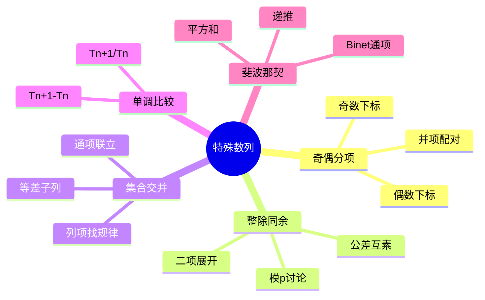
```mermaid
mindmap
  root((特殊数列))
    奇偶分项
      奇数下标
      偶数下标
      并项配对
    整除同余
      二项展开
      模p讨论
      公差互素
    集合交并
      列项找规律
      通项联立
      等差子列
    单调比较
      Tn+1-Tn
      Tn+1/Tn
    斐波那契
      递推
      平方和
      Binet通项
```

- 特殊数列题经常需要"去项、并项"，相邻项要消去公共因子；列项时把奇偶项分别写在两行可看清楚。
- 等差和等比混合：
  - 公差项相加：$AP+AP\Rightarrow AP$，差也是 $AP$；
  - 公比项相乘：$GP\times GP\Rightarrow GP$；
  - 但 $AP\times GP$ 一般不再是 $AP$ 或 $GP$（典型错位相减场景）。
- 奇偶构造示例（图中给出三组）：
  $$
  \{2^n\},\quad \{3n-1\},\quad \{2^n+3n-1\}
  $$
  研究第三组通项是否落入前两组的并集时，按 $n$ 奇偶分两类讨论。
- 图中证明思路：
  - 若 $n$ 为奇数，用二项展开 $(3+1)^n=\sum_{k=0}^n C_n^k 3^k$，分离 $k\ge1$ 时 $3$ 的倍数项，剩余为 $1$，故 $4^n\equiv 1\pmod 3$；
  - 若 $n$ 为偶数，令 $n=2t$，则 $2^n=4^t$，再由 $4^t-1=(4-1)(4^{t-1}+\cdots+1)$ 得 $3\mid 4^t-1$，故 $2^n\equiv 1\pmod 3$；
  - 联合奇偶得：$2^n+(-1)^n\equiv 0\pmod 3$。
- 两个等差集合如 $\{2n-1\}$（奇数集）与 $\{3m-2\}$ 的交集，可用同余：
  $$
  2n-1\equiv 3m-2\pmod{6}
  $$
  解出 $2n-1\equiv 1\pmod 6$，即新数列首项 $1$，公差 $\mathrm{lcm}(2,3)=6$：
  $$
  1,7,13,19,25,\ldots
  $$
  一般规律：两等差列的交集仍是等差，公差为两公差的最小公倍数。
- 对于序列 $T_n$，判断单调性与最值常用：
  - 加减法：$T_{n+1}-T_n$ 看符号；
  - 乘除法（正项）：$\dfrac{T_{n+1}}{T_n}$ 与 $1$ 比较；
  - 含 $(-1)^n$ 时按奇偶分别写 $T_{2k},T_{2k+1}$ 的子列。
- 示例：
  $$
  T_n=\frac1{15}+\frac{4n+3}{10\cdot(-3)^{n-1}}
  $$
  - $n$ 偶：$(-3)^{n-1}<0$，第二项 $<0$，$T_n<\dfrac{1}{15}$；
  - $n$ 奇：第二项 $>0$，$T_n>\dfrac{1}{15}$；
  - 进一步比较 $T_{2k+1}$ 内部单调性即可判断最大、最小值。
- 斐波那契型：
  $$
  A_1=A_2=1,\qquad A_{n+2}=A_{n+1}+A_n
  $$
  常见恒等式：
  $$
  A_1^2+A_2^2+\cdots+A_n^2=A_nA_{n+1}
  $$
  $$
  A_1+A_2+\cdots+A_n=A_{n+2}-1
  $$
  $$
  A_{m+n}=A_mA_{n+1}+A_{m-1}A_n
  $$
  通项（Binet 公式）：
  $$
  A_n=\frac1{\sqrt5}\left[\left(\frac{1+\sqrt5}{2}\right)^n-\left(\frac{1-\sqrt5}{2}\right)^n\right]
  $$
  其中 $\varphi=\dfrac{1+\sqrt5}{2}$ 为黄金分割比，$A_{n+1}/A_n\to\varphi$。

<details class="md-source-page">
<summary>原图 · Maths 第 19 页</summary>
<figure class="md-source-page__figure">

<figcaption>Maths_19.pdf</figcaption>
</figure>
</details>

## 20. 整除、有界与错位相减

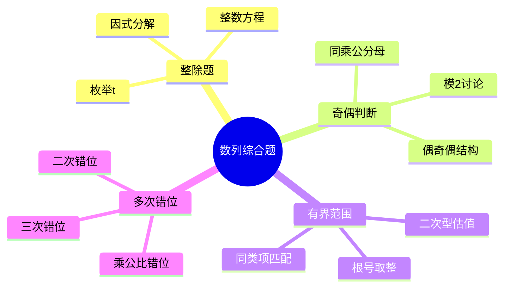
```mermaid
mindmap
  root((数列综合题))
    整除题
      因式分解
      整数方程
      枚举t
    奇偶判断
      同乘公分母
      模2讨论
      偶奇偶结构
    有界范围
      同类项匹配
      二次型估值
      根号取整
    多次错位
      乘公比错位
      二次错位
      三次错位
```

- 整除题示例：存在正整数 $t$，满足
  $$
  2b_t=b_1+b_m,\qquad b_n=\frac{2n-1}{2n-1+t}
  $$
  可把
  $$
  b_m=\frac{2m-1}{2m-1+t}
  $$
  与给定式联立，转为 $t,m$ 的整数方程。
- 通过通分与因式分解：
  $$
  \frac{5t+3}{t^2+t}=\frac{2m-1}{m}
  $$
  即 $m(5t+3)=(2m-1)(t^2+t)$，整理为
  $$
  m=\frac{t^2+t}{2t^2-3t-3}\cdot(\cdots)
  $$
  按 $t=1,2,3,4,\ldots$ 枚举使 $m$ 为正整数；图中给出 $t=1,2,4$ 等候选值，再回代验证。
- 奇偶判断：
  - 若 $2b_s=b_r+b_t$，且
    $$
    b_n=\frac12\left(\frac23\right)^{n-1}
    $$
    则同乘 $3^{s-1}$ 化掉分母，比较两侧 $2$ 的幂指数；
  - 图中"偶、奇、偶"指：左侧 $2b_s$ 为偶，右侧若 $r,t$ 不同奇偶则一项偶一项奇，和为奇，矛盾；故 $r,t$ 必同奇偶。
- 有界性：
  - 若 $b_n=n+\sqrt2$，则
    $$
    b_n^2-b_mb_n=n^2-mn+\sqrt2(2n-m)
    $$
    令为有理数即要求 $\sqrt2$ 系数为 $0$，即 $2n=m$；再回代检验 $n^2-mn$ 是否符合范围。
  - 由 $\sqrt2$ 是无理数推有理同类项匹配，是含根号数列题的核心套路。
- 比较分数（图中范围讨论）：
  $$
  \frac{2p}{3p}=\frac23,\qquad \frac13+\frac{q}{3q}=\frac23
  $$
  注意：$\dfrac{q}{3q}=\dfrac13$ 仅在 $q\ne0$ 时成立；若题设里 $p,q$ 是正整数列且与 $n$ 有关，要回到原通项写出范围 $\dfrac{2}{9}<\dfrac{2p}{3p+\cdots}<\dfrac{2}{3}$ 这类区间，结合 $p,q$ 的整数取值缩小可能。
- 多次错位相减：
  - 若 $a_n=n^2\cdot 2^n$，则
    $$
    S_n=1^2\cdot2+2^2\cdot2^2+\cdots+n^2\cdot2^n
    $$
    两边乘 $2$：
    $$
    2S_n=1^2\cdot2^2+2^2\cdot2^3+\cdots+n^2\cdot2^{n+1}
    $$
    错位相减：
    $$
    -S_n=1^2\cdot2+(2^2-1^2)2^2+(3^2-2^2)2^3+\cdots+(n^2-(n-1)^2)2^n-n^2\cdot2^{n+1}
    $$
    括号内 $k^2-(k-1)^2=2k-1$，得
    $$
    -S_n=\sum_{k=1}^n(2k-1)2^k-n^2\cdot 2^{n+1}+\text{修正}
    $$
    再对 $\sum(2k-1)2^k$ 做一次错位相减即可。**两次错位相减是 $n^2 q^n$ 类的标准套路**。
  - 对 $n^3\cdot 2^n$ 类需做三次错位相减；一般 $n^k q^n$ 需要 $k$ 次。
- 小结（图右下"小结"）：
  - 整除题抓"整数条件 + 因式分解枚举"；
  - 有界题抓"同类项匹配（无理 vs 有理）+ 二次估值"；
  - 含 $n^k q^n$ 的求和题抓多次错位相减；
  - 涉及奇偶时优先模 $2$ 化简，必要时分类讨论。

<details class="md-source-page">
<summary>原图 · Maths 第 20 页</summary>
<figure class="md-source-page__figure">

<figcaption>Maths_20.pdf</figcaption>
</figure>
</details>

## 21. 多面体与旋转体

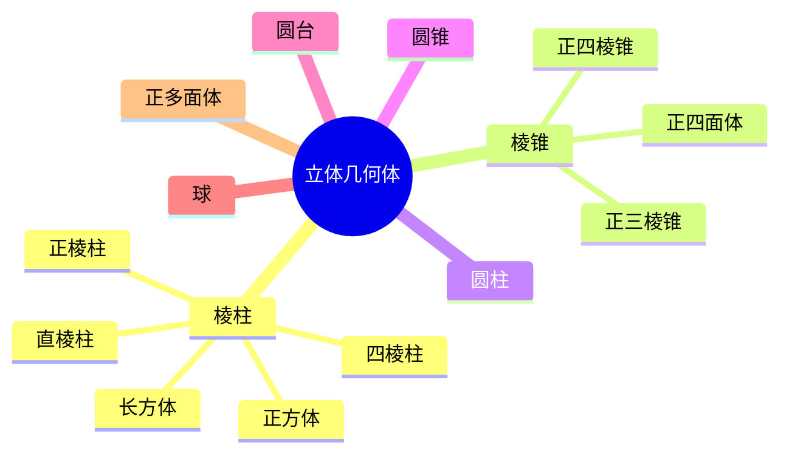
```mermaid
mindmap
  root((立体几何体))
    棱柱
      四棱柱
      正方体
      长方体
      正棱柱
      直棱柱
    棱锥
      正三棱锥
      正四面体
      正四棱锥
    圆柱
    圆锥
    圆台
    球
    正多面体
```

- 棱柱定义与特征：
  - 两个底面互相平行且全等；
  - 其余面为平行四边形；
  - 侧棱互相平行且相等；
  - 直棱柱的侧棱垂直底面；
  - 正棱柱底面是正多边形且侧棱垂直底面。
- 棱柱体积：
  $$
  V=Sh
  $$
  正三棱柱也用 $V=Sh$。
- 圆柱：
  $$
  S_{\text{侧}}=2\pi rh,\qquad V=\pi r^2h
  $$
  注意正方形绕一边或中心轴旋转得到的圆柱半径不同。
- 棱锥定义：一个面为多边形，其余面有公共顶点。
- 棱锥体积：
  $$
  V=\frac13Sh
  $$
  正三棱锥、正四棱锥可用侧面高、底面高和顶点到底面距离构造直角三角形。
- 台体体积：
  $$
  V=\frac h3(S'+\sqrt{SS'}+S)
  $$
  其中 $S,S'$ 为上下底面积。
- 正四面体：
  $$
  V=\frac{\sqrt2}{12}a^3,\qquad S=\sqrt3a^2
  $$
  面截三棱锥时可化成三角形或四边形。
- 圆锥：
  $$
  V=\frac13\pi r^2h,\qquad S_{\text{侧}}=\pi rl
  $$
- 圆台：
  $$
  S_{\text{侧}}=\pi l(r+r'),\qquad
  S_{\text{全}}=\pi\bigl(r'^2+r'l+rl+r^2\bigr)
  $$
  $$
  V=\frac h3\bigl(S+\sqrt{SS'}+S'\bigr)
  $$
  其中 $r,r'$ 为下、上底面半径，$l$ 为母线，$h$ 为高，三者满足
  $$
  l^2=h^2+(r-r')^2
  $$
  画轴截面（等腰梯形）就能把圆台量化为平面几何题。
- 球：
  $$
  V=\frac43\pi R^3,\qquad S=4\pi R^2
  $$
  原图把球与圆柱、圆锥并列，提示球题常配截面圆 $d^2+r^2=R^2$。
- 正多面体：原图右下列出五种正多面体（正四、正六、正八、正十二、正二十面体），其中只有正四面体可由 4 个正三角形拼成且每顶点 3 棱汇合；后续 Maths_25 推 $h,r,R$。
- 棱台体积统一公式：
  $$
  V=\frac h3\bigl(S_1+S_2+\sqrt{S_1S_2}\bigr)
  $$

### 截面与正方体模型

- 正方体过若干顶点/棱中点的截面形状（图中按面数 ③④⑤⑥ 分列）：
  - **③ 三角形**：必为锐角三角形（不能为直角、钝角三角形）；
  - **④ 四边形**：可为平行四边形、矩形、菱形、正方形、等腰梯形；**不能为直角梯形**；
  - **⑤ 五边形**：可有，但**不能为正五边形**（正方体只有 3 组互相平行面，5 条边不可能两两按正五边形方式平行）；
  - **⑥ 六边形**：可有，且**可为正六边形**（取六条相邻棱中点连接）。
- 正方体截面三大做法：
  1. **延长找交点**：截线在某面上，延长后与相邻面棱所在直线交于一点；
  2. **平行线补线**：截面与两平行面相交所得线段必平行；
  3. **平移异面线**：过定点 $A$ 作题中某异面直线的平行线，把异面问题降为相交。
- 经典构图（图中标注 $A,B,C,D,P$ 等点）：
  - 已知 $A$ 在棱上、$B,C,D$ 在另几条棱上，且
    $$
    AB=AC=AD
    $$
    可由对称性证 $A$ 在 $\triangle BCD$ 的射影即外心；
  - 若同时 $AB\perp CD,\ AC\perp BD$，则 $A$ 的射影为 $\triangle BCD$ 的垂心，由三垂线定理可推出 $AD\perp BC$；
  - 过棱上点 $P$ 作平面 $\alpha\parallel BC$，可用"平面与所截两平行面交线必平行"快速定位截面。
- 点到面、线到面距离常借助正方体内部对角线（$\sqrt 3\,a$）、面对角线（$\sqrt 2\,a$）和三垂线定理处理。

<details class="md-source-page">
<summary>原图 · Maths 第 21 页</summary>
<figure class="md-source-page__figure">

<figcaption>Maths_21.pdf</figcaption>
</figure>
</details>

## 22. 体积、表面积与割补

- 公式法汇总：
  - 棱柱、圆柱：$V=Sh$；
  - 棱锥、圆锥：
    $$
    V=\frac13Sh
    $$
  - 球：
    $$
    V=\frac43\pi R^3
    $$
  - 台体：
    $$
    V=\frac h3\bigl(S+\sqrt{SS'}+S'\bigr)
    $$
    （上、下底面积分别为 $S',S$；圆台代入 $S=\pi r^2,\ S'=\pi r'^2$）；
  - 正四面体：
    $$
    V=\frac{\sqrt2}{12}a^3,\qquad h=\frac{\sqrt 6}{3}a,\qquad S_{\text{全}}=\sqrt 3\,a^2
    $$
- 等体积法：同一三棱锥从不同顶点看可写出多种 $V=\frac13 S_{\text{底}}h$，对应公式
  $$
  V_{P\text{-}ABC}=V_{A\text{-}PBC}=V_{B\text{-}PAC}=V_{C\text{-}PAB}
  $$
  互相代换可解：点到面距、面到面距、对侧面积。
- 祖暅原理：两几何体在每条等高截线上截面面积相等，则总体积相等（用于推球与"圆柱挖锥"等高截面）。
- 换顶点 / 换底法（图中口诀"换顶点不换底，换底不换顶"）：
  - **换顶点**：在与底面平行的另一平面内挪顶点位置，体积不变；
  - **换底**：把侧面当底，配合相应顶点；
  - 比例关系：若两锥共底，则 $V_1:V_2=h_1:h_2$；若共顶共高，则 $V_1:V_2=S_1:S_2$。
- 割补常见对应：
  - 三棱锥 $\leftrightarrow$ 平行六面体的 $\tfrac16$（"补成长方体"）；
  - 正四面体 $\leftrightarrow$ 正方体的 $\tfrac13$（图中标注：在棱长为 $a$ 的正方体中取 4 个互不相邻顶点构成正四面体，体积 $=\tfrac13 a^3$）；
  - 三棱柱 $\leftrightarrow$ 平行六面体一半；
  - 两个相同小锥体可拼成规则六面体或棱柱。
- 斜截圆柱 / 圆锥：截面不平行底面时体积无统一公式，须按拼回完整几何体做减法或用积分代换；图中 $\tfrac12V$ 对应"过轴截面把圆柱切成两个等体积体"。
- 球与多面体的几何关系：
  - 长方体外接球：$2R=\sqrt{a^2+b^2+c^2}$；
  - 正方体棱切球：$2r=\sqrt 2\,a$（球与各棱中点相切）；
  - 正方体内切球：$2r=a$。

### 表面积与截面公式

- 圆柱：
  $$
  S_{\text{侧}}=2\pi rl,\qquad S_{\text{全}}=2\pi r(r+l)
  $$
- 圆锥：
  $$
  S_{\text{侧}}=\pi rl,\qquad S_{\text{全}}=\pi r(r+l)
  $$
  其中 $l=\sqrt{r^2+h^2}$。圆锥侧面展开为以 $l$ 为半径、弧长 $2\pi r$ 的扇形，对应圆心角
  $$
  \theta=\frac{2\pi r}{l}
  $$
- 圆台：
  $$
  S_{\text{侧}}=\pi l(r+r'),\qquad S_{\text{全}}=\pi(r^2+r'^2)+\pi l(r+r')
  $$
  其中 $l=\sqrt{h^2+(r-r')^2}$。
- 直棱柱侧面积：
  $$
  S_{\text{侧}}=C_{\text{底}}h
  $$
- 正棱锥侧面积：
  $$
  S_{\text{侧}}=\frac12 c\,h'
  $$
  其中 $c$ 为底面周长，$h'$ 为**斜高**（侧面三角形高，注意不是棱锥高 $h$）。
- 正棱台侧面积：
  $$
  S_{\text{侧}}=\frac12(c+c')h'
  $$
  其中 $c,c'$ 为下、上底周长，$h'$ 为侧面梯形的高。
- 组合体表面积：重合面、隐藏面、相接面**不计入外表面积**；要先把组合体拆为单体，分别求外露面积再求和。
- 球的接、切、外切（图中圈注"球的接 / 切 / 外切问题"）：
  - **内切**：球面与每个面相切，$r=$ 中心到面距离；
  - **外接**：所有顶点都在球面上，$R=$ 中心到顶点距离；
  - **棱切**：球面与每条棱相切，半径介于 $r$ 与 $R$ 之间；
  - 解题套路：先确定球心位置（对称中心或外心连线上），再以"中心 + 球面点"建立直角三角形。

<details class="md-source-page">
<summary>原图 · Maths 第 22 页</summary>
<figure class="md-source-page__figure">

<figcaption>Maths_22.pdf</figcaption>
</figure>
</details>

## 23. 空间位置关系与判定

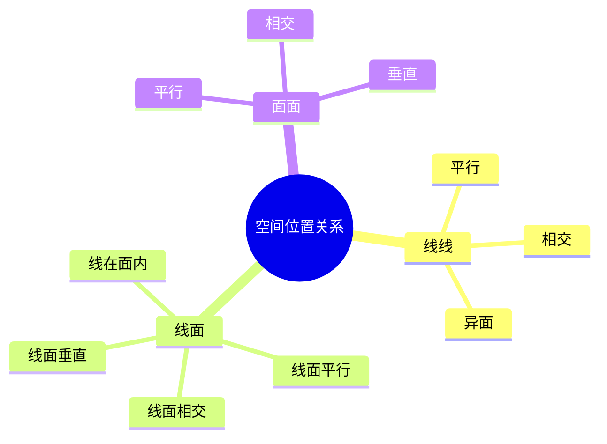
```mermaid
mindmap
  root((空间位置关系))
    线线
      平行
      相交
      异面
    线面
      线在面内
      线面平行
      线面相交
      线面垂直
    面面
      平行
      相交
      垂直
```

- 基本判定（图中编号 ①②③④）：
  1. **三点不共线确定唯一平面**：$A\notin BC \Rightarrow A,B,C$ 共面。
  2. **公理 2**：直线上任两点都在平面内，则整条直线在该平面内：$A\in l, B\in l, A\in\alpha, B\in\alpha \Rightarrow l\subset\alpha$。
  3. **公理 3**：若 $P\in\alpha$ 且 $P\in\beta$，则 $\alpha\cap\beta=l$，且 $P\in l$。
  4. **公理 4（平行传递性）**：若 $a\parallel c,\ b\parallel c$，则 $a\parallel b$。
- **等角定理**：若两个角的两边分别对应平行，则这两个角相等或互补（图中红字标注 "$\angle BAC$ 与 $\angle B'A'C'$ 边平行 $\Rightarrow$ 相等或互补"）。
- 线线关系（三类）：
  - **平行**：$l\parallel m$（共面不交）；
  - **相交**：$l\cap m=P$（共面有一公共点）；
  - **异面**：不在同一平面内，既不平行也不相交。
- 异面直线判定定理：**经过平面外一点和平面内一点的直线，与平面内不经过该点的直线是异面直线**（图中右上方画三棱锥示意）。
- 线面关系（三类）：
  - $l\subset\alpha$（线在面内）；
  - $l\cap\alpha=\{P\}$（线面相交于一点）；
  - $l\parallel\alpha$（线面无公共点）。
- 线面平行 / 垂直判定与性质：
  - **线面平行判定**：$l\parallel m,\ m\subset\alpha,\ l\not\subset\alpha \Rightarrow l\parallel\alpha$；
  - **线面平行性质**：$l\parallel\alpha,\ l\subset\beta,\ \alpha\cap\beta=m \Rightarrow l\parallel m$；
  - **线面垂直判定**：$l\perp m,\ l\perp n,\ m,n\subset\alpha,\ m\cap n=P \Rightarrow l\perp\alpha$（两条相交直线垂直 $\Rightarrow$ 垂直整个平面）；
  - **线面垂直性质**：$l\perp\alpha,\ m\subset\alpha \Rightarrow l\perp m$。
- 面面关系（三类）：相交、平行、垂直。
  - **面面平行判定**：$a\subset\alpha,\ b\subset\alpha,\ a\cap b=P,\ a\parallel\beta,\ b\parallel\beta \Rightarrow \alpha\parallel\beta$；
  - **面面平行性质**：$\alpha\parallel\beta,\ \alpha\cap\gamma=a,\ \beta\cap\gamma=b \Rightarrow a\parallel b$；
  - **面面垂直判定**：$l\subset\alpha,\ l\perp\beta \Rightarrow \alpha\perp\beta$；
  - **面面垂直性质**：$\alpha\perp\beta,\ \alpha\cap\beta=l,\ m\subset\alpha,\ m\perp l \Rightarrow m\perp\beta$。
- 图中红字强调易错：
  - "$l\parallel\alpha$" 不能推出 $l$ 平行于 $\alpha$ 内**任意一条**直线；
  - "$\alpha\parallel\beta$" 不能推出 $\alpha$ 内任一条线都平行于 $\beta$ 内任一条线；
  - **三线共点 / 共面**类问题，常用反证法或辅助平面。

### 截面、三垂线与二面角

- 共面 / 共线证明三板斧：
  - **点线共面**：纳入平面法、辅助平面法、反证法；
  - **点共线**：两平面交线唯一 $\Rightarrow$ 多个交点都在唯一交线上；
  - **三线共点**：先证两线交于 $P$，再证 $P$ 在第三条线（或在两个平面的交线）上。
- 截面辅助线来源：
  - 平面与两平行面相交所得线段必平行；
  - 截面与同一平面相交所得线段在该平面内；
  - 延长面内线段与相邻面的棱相交得新交点。
- **三垂线定理**：在平面 $\alpha$ 内的一条直线 $a$，如果与 $\alpha$ 的一条**斜线在 $\alpha$ 内的射影**垂直，则也与该斜线垂直。
  - **逆定理**：若 $a\subset\alpha$，斜线 $l$ 与 $\alpha$ 交于 $O$，若 $a\perp l$，则 $a$ 与 $l$ 在 $\alpha$ 内的射影也垂直。
  - 常用于"先证射影垂直 $\Rightarrow$ 再证斜线垂直"或反之。
- 三角形心在立体几何中的对应：
  - $PA=PB=PC \Rightarrow$ $P$ 在底面 $\triangle ABC$ 的射影 = **外心**；
  - $PA\perp BC,\ PB\perp AC \Rightarrow$ 射影 = **垂心**；
  - $P$ 到三条侧棱所在直线距离相等 $\Rightarrow$ 射影 = **内心**；
  - 一些更高阶情形对应"重心"。
- **二面角的平面角**：在棱 $l$ 上任取一点 $O$，分别在两个半平面 $\alpha,\beta$ 内作 $OA\perp l\ (A\in\alpha),\ OB\perp l\ (B\in\beta)$，则 $\angle AOB$ 即为二面角 $\alpha\text{-}l\text{-}\beta$ 的平面角。范围：
  $$
  \theta\in[0,\pi]
  $$
- 找二面角的三种常用方法：
  1. **定义法**：直接作垂直于棱的两条线；
  2. **三垂线法**：取一面内一点作另一面的垂线，再连棱上垂足；
  3. **向量法**：用两个面的法向量夹角（取锐角或钝角按题意决定）。
- 平行截面 / 平行平面问题：常要**找"第二个平面"**，不能只看原图中的一个截面；若问"线 $l$ 是否平行于面 $\alpha$"，需在 $\alpha$ 内找一条 $l$ 的平行线。

<details class="md-source-page">
<summary>原图 · Maths 第 23 页</summary>
<figure class="md-source-page__figure">

<figcaption>Maths_23.pdf</figcaption>
</figure>
</details>

## 24. 空间角与距离

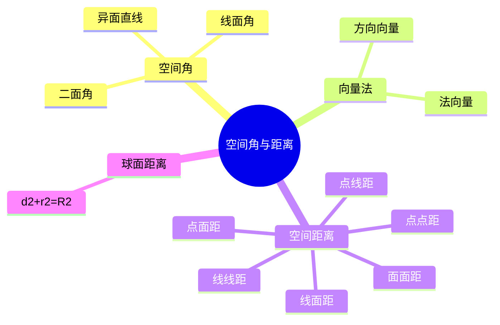
```mermaid
mindmap
  root((空间角与距离))
    空间角
      异面直线
      线面角
      二面角
    向量法
      方向向量
      法向量
    空间距离
      点点距
      点线距
      点面距
      线线距
      线面距
      面面距
    球面距离
      d2+r2=R2
```

- **异面直线所成角**：
  $$
  \theta\in\left(0,\frac{\pi}{2}\right]
  $$
  做法：把其中一条线**平移**到与另一条相交，所得相交角即为夹角；若得到钝角则取其补角。
- **线面角**：直线 $l$ 与平面 $\alpha$ 的射影线 $l'$ 所成角，
  $$
  \theta\in\left[0,\frac{\pi}{2}\right]
  $$
  当 $l\subset\alpha$ 或 $l\parallel\alpha$ 时 $\theta=0$；当 $l\perp\alpha$ 时 $\theta=\frac\pi2$。
- **二面角的平面角**：在棱 $l$ 上任取一点 $O$，分别在两个半平面内作 $OA\perp l,OB\perp l$，$\angle AOB$ 即为二面角的平面角。范围
  $$
  \theta\in[0,\pi]
  $$
  注意：二面角的平面角与"两面所成角"不同，前者可为钝角，后者只取锐角或直角。
- 角的取值速查表：

  | 角的类型 | 取值范围 | 是否含 0 / $\frac\pi2$ |
  | --- | --- | --- |
  | 异面直线角 | $\left(0,\frac\pi2\right]$ | 不含 0，含 $\frac\pi2$ |
  | 线面角 | $\left[0,\frac\pi2\right]$ | 都含 |
  | 二面角 | $[0,\pi]$ | 都含 |

- **向量法**（设方向向量 $\vec u,\vec v$，法向量 $\vec n_1,\vec n_2$）：
  - 异面直线角：
    $$
    \cos\theta=\frac{|\vec u\cdot\vec v|}{|\vec u||\vec v|}
    $$
  - 线面角：
    $$
    \sin\theta=\frac{|\vec u\cdot\vec n|}{|\vec u||\vec n|}
    $$
    （$\vec n$ 是面法向量，余角关系）
  - 二面角：
    $$
    \cos\theta=\pm\frac{\vec n_1\cdot\vec n_2}{|\vec n_1||\vec n_2|}
    $$
    符号按"是否同侧法向量"决定，最后看图取锐角或钝角。
- **空间距离 6 类**（图中竖列）：
  - 点点距 $|AB|$；
  - 点线距：$d=\dfrac{|\vec{AP}\times\vec u|}{|\vec u|}$（$\vec u$ 是 $l$ 方向向量）；
  - 点面距：见下文体积法；
  - 异面直线距：$d=\dfrac{|\vec{AB}\cdot\vec n|}{|\vec n|}$（$\vec n$ 是公共垂线方向，等于两方向向量的叉积方向）；
  - 线面距 = 线上任一点到面的距离（前提：$l\parallel\alpha$）；
  - 面面距 = 一面内任一点到另一面的距离（前提：$\alpha\parallel\beta$）。
- **点面距等体积法**：把点 $P$ 当三棱锥 $P\text-ABC$ 的顶点，
  $$
  V_{P\text-ABC}=\frac13 S_{\triangle ABC}\cdot d
  \Rightarrow
  d=\frac{3V}{S_{\triangle ABC}}
  $$
  $V$ 用其它顶点为顶点反算。
- **球与截面**：截面 $\alpha$ 距球心 $O$ 距离 $d$，截面圆半径 $r$，球半径 $R$，则
  $$
  d^2+r^2=R^2
  $$
  当 $d=0$（过球心截面）时 $r=R$ 取最大；$d=R$ 时 $r=0$（切平面）。
- **球面距离**：球面上 $A,B$ 两点的最短弧长 = $R\cdot\angle AOB$（$O$ 为球心）。
- 正四面体（棱长 $a$）的球：
  $$
  R_{\text{外}}=\frac{\sqrt 6}{4}a,\quad r_{\text{内}}=\frac{\sqrt 6}{12}a,\quad h=\frac{\sqrt 6}{3}a
  $$
  关系 $R:r=3:1$，$h=R+r$（球心在高 $\frac34 h$ 处）。
- 正方体、正四棱台、正四棱锥的球问题：常**画轴截面**化成平面几何（梯形 / 三角形 / 等腰三角形）。
- **图中红字**：空间角和距离题先画截面图，把三维关系降为二维直角三角形或相似三角形。

<details class="md-source-page">
<summary>原图 · Maths 第 24 页</summary>
<figure class="md-source-page__figure">

<figcaption>Maths_24.pdf</figcaption>
</figure>
</details>

## 25. 立体几何模型与球

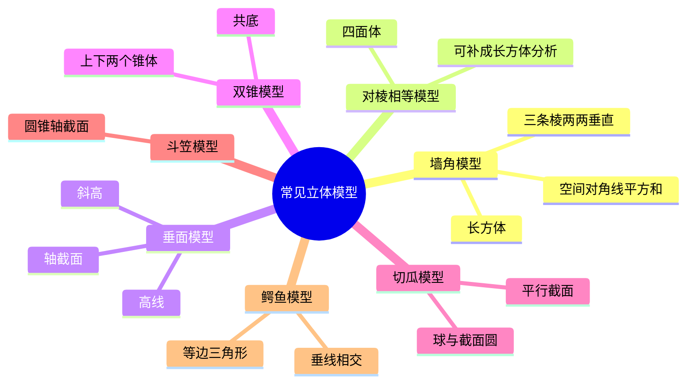
```mermaid
mindmap
  root((常见立体模型))
    墙角模型
      长方体
      三条棱两两垂直
      空间对角线平方和
    对棱相等模型
      四面体
      可补成长方体分析
    垂面模型
      高线
      斜高
      轴截面
    双锥模型
      共底
      上下两个锥体
    切瓜模型
      平行截面
      球与截面圆
    斗笠模型
      圆锥轴截面
    鳄鱼模型
      等边三角形
      垂线相交
```

- **墙角模型（长方体模型）**：三条互相垂直的棱可视为长方体三条边，棱长 $a,b,c$，空间对角线
  $$
  d=\sqrt{a^2+b^2+c^2}
  $$
  外接球以体对角线为直径：
  $$
  R=\frac d2,\qquad R^2=\frac14(a^2+b^2+c^2)
  $$
  常见情形：三条两两垂直的棱共顶点（直角三棱锥）$\Rightarrow$ 直接补成长方体。
- **对棱相等模型（四面体）**：若四面体三组对棱分别相等 $AB=CD=p,\ AC=BD=q,\ AD=BC=r$，可补成长方体，长方体三棱 $a,b,c$ 满足
  $$
  a^2+b^2=p^2,\quad b^2+c^2=q^2,\quad a^2+c^2=r^2
  $$
  解得
  $$
  a^2=\frac{p^2-q^2+r^2}{2},\quad b^2=\frac{p^2+q^2-r^2}{2},\quad c^2=\frac{-p^2+q^2+r^2}{2}
  $$
  外接球半径
  $$
  R=\frac12\sqrt{a^2+b^2+c^2}=\frac12\sqrt{\frac{p^2+q^2+r^2}{2}}
  $$
- **垂面模型**：顶点 $P$ 在底面射影为 $O$，把高 $h=PO$、底面外接圆半径 $r$、外接球半径 $R$ 放进直角三角形：
  $$
  r^2+(h-R)^2=R^2 \;\Longrightarrow\; R=\frac{r^2+h^2}{2h}
  $$
  原图给出特殊情形 $r^2+\dfrac{h^2}{4}=R^2$（球心位于高的中点）。
- **双锥模型**：两个圆锥（或棱锥）共底拼成纺锤体。若上下高分别为 $h_1,h_2$，公共底圆半径 $r$，外接球
  $$
  R^2=r^2+\left(\frac{h_1-h_2}{2}\right)^2,\qquad R=\frac{h_1+h_2}{2}\text{（特殊情形）}
  $$
  体积合成：$V=\frac13\pi r^2(h_1+h_2)$。
- **切瓜模型**：球被两平行平面所截得两个截面圆，半径 $r_1,r_2$，两截面距离 $l$。设球心到 $r_1$ 截面距离为 $d_1$，则
  $$
  d_1^2+r_1^2=R^2,\quad (l-d_1)^2+r_2^2=R^2
  $$
  消去 $d_1$：
  $$
  R^2=r_1^2+\frac{(r_2^2-r_1^2+l^2)^2}{4l^2}
  $$
  图中简记
  $$
  R^2=r_1^2+r_2^2-\frac{l^2}{4}
  $$
  对应"两截面在球心同侧、半径相等"的特例。
- **斗笠模型**：圆锥轴截面为等腰三角形，底圆半径 $r$、高 $h$、母线 $l=\sqrt{r^2+h^2}$。圆锥外接球（顶点和底圆都在球面上）
  $$
  R=\frac{l^2}{2h}=\frac{r^2+h^2}{2h}
  $$
  内切球（与底面和侧面都相切）
  $$
  r_{\text{in}}=\frac{rh}{l+r}=\frac{rh}{\sqrt{r^2+h^2}+r}
  $$
- **鳄鱼模型 / 正三角形模型**：正三角形边长 $a$，重心、内心、外心三心合一：
  $$
  R_{\triangle}=\frac{\sqrt3}{3}a,\qquad r_{\triangle}=\frac{\sqrt3}{6}a,\qquad h_{\triangle}=\frac{\sqrt3}{2}a
  $$
  比例 $R:r:h=2:1:3$。空间中正三棱锥常借助这组比例与三垂线建立关系。

### 内切球与外接球

- **正四面体（棱长 $a$）核心数据**：
  $$
  h=\frac{\sqrt6}{3}a,\qquad R=\frac{\sqrt6}{4}a,\qquad r=\frac{\sqrt6}{12}a
  $$
  关系链：$R=3r$，$h=R+r=\frac34 h+\frac14 h$（球心位于高的 $\tfrac34$ 处）。
- **内切球体积法**（等体积技巧）：若多面体有内切球（每个面到球心距离都等于 $r$），则把体积拆成以各面为底、$r$ 为高的小锥：
  $$
  V=\frac13 r\sum_i S_i=\frac13 r\,S_{\text{全}}
  $$
  $\Rightarrow$
  $$
  r=\frac{3V}{S_{\text{全}}}
  $$
- **外接球的球心定位**：
  - 棱锥的外接球球心在所有棱的**中垂面**交线上；
  - 等价于"在底面外心的正上方某高度"+"在侧棱中垂面上"两条件交点；
  - 直三棱柱外接球球心在两底面外心连线的**中点**上。
- **常用直角三角形关系**：球心 $O$、底面外心 $O_1$、顶点 $P$、底面顶点 $A$，则
  $$
  R=|OA|=|OP|,\quad |OO_1|^2+|O_1A|^2=R^2,\quad |OO_1|+|OP|=h\text{ 或 }|h-|OO_1||
  $$
- 解题套路：**先判模型 $\to$ 定轴线 / 截面 $\to$ 列直角三角形关系**。
- 内切球题着重看"棱、面边界与 $h,r$ 的关系"；外接球题着重看"顶点、棱长与 $R$ 的关系"。

<details class="md-source-page">
<summary>原图 · Maths 第 25 页</summary>
<figure class="md-source-page__figure">

<figcaption>Maths_25.pdf</figcaption>
</figure>
</details>

## 26. 排列、组合与二项式

```mermaid
mindmap
  root((计数基础))
    排列
      有序
      A_n^m
      n(n-1)...(n-m+1)
    组合
      无序
      C_n^m
      对称性
    二项式定理
      通项
      系数
      中间项
    特殊位置
      捆绑法
      插空法
      相邻不相邻
    分组分配
      记名
      不记名
      均分
```

- 排列：
  $$
  A_n^m=\frac{n!}{(n-m)!}=n(n-1)(n-2)\cdots(n-m+1)
  $$
  特别地 $A_n^n=n!$，约定 $0!=1$。常用恒等式：
  $$
  A_n^m=nA_{n-1}^{m-1}=mA_{n-1}^{m-1}+A_{n-1}^{m}
  $$
- 组合：
  $$
  C_n^m=\frac{n!}{m!(n-m)!}=\frac{A_n^m}{A_m^m},\qquad C_n^m=C_n^{n-m}
  $$
  特别地
  $$
  C_n^0=C_n^n=1,\qquad C_n^m=C_{n-1}^m+C_{n-1}^{m-1}\text{（帕斯卡恒等式）}
  $$
  以及降项关系：
  $$
  kC_n^k=nC_{n-1}^{k-1},\qquad C_n^kC_k^r=C_n^rC_{n-r}^{k-r}
  $$
- 二项式定理：
  $$
  (a+b)^n=\sum_{k=0}^{n}C_n^ka^{n-k}b^k
  $$
  通项
  $$
  T_{k+1}=C_n^ka^{n-k}b^k,\qquad k=0,1,\ldots,n
  $$
  $T_{k+1}$ 的下标 $k+1$ 与组合数下标 $k$ **错一位**，做题切勿混淆。
- 二项式系数性质（图中编号 ①②③④）：
  ① **系数和**：令 $a=b=1$，$\sum_{k=0}^n C_n^k=2^n$；
  ② **奇偶分组相等**：令 $a=1,b=-1$，$\sum_{k\text{ 偶}}C_n^k=\sum_{k\text{ 奇}}C_n^k=2^{n-1}$；
  ③ **单峰性**：当 $k<\dfrac{n+1}{2}$ 时 $C_n^k$ 递增，$k>\dfrac{n+1}{2}$ 时递减；
  ④ **中间最大**：$n$ 偶 $\Rightarrow$ 唯一最大项 $C_n^{n/2}$；$n$ 奇 $\Rightarrow$ 两个相等最大项 $C_n^{(n-1)/2}=C_n^{(n+1)/2}$。
- **二项式系数与项的系数区分**：
  - "二项式系数"专指 $C_n^k$，只看下标；
  - "项的系数"指 $C_n^k\cdot a^{n-k}b^k$ 的常数因子（含 $a,b$ 中的常数）；
  - 求"系数最大项"要用比值法 $\dfrac{T_{k+1}}{T_k}\geq 1$ 解 $k$。
- 常用方法（图中口诀）：**赋值法、求导法、积分法、对称法、错位相消、配方凑公式**。
  - 求 $\sum kC_n^k$：对 $(1+x)^n$ 求导后赋值；
  - 求 $\sum \frac{C_n^k}{k+1}$：对 $(1+x)^n$ 积分后赋值；
  - 求 $\sum (C_n^k)^2$：用 $C_{2n}^n=\sum_{k=0}^n (C_n^k)^2$（范德蒙恒等式）。

### 特殊位置排列

- **捆绑法**（相邻问题）：把要相邻的元素先打包成整体，再考虑包内部排列：
  $$
  \text{答案}=A_{m+1}^{m+1}\cdot A_k^k
  $$
  其中 $k$ 是相邻元素个数。
- **插空法**（不相邻问题）：先排其它 $m$ 个元素，再在 $m+1$ 个空位中插入 $k$ 个不相邻元素：
  $$
  \text{答案}=A_m^m\cdot A_{m+1}^k
  $$
- **定序问题**：若 $k$ 个元素内部顺序固定，先全排列再除内部顺序数：
  $$
  \text{答案}=\dfrac{A_n^n}{A_k^k}=C_n^k\cdot A_{n-k}^{n-k}
  $$
- **6 人排队全例**（图中表格）：
  - 不限制：$A_6^6=720$；
  - 排成一圈（环排）：$\dfrac{A_6^6}{6}=120$；
  - 甲站两端：$2\cdot A_5^5=240$；
  - 甲不站两端：$4\cdot A_5^5=480$；
  - 甲乙不相邻：$A_4^4\cdot A_5^2=24\cdot 20=480$（先排其他 4 人再插空）；
  - 甲乙相邻：$A_5^5\cdot A_2^2=120\cdot 2=240$（捆绑）；
  - 甲在乙左边（不必相邻）：$\dfrac{A_6^6}{2}=360$（对称性，左右各半）；
  - 甲乙之间恰好夹 2 人：$A_4^2\cdot A_2^2\cdot A_3^3=12\cdot 2\cdot 6=144$。
- **涂色问题**：按相邻关系分类
  - 区域少（4 块以内）：直接分类讨论；
  - 区域多：找"关键区域"先涂，再按相邻关系递推；
  - 公式法：对环形 $n$ 块、$m$ 色，染色数 $=(m-1)^n+(-1)^n(m-1)$。
- **数字组成问题**：首位不为 0。
  - 例：用 $0,1,2,3,4,5$ 组成无重复的 6 位数：$5\cdot A_5^5=600$；
  - 用 $0,1,2,3,4,5$ 组无重复 6 位偶数：末位为 0 时 $A_5^5$，末位为 2,4 时 $4\cdot A_4^4\cdot 2$，合计 $120+192=312$；
  - 图中题目"用 $0,1,2,3$ 与重复元素组 6 位数"：$4A_4^4-\dfrac{A_4^4}{A_2^2}=96-12=84$，演示了"扣除前导 0"与"重复元素除阶乘"两步。

### 分组分配

- **判前提三要素**：①球（元素）是否相同；②盒（位置）是否相同；③是否允许空盒。
- **均分组除阶乘**：把 $m$ 个不同对象分成 $k$ 个**大小相同**的组，必须除 $k!$；若有 $s$ 个等大小组，除 $s!$。
  $$
  \text{答案}=\dfrac{C_m^{n_1}C_{m-n_1}^{n_2}\cdots C_{n_k}^{n_k}}{\prod_i s_i!}
  $$
- **记名分配（先分后排）**：先按上式分组，再乘 $A_k^k$ 把组分给 $k$ 个不同的人：
  $$
  \text{答案}=\dfrac{C_m^{n_1}\cdots C_{n_k}^{n_k}}{\prod s_i!}\cdot A_k^k
  $$
- **球同盒异可空（隔板法）**：$n$ 个相同球分到 $m$ 个不同盒，允许空盒：
  $$
  C_{n+m-1}^{m-1}
  $$
  不允许空盒：
  $$
  C_{n-1}^{m-1}
  $$
- **球同盒同（分拆数）**：无简单公式，按整数分拆穷举。
- **图中具体例**："3 人 1 人 1 人 = 5 人分 3 组"：$C_5^3\cdot C_2^1\cdot C_1^1\div 2!=10$（两个 1 人组重复要除 $2!$）。
- 决策树：

  | 球 | 盒 | 空盒 | 公式 |
  | --- | --- | --- | --- |
  | 异 | 异 | 不空 | $\sum (-1)^i C_m^i (m-i)^n$（容斥） |
  | 异 | 异 | 可空 | $m^n$ |
  | 异 | 同 | 不空 | 第二类 Stirling 数 $S(n,m)$ |
  | 同 | 异 | 不空 | $C_{n-1}^{m-1}$ |
  | 同 | 异 | 可空 | $C_{n+m-1}^{m-1}$ |

<details class="md-source-page">
<summary>原图 · Maths 第 26 页</summary>
<figure class="md-source-page__figure">

<figcaption>Maths_26.pdf</figcaption>
</figure>
</details>

## 27. 组合计数补充

```mermaid
mindmap
  root((组合计数补充))
    定位限制
      原位不变
      位置约束
    无差别球
      隔板法
      正整数解
    几何计数
      共面共线扣除
      正多边形周期
    格点路径
      水平加竖直
      转向次数
    随机模型
      混检
      路径概率
```

- **保持原位置不变的限制题**（图中"6 选 3 不动 / 6 选 3 全动"）：8 个位置中选 3 个动、5 个不动，再把动的 3 个全排：
  $$
  A_8^3=\frac{A_8^8}{A_5^5}=C_8^3\cdot A_3^3=336
  $$
  推广：$n$ 选 $k$ 个动、$n-k$ 个不动 $\Rightarrow$ $C_n^k\cdot A_k^k$。
- **错位排列**（每个元素都不在原位）：递推
  $$
  D_n=(n-1)(D_{n-1}+D_{n-2}),\quad D_1=0,\ D_2=1,\ D_3=2,\ D_4=9,\ D_5=44
  $$
- **元素无差别（隔板法）**：$n$ 件相同货物分到 $m$ 个不同学校：
  - 至少 1 件：$C_{n-1}^{m-1}$（"插板"在 $n-1$ 个空隙中选 $m-1$ 个）；
  - 可空：$C_{n+m-1}^{m-1}$（先借 $m$ 件再扣）；
  - 至少 $k_i$ 件：先发 $k_i$ 件，剩下 $n-\sum k_i$ 件按"至少 0"处理。
- **几何计数（图中正方体 + 360 边形）**：
  - **正方体三角形数**：$C_8^3-12=56-12=44$（扣除三点共面退化为线段的情况；正方体共面三点的组数 = $6\text{ 面}\cdot C_4^3=24$ 但要细分 $\Rightarrow$ 经典答案 $\binom{8}{3}-\text{共线退化}$，按图取 $44$）；
  - **正方体四面体（三棱锥）数**：$C_8^4-12=70-12=58$（图中标"$C_8^4-6-6$" 表示扣 6 个矩形 + 6 个对角矩形 = 共面 4 点 12 组）；
  - **正 $n$ 边形顶点构成正多边形数**（$n=360$）：$d\mid n$ 时可用 $d$ 个顶点构成正 $d$ 边形（$d\geq3$）。$360=2^3\cdot 3^2\cdot 5$，因子个数 $4\cdot 3\cdot 2=24$；
    $$
    \sigma(360)=(1+2+4+8)(1+3+9)(1+5)=15\cdot 13\cdot 6=1170
    $$
    扣去 $d=1,2$ 与 $d=360$ 等不构成多边形或与原图重合的情形得 $1170-360-180=630$（图中写 $-360-18$ 应为 $-360-180$ 笔误）。
- **格点路径计数**（"网格 $A\to B$"模型）：
  - 从 $A(0,0)$ 到 $B(m,n)$ 仅向右 / 向上：路径数 $=C_{m+n}^m$；
  - 若有 $k$ 次转向：按"水平段数 + 竖直段数"等于 $k+1$ 分布，每段长度为正整数，路径数
    $$
    =C_{m-1}^{a-1}\cdot C_{n-1}^{b-1}\cdot 2
    $$
    （$a+b=k+1$，因子 2 对应"横竖谁先开"）。例如 $m=n=3$ 且 3 次转向：$C_2^1C_2^1=4$；
  - 经过/避开某点：用乘法 $A\to P\cdot P\to B$ 或减法（总数减经过的）。
- **格点不过对角线（卡塔兰数）**：$2n$ 步，$n$ 横 $n$ 竖，路径不过对角线 $\Rightarrow$
  $$
  C_n=\frac{1}{n+1}C_{2n}^n
  $$

### 随机变量例题

- **"混检"模型**（10 人核酸混合检测）：图中分两组各 5 人混检。设单人感染概率 $q=1-p$，每组结果取决于"组内是否有阳性"。设 $X=$ 总检测次数：
  - 若 5 人组阴性 $\Rightarrow$ 仅 1 次混检；概率 $p^5$；
  - 若 5 人组阳性 $\Rightarrow$ 1 次混检 + 5 次单测 = 6 次；概率 $1-p^5$。
  - 两组独立 $\Rightarrow$ $X\in\{2,7,12\}$：
    $$
    P(X=2)=(p^5)^2,\quad P(X=7)=2p^5(1-p^5),\quad P(X=12)=(1-p^5)^2
    $$
  - 期望 $E(X)=2(p^5)^2+7\cdot 2p^5(1-p^5)+12(1-p^5)^2$。
- **二值随机变量 $Y$**（10 人**全部**混检 1 次）：
  - $Y=1$ 表示混检阳性需补检；$Y=0$ 表示阴性结束：
    $$
    P(Y=0)=p^{10},\qquad P(Y=1)=1-p^{10}
    $$
- **等概率排列例题**（6 棵高矮不同的树排 3 排，每排 2 棵，最后一排树都比前排高）：
  - 共有 $\dfrac{6!}{(2!)^3\cdot 3!}=15$ 种本质不同分组（不计排间顺序），但若计排间顺序，有 $\dfrac{6!}{(2!)^3}=90$ 种；
  - 由对称性"每对树 ${2,1},{4,3},{6,5}$ 这种结构"概率为 $\bigl(\dfrac12\bigr)^3=\dfrac18$。
- **方格路径概率**：从 $A$ 到 $B$ 不碰对角线 / 必经某点 $M_i$ 时，按中间点 $M_2,M_3,M_4$ 分类相加：
  $$
  P=\sum_i P(A\to M_i)\cdot P(M_i\to B)
  $$
  各段路径数互独立，最后归一化 $\div$ 总路径数。

<details class="md-source-page">
<summary>原图 · Maths 第 27 页</summary>
<figure class="md-source-page__figure">

<figcaption>Maths_27.pdf</figcaption>
</figure>
</details>

## 28. 抽样与数字特征

```mermaid
mindmap
  root((统计))
    抽样
      简单随机抽样
      分层随机抽样
      系统抽样
    数字特征
      平均数
      方差
      标准差
      百分位数
    相关
      样本相关系数
      正相关
      负相关
    回归
      一元线性回归
      残差
      最小二乘
      决定系数
    独立性检验
      2x2列联表
      卡方统计量
```

- **抽样三种方法**：
  - **简单随机抽样**：不放回，等概率，常用抽签法或随机数表，适用于总体小且**个体差异不大**的情形；
  - **分层随机抽样**：先按某特征把总体划分为互不相交的层，每层独立做简单随机抽样。**抽样比一致**：
    $$
    k=\frac nN,\qquad n_i=k\,N_i
    $$
    适用于总体差异大但层内一致的情形；
  - **系统抽样**：将总体按 $1,2,\ldots,N$ 编号，确定间隔 $k=\lfloor N/n\rfloor$，先在 $[1,k]$ 中随机选起点 $a$，依次取 $a,a+k,a+2k,\ldots$。
- **频率分布图（4 种）**：
  - **频率分布直方图**：纵轴为"频率/组距"，矩形**面积**表示该组频率，所有矩形面积之和 = 1；
  - **频率分布折线图**：取每个矩形的上端点中点连线；
  - **等高堆积条形图**：比较不同类别中各属性的占比；
  - **残差图、散点图**：用于回归分析。
- **平均数**：
  $$
  \bar x=\frac1n\sum_{i=1}^{n}x_i
  $$
  线性变换 $y_i=ax_i+b \Rightarrow \bar y=a\bar x+b$。
- **方差与标准差**：
  $$
  s^2=\frac1n\sum_{i=1}^{n}(x_i-\bar x)^2
  =\frac1n\sum_{i=1}^{n}x_i^2-\bar x^2
  $$
  标准差 $s=\sqrt{s^2}$；线性变换 $y_i=ax_i+b \Rightarrow s_y^2=a^2s_x^2$，$s_y=|a|s_x$（位移 $b$ 不影响离散程度）。
- **合并/分层平均数与方差**：两组样本量分别为 $m,n$，均值 $\bar x,\bar y$，方差 $s_x^2,s_y^2$，则合并样本：
  $$
  \bar z=\frac{m\bar x+n\bar y}{m+n}
  $$
  $$
  s_z^2=\frac{m\bigl[s_x^2+(\bar x-\bar z)^2\bigr]+n\bigl[s_y^2+(\bar y-\bar z)^2\bigr]}{m+n}
  $$
- **百分位数**：将数据从小到大排序后，第 $p$ 百分位数按 $i=n\cdot p\%$ 计算：
  - 若 $i$ 为整数：第 $p$ 百分位数 $=\dfrac{x_{(i)}+x_{(i+1)}}{2}$；
  - 若 $i$ 不为整数：向上取整 $\lceil i\rceil$，第 $p$ 百分位数 $=x_{(\lceil i\rceil)}$。
  - 中位数 $=$ 第 50 百分位数；上四分位 $=$ 第 75 百分位数。
- **样本相关系数 $r$**：
  $$
  r=\frac{\sum_{i=1}^n(x_i-\bar x)(y_i-\bar y)}
  {\sqrt{\sum_{i=1}^n(x_i-\bar x)^2\,\sum_{i=1}^n(y_i-\bar y)^2}}
  =\frac{\sum x_iy_i-n\bar x\bar y}
  {\sqrt{(\sum x_i^2-n\bar x^2)(\sum y_i^2-n\bar y^2)}}
  $$
  性质 $r\in[-1,1]$：
  - $r>0$ 正相关，$r<0$ 负相关，$r=0$ 不相关；
  - $|r|=1$ 完全线性相关；$|r|>0.75$ 通常视为强相关；
  - 与回归系数关系 $\hat b=r\cdot\dfrac{s_y}{s_x}$。

### 回归与独立性检验

- **一元线性回归模型**：
  $$
  Y=bx+a+e,\qquad E(e)=0,\quad D(e)=\sigma^2
  $$
  其中 $e$ 为随机误差，要求 $e_i$ 互独立同分布。
- **经验回归方程**：
  $$
  \hat y=\hat bx+\hat a
  $$
  必经过样本中心 $(\bar x,\bar y)$（图中红字标"样本中心点"）。
- **最小二乘估计**：
  $$
  \hat b=\frac{\sum_{i=1}^n(x_i-\bar x)(y_i-\bar y)}{\sum_{i=1}^n(x_i-\bar x)^2}
  =\frac{\sum x_iy_i-n\bar x\bar y}{\sum x_i^2-n\bar x^2},\qquad
  \hat a=\bar y-\hat b\bar x
  $$
  与相关系数关系：
  $$
  r=\hat b\cdot\frac{s_x}{s_y}
  $$
- **残差**：$e_i=y_i-\hat y_i$。残差图的横轴为解释变量 $x$（或编号 $i$），纵轴为 $e_i$。模型较好的特征：
  - 残差点**随机散布**在 $e=0$ 两侧；
  - 残差**带宽窄**（绝对值小）；
  - 不呈现系统性的曲线 / 喇叭形（否则需换模型）。
- **残差平方和**：
  $$
  Q=\sum_{i=1}^n e_i^2=\sum (y_i-\hat y_i)^2
  $$
- **决定系数（拟合优度）**：
  $$
  R^2=1-\frac{\sum (y_i-\hat y_i)^2}{\sum (y_i-\bar y)^2}\in[0,1]
  $$
  对线性回归 $R^2=r^2$；$R^2$ 越接近 1，回归方程对数据解释能力越强。
- **独立性检验（$2\times 2$ 列联表）**：

  |  | $B$ | $\bar B$ | 行和 |
  | --- | --- | --- | --- |
  | $A$ | $a$ | $b$ | $a+b$ |
  | $\bar A$ | $c$ | $d$ | $c+d$ |
  | 列和 | $a+c$ | $b+d$ | $n=a+b+c+d$ |

  卡方统计量：
  $$
  \chi^2=\frac{n(ad-bc)^2}{(a+b)(c+d)(a+c)(b+d)}
  $$
- 检验流程：
  1. 提出原假设 $H_0$："$A$ 与 $B$ 独立"；
  2. 选定显著性水平 $\alpha$（常见 0.05 或 0.01），查临界值 $x_\alpha$；
  3. 比较 $\chi^2$ 与 $x_\alpha$：
     - $\chi^2\geq x_\alpha$：**拒绝 $H_0$**，认为 $A,B$ 不独立（有 $1-\alpha$ 的把握）；
     - $\chi^2<x_\alpha$：不能拒绝，**没有足够证据**推断 $A,B$ 不独立。
- 常用临界值：

  | $\alpha$ | 0.10 | 0.05 | 0.025 | 0.010 | 0.005 | 0.001 |
  | --- | --- | --- | --- | --- | --- | --- |
  | $x_\alpha$ | 2.706 | 3.841 | 5.024 | 6.635 | 7.879 | 10.828 |

<details class="md-source-page">
<summary>原图 · Maths 第 28 页</summary>
<figure class="md-source-page__figure">

<figcaption>Maths_28.pdf</figcaption>
</figure>
</details>

## 29. 概率公式与事件关系

```mermaid
mindmap
  root((概率求解))
    古典概型
      等可能
      有限样本空间
      P(A)=n(A)/n(Omega)
    加法
      并事件
      互斥
      对立
    乘法
      条件概率
      独立事件
    全概率
      完备事件组
    贝叶斯
      后验概率
    随机变量
      分布列
      期望
      方差
```

- **古典概型**（样本空间有限且等可能）：
  $$
  P(A)=\frac{n(A)}{n(\Omega)}
  $$
- **条件概率**：
  $$
  P(B\mid A)=\frac{P(AB)}{P(A)},\qquad P(A)>0
  $$
  性质：$P(\Omega\mid A)=1,\ P(\bar B\mid A)=1-P(B\mid A),\ P(B_1\cup B_2\mid A)=P(B_1\mid A)+P(B_2\mid A)-P(B_1B_2\mid A)$。
- **加法公式**：
  $$
  P(A\cup B)=P(A)+P(B)-P(AB)\le P(A)+P(B)
  $$
  - 若 $A,B$ **互斥**：$P(A\cup B)=P(A)+P(B)$；
  - 多事件容斥：
    $$
    P\!\left(\bigcup_{i=1}^n A_i\right)=\sum P(A_i)-\sum_{i<j}P(A_iA_j)+\cdots+(-1)^{n+1}P(A_1A_2\cdots A_n)
    $$
  - 求"至少一个发生"常用对偶：
    $$
    P(A_1\cup\cdots\cup A_n)=1-P(\bar A_1\bar A_2\cdots\bar A_n)
    $$
- **乘法公式（链式）**：
  $$
  P(AB)=P(A)P(B\mid A)=P(B)P(A\mid B)
  $$
  推广：$P(A_1A_2\cdots A_n)=P(A_1)P(A_2\mid A_1)P(A_3\mid A_1A_2)\cdots$
  - 若 $A,B$ **独立**：$P(AB)=P(A)P(B)$；
  - $A,B$ 独立 $\Rightarrow A,\bar B;\ \bar A,B;\ \bar A,\bar B$ 也独立。
- **全概率公式**（要求 $\{A_i\}$ 为 $\Omega$ 的完备事件组，即两两互斥且 $\bigcup A_i=\Omega,\ P(A_i)>0$）：
  $$
  P(B)=\sum_{i=1}^n P(A_i)P(B\mid A_i)
  $$
- **贝叶斯公式**（先验 $\to$ 后验）：
  $$
  P(A_i\mid B)=\frac{P(A_i)P(B\mid A_i)}{\sum_j P(A_j)P(B\mid A_j)}
  $$
  - 分子：先验概率 × 似然；
  - 分母：用全概率 $P(B)$；
  - 图中黄色批注"先验 / 后验 / 类比"。
- **互斥 vs 独立**（图中红框）：
  - **互斥**：$AB=\varnothing$，$P(AB)=0$；
  - **独立**：$P(AB)=P(A)P(B)$；
  - 当 $P(A)>0,P(B)>0$ 时，互斥与独立**不能同时成立**（否则 $P(A)P(B)=0$ 矛盾）。
- **事件运算 De Morgan**：
  $$
  \overline{A\cup B}=\bar A\cap\bar B,\qquad \overline{A\cap B}=\bar A\cup\bar B
  $$

### 常见分布

- **期望与方差基本性质**：
  $$
  E(aX+b)=aE(X)+b,\qquad D(aX+b)=a^2D(X)
  $$
  $$
  D(X)=E(X^2)-[E(X)]^2,\qquad \sigma(X)=\sqrt{D(X)}
  $$
  $$
  E(X+Y)=E(X)+E(Y)\text{（无须独立）}
  $$
  $$
  D(X+Y)=D(X)+D(Y)\text{（仅当 }X,Y\text{ 独立时成立）}
  $$
- **两点（0-1）分布** $X\sim B(1,p)$：
  $$
  P(X=1)=p,\ P(X=0)=1-p,\qquad E(X)=p,\ D(X)=p(1-p)
  $$
- **二项分布** $X\sim B(n,p)$（$n$ 重独立伯努利试验中成功次数）：
  $$
  P(X=k)=C_n^kp^k(1-p)^{n-k},\quad k=0,1,\ldots,n
  $$
  $$
  E(X)=np,\qquad D(X)=np(1-p)
  $$
  适用前提：**有放回、每次独立、$p$ 固定**。
- **超几何分布** $X\sim H(N,M,n)$（$N$ 件中 $M$ 件次品，**无放回**抽 $n$ 件，$X$ 为次品数）：
  $$
  P(X=k)=\frac{C_M^kC_{N-M}^{n-k}}{C_N^n},\quad \max\{0,n-(N-M)\}\le k\le\min\{n,M\}
  $$
  $$
  E(X)=n\frac MN,\qquad D(X)=n\frac MN\!\left(1-\frac MN\right)\!\cdot\!\frac{N-n}{N-1}
  $$
  与二项的区别：**不放回 → 各次不独立**，方差多一个有限总体修正因子 $\frac{N-n}{N-1}$。当 $N\to\infty,\ \frac MN\to p$ 时，超几何 $\to$ 二项。
- **正态分布** $X\sim N(\mu,\sigma^2)$：
  $$
  f(x)=\frac1{\sigma\sqrt{2\pi}}\exp\!\left(-\frac{(x-\mu)^2}{2\sigma^2}\right)
  $$
  $$
  E(X)=\mu,\qquad D(X)=\sigma^2
  $$
  - 曲线关于 $x=\mu$ 对称，最高点 $\bigl(\mu,\frac{1}{\sigma\sqrt{2\pi}}\bigr)$；
  - $\sigma$ 小 $\Rightarrow$ 高而瘦（集中），$\sigma$ 大 $\Rightarrow$ 矮而胖（分散）；
  - 标准正态 $Z=\dfrac{X-\mu}{\sigma}\sim N(0,1)$。
- **3σ 原则**：
  $$
  P(\mu-\sigma<X<\mu+\sigma)\approx 0.6827
  $$
  $$
  P(\mu-2\sigma<X<\mu+2\sigma)\approx 0.9545
  $$
  $$
  P(\mu-3\sigma<X<\mu+3\sigma)\approx 0.9973
  $$
  对称性：$P(X<\mu-k\sigma)=P(X>\mu+k\sigma)=\dfrac{1-P(\mu-k\sigma<X<\mu+k\sigma)}{2}$。
- **二项 vs 超几何 vs 正态**速查表：

  | 分布 | 试验方式 | $E(X)$ | $D(X)$ |
  | --- | --- | --- | --- |
  | 二项 $B(n,p)$ | 有放回、独立 | $np$ | $np(1-p)$ |
  | 超几何 $H(N,M,n)$ | 不放回 | $\dfrac{nM}{N}$ | $\dfrac{nM(N-M)(N-n)}{N^2(N-1)}$ |
  | 正态 $N(\mu,\sigma^2)$ | 连续型 | $\mu$ | $\sigma^2$ |

- **马尔科夫链 / 不放回抽球**：分步法时要区分"步与步是否独立"。常用工具：状态转移矩阵、递推关系 $P_{n+1}=P_n\cdot Q$、不变分布。

<details class="md-source-page">
<summary>原图 · Maths 第 29 页</summary>
<figure class="md-source-page__figure">

<figcaption>Maths_29.pdf</figcaption>
</figure>
</details>

## 30. 二项分布最大概率项

- 若 $X\sim B(n,p)$，求使 $P(X=k)$ 取最大值的 $k$：考察相邻概率比
  $$
  \frac{P(X=k)}{P(X=k-1)}=\frac{(n-k+1)p}{k(1-p)}
  $$
  令此比 $\geq 1$ 得 $k\leq (n+1)p$。所以
  $$
  k_0=
  \begin{cases}
  (n+1)p\ \text{与}\ (n+1)p-1\ \text{并列最大}, & (n+1)p\in\mathbb Z,\\[2pt]
  \lfloor (n+1)p\rfloor, & (n+1)p\notin\mathbb Z.
  \end{cases}
  $$
  - $(n+1)p$ 为整数 $\Rightarrow$ **两个相邻 $k$ 同时取最大**：$k_0=(n+1)p,\ (n+1)p-1$；
  - $(n+1)p$ 非整数 $\Rightarrow$ **唯一最大** $k_0=\lfloor (n+1)p\rfloor$。
- 反问题：给定 $k$ 求使 $P(X=k)$ 最大的 $n$（图中 "$k$ 定" 框）：由 $(n+1)p$ 与 $k$ 关系反推
  $$
  n\in\left\{\left\lfloor\tfrac kp\right\rfloor,\ \left\lfloor\tfrac kp\right\rfloor-1\right\}\text{ 或 }\tfrac kp\in\mathbb Z\Rightarrow n=\tfrac kp,\ \tfrac kp-1
  $$
- **判事件关系（图中红框）**：
  - $A,B$ 互斥 $\Rightarrow$ 不独立（前提 $P(A)>0,P(B)>0$）；
  - $A,B$ 独立 $\Rightarrow$ $A,\bar B$；$\bar A,B$；$\bar A,\bar B$ 也都独立；
  - $A\subset B$（即 $A$ 发生必导致 $B$ 发生）$\Rightarrow$ $P(B\mid A)=1$。

### 重复试验与无穷局对称模型

```mermaid
mindmap
  root((重复试验模型))
    抛硬币比较
      正面次数多
      对称性
      平局概率
    无穷局赢家
      连续 2 局
      条件概率
      自相似方程
    条件概率比较
      P(B|A) vs P(B|notA)
      P(AB) vs P(A)P(B)
```

- **抛硬币正面次数比较**（图中"甲、乙各抛 $n$ 次"）：设事件
  $A=$ 甲正面数 $>$ 乙正面数；
  $B=$ 甲正面数 $<$ 乙正面数；
  $C=$ 甲正面数 $=$ 乙正面数。
  由对称性 $P(A)=P(B)$，且 $P(A)+P(B)+P(C)=1$，故
  $$
  P(A)=P(B)=\frac{1-P(C)}{2}
  $$
  当硬币公平时，常出现 $P=\dfrac12$ 的简化结果（把平局概率均分到两侧）。
- **抛 $n$ 次正面数相等概率**：
  $$
  P(C)=\sum_{k=0}^{n}\bigl[C_n^k(\tfrac12)^n\bigr]^2=C_{2n}^n\bigl(\tfrac12\bigr)^{2n}
  $$
  由范德蒙恒等式 $C_{2n}^n=\sum_k(C_n^k)^2$。
- **"先连胜 2 局"无穷局模型**：每局甲赢概率 $p$，乙赢概率 $q=1-p$。设 $A=$ 甲最终先达成连胜 2 局。**自相似列方程**：以前两局结果分类：
  - 前 2 局甲全胜：概率 $p^2$，甲直接赢；
  - 前 2 局乙全胜：概率 $q^2$，乙直接赢；
  - 前 2 局一胜一负（共 $2pq$）：状态回到起点，
  $$
  P(\text{甲赢})=p^2+2pq\cdot P(\text{甲赢})
  $$
  解得
  $$
  P(\text{甲赢})=\frac{p^2}{1-2pq}=\frac{p^2}{p^2+q^2}
  $$
  类似地 $P(\text{乙赢})=\dfrac{q^2}{p^2+q^2}$，两者之和为 1（必有一方先连胜）。

### 条件概率比较与"促进关系"

- **核心结论**：以下三式两两等价（图中黄色批注"促进 / 抑制"）：
  $$
  P(B\mid A)>P(B\mid\bar A)\iff P(AB)>P(A)P(B)\iff P(A\mid B)>P(A\mid\bar B)
  $$
- **推导**（图中分式法）：
  $$
  P(B\mid A)>P(B\mid\bar A)\iff
  \frac{P(AB)}{P(A)}>\frac{P(B)-P(AB)}{1-P(A)}
  $$
  两边乘 $P(A)(1-P(A))>0$：
  $$
  P(AB)\bigl(1-P(A)\bigr)>P(A)\bigl(P(B)-P(AB)\bigr)
  $$
  $$
  \Rightarrow P(AB)>P(A)P(B)
  $$
- **直观解释**：$P(AB)>P(A)P(B)$ 表示 $A$ 与 $B$ "正相关"，$A$ 发生**提高** $B$ 发生的概率（"促进"）；反向不等式则为"抑制"。
- **特殊情况**：若 $A,B$ 独立 $\Rightarrow$ 三式都取等号，$A$ 对 $B$ 不产生概率影响。

### 分布形状与均值位置

- **右偏（正偏态）分布**：尾巴在右侧，少数极大值把平均数往右拉
  $$
  \text{众数}<\text{中位数}<\text{平均数}
  $$
  示意：

  ```
  freq
   |
   |  ##
   |  ###
   |  ####
   |  ######
   |  #########_____ tail →
   +-----------------------> x
        ^  ^   ^
       众  中  平
       数  位  均
  ```

- **左偏（负偏态）分布**：尾巴在左侧，少数极小值把平均数往左拉
  $$
  \text{平均数}<\text{中位数}<\text{众数}
  $$
  示意：

  ```
  freq
   |
   |        ##
   |       ###
   |      ####
   |    ######
   |__####### ← tail
   +-----------------------> x
       ^  ^  ^
       平 中 众
       均 位 数
  ```

- **对称分布（如正态）**：三者重合，
  $$
  \text{众数}=\text{中位数}=\text{平均数}
  $$
- **图中红字诀窍**：看"尾巴"方向 → 平均数被拉向尾巴一侧。
  - 右尾长 $\Rightarrow$ 平均数偏右 $\Rightarrow$ "众 < 中 < 均"；
  - 左尾长 $\Rightarrow$ 平均数偏左 $\Rightarrow$ "均 < 中 < 众"。
- **应用**：判断收入、成绩等数据分布偏态，进而决定使用平均数还是中位数作为代表值（一般偏态明显时，**中位数更稳健**）。

<details class="md-source-page">
<summary>原图 · Maths 第 30 页</summary>
<figure class="md-source-page__figure">

<figcaption>Maths_30.pdf</figcaption>
</figure>
</details>
