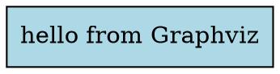

# Sandkasten 全运行时测试

本文测试 Sandkasten 后端支持的全部 58 种语言 / 运行时。每个代码块均可在线运行。

## 系统 / 底层

### Go

```go
package main

import "fmt"

func main() {
	fmt.Println("hello from Go")
}
```

### Assembly (GAS x86-64)

```asm
.section .rodata
msg: .string "hello from Assembly\n"
len = . - msg

.section .text
.globl _start
_start:
    movq $1, %rax
    movq $1, %rdi
    leaq msg(%rip), %rsi
    movq $len, %rdx
    syscall
    movq $60, %rax
    xorq %rdi, %rdi
    syscall
```

### C

```c
#include <stdio.h>

int main() {
    printf("hello from C\n");
    return 0;
}
```

### C++

```cpp
#include <iostream>

int main() {
    std::cout << "hello from C++" << std::endl;
    return 0;
}
```

### Rust

```rust
fn main() {
    println!("hello from Rust");
}
```

### Zig

```zig
const std = @import("std");

pub fn main() void {
    std.debug.print("hello from Zig\n", .{});
}
```

### V

```v
fn main() {
    println("hello from V")
}
```

### Nim

```nim
echo "hello from Nim"
```

### Pascal (Free Pascal)

```pascal
program Hello;
begin
  writeln('hello from Pascal');
end.
```

### Fortran

```fortran
program hello
  print *, "hello from Fortran"
end program hello
```

## 脚本语言

### Python

```python
print("hello from Python")
```

### JavaScript

```javascript
console.log("hello from JavaScript");
```

### TypeScript

```typescript
const msg: string = "hello from TypeScript";
console.log(msg);
```

### Ruby

```ruby
puts "hello from Ruby"
```

### Perl

```perl
print "hello from Perl\n";
```

### PHP

```php
<?php
echo "hello from PHP\n";
```

### Lua

```lua
print("hello from Lua")
```

### R

```r
cat("hello from R\n")
```

### Julia

```julia
println("hello from Julia")
```

### Dart

```dart
void main() {
  print("hello from Dart");
}
```

### Crystal

```crystal
puts "hello from Crystal"
```

### Bash

```bash
echo "hello from Bash"
```

## JVM / 函数式

### Java

```java
public class Main {
    public static void main(String[] args) {
        System.out.println("hello from Java");
    }
}
```

### Kotlin

```kotlin
fun main() {
    println("hello from Kotlin")
}
```

### Scala

```scala
object Main {
  def main(args: Array[String]): Unit = {
    println("hello from Scala")
  }
}
```

### Clojure

```clojure
(println "hello from Clojure")
```

### Gleam

```gleam
import gleam/io

pub fn main() {
  io.println("hello from Gleam")
}
```

## .NET

### C#

```csharp
using System;

class Program {
    static void Main() {
        Console.WriteLine("hello from C#");
    }
}
```

### F#

```fsharp
printfn "hello from F#"
```

## 函数式 / 证明助手

### Haskell

```haskell
main :: IO ()
main = putStrLn "hello from Haskell"
```

### OCaml

```ocaml
print_endline "hello from OCaml"
```

### Elixir

```elixir
IO.puts("hello from Elixir")
```

### Erlang

```erlang
-module(main).
-export([main/1]).

main(_) ->
    io:format("hello from Erlang~n"),
    erlang:halt(0).
```

### Racket

```racket
#lang racket
(displayln "hello from Racket")
```

### Lean 4

```lean4
def main : IO Unit :=
  IO.println "hello from Lean 4"

#eval main
```

### Coq

```coq
Require Import String.

Compute "hello from Coq".
```

### Prolog

```prolog
main :-
    write('hello from Prolog'),
    nl,
    halt.

:- main.
```

## 前端 / 标记语言

### HTML

```html
<!DOCTYPE html>
<html lang="en">
<head>
  <meta charset="UTF-8">
  <title>Hello</title>
</head>
<body>
  <h1>hello from HTML</h1>
</body>
</html>
```

### CSS

```css
body {
  font-family: system-ui, sans-serif;
}

body::before {
  content: "hello from CSS";
  display: block;
  padding: 2rem;
  color: #333;
}
```

### SCSS

```scss
$greeting: "hello from SCSS";

body {
  font-family: system-ui, sans-serif;

  &::before {
    content: $greeting;
    display: block;
    padding: 2rem;
  }
}
```

### TailwindCSS

```css
@tailwind base;
@tailwind components;
@tailwind utilities;

@layer components {
  .greeting::before {
    content: "hello from TailwindCSS";
    @apply block p-8 text-2xl font-bold;
  }
}
```

### TSX (React)

```tsx
export default function Home() {
  return <h1>hello from TSX</h1>;
}
```

### Vue 3

```vue
<template>
  <h1>hello from Vue 3</h1>
</template>

<script setup>
const msg = "hello from Vue 3";
</script>
```

### QML

```qml
import QtQuick

Text {
    text: "hello from QML"
}
```

### Next.js

```tsx
export default function Page() {
  return <h1>hello from Next.js</h1>;
}
```

## 标记语言 / 文档

### Markdown

```markdown
# hello from Markdown

This is a **Markdown** document.
```

### MDX

```mdx
# hello from MDX

export const greeting = "hello";

<strong>{greeting} from MDX</strong>
```

### LaTeX

```latex
\documentclass{article}
\begin{document}
hello from \LaTeX
\end{document}
```

### Typst

```typst
#set page(width: auto, height: auto)
hello from Typst
```

### Graphviz (DOT)



## 科学计算 / 数学

### Octave

```octave
disp("hello from GNU Octave");
```

### MATLAB (Octave compatible)

```octave
fprintf("hello from MATLAB\n");
```

## 数据库

### SQL (SQLite)

```sql
SELECT 'hello from SQL' AS greeting;
```

## 领域特定语言

### GDScript (Godot)

```swift
extends Node

func _ready():
    print("hello from GDScript")
```

### Nextflow

```nextflow
process sayHello {
    output:
    stdout

    script:
    """
    echo "hello from Nextflow"
    """
}

workflow {
    sayHello()
}
```

### WDL

```wdl
version 1.0

task hello {
  command {
    echo "hello from WDL"
  }
  output {
    String out = read_string(stdout())
  }
}

workflow hello_wf {
  call hello
}
```

## 新兴语言

### Mojo

```mojo
fn main():
    print("hello from Mojo")
```

### 仓颉 (Cangjie)

```cangjie
main(): Int64 {
    println("hello from 仓颉")
    return 0
}
```

### Swift

```swift
print("hello from Swift")
```

## 总结

以上覆盖了 Sandkasten 后端的全部 58 种运行时：

| # | 运行时 | 类别 |
|---|--------|------|
| 1 | Go | 系统语言 |
| 2 | Assembly | 系统语言 |
| 3 | Bash | 脚本语言 |
| 4 | C | 系统语言 |
| 5 | 仓颉 (Cangjie) | 新兴语言 |
| 6 | Clojure | JVM / 函数式 |
| 7 | CSS | 前端 |
| 8 | C++ | 系统语言 |
| 9 | C# | .NET |
| 10 | Coq | 证明助手 |
| 11 | Crystal | 脚本语言 |
| 12 | Dart | 脚本语言 |
| 13 | Elixir | 函数式 |
| 14 | Erlang | 函数式 |
| 15 | F# | .NET |
| 16 | Fortran | 系统语言 |
| 17 | GDScript | DSL |
| 18 | Gleam | JVM / 函数式 |
| 19 | Graphviz | 文档 |
| 20 | Haskell | 函数式 |
| 21 | HTML | 标记语言 |
| 22 | Java | JVM |
| 23 | JavaScript | 脚本语言 |
| 24 | Julia | 科学计算 |
| 25 | Kotlin | JVM |
| 26 | LaTeX | 文档 |
| 27 | Lean 4 | 证明助手 |
| 28 | Lua | 脚本语言 |
| 29 | Markdown | 标记语言 |
| 30 | MDX | 标记语言 |
| 31 | Mojo | 新兴语言 |
| 32 | Next.js | 前端框架 |
| 33 | Nextflow | DSL |
| 34 | Nim | 系统语言 |
| 35 | Octave | 科学计算 |
| 36 | OCaml | 函数式 |
| 37 | Pascal | 系统语言 |
| 38 | Perl | 脚本语言 |
| 39 | PHP | 脚本语言 |
| 40 | Prolog | 逻辑编程 |
| 41 | Python | 脚本语言 |
| 42 | QML | 前端 |
| 43 | R | 科学计算 |
| 44 | Racket | 函数式 |
| 45 | Ruby | 脚本语言 |
| 46 | Rust | 系统语言 |
| 47 | Scala | JVM |
| 48 | SCSS | 前端 |
| 49 | SQL | 数据库 |
| 50 | Swift | 新兴语言 |
| 51 | TailwindCSS | 前端 |
| 52 | Typst | 文档 |
| 53 | TypeScript | 脚本语言 |
| 54 | TSX | 前端框架 |
| 55 | V | 系统语言 |
| 56 | Vue 3 | 前端框架 |
| 57 | WDL | DSL |
| 58 | Zig | 系统语言 |

