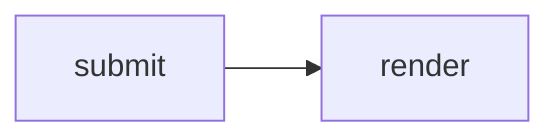
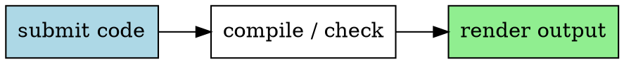

## Sandkasten 测试

本文测试 <a href="https://github.com/dieWehmut/sandkasten" target="_blank" rel="noopener noreferrer">Sandkasten</a>后端支持的全部语言 / 运行时。程序语言代码块用于运行；HTML、CSS、Markdown、LaTeX、Typst、Graphviz、Vue、TSX 等前端 / 文档代码块用于渲染预览。

## 系统 / 底层

### Go

```go
package main

import "fmt"

func main() {
	total := 0
	for _, n := range []int{1, 2, 3, 4, 5} {
		total += n * n
	}
	fmt.Printf("go squares=%d\n", total)
}
```

### Assembly (GAS x86-64)

```asm
.section .rodata
msg: .string "hello from Assembly\n"
len = . - msg

.section .text
.globl main
main:
    movq $1, %rax
    movq $1, %rdi
    leaq msg(%rip), %rsi
    movq $len, %rdx
    syscall
    xorl %eax, %eax
    ret
```

### C

```c
#include <stdio.h>

int main() {
    int total = 0;
    for (int i = 1; i <= 5; i++) total += i * i;
    printf("c squares=%d\n", total);
    return 0;
}
```

### C++

```cpp
#include <numeric>
#include <iostream>
#include <vector>

int main() {
    std::vector<int> values{1, 2, 3, 4, 5};
    int total = std::accumulate(values.begin(), values.end(), 0, [](int acc, int n) {
        return acc + n * n;
    });
    std::cout << "cpp squares=" << total << std::endl;
    return 0;
}
```

### Rust

```rust
fn main() {
    let total: i32 = (1..=5).map(|n| n * n).sum();
    println!("rust squares={total}");
}
```

### Zig

```zig
extern fn write(fd: i32, buf: [*]const u8, count: usize) isize;

pub fn main() void {
    var total: usize = 0;
    for ([_]usize{ 1, 2, 3, 4, 5 }) |n| {
        total += n * n;
    }
    if (total == 55) {
        const msg = "zig squares=55\n";
        _ = write(1, msg.ptr, msg.len);
    }
}
```

### V

```v
fn fib(n int) int {
    if n < 2 {
        return n
    }
    return fib(n - 1) + fib(n - 2)
}

fn main() {
    mut total := 0
    for n in [1, 2, 3, 4, 5] {
        total += n * n
    }
    println('v squares=${total} fib=${fib(8)}')
}
```

### Nim

```nim
import sequtils

proc fib(n: int): int =
  if n < 2: n else: fib(n - 1) + fib(n - 2)

let squares = @[1, 2, 3, 4, 5].mapIt(it * it)
echo "nim squares=", squares.foldl(a + b), " fib=", fib(8)
```

### Pascal (Free Pascal)

```pascal
program Squares;
var
  i, total: integer;
begin
  total := 0;
  for i := 1 to 5 do
    total := total + i * i;
  writeln('pascal squares=', total);
end.
```

### Fortran

```fortran
program squares
  implicit none
  integer :: i, total
  total = 0
  do i = 1, 5
    total = total + i * i
  end do
  print *, "fortran squares=", total
end program squares
```

## 脚本语言

### Python

```python
from functools import reduce

values = [1, 2, 3, 4, 5]
total = reduce(lambda acc, n: acc + n * n, values, 0)
print(f"python squares={total}")
```

### JavaScript

```javascript
const values = [1, 2, 3, 4, 5];
const total = values.reduce((acc, n) => acc + n * n, 0);
console.log(`javascript squares=${total}`);
```

### TypeScript

```typescript
type Row = { name: string; score: number }

const rows: Row[] = [
  { name: "Ada", score: 5 },
  { name: "Linus", score: 8 },
  { name: "Grace", score: 13 },
];

console.log(rows.map((row) => `${row.name}:${row.score}`).join(", "));
```

### Ruby

```ruby
values = [1, 2, 3, 4, 5]
squares = values.map { |n| n * n }
puts "ruby squares=#{squares.sum} odds=#{values.select(&:odd?).join(',')}"
```

### Perl

```perl
use strict;
use warnings;

my @values = (1, 2, 3, 4, 5);
my $total = 0;
$total += $_ * $_ for @values;
print "perl squares=$total\n";
```

### PHP

```php
<?php
$values = [1, 2, 3, 4, 5];
$total = array_reduce($values, fn($sum, $n) => $sum + $n * $n, 0);
echo "php squares={$total}\n";
```

### Lua

```lua
local total = 0
for _, n in ipairs({1, 2, 3, 4, 5}) do
  total = total + n * n
end
print("lua squares=" .. total)
```

### R

```r
values <- 1:5
total <- sum(values ^ 2)
cat(sprintf("r squares=%d mean=%.1f\n", total, mean(values)))
```

### Julia

```julia
using Statistics

values = 1:5
total = sum(n -> n^2, values)
println("julia squares=$total median=$(median(collect(values)))")
```

### Dart

```dart
void main() {
  final values = [1, 2, 3, 4, 5];
  final total = values.fold<int>(0, (sum, n) => sum + n * n);
  print("dart squares=$total");
}
```

### Crystal

```crystal
def fib(n : Int32) : Int32
  return n if n < 2
  fib(n - 1) + fib(n - 2)
end

total = [1, 2, 3, 4, 5].map { |n| n * n }.sum
puts "crystal squares=#{total} fib=#{fib(8)}"
```

### Bash

```bash
set -euo pipefail

total=0
for n in 1 2 3 4 5; do
  total=$((total + n * n))
done
printf 'bash squares=%s\n' "$total"
```

## JVM / 函数式

### Java

```java
public class Main {
    public static void main(String[] args) {
        int total = java.util.stream.IntStream.rangeClosed(1, 5)
            .map(n -> n * n)
            .sum();
        System.out.println("java squares=" + total);
    }
}
```

### Kotlin

```kotlin
fun main() {
    val total = (1..5).sumOf { it * it }
    println("kotlin squares=$total")
}
```

### Scala

```scala
object Main {
  def main(args: Array[String]): Unit = {
    val total = (1 to 5).map(n => n * n).sum
    println(s"scala squares=$total")
  }
}
```

### Clojure

```clojure
(def values [1 2 3 4 5])
(println "clojure squares=" (reduce + (map #(* % %) values)))
```

### Gleam

```gleam
import gleam/io
import gleam/int
import gleam/list

pub fn main() {
  [1, 2, 3, 4, 5]
  |> list.map(fn(n) { n * n })
  |> list.fold(0, fn(sum, n) { sum + n })
  |> int.to_string
  |> fn(total) { "gleam squares=" <> total }
  |> io.println
}
```

## .NET

### C#

```csharp
using System;
using System.Linq;

class Program {
    static void Main() {
        var values = new[] { 1, 2, 3, 4, 5 };
        Console.WriteLine($"csharp squares={values.Sum(n => n * n)}");
    }
}
```

### F#

```fsharp
let total = [1..5] |> List.sumBy (fun n -> n * n)
printfn "fsharp squares=%d" total
```

## 函数式 / 证明助手

### Haskell

```haskell
main :: IO ()
main = putStrLn ("haskell squares=" ++ show (sum [n * n | n <- [1..5]]))
```

### OCaml

```ocaml
let total = List.fold_left (fun acc n -> acc + n * n) 0 [1; 2; 3; 4; 5]

let () = Printf.printf "ocaml squares=%d\n" total
```

### Elixir

```elixir
total = Enum.reduce(1..5, 0, fn n, sum -> sum + n * n end)
IO.puts("elixir squares=#{total}")
```

### Erlang

```erlang
-module(main).
-export([main/0]).

main() ->
    Total = lists:sum([N * N || N <- lists:seq(1, 5)]),
    io:format("erlang squares=~p~n", [Total]),
    erlang:halt(0).
```

### Racket

```racket
#lang racket

(define (fib n)
  (if (< n 2) n (+ (fib (- n 1)) (fib (- n 2)))))

(define squares (map (lambda (n) (* n n)) '(1 2 3 4 5)))
(displayln (format "racket squares=~a fib=~a" (apply + squares) (fib 8)))
```

### Lean 4

```lean4
def main : IO Unit :=
  IO.println s!"lean squares={List.sum ((List.range 6).map fun n => n * n)}"

#eval main
```

### Coq

```coq
Fixpoint square_sum (n : nat) : nat :=
  match n with
  | O => O
  | S k => n * n + square_sum k
  end.

Compute square_sum 5.
```

### Prolog

```prolog
square_sum(N, Total) :-
    findall(Square, (between(1, N, X), Square is X * X), Squares),
    sum_list(Squares, Total).

main :-
    square_sum(5, Total),
    format('prolog squares=~w~n', [Total]),
    nl,
    halt.

:- main.
```

## 前端 / 标记语言

### HTML

```html
<!DOCTYPE html>
<html lang="en">
<head>
  <meta charset="UTF-8">
  <title>Sandkasten Render</title>
</head>
<body>
  <article>
    <h1>HTML render preview</h1>
    <ol>
      <li>parse document structure</li>
      <li>render safe preview</li>
    </ol>
  </article>
</body>
</html>
```

### CSS

```css
.greeting {
  display: grid;
  gap: 0.5rem;
  max-width: 24rem;
  padding: 1rem;
  border: 1px solid #14b8a6;
  border-radius: 8px;
  font: 600 1rem/1.5 system-ui, sans-serif;
  color: #0f172a;
  background: #f8fafc;
}

.greeting strong {
  color: #0f766e;
}
```

```file style-preview.html lang=html
<main class="greeting"><strong>CSS</strong><span>rendered with an adjacent HTML file</span></main>
```

### SCSS

```scss
$accent: #7c2d12;
$surface: #fff7ed;

.greeting {
  display: grid;
  gap: 0.4rem;
  padding: 1rem;
  font-family: system-ui, sans-serif;
  background: $surface;
  color: $accent;

  strong {
    color: #0f766e;
  }
}
```

```file style-preview.html lang=html
<main class="greeting">hello from <strong>SCSS</strong></main>
```

### TailwindCSS

```tailwindcss
@tailwind base;
@tailwind components;
@tailwind utilities;

@layer components {
  .greeting {
    @apply grid gap-2 rounded border border-teal-500 bg-slate-50 p-4 text-slate-900;
  }

  .greeting strong {
    @apply text-teal-700;
  }
}
```

```file style-preview.html lang=html
<main class="greeting"><strong>TailwindCSS</strong><span>utility output rendered as CSS</span></main>
```

### TSX (React)

```tsx
export default function Home() {
  const rows = ["TSX", "React", "SSR"];
  return <section><h1>TSX render</h1><ul>{rows.map((row) => <li key={row}>{row}</li>)}</ul></section>;
}
```

### Vue 3

```vue
<template>
  <section>
    <h1>{{ msg }}</h1>
    <ul>
      <li v-for="item in items" :key="item">{{ item }}</li>
    </ul>
  </section>
</template>

<script setup>
const msg = "Vue 3 render";
const items = ["template", "script setup", "SSR"];
</script>
```

### QML

```qml
import QtQml 2.15

QtObject {
    Component.onCompleted: {
        console.log("hello from QML")
        Qt.quit()
    }
}
```

### Next.js

```nextjs
export default function Page() {
  const items = ["route", "component", "static html"];
  return <main><h1>Next.js render</h1><p>{items.join(" / ")}</p></main>;
}
```

## 标记语言 / 文档

### Markdown

````markdown
# Markdown render

This document renders **Markdown** with a list:

- fenced source
- sanitized HTML
- optional Mermaid


````

### MDX

```mdx
# MDX render

<strong>static React markup</strong>

{" score: " + (21 * 2)}
```

### LaTeX

```latex
\documentclass{article}
\begin{document}
LaTeX render:
\begin{itemize}
\item compile source
\item cache fonts offline
\item return a render marker
\end{itemize}
\begin{tabular}{r|r}
n & square\\
1 & 1\\
2 & 4\\
3 & 9
\end{tabular}
\end{document}
```

### Typst

```typst
#set page(width: auto, height: auto)
#set text(size: 12pt)

= Typst render

$ sum_(n=1)^5 n^2 = 55 $
```

### Graphviz (DOT)



## 科学计算 / 数学

### Octave

```octave
values = 1:5;
total = sum(values .^ 2);
printf("octave squares=%d mean=%.1f\n", total, mean(values));
```

## 数据库

### SQL (SQLite)

```sql
WITH values(n) AS (
  VALUES (1), (2), (3), (4), (5)
)
SELECT SUM(n * n) AS square_sum, ROUND(AVG(n), 1) AS mean_value
FROM values;
```

## 领域特定语言

### GDScript (Godot)

```gdscript
extends SceneTree

func _init():
    var total := 0
    for n in [1, 2, 3, 4, 5]:
        total += n * n
    print("gdscript squares=%s" % total)
    quit()
```

### Nextflow

```nextflow
workflow {
  def values = [1, 2, 3, 4, 5]
  println "nextflow squares=${values.collect { it * it }.sum()}"
}
```

### WDL

```wdl
version 1.0

workflow hello_wf {
  output {
    Array[Int] values = [1, 2, 3, 4, 5]
    String message = "wdl values=" + sep(",", values)
  }
}
```

## 新兴语言

### Mojo

```mojo
def main():
    var total = 0
    for n in range(1, 6):
        total += n * n
    print("mojo squares=", total)
```

### 仓颉 (Cangjie)

```cangjie
main(): Int64 {
    var total = 0
    for (n in 1..=5) {
        total += n * n
    }
    println("cangjie squares=${total}")
    return 0
}
```

### Swift

```swift
let total = (1...5).map { $0 * $0 }.reduce(0, +)
print("swift squares=\(total)")
```
