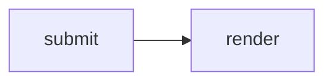
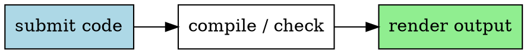

## Sandkasten 测试

本文测试 <a href="https://github.com/dieWehmut/sandkasten" target="_blank" rel="noopener noreferrer">Sandkasten</a>后端支持的全部语言 / 运行时。程序语言代码块用于运行；HTML、CSS、Markdown、LaTeX、Typst、Graphviz、Vue、TSX 等前端 / 文档代码块用于渲染预览。

## 系统 / 底层

### Go

```go
package main

import "fmt"

func main() {
	total := 0
	for _, n := range []int{1, 2, 3, 4, 5} {
		total += n * n
	}
	fmt.Printf("go squares=%d\n", total)
}
```

### Assembly (GAS x86-64)

```asm
.section .rodata
msg: .string "hello from Assembly\n"
len = . - msg

.section .text
.globl main
main:
    movq $1, %rax
    movq $1, %rdi
    leaq msg(%rip), %rsi
    movq $len, %rdx
    syscall
    xorl %eax, %eax
    ret
```

### C

```c
#include <stdio.h>

int main() {
    int total = 0;
    for (int i = 1; i <= 5; i++) total += i * i;
    printf("c squares=%d\n", total);
    return 0;
}
```

### C++

```cpp
#include <numeric>
#include <iostream>
#include <vector>

int main() {
    std::vector<int> values{1, 2, 3, 4, 5};
    int total = std::accumulate(values.begin(), values.end(), 0, [](int acc, int n) {
        return acc + n * n;
    });
    std::cout << "cpp squares=" << total << std::endl;
    return 0;
}
```

### Rust

```rust
fn main() {
    let total: i32 = (1..=5).map(|n| n * n).sum();
    println!("rust squares={total}");
}
```

### Zig

```zig
extern fn write(fd: i32, buf: [*]const u8, count: usize) isize;

pub fn main() void {
    var total: usize = 0;
    for ([_]usize{ 1, 2, 3, 4, 5 }) |n| {
        total += n * n;
    }
    if (total == 55) {
        const msg = "zig squares=55\n";
        _ = write(1, msg.ptr, msg.len);
    }
}
```

### V

```v
fn fib(n int) int {
    if n < 2 {
        return n
    }
    return fib(n - 1) + fib(n - 2)
}

fn main() {
    mut total := 0
    for n in [1, 2, 3, 4, 5] {
        total += n * n
    }
    println('v squares=${total} fib=${fib(8)}')
}
```

### Nim

```nim
import sequtils

proc fib(n: int): int =
  if n < 2: n else: fib(n - 1) + fib(n - 2)

let squares = @[1, 2, 3, 4, 5].mapIt(it * it)
echo "nim squares=", squares.foldl(a + b), " fib=", fib(8)
```

### Pascal (Free Pascal)

```pascal
program Hello;
begin
  writeln('hello from Pascal');
end.
```

### Fortran

```fortran
program hello
  print *, "hello from Fortran"
end program hello
```

## 脚本语言

### Python

```python
from functools import reduce

values = [1, 2, 3, 4, 5]
total = reduce(lambda acc, n: acc + n * n, values, 0)
print(f"python squares={total}")
```

### JavaScript

```javascript
const values = [1, 2, 3, 4, 5];
const total = values.reduce((acc, n) => acc + n * n, 0);
console.log(`javascript squares=${total}`);
```

### TypeScript

```typescript
type Row = { name: string; score: number }

const rows: Row[] = [
  { name: "Ada", score: 5 },
  { name: "Linus", score: 8 },
  { name: "Grace", score: 13 },
];

console.log(rows.map((row) => `${row.name}:${row.score}`).join(", "));
```

### Ruby

```ruby
puts "hello from Ruby"
```

### Perl

```perl
print "hello from Perl\n";
```

### PHP

```php
<?php
echo "hello from PHP\n";
```

### Lua

```lua
print("hello from Lua")
```

### R

```r
cat("hello from R\n")
```

### Julia

```julia
println("hello from Julia")
```

### Dart

```dart
void main() {
  print("hello from Dart");
}
```

### Crystal

```crystal
def fib(n : Int32) : Int32
  return n if n < 2
  fib(n - 1) + fib(n - 2)
end

total = [1, 2, 3, 4, 5].map { |n| n * n }.sum
puts "crystal squares=#{total} fib=#{fib(8)}"
```

### Bash

```bash
echo "hello from Bash"
```

## JVM / 函数式

### Java

```java
public class Main {
    public static void main(String[] args) {
        System.out.println("hello from Java");
    }
}
```

### Kotlin

```kotlin
fun main() {
    println("hello from Kotlin")
}
```

### Scala

```scala
object Main {
  def main(args: Array[String]): Unit = {
    println("hello from Scala")
  }
}
```

### Clojure

```clojure
(println "hello from Clojure")
```

### Gleam

```gleam
import gleam/io

pub fn main() {
  io.println("hello from Gleam")
}
```

## .NET

### C#

```csharp
using System;

class Program {
    static void Main() {
        Console.WriteLine("hello from C#");
    }
}
```

### F#

```fsharp
printfn "hello from F#"
```

## 函数式 / 证明助手

### Haskell

```haskell
main :: IO ()
main = putStrLn "hello from Haskell"
```

### OCaml

```ocaml
print_endline "hello from OCaml"
```

### Elixir

```elixir
IO.puts("hello from Elixir")
```

### Erlang

```erlang
-module(main).
-export([main/0]).

main() ->
    io:format("hello from Erlang~n"),
    erlang:halt(0).
```

### Racket

```racket
#lang racket

(define (fib n)
  (if (< n 2) n (+ (fib (- n 1)) (fib (- n 2)))))

(define squares (map (lambda (n) (* n n)) '(1 2 3 4 5)))
(displayln (format "racket squares=~a fib=~a" (apply + squares) (fib 8)))
```

### Lean 4

```lean4
def main : IO Unit :=
  IO.println "hello from Lean 4"

#eval main
```

### Coq

```coq
Definition hello_from_coq : True := I.
```

### Prolog

```prolog
main :-
    write('hello from Prolog'),
    nl,
    halt.

:- main.
```

## 前端 / 标记语言

### HTML

```html
<!DOCTYPE html>
<html lang="en">
<head>
  <meta charset="UTF-8">
  <title>Sandkasten Render</title>
</head>
<body>
  <article>
    <h1>HTML render preview</h1>
    <ol>
      <li>parse document structure</li>
      <li>render safe preview</li>
    </ol>
  </article>
</body>
</html>
```

### CSS

```css
.greeting {
  display: grid;
  gap: 0.5rem;
  max-width: 24rem;
  padding: 1rem;
  border: 1px solid #14b8a6;
  border-radius: 8px;
  font: 600 1rem/1.5 system-ui, sans-serif;
  color: #0f172a;
  background: #f8fafc;
}

.greeting strong {
  color: #0f766e;
}
```

```file style-preview.html lang=html
<main class="greeting"><strong>CSS</strong><span>rendered with an adjacent HTML file</span></main>
```

### SCSS

```scss
$accent: #7c2d12;
$surface: #fff7ed;

.greeting {
  display: grid;
  gap: 0.4rem;
  padding: 1rem;
  font-family: system-ui, sans-serif;
  background: $surface;
  color: $accent;

  strong {
    color: #0f766e;
  }
}
```

```file style-preview.html lang=html
<main class="greeting">hello from <strong>SCSS</strong></main>
```

### TailwindCSS

```tailwindcss
@tailwind base;
@tailwind components;
@tailwind utilities;

@layer components {
  .greeting {
    @apply grid gap-2 rounded border border-teal-500 bg-slate-50 p-4 text-slate-900;
  }

  .greeting strong {
    @apply text-teal-700;
  }
}
```

```file style-preview.html lang=html
<main class="greeting"><strong>TailwindCSS</strong><span>utility output rendered as CSS</span></main>
```

### TSX (React)

```tsx
export default function Home() {
  const rows = ["TSX", "React", "SSR"];
  return <section><h1>TSX render</h1><ul>{rows.map((row) => <li key={row}>{row}</li>)}</ul></section>;
}
```

### Vue 3

```vue
<template>
  <section>
    <h1>{{ msg }}</h1>
    <ul>
      <li v-for="item in items" :key="item">{{ item }}</li>
    </ul>
  </section>
</template>

<script setup>
const msg = "Vue 3 render";
const items = ["template", "script setup", "SSR"];
</script>
```

### QML

```qml
import QtQml 2.15

QtObject {
    Component.onCompleted: {
        console.log("hello from QML")
        Qt.quit()
    }
}
```

### Next.js

```nextjs
export default function Page() {
  const items = ["route", "component", "static html"];
  return <main><h1>Next.js render</h1><p>{items.join(" / ")}</p></main>;
}
```

## 标记语言 / 文档

### Markdown

````markdown
# Markdown render

This document renders **Markdown** with a list:

- fenced source
- sanitized HTML
- optional Mermaid


````

### MDX

```mdx
# MDX render

<strong>static React markup</strong>

{" score: " + (21 * 2)}
```

### LaTeX

```latex
\documentclass{article}
\begin{document}
LaTeX render:
\begin{itemize}
\item compile source
\item cache fonts offline
\item return a render marker
\end{itemize}
\begin{tabular}{r|r}
n & square\\
1 & 1\\
2 & 4\\
3 & 9
\end{tabular}
\end{document}
```

### Typst

```typst
#set page(width: auto, height: auto)
#set text(size: 12pt)

= Typst render

$ sum_(n=1)^5 n^2 = 55 $
```

### Graphviz (DOT)



## 科学计算 / 数学

### Octave

```octave
disp("hello from GNU Octave");
```

## 数据库

### SQL (SQLite)

```sql
SELECT 'hello from SQL' AS greeting;
```

## 领域特定语言

### GDScript (Godot)

```gdscript
extends SceneTree

func _init():
    print("hello from GDScript")
    quit()
```

### Nextflow

```nextflow
workflow {
  println "hello from Nextflow"
}
```

### WDL

```wdl
version 1.0

workflow hello_wf {
  output {
    String message = "hello from WDL"
  }
}
```

## 新兴语言

### Mojo

```mojo
def main():
    print("hello from Mojo")
```

### 仓颉 (Cangjie)

```cangjie
main(): Int64 {
    println("hello from 仓颉")
    return 0
}
```

### Swift

```swift
print("hello from Swift")
```
